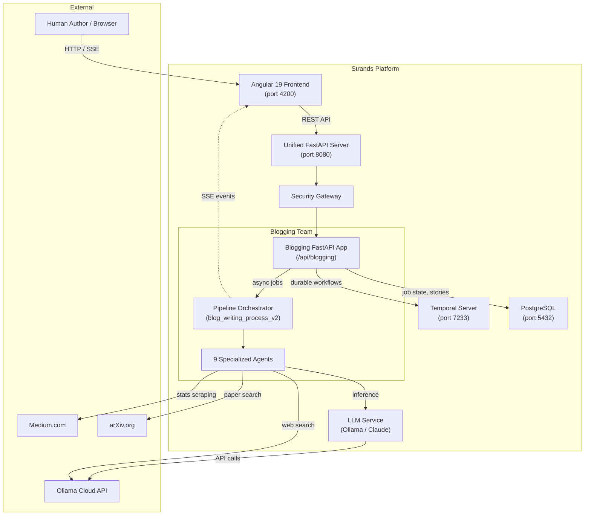
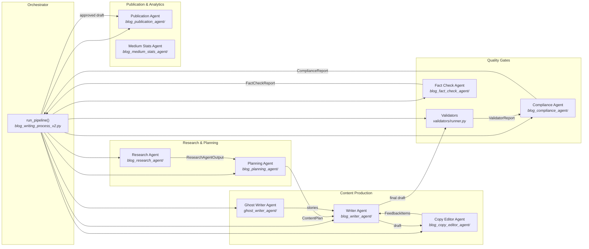
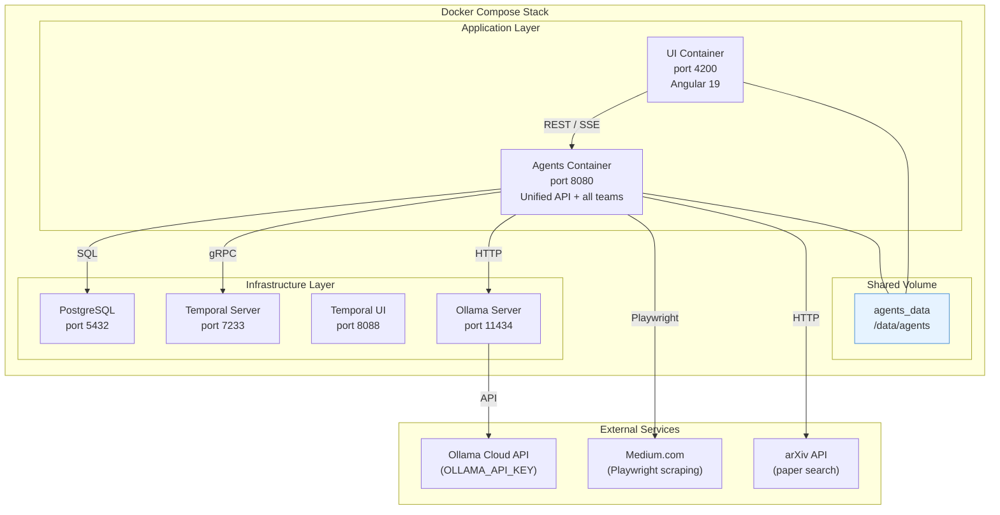
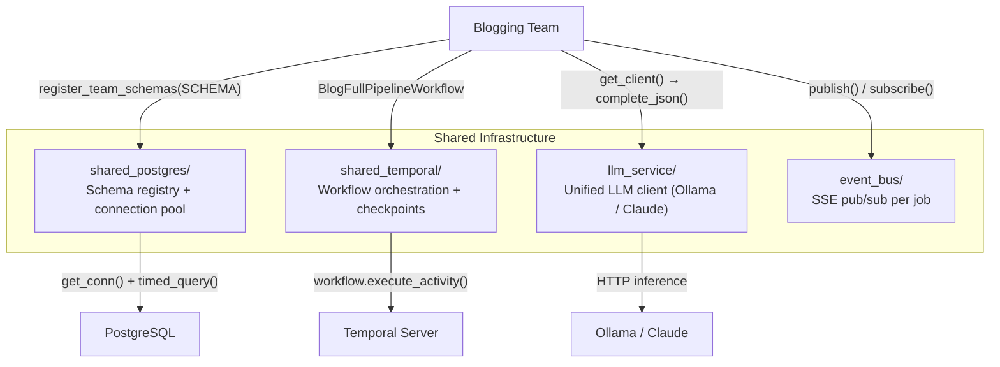

# Blogging Team — System Architecture

This document describes the high-level architecture of the Blogging Agent Suite: how it fits within the Strands Agents platform, its internal component structure, deployment topology, shared infrastructure dependencies, and agent responsibilities.

---

## 1. System Context

The blogging team operates as one of 20 agent teams within the Strands Agents platform. It is mounted at `/api/blogging` by the Unified API and accessed through the Angular 19 frontend.



---

## 2. Component Architecture

The pipeline orchestrator (`run_pipeline()`) coordinates 9 specialized agents across 5 functional groups: Research, Planning, Content Production, Quality Gates, and Publication.



### Pipeline Phase Mapping

| Phase | Progress | Agent(s) Involved |
|-------|----------|-------------------|
| Planning | 0–15% | Research Agent, Planning Agent |
| Draft Initial | 15–30% | Writer Agent, Ghost Writer Agent |
| Draft Review | 30–45% | Writer Agent (human feedback loop) |
| Copy Edit | 45–60% | Copy Editor Agent, Writer Agent |
| Fact Check | 60–70% | Fact Check Agent |
| Compliance | 70–82% | Compliance Agent, Validators |
| Rewrite Loop | 82–90% | Writer Agent (gate-driven rewrites) |
| Title Selection | 90–96% | Human choice (via job store) |
| Finalize | 96–100% | Pipeline (publishing pack generation) |

---

## 3. Infrastructure & Deployment



### Volume & Storage Layout

All blogging team artifacts persist under the shared `agents_data` Docker volume:

```
/data/agents/
  blogging_team/                    # AGENT_CACHE/blogging_team
    medium_stats_runs/              # BLOGGING_MEDIUM_STATS_ROOT
  blogging/runs/                    # BLOGGING_RUN_ARTIFACTS_ROOT (per-job)
    {job_id}/
      research_packet.md
      content_plan.json
      draft_v1.md
      ...
      publishing_pack.json
```

### Port Allocation

| Service | Port | Protocol |
|---------|------|----------|
| Unified API (all teams) | 8080 | HTTP |
| Angular UI | 4200 | HTTP |
| PostgreSQL | 5432 | TCP |
| Temporal Server | 7233 | gRPC |
| Temporal UI | 8088 | HTTP |
| Ollama | 11434 | HTTP |

---

## 4. Shared Infrastructure Dependencies

The blogging team relies on four shared infrastructure modules provided by the platform.



| Module | Blogging Team Usage |
|--------|---------------------|
| **shared_postgres** | `blogging_stories` table for story bank persistence; schema registered at FastAPI lifespan startup via `register_team_schemas(SCHEMA)` |
| **shared_temporal** | `BlogFullPipelineWorkflow` wraps the full pipeline as a single long-lived activity (12h timeout, 3 retries, 30s heartbeat); checkpoints for human-in-the-loop pauses |
| **llm_service** | `OllamaLLMClient` singleton created at API startup; agents call `complete_json()` for structured output and `complete()` for text generation; factory resolves model via env chain |
| **event_bus** | Thread-safe SSE pub/sub: pipeline publishes progress events per job; Angular UI subscribes via `/stream/{job_id}` endpoint for real-time updates |

---

## 5. Agent Responsibility Matrix

| Agent | Module | Role | Input Model | Output Model | Key Behavior |
|-------|--------|------|-------------|--------------|--------------|
| **Research Agent** | `blog_research_agent/` | Web + arXiv search, source ranking, document synthesis | `ResearchBriefInput` | `ResearchAgentOutput` | Stateless; parallel search queries; relevance scoring |
| **Planning Agent** | `blog_planning_agent/` | Structured content plan with refine-until-done loop | `PlanningInput` | `PlanningPhaseResult` | Self-critique via `RequirementsAnalysis`; max 5 iterations |
| **Writer Agent** | `blog_writer_agent/` | Draft generation and revision from feedback | `WriterInput` / `ReviseWriterInput` | `WriterOutput` | Dual role: initial draft + feedback-driven revision; detects uncertainty questions |
| **Copy Editor Agent** | `blog_copy_editor_agent/` | Draft quality, style, and length feedback | `CopyEditorInput` | `CopyEditorOutput` | Read-only feedback; staleness detection; escalation after 10 iterations |
| **Ghost Writer Agent** | `ghost_writer_agent/` | Personal story elicitation via multi-turn interview | `StoryGap` | `StoryElicitationResult` | Conversational interview; stories saved to bank for reuse |
| **Validators** | `validators/` | Deterministic content checks (no LLM) | Draft text | `ValidatorReport` | Banned phrases, reading level, paragraph length, required sections |
| **Fact Check Agent** | `blog_fact_check_agent/` | Claims verification and risk flagging | Draft + allowed claims | `FactCheckReport` | Flags unverified claims; identifies required disclaimers |
| **Compliance Agent** | `blog_compliance_agent/` | Brand/style enforcement with veto power | Draft + brand spec + validator report | `ComplianceReport` | FAIL status blocks publication; triggers rewrite loop |
| **Publication Agent** | `blog_publication_agent/` | Draft submission, approval, platform formatting | `SubmitDraftInput` | `ApprovalResult` | Formats for Medium, DevTo, Substack; writes to `blog_posts/` |
| **Medium Stats Agent** | `blog_medium_stats_agent/` | Medium.com dashboard stats scraping | `MediumStatsRunConfig` | `MediumStatsReport` | Playwright automation; Google browser login integration |

---

## 6. API Surface

The blogging team mounts at `/api/blogging` with these endpoint groups:

| Category | Endpoints | Purpose |
|----------|-----------|---------|
| **Pipeline** | `POST /full-pipeline`, `POST /research-and-review` | Trigger pipeline execution |
| **Jobs** | `POST /jobs`, `GET /job/{id}`, `DELETE /job/{id}`, `POST /restart/{id}` | Async job lifecycle management |
| **Streaming** | `GET /stream/{job_id}` (SSE) | Real-time progress events |
| **Collaboration** | `POST /job/{id}/title-selection`, `POST /job/{id}/draft-feedback`, `POST /job/{id}/story-message`, `POST /job/{id}/skip-story`, `POST /job/{id}/answers` | Human-in-the-loop inputs |
| **Publication** | `POST /job/{id}/approve`, `POST /job/{id}/reject` | Final draft approval |
| **Analytics** | `POST /medium-stats`, `POST /medium-stats-async` | Medium.com stats collection |
| **Health** | `GET /health` | Brand spec configuration status |

---

## 7. Execution Modes

The blogging team supports two runtime modes:

| Mode | Trigger | Characteristics |
|------|---------|-----------------|
| **Thread Mode** (default) | `TEMPORAL_ADDRESS` not set | Agents run as Python threads; pipeline executes in-process; state in memory + job store |
| **Temporal Mode** | `TEMPORAL_ADDRESS` is set | `BlogFullPipelineWorkflow` wraps pipeline as durable activity; 12h timeout; 30s heartbeat; state survives server restarts; 3 retries with exponential backoff |

Both modes use the same `run_blog_full_pipeline_job()` entry point and produce identical artifacts.
