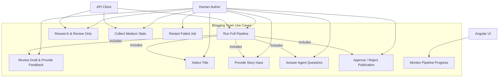
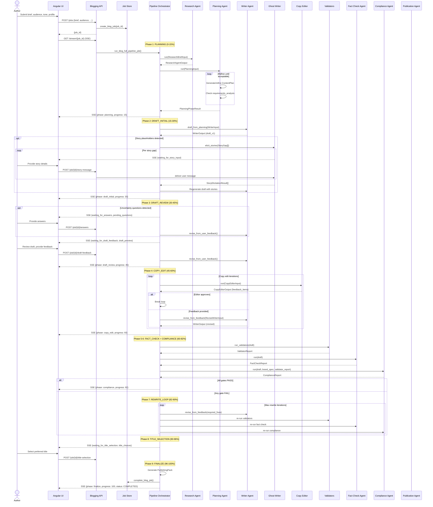
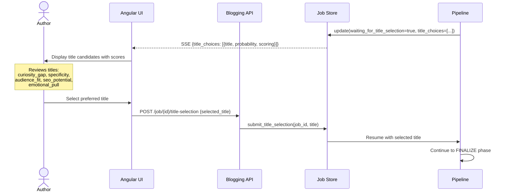
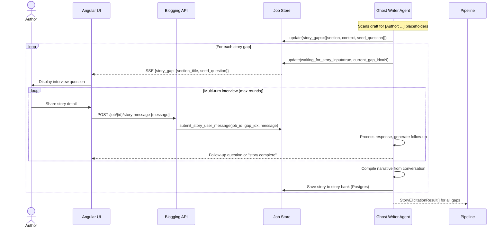
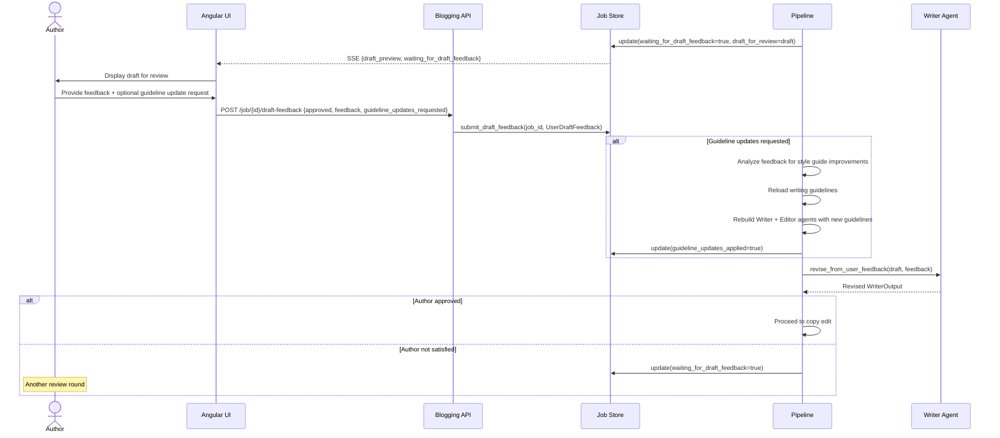
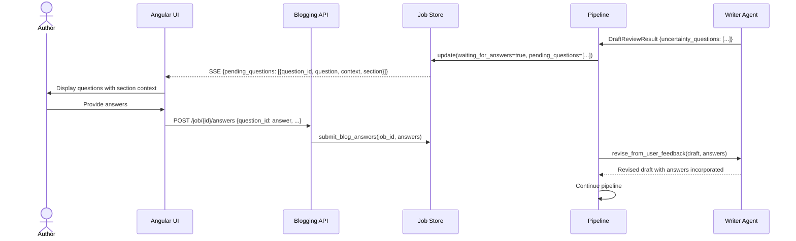
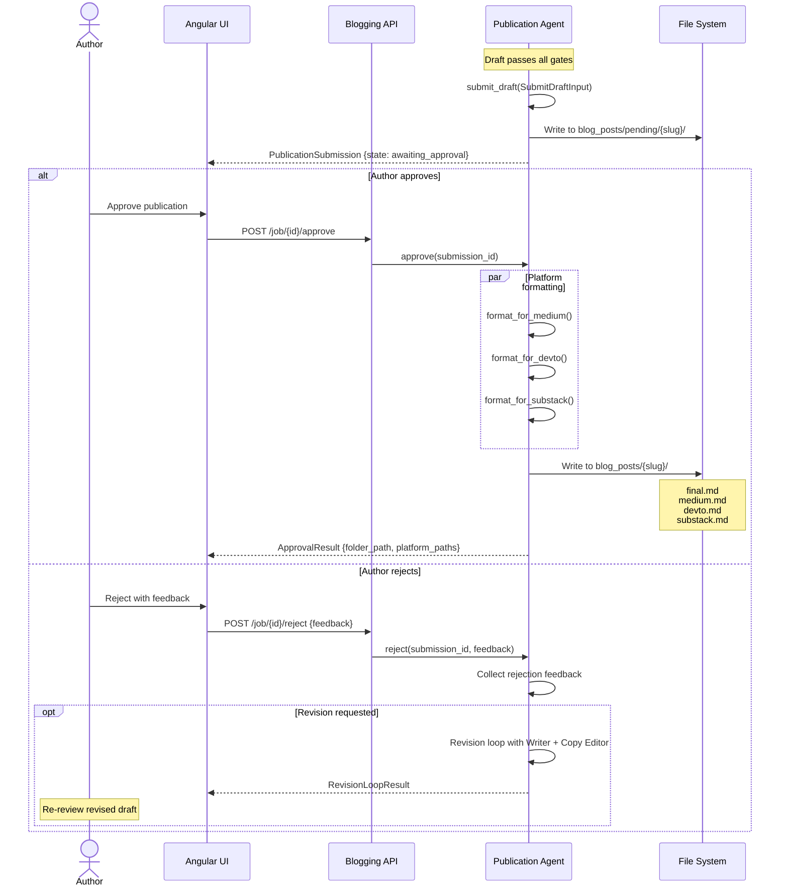
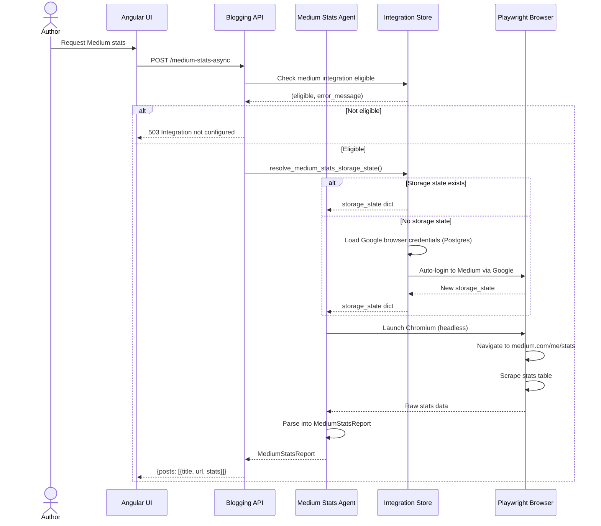
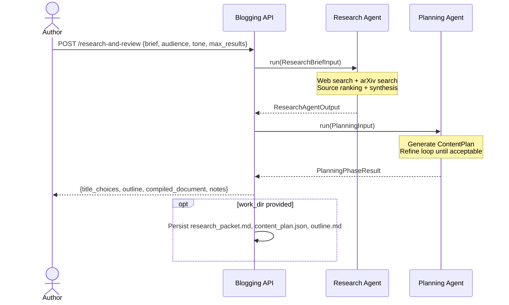

# Blogging Team — Use Cases

This document describes the actors, primary use cases, and detailed interaction sequences for the blogging agent suite.

---

## 1. Actors

| Actor | Type | Description |
|-------|------|-------------|
| **Human Author** | Primary | Content creator who initiates pipelines, provides feedback, selects titles, tells stories, and approves publications |
| **Angular UI** | System | Frontend client that renders progress, collects user inputs, and streams SSE events |
| **API Client** | System | Any HTTP client (CLI, script, integration) calling the REST API directly |
| **LLM Service** | Internal | Ollama/Claude inference backend used by all LLM-powered agents |
| **Temporal Server** | Internal | Durable workflow engine for long-running pipeline execution |
| **PostgreSQL** | Internal | Persistent store for job state, story bank, and integration credentials |
| **Medium.com** | External | Publishing platform; stats scraped via Playwright |
| **arXiv** | External | Academic paper repository searched during research |

---

## 2. Primary Use Cases

---

## 3. Use Case: Full Pipeline Execution

The primary use case — an author requests a complete blog post from brief to publishing-ready output.

### 3.1 Sequence Diagram

---

## 4. Use Case: Human Collaboration Points

The pipeline pauses at multiple points for human input. Each pause sets a `waiting_for_*` flag on the job record and resumes when the corresponding API endpoint receives input.

### 4.1 Title Selection

### 4.2 Story Elicitation (Multi-turn Interview)

### 4.3 Draft Feedback with Guideline Updates

### 4.4 Uncertainty Question Resolution

---

## 5. Use Case: Publication Workflow

---

## 6. Use Case: Medium Stats Collection

---

## 7. Use Case: Research & Review Only

A lightweight use case for exploring a topic without full pipeline execution.

---

## 8. API Endpoint Mapping

| Use Case | Method | Endpoint | Request Body | Response |
|----------|--------|----------|-------------|----------|
| Run full pipeline (sync) | POST | `/full-pipeline` | `FullPipelineRequest` | `FullPipelineResponse` |
| Create async job | POST | `/jobs` | `FullPipelineRequest` | `{job_id}` |
| Poll job status | GET | `/job/{id}` | — | `BlogJobStatusResponse` |
| Stream progress (SSE) | GET | `/stream/{job_id}` | — | SSE events |
| Select title | POST | `/job/{id}/title-selection` | `{selected_title}` | 200 OK |
| Submit draft feedback | POST | `/job/{id}/draft-feedback` | `UserDraftFeedback` | 200 OK |
| Send story message | POST | `/job/{id}/story-message` | `{message}` | 200 OK |
| Skip story gap | POST | `/job/{id}/skip-story` | — | 200 OK |
| Submit answers | POST | `/job/{id}/answers` | `{question_id: answer}` | 200 OK |
| Approve publication | POST | `/job/{id}/approve` | — | `ApprovalResult` |
| Reject publication | POST | `/job/{id}/reject` | `{feedback}` | `RejectionResponse` |
| Research & review | POST | `/research-and-review` | `{brief, audience, ...}` | `{title_choices, outline, ...}` |
| Medium stats (sync) | POST | `/medium-stats` | `MediumStatsRequest` | `MediumStatsReport` |
| Medium stats (async) | POST | `/medium-stats-async` | `MediumStatsRequest` | `{job_id}` |
| Restart job | POST | `/restart/{id}` | — | 200 OK |
| Delete job | DELETE | `/job/{id}` | — | 200 OK |
| Health check | GET | `/health` | — | `{status, brand_spec_configured}` |
