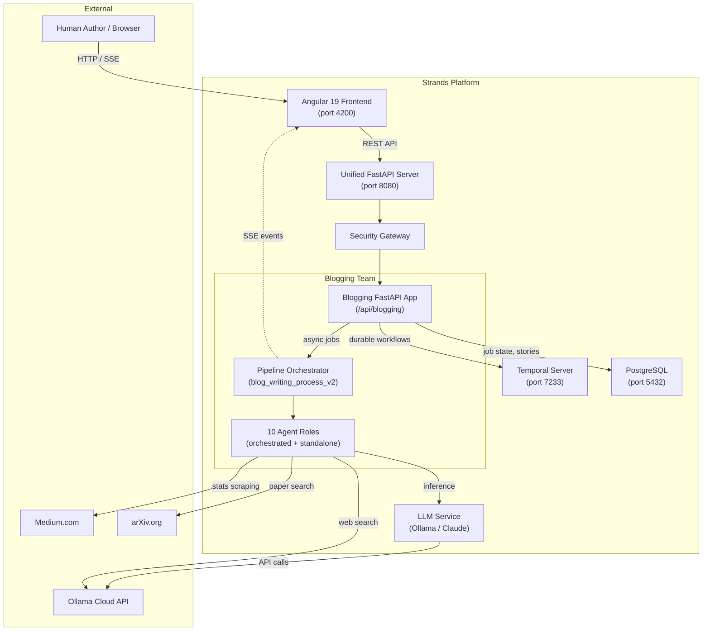
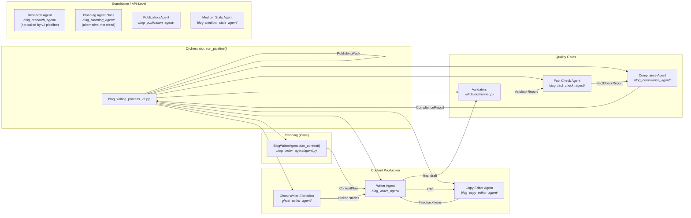
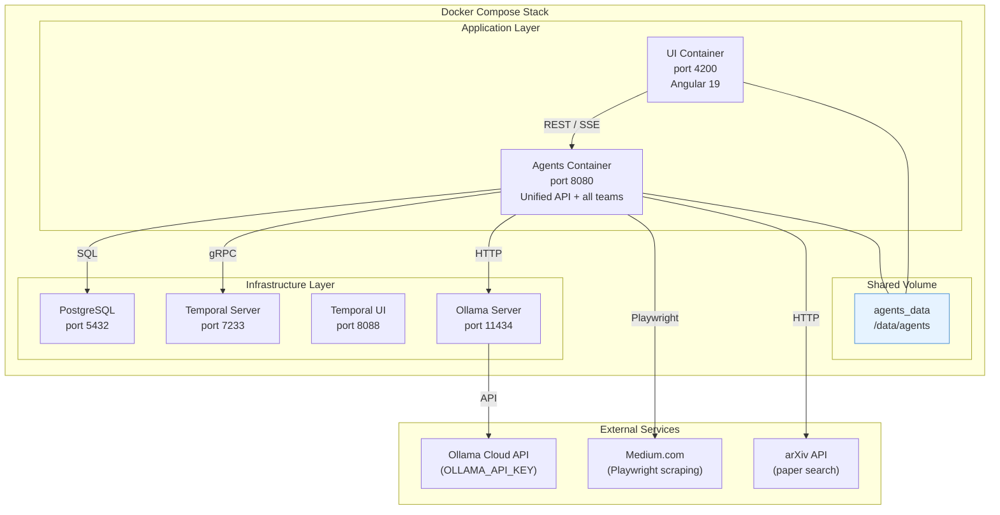
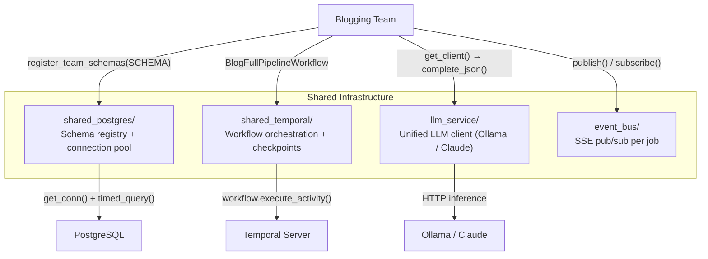

# Blogging Team — System Architecture

This document describes the high-level architecture of the Blogging Agent Suite: how it fits within the Strands Agents platform, its internal component structure, deployment topology, shared infrastructure dependencies, and agent responsibilities.

---

## 1. System Context

The blogging team operates as one of 20 agent teams within the Strands Agents platform. It is mounted at `/api/blogging` by the Unified API and accessed through the Angular 19 frontend.



---

## 2. Component Architecture

The pipeline orchestrator (`run_pipeline()` in `agent_implementations/blog_writing_process_v2.py`) coordinates agents across three functional groups that run inline: Content Production, Quality Gates, and Finalization. Four additional agent modules — Research Agent, Planning Agent (class), Publication Agent, and Medium Stats Agent — live in the team but are **not** invoked by `run_pipeline()` in the current v2 path: they are either standalone modules or are driven directly by the API layer.



> **Note 1:** Planning is performed by `BlogWriterAgent.plan_content()` (see `blog_writer_agent/agent.py:294`), which implements the refine-until-done loop. The `BlogPlanningAgent` class in `blog_planning_agent/agent.py` is an alternative implementation that is not currently wired into `run_pipeline()`.
>
> **Note 2:** The v2 pipeline currently skips external research. `PlanningInput.research_digest` defaults to `""` (see `shared/content_plan.py:197`), and the orchestrator does not invoke `BlogResearchAgent`. The research agent module remains available as a standalone component.
>
> **Note 3:** `run_pipeline()` writes a `PublishingPack` artifact but does **not** call the Publication Agent. Publication (approve/unapprove) and Medium stats collection are handled by separate API endpoints.

### Pipeline Phase Mapping

Phase names and progress ranges come from `BlogPhase` and `PHASE_PROGRESS_RANGES` in `shared/models.py`.

| `BlogPhase` | Enum value | Progress | Agent(s) Involved |
|-------------|-----------|----------|-------------------|
| `PLANNING` | `planning` | 0–15% | `BlogWriterAgent.plan_content()` (refine loop) |
| `DRAFT_INITIAL` | `draft_initial` | 15–30% | Writer Agent, Ghost Writer Elicitation |
| `DRAFT_REVIEW` | `draft_review` | 30–45% | Writer Agent (human feedback loop) |
| `COPY_EDIT_LOOP` | `copy_edit` | 45–60% | Copy Editor Agent ↔ Writer Agent |
| `FACT_CHECK` | `fact_check` | 60–70% | Validators + Fact Check Agent |
| `COMPLIANCE` | `compliance` | 70–82% | Compliance Agent |
| `REWRITE_LOOP` | `rewrite` | 82–90% | Writer Agent (gate-driven rewrites) |
| `TITLE_SELECTION` | `title_selection` | 90–96% | Human choice (via job store) |
| `FINALIZE` | `finalize` | 96–100% | Pipeline (publishing pack generation) |

**Implementation note:** `run_pipeline()` evaluates the gates inside a single loop bounded by `max_rewrite_iterations`. On each iteration it runs Validators → Fact Check → Compliance in sequence. Title selection only runs once inside the `all_pass` branch, after every gate has returned `PASS`.

---

## 3. Infrastructure & Deployment



### Volume & Storage Layout

All blogging team artifacts persist under the shared `agents_data` Docker volume:

```
/data/agents/
  blogging_team/                    # AGENT_CACHE/blogging_team
    medium_stats_runs/              # BLOGGING_MEDIUM_STATS_ROOT
  blogging/runs/                    # BLOGGING_RUN_ARTIFACTS_ROOT (per-job)
    {job_id}/
      research_packet.md
      content_plan.json
      draft_v1.md
      ...
      publishing_pack.json
```

### Port Allocation

| Service | Port | Protocol |
|---------|------|----------|
| Unified API (all teams) | 8080 | HTTP |
| Angular UI | 4200 | HTTP |
| PostgreSQL | 5432 | TCP |
| Temporal Server | 7233 | gRPC |
| Temporal UI | 8088 | HTTP |
| Ollama | 11434 | HTTP |

---

## 4. Shared Infrastructure Dependencies

The blogging team relies on four shared infrastructure modules provided by the platform.



| Module | Blogging Team Usage |
|--------|---------------------|
| **shared_postgres** | `blogging_stories` table for story bank persistence; schema registered at FastAPI lifespan startup via `register_team_schemas(SCHEMA)`. See `postgres/__init__.py` |
| **shared_temporal** | `BlogFullPipelineWorkflow` wraps the full pipeline as a single long-lived activity. `schedule_to_close_timeout=12h`, `heartbeat_timeout=5m`, `RetryPolicy(maximum_attempts=3, initial_interval=30s, maximum_interval=2m, backoff_coefficient=2.0)`. A background heartbeat thread calls `activity.heartbeat()` every 30s (`shared/run_pipeline_job.py:170`). See `temporal/workflows.py:15-38` |
| **llm_service** | `get_client("blog")` returns an `OllamaLLMClient`; agents call `complete_json()` for structured output and `complete()` for text generation. Planning can use a different model via the `BLOG_PLANNING_MODEL` env var |
| **event_bus** | Thread-safe SSE pub/sub (`shared/job_event_bus.py`): `run_pipeline_job.py` publishes update events for every job store mutation; the UI subscribes via `GET /job/{job_id}/stream` |

---

## 5. Agent Responsibility Matrix

Agents marked **[pipeline]** are orchestrated by `run_pipeline()`. Agents marked **[standalone]** live in the team but are not invoked by the pipeline — they are either triggered directly by the API layer or exist as alternative implementations.

| Agent | Module | Orchestration | Role | Key I/O |
|-------|--------|---------------|------|---------|
| **Writer Agent** | `blog_writer_agent/` | [pipeline] | Plan generation (`plan_content()`) + initial draft + feedback-driven revision + uncertainty detection | `PlanningInput`/`WriterInput`/`ReviseWriterInput` → `PlanningPhaseResult`/`WriterOutput` |
| **Ghost Writer Elicitation** | `ghost_writer_agent/` | [pipeline] | Identifies `[Author: ...]` placeholders, conducts multi-turn interviews, persists stories to Postgres for reuse | `ContentPlan`/`StoryGap` → `StoryElicitationResult[]` |
| **Copy Editor Agent** | `blog_copy_editor_agent/` | [pipeline] | Read-only feedback loop with staleness detection and human-escalation after `COPY_EDIT_ESCALATION_THRESHOLD` (default 10) iterations | `CopyEditorInput` → `CopyEditorOutput` |
| **Validators** | `validators/` | [pipeline] | Deterministic no-LLM checks (banned phrases, reading level, paragraph length, required sections, claims policy) | Draft text → `ValidatorReport` |
| **Fact Check Agent** | `blog_fact_check_agent/` | [pipeline] | LLM-based claim verification and risk flagging with required-disclaimer detection | Draft + allowed claims → `FactCheckReport` |
| **Compliance Agent** | `blog_compliance_agent/` | [pipeline] | LLM-based brand/style enforcement with veto power — FAIL triggers the closed-loop rewrite | Draft + brand spec + validator report → `ComplianceReport` |
| **Research Agent** | `blog_research_agent/` | [standalone] | Ollama web_search + arXiv + ranking + synthesis. Not called by v2 pipeline; `PlanningInput.research_digest` defaults to `""` | `ResearchBriefInput` → `ResearchAgentOutput` |
| **Planning Agent (class)** | `blog_planning_agent/` | [standalone] | Alternative planning implementation with its own refine loop. Not wired into v2; planning uses `BlogWriterAgent.plan_content()` instead | `PlanningInput` → `PlanningPhaseResult` |
| **Publication Agent** | `blog_publication_agent/` | [standalone] | Draft submission and platform formatting (Medium, dev.to, Substack). `run_pipeline()` writes the `publishing_pack.json` artifact directly and does not call this agent | `SubmitDraftInput` → `ApprovalResult` |
| **Medium Stats Agent** | `blog_medium_stats_agent/` | [standalone] | Playwright automation against `medium.com/me/stats`, reusing the shared Google browser login when configured | `MediumStatsRunConfig` → `MediumStatsReport` |

---

## 6. API Surface

The blogging team mounts at `/api/blogging`. Routes live in `api/main.py`.

| Category | Endpoints | Purpose |
|----------|-----------|---------|
| **Pipeline** | `POST /full-pipeline` (sync), `POST /full-pipeline-async` | Trigger full pipeline execution |
| **Jobs** | `GET /jobs`, `GET /job/{job_id}`, `DELETE /job/{job_id}`, `POST /job/{job_id}/restart`, `POST /job/{job_id}/resume`, `POST /job/{job_id}/cancel` | List and manage async jobs |
| **Streaming** | `GET /job/{job_id}/stream` (SSE) | Real-time progress events |
| **Collaboration** | `POST /job/{job_id}/select-title`, `POST /job/{job_id}/rate-titles`, `POST /job/{job_id}/draft-feedback`, `POST /job/{job_id}/story-response`, `POST /job/{job_id}/skip-story-gap`, `POST /job/{job_id}/answers` | Human-in-the-loop inputs |
| **Approval** | `POST /job/{job_id}/approve`, `POST /job/{job_id}/unapprove` | Final draft approval |
| **Artifacts** | `GET /job/{job_id}/artifacts`, `GET /job/{job_id}/artifacts/{artifact_name}` | Browse and download pipeline artifacts |
| **Story bank** | `GET /stories`, `GET /stories/{story_id}`, `DELETE /stories/{story_id}`, `GET /stories/search/{keywords}` | Cross-post personal-anecdote reuse |
| **Analytics** | `POST /medium-stats`, `POST /medium-stats-async` | Medium.com stats collection |
| **Health** | `GET /health` | Brand spec configuration status |

---

## 7. Execution Modes

`POST /full-pipeline-async` picks one of two runtime modes based on whether Temporal is configured (see `shared/run_pipeline_job.py`):

| Mode | Trigger | Characteristics |
|------|---------|-----------------|
| **Thread Mode** (fallback) | `TEMPORAL_ADDRESS` not set | A daemon Python thread runs `run_blog_full_pipeline_job()` in-process; job state lives in Postgres (via `blog_job_store`); progress is published to the in-memory SSE bus |
| **Temporal Mode** | `TEMPORAL_ADDRESS` is set | `BlogFullPipelineWorkflow` schedules `run_full_pipeline_activity`; `schedule_to_close_timeout=12h`, `heartbeat_timeout=5m`, retry policy 3 attempts with 30s→2m exponential backoff. A background heartbeat thread calls `activity.heartbeat()` every 30s; state survives worker restarts |

Both modes call the same `run_blog_full_pipeline_job()` entry point, produce identical artifacts, and publish identical SSE events. The synchronous `POST /full-pipeline` endpoint always runs in-process on the request thread.
