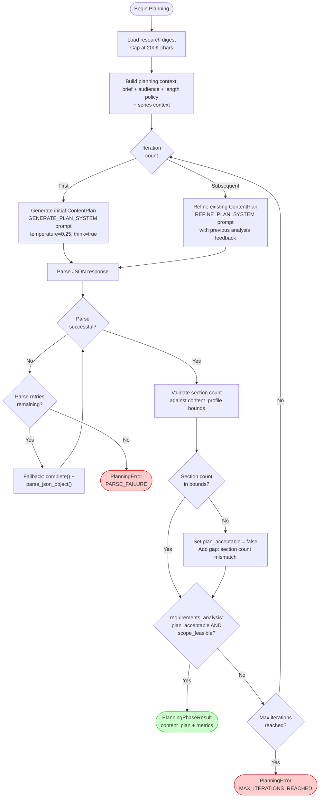
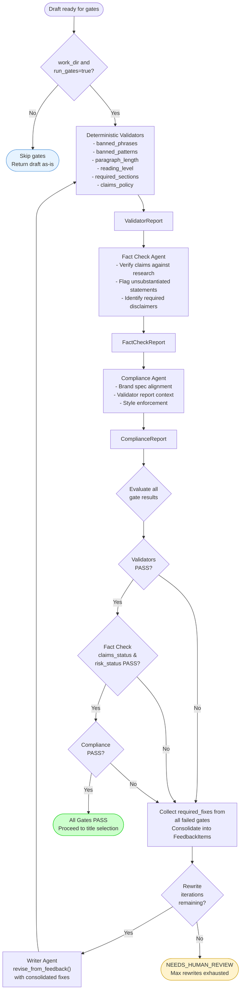
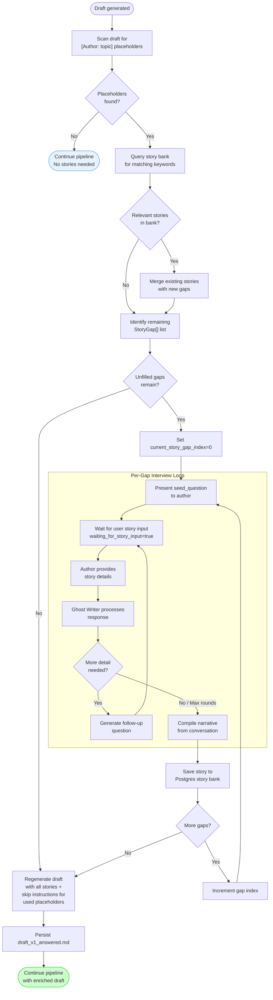
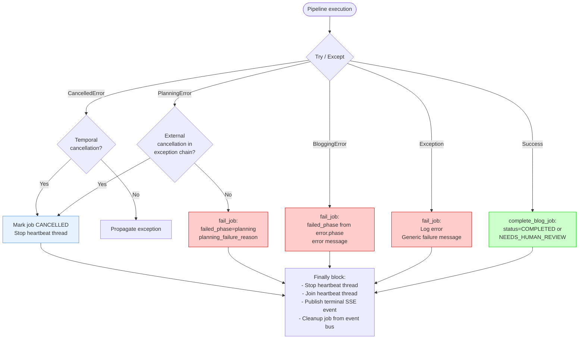
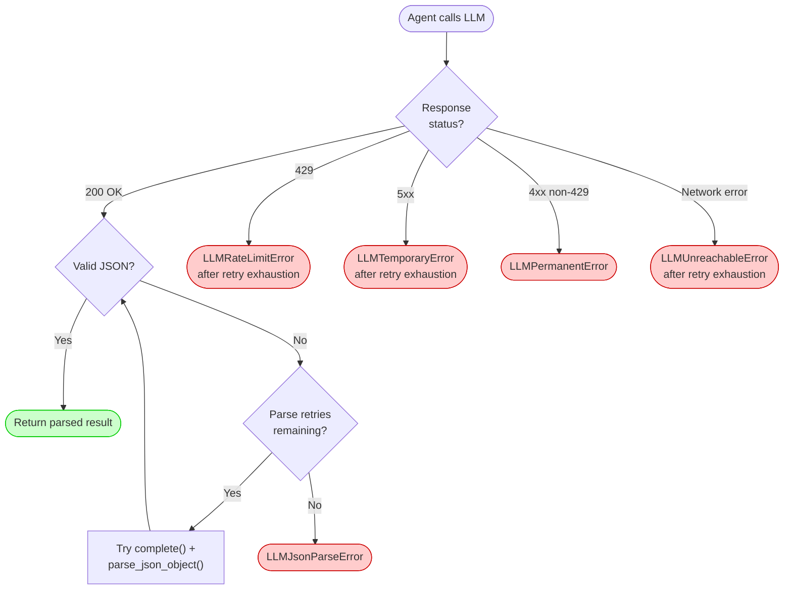
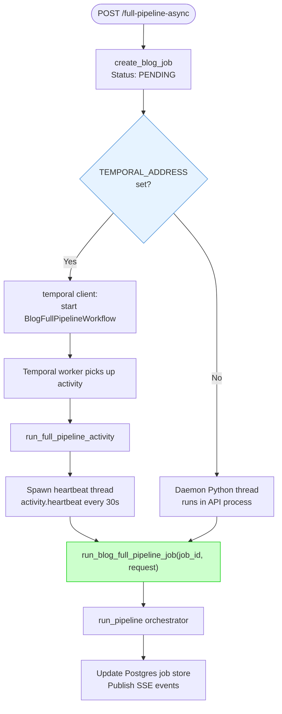
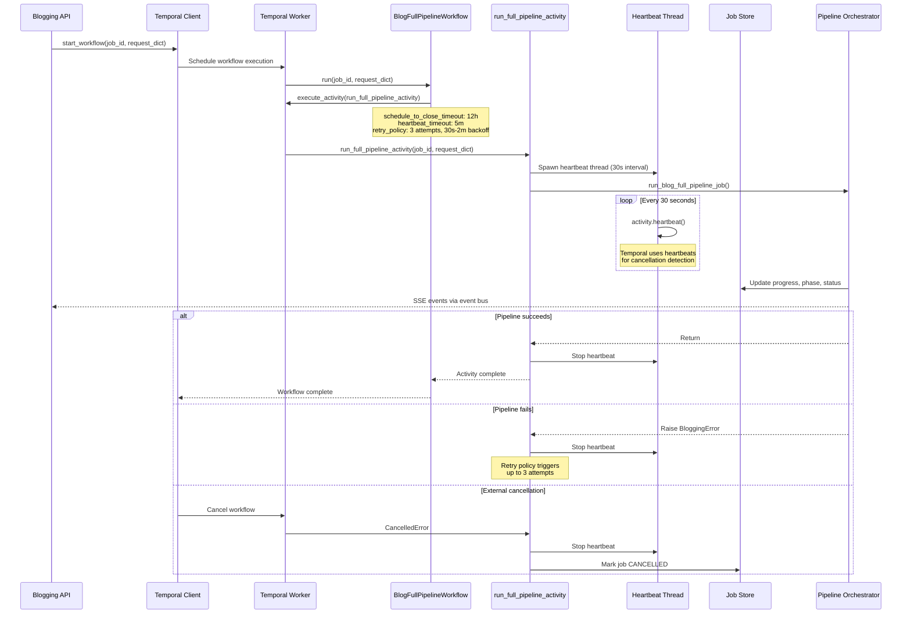
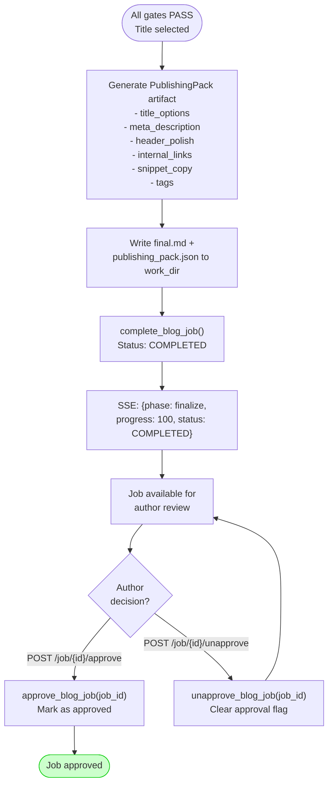
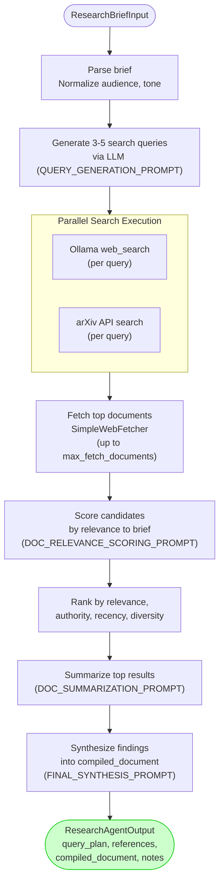

# Blogging Team — Flow Charts

This document provides detailed flow charts for the blogging pipeline's execution paths, decision trees, feedback loops, and error handling mechanisms.

---

## 1. Master Pipeline Flow

The complete end-to-end pipeline from API request to publishing pack, showing all decision points and exit conditions.

```mermaid
flowchart TD
    Start([POST /full-pipeline-async or /full-pipeline]) --> CreateJob[Create blog job in store<br/>Status: PENDING]
    CreateJob --> ResolveProfile[Resolve LengthPolicy<br/>from content_profile / target_word_count]
    ResolveProfile --> LoadBrandSpec[Load brand spec + writing guidelines<br/>Render Jinja2 templates with AuthorProfile]
    LoadBrandSpec --> StartPipeline[Start pipeline<br/>Status: RUNNING]

    StartPipeline --> Planning["BlogWriterAgent.plan_content()<br/>ContentPlan + refine loop<br/>(research_digest defaults to empty)<br/>(BlogPhase.PLANNING, 0-15%)"]

    Planning --> PlanOK{Plan<br/>acceptable?}
    PlanOK -->|No| PlanFail([FAILED<br/>PlanningError])
    PlanOK -->|Yes| WriteDraft["Writer Agent<br/>Generate draft_v1<br/>(DRAFT_INITIAL, 15-25%)"]

    WriteDraft --> StoryCheck{Story<br/>placeholders<br/>detected?}
    StoryCheck -->|Yes| StoryElicit["Ghost Writer Elicitation<br/>Multi-turn interviews<br/>(story_elicitation sub-phase, ~27%)"]
    StoryCheck -->|No| DraftReady
    StoryElicit --> RegenDraft[Regenerate draft with stories]
    RegenDraft --> DraftReady

    DraftReady[Draft ready] --> UncertaintyCheck{Uncertainty<br/>questions?}
    UncertaintyCheck -->|Yes| WaitAnswers["Wait for user answers<br/>(DRAFT_REVIEW, 30-35%)"]
    UncertaintyCheck -->|No| DraftReview
    WaitAnswers --> ReviseAnswers[Revise draft with answers]
    ReviseAnswers --> DraftReview

    DraftReview["Wait for draft feedback<br/>(DRAFT_REVIEW, 35-45%)"] --> FeedbackReceived{Author<br/>approved?}
    FeedbackReceived -->|Feedback| ReviseDraft[Revise from user feedback]
    ReviseDraft --> DraftReview
    FeedbackReceived -->|Approved / Skipped| CopyEdit

    CopyEdit["Copy Edit Loop<br/>(COPY_EDIT_LOOP, 45-60%)"] --> EditorApproved{Editor<br/>approved?}
    EditorApproved -->|Yes| RunGates
    EditorApproved -->|Loop exhausted| RunGates

    subgraph RunGates["Quality Gates (FACT_CHECK 60-70%, COMPLIANCE 70-82%)"]
        Validators["Validators<br/>Banned phrases, reading level,<br/>paragraph length, required sections"]
        FactCheck["Fact Check Agent<br/>Claims verification, risk flags,<br/>required disclaimers"]
        Compliance["Compliance Agent<br/>Brand spec alignment,<br/>violation detection"]
        Validators --> FactCheck --> Compliance
    end

    Compliance --> GatesPass{All gates<br/>PASS?}
    GatesPass -->|Yes| TitleSelect
    GatesPass -->|No| RewriteCheck{Rewrite<br/>iterations<br/>remaining?}
    RewriteCheck -->|Yes| Rewrite["Rewrite from consolidated<br/>required_fixes<br/>(REWRITE_LOOP, 82-90%)"]
    Rewrite --> RunGates
    RewriteCheck -->|No| NeedsReview([NEEDS_HUMAN_REVIEW])

    TitleSelect["Title Selection<br/>Wait for user choice<br/>(TITLE_SELECTION, 90-96%)"] --> Finalize["Write final.md +<br/>publishing_pack.json<br/>(FINALIZE, 96-100%)"]
    Finalize --> Complete([COMPLETED / PASS])

    style PlanFail fill:#ffcccc,stroke:#cc0000
    style NeedsReview fill:#fff3cd,stroke:#cc9900
    style Complete fill:#ccffcc,stroke:#00cc00
```



**Implementation notes:**

- The research phase shown in earlier versions of this diagram has been removed. `run_pipeline()` builds `PlanningInput` with `research_digest=""` (the default in `shared/content_plan.py:197`) and never calls `BlogResearchAgent`. The research module remains available as a standalone component.
- Planning is done inline by `BlogWriterAgent.plan_content()` (`blog_writer_agent/agent.py:294`), not by a separate `BlogPlanningAgent` class.
- Validators, fact-check, and compliance all run inside a single loop bounded by `max_rewrite_iterations`. Title selection is only reached after an iteration where every gate returned `PASS`.

---

## 2. Planning Refine Loop

The planning agent generates and refines the content plan until it meets acceptance criteria or exhausts iterations.



**Key constants**:
- `BLOG_PLANNING_MAX_ITERATIONS`: default 5 (env configurable)
- `BLOG_PLANNING_MAX_PARSE_RETRIES`: default 3 (env configurable)
- Temperature: 0.25 with `think=true` for structured reasoning

---

## 3. Copy-Edit Feedback Loop

The copy editor and writer iterate until the draft is approved, the loop stalls, or the escalation threshold triggers human intervention.

```mermaid
flowchart TD
    Start([Begin Copy Edit]) --> Init[Initialize FeedbackTracker<br/>window_size=3]

    Init --> EditorRun["Copy Editor Agent<br/>run(CopyEditorInput)"]
    EditorRun --> EditorResult{Editor<br/>approved?}

    EditorResult -->|Yes| Approved([Draft Approved<br/>Proceed to gates])

    EditorResult -->|No| TrackFeedback[Track feedback items<br/>in FeedbackTracker]
    TrackFeedback --> StaleCheck{Feedback<br/>stale?}
    StaleCheck -->|"Yes (same issues repeating)"| StaleAccept([Accept draft<br/>Loop stalled])

    StaleCheck -->|No| EscalationCheck{Iterations >=<br/>ESCALATION_THRESHOLD<br/>(default 10)?}

    EscalationCheck -->|Yes| Escalate["Pause for human feedback<br/>waiting_for_draft_feedback=true"]
    Escalate --> HumanResponse{Human<br/>response?}
    HumanResponse -->|Approved| Approved
    HumanResponse -->|Feedback| HumanRevise[Revise from human feedback]
    HumanRevise --> ContinueLoop

    EscalationCheck -->|No| WriterRevise

    WriterRevise["Writer Agent<br/>revise_from_feedback(ReviseWriterInput)<br/>with FeedbackItems + persistent_issues"]
    WriterRevise --> WriterDone[Updated draft]

    ContinueLoop --> IterCheck
    WriterDone --> IterCheck{Max iterations<br/>reached?<br/>(default 500)}
    IterCheck -->|No| EditorRun
    IterCheck -->|Yes| Exhausted([Accept draft<br/>Max iterations])

    style Approved fill:#ccffcc,stroke:#00cc00
    style StaleAccept fill:#fff3cd,stroke:#cc9900
    style Exhausted fill:#fff3cd,stroke:#cc9900
```

**Staleness detection**: The `FeedbackTracker` keeps a sliding window of the last 3 feedback rounds. If the same issue categories and locations repeat without resolution, the loop is considered stalled and the draft is accepted as-is.

**Escalation**: After `COPY_EDIT_ESCALATION_THRESHOLD` (default 10) iterations without editor approval, the pipeline pauses and presents the draft to the human author for intervention.

---

## 4. Quality Gate System

The three-tier validation system that determines whether a draft is publication-ready.



**Gate evaluation order**: Validators (cheapest, no LLM) → Fact Check → Compliance (most expensive). All three run even if early gates fail, so the rewrite loop gets comprehensive feedback in one pass.

**Rewrite budget**: Default `max_rewrite_iterations=3` (configurable per request, hard cap at 100).

---

## 5. Story Elicitation Flow

The ghost writer agent identifies story opportunities in the content plan and conducts multi-turn interviews to collect personal narratives.



**Story bank reuse**: Stories persisted in Postgres (`blogging_stories` table) are queried by keyword overlap for future posts, avoiding redundant interviews.

---

## 6. Error Handling & Recovery



### LLM-Level Error Recovery



---

## 7. Async Pipeline: Temporal vs Thread Branching

When a client calls `POST /full-pipeline-async`, the API chooses a runtime mode based on whether Temporal is configured. Both paths end up calling the same `run_blog_full_pipeline_job()` entry point.



In thread mode, a failure crashes only the daemon thread; the API process keeps serving. In Temporal mode, the workflow is durable: if the worker dies mid-pipeline the retry policy reruns the activity up to 3 times (30s→2m backoff), and the `heartbeat_timeout=5m` ensures stuck activities are detected and reassigned.

---

## 8. Temporal Workflow Execution Detail

The durable workflow execution path when `TEMPORAL_ADDRESS` is configured.



**Temporal retry policy**:
- `maximum_attempts`: 3
- `initial_interval`: 30 seconds
- `maximum_interval`: 2 minutes
- `backoff_coefficient`: 2.0

---

## 9. Finalization & Approval Decision Tree

After all quality gates pass and the title is selected, the pipeline generates a `PublishingPack` artifact and completes the job. Approval is handled by the API layer via separate endpoints.

> **Note:** The pipeline orchestrator produces the `PublishingPack` directly and does **not** invoke the Publication Agent. The Publication Agent module provides platform formatters and models that can be used independently.



---

## 10. Research Agent Internal Flow (standalone module)

The research agent lives in `blog_research_agent/` and is a fully functional standalone module. It is **not** invoked by `run_pipeline()` in the current v2 path — it is kept available for future re-integration or direct scripted use. The flow below documents how the module works when it is run on its own.


