# Blogging Team — System Design

This document covers the detailed design decisions, data models, persistence patterns, state management, and infrastructure choices that underpin the blogging agent suite.

---

## 1. Core Data Models

The blogging pipeline uses Pydantic `BaseModel` classes for all inter-agent communication. Models enforce validation at system boundaries and serialize cleanly to JSON for artifact persistence.

### 1.1 Content Planning Models

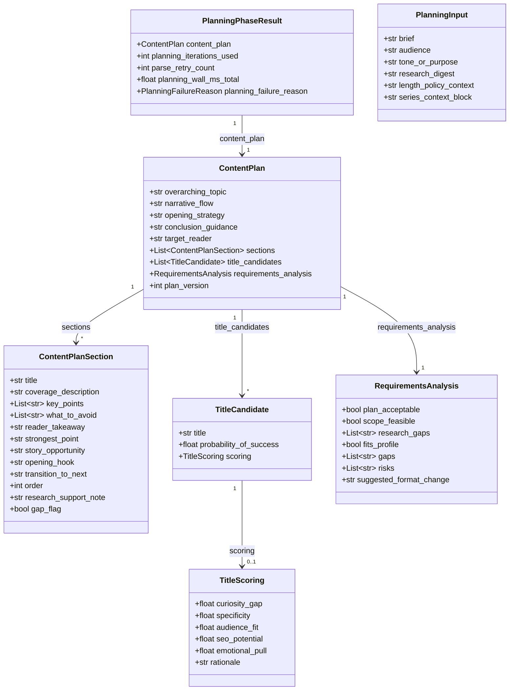

### 1.2 Writing & Editing Models

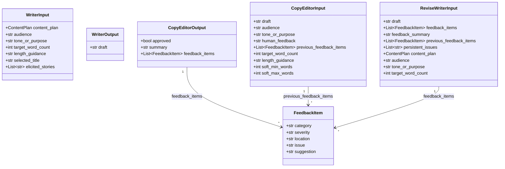

**FeedbackItem categories**: `voice`, `style`, `clarity`, `structure`, `flow`, `engagement`, `technical`, `formatting`, `authenticity`, `length`

**FeedbackItem severities**: `must_fix`, `should_fix`, `consider`

### 1.3 Quality Gate Models

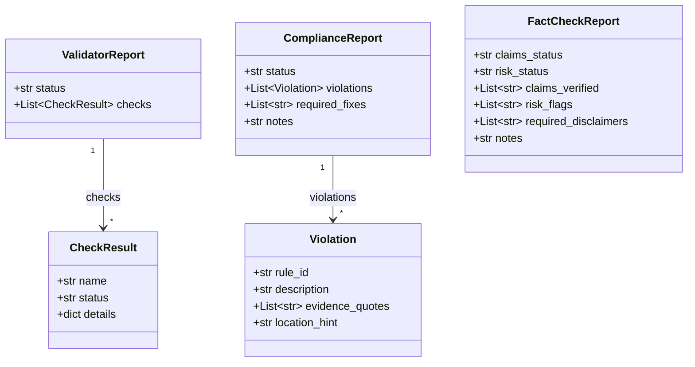

**Gate status values**: `PASS` or `FAIL`. All three gates must report `PASS` for the draft to proceed to publication.

### 1.4 Publication Models

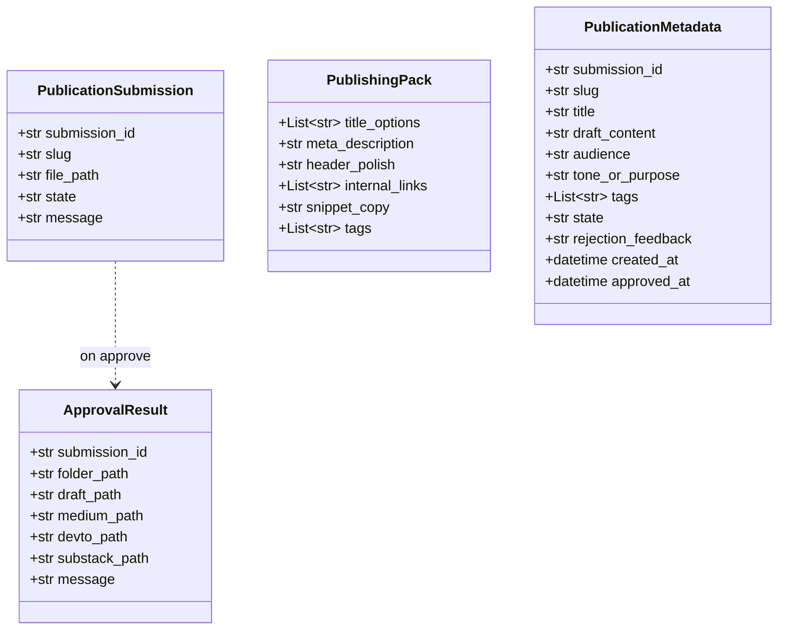

**Publication states**: `awaiting_approval` → `approved` or `collecting_rejection_feedback`

---

## 2. Error Hierarchy

All pipeline exceptions inherit from `BloggingError`, enabling consistent error handling at the orchestrator level. Each exception carries contextual metadata for debugging and job status updates.

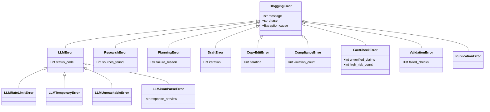

**Design decision**: Each error includes a `phase` field so the orchestrator can update the job store with `failed_phase` without parsing the exception type. `PlanningError` carries a `failure_reason` enum (`MAX_ITERATIONS_REACHED`, `INFEASIBLE_SCOPE`, `PARSE_FAILURE`, `MODEL_ABORT`) for API consumers.

---

## 3. Job State Machine

### 3.1 Job Lifecycle States

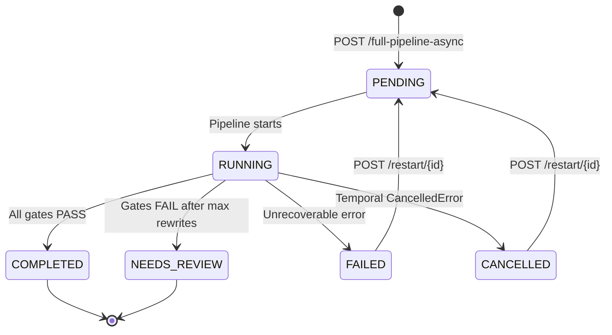

### 3.2 Pipeline Phase Transitions

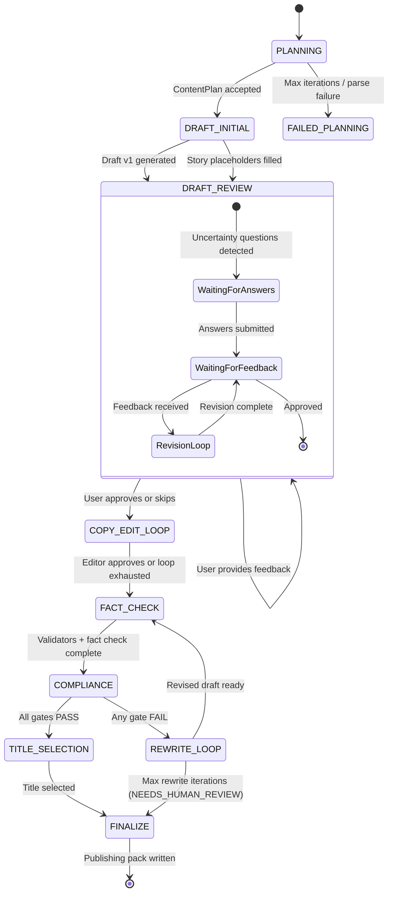

### 3.3 Progress Tracking

Each phase maps to a progress range from `PHASE_PROGRESS_RANGES` in `shared/models.py`. The `get_phase_progress(phase, sub_progress)` function computes the overall percentage:

| `BlogPhase` | Enum value | Range | Calculation |
|-------------|-----------|-------|-------------|
| `PLANNING` | `planning` | 0–15% | `0 + 15 * sub_progress` |
| `DRAFT_INITIAL` | `draft_initial` | 15–30% | `15 + 15 * sub_progress` |
| `DRAFT_REVIEW` | `draft_review` | 30–45% | `30 + 15 * sub_progress` |
| `COPY_EDIT_LOOP` | `copy_edit` | 45–60% | `45 + 15 * sub_progress` |
| `FACT_CHECK` | `fact_check` | 60–70% | `60 + 10 * sub_progress` |
| `COMPLIANCE` | `compliance` | 70–82% | `70 + 12 * sub_progress` |
| `REWRITE_LOOP` | `rewrite` | 82–90% | `82 + 8 * sub_progress` |
| `TITLE_SELECTION` | `title_selection` | 90–96% | `90 + 6 * sub_progress` |
| `FINALIZE` | `finalize` | 96–100% | `96 + 4 * sub_progress` |

Note that the two loop phases have shorter enum values (`copy_edit`, `rewrite`) than their enum names suggest.

---

## 4. Artifact Persistence

All pipeline outputs are written to `work_dir/{job_id}/` as versioned artifacts. The canonical filenames come from `ARTIFACT_NAMES` in `shared/artifacts.py:18-34`, and per-artifact producer metadata lives in `ARTIFACT_PRODUCER` (same file). The `write_artifact()` / `read_artifact()` helpers auto-serialize JSON for `.json` files.

| Artifact | `producer_phase` | `producer_agent` | Format | Purpose |
|----------|-----------------|------------------|--------|---------|
| `brand_spec_prompt.md` | `draft_initial` | Pipeline (brand load) | Markdown | Brand and style rules (single source of truth) |
| `research_packet.md` | `research` | BlogResearchAgent | Markdown | Compiled research document. **Legacy slot**: declared in `ARTIFACT_NAMES` but not currently written by the v2 pipeline, since research is skipped |
| `content_plan.json` | `planning` | BlogPlanningAgent | JSON | Structured plan (machine-readable) |
| `content_plan.md` | `planning` | BlogPlanningAgent | Markdown | Human-readable plan with analysis |
| `content_brief.md` | `planning` | BlogPlanningAgent | Markdown | Title choices + outline |
| `outline.md` | `planning` | BlogPlanningAgent | Markdown | Flat outline (display / compatibility) |
| `draft_v1.md` | `draft_initial` | BlogWriterAgent | Markdown | First draft |
| `draft_v2.md` | `copy_edit` | BlogCopyEditorAgent | Markdown | Revised draft after copy editing |
| `final.md` | `finalize` | BlogCopyEditorAgent | Markdown | Approved final draft |
| `editor_feedback.json` | `copy_edit` | BlogCopyEditorAgent | JSON | Feedback items from the editor |
| `validator_report.json` | `compliance` | Validators | JSON | Deterministic check results |
| `compliance_report.json` | `compliance` | BlogComplianceAgent | JSON | Brand/style violations |
| `fact_check_report.json` | `fact_check` | BlogFactCheckAgent | JSON | Claims and risk assessment |
| `publishing_pack.json` | `finalize` | Pipeline | JSON | Title options, meta, tags, platform versions |
| `medium_stats_report.json` | `medium_stats` | BlogMediumStatsAgent | JSON | Medium.com dashboard stats |

**Planning attribution:** the `producer_agent` metadata still names `BlogPlanningAgent` for the four planning artifacts because that is the logical role. In the current v2 wiring, the code path that produces the `ContentPlan` is `BlogWriterAgent.plan_content()` (see `blog_writer_agent/agent.py:294`), which implements the same refine-until-done contract.

---

## 5. Content Profile System

Content profiles provide guideline-based length and structure targets, replacing manual word count guessing.

### 5.1 Profile Presets

| Profile | Target Words | Soft Min | Soft Max | Sections Min | Sections Max |
|---------|-------------|----------|----------|-------------|-------------|
| `short_listicle` | 750 | 500 | 1,100 | 3 | 7 |
| `standard_article` | 1,000 | 750 | 1,300 | 4 | 10 |
| `technical_deep_dive` | 2,200 | 1,500 | 3,200 | 6 | 14 |
| `series_instalment` | 1,400 | 950 | 2,000 | 4 | 10 |

### 5.2 Length Policy Resolution

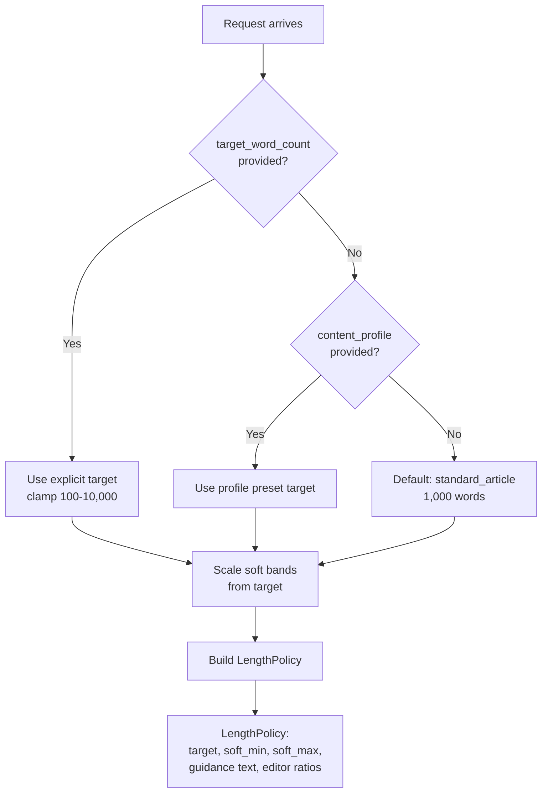

**Design decision**: The profile still influences editor strictness ratios even when `target_word_count` overrides the numeric target. Tighter over-length checks apply for deep dives; looser for listicles.

### 5.3 Series Context

For multi-part series, `SeriesContext` scopes the outline and draft to a single instalment:

- `series_title`: Overall series name
- `part_number`: Current instalment (1-based)
- `planned_parts`: Total planned parts
- `instalment_scope`: What this specific part covers

---

## 6. Author Profile Architecture

The author profile system personalizes all generated content with the author's identity, voice, and background.

### 6.1 Profile Model

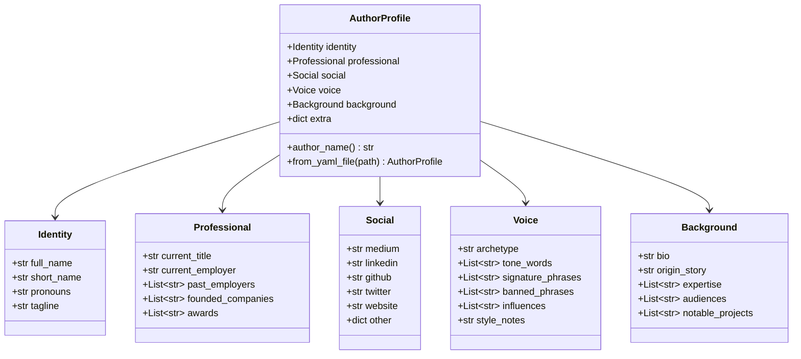

### 6.2 Profile Resolution Chain

1. `$AUTHOR_PROFILE_PATH` env var (explicit path)
2. `$AGENT_CACHE/author_profile.yaml` (convention-based)
3. Bundled `author_profile.example.yaml` (fallback with warning)
4. Raises error if `AUTHOR_PROFILE_STRICT=true` and no profile found

Profiles are cached by `(resolved_path, mtime_ns)` to avoid re-parsing on every request.

### 6.3 Template Rendering

Writing guidelines (`docs/writing_guidelines.md`) and brand spec (`docs/brand_spec_prompt.md`) are **Jinja2 templates** rendered against the `AuthorProfile` at runtime using `StrictUndefined` so missing fields fail loudly.

---

## 7. LLM Integration Patterns

### 7.1 Client Architecture

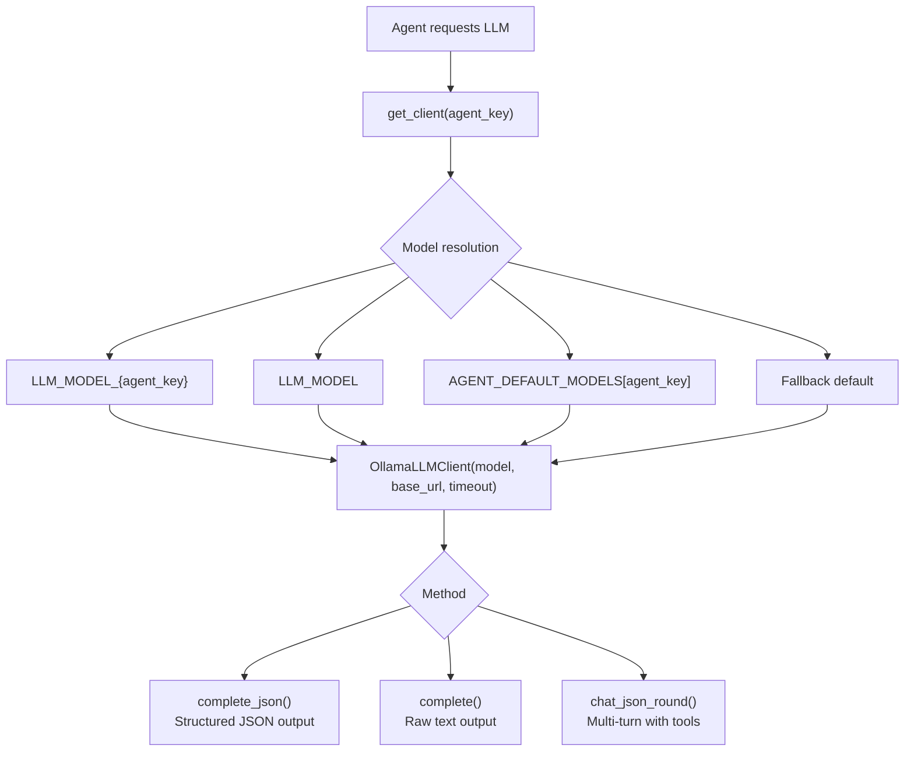

**Design decision**: Clients are cached by `(model, base_url, timeout)` tuple for thread safety. The factory returns a `DummyLLMClient` in test environments.

### 7.2 Error Recovery

- **JSON parse failures**: Up to `BLOG_PLANNING_MAX_PARSE_RETRIES` (default 3) attempts with fallback to `complete()` + manual `parse_json_object()`
- **Rate limits (429)**: Raised as `LLMRateLimitError` after retry exhaustion
- **Server errors (5xx)**: Raised as `LLMTemporaryError`
- **Compliance fallback**: Up to 3 LLM rounds; on persistent parse failure returns a safe `FAIL` report

### 7.3 Planning Model Override

The `BLOG_PLANNING_MODEL` env var allows using a different model specifically for planning (e.g., a larger model for better content plans) while the rest of the pipeline uses the default `LLM_MODEL`.

---

## 8. Postgres Schema

### 8.1 Story Bank Table

Defined in `postgres/__init__.py` as a `TeamSchema` constant and registered at FastAPI lifespan startup via `register_team_schemas(SCHEMA)`:

```sql
CREATE TABLE IF NOT EXISTS blogging_stories (
    id              TEXT PRIMARY KEY,
    narrative       TEXT NOT NULL,
    section_title   TEXT NOT NULL DEFAULT '',
    section_context TEXT NOT NULL DEFAULT '',
    keywords        JSONB NOT NULL DEFAULT '[]'::jsonb,
    summary         TEXT NOT NULL DEFAULT '',
    source_job_id   TEXT,
    created_at      TIMESTAMPTZ NOT NULL DEFAULT NOW()
);

CREATE INDEX IF NOT EXISTS idx_blogging_stories_source_job
    ON blogging_stories(source_job_id);
```

**Design decisions**:
- Stories are persisted for cross-post reuse (the ghost writer agent elicits stories once, uses them across future posts)
- `keywords` as JSONB enables flexible search without schema changes
- `find_relevant_stories()` uses two-stage retrieval: keyword overlap SQL query, then LLM reranking
- All queries instrumented via `@timed_query(store="blogging_story_bank")`

### 8.2 Schema Registration Pattern

The blogging team follows **Pattern B**: a pure-data `SCHEMA: TeamSchema` constant is exported from `blogging/postgres/__init__.py`, and the FastAPI lifespan calls `register_team_schemas(SCHEMA)` at startup. The schema is a no-op when `POSTGRES_HOST` is unset.

---

## 9. Real-time Communication (SSE Event Bus)

### 9.1 Architecture

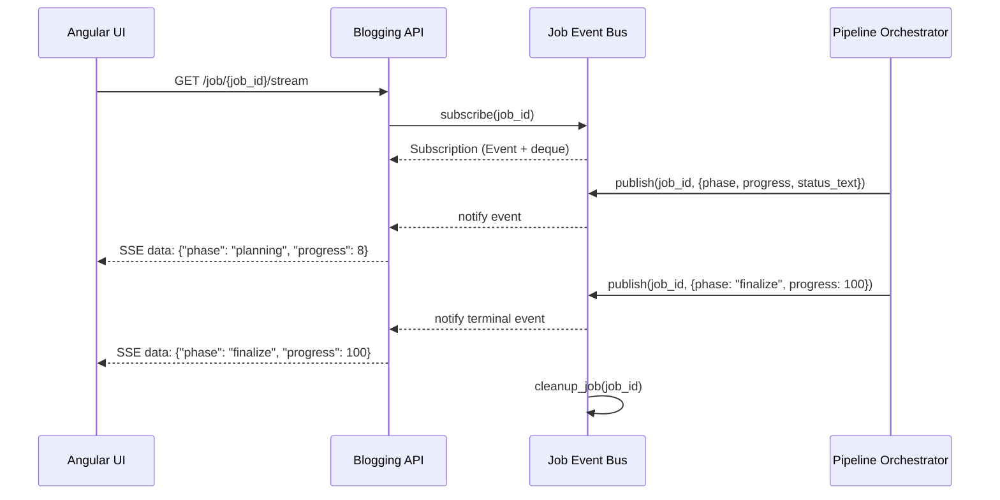

### 9.2 Design Decisions

- **Thread-safe**: Uses `threading.Event` for notifications and `deque(maxlen=500)` for event buffering
- **Per-job isolation**: Each job_id has independent subscribers; no cross-job interference
- **Automatic cleanup**: `cleanup_job()` wakes all subscribers on terminal events and removes the job
- **Integration**: The `job_updater()` wrapper in `run_pipeline_job.py` publishes to SSE on every job store update, merging update kwargs with timestamp

---

## 10. Deterministic Validators

The validator system runs rule-based checks without LLM calls, providing fast feedback before the more expensive compliance and fact-check gates.

| Check | What It Detects | Configuration |
|-------|-----------------|---------------|
| `banned_phrases` | Cliches ("In today's fast-paced world", "Furthermore", "In conclusion", etc.) | Case-insensitive match against 20+ phrases |
| `banned_patterns` | Vague citations ("Studies show", "Experts agree"), em-dash overuse | Regex patterns |
| `paragraph_length` | Too-short or too-long paragraphs | Min/max sentences per paragraph |
| `reading_level` | Grade level outside target range | Flesch-Kincaid via readability library |
| `required_sections` | Missing required markdown headings | Configurable heading list |
| `claims_policy` | Missing `[CLAIM:id]` tags on factual claims | When claims tagging is required |

**Design decision**: Validators run before LLM-based gates to catch mechanical issues cheaply. Their report is passed to the Compliance Agent as additional context.
