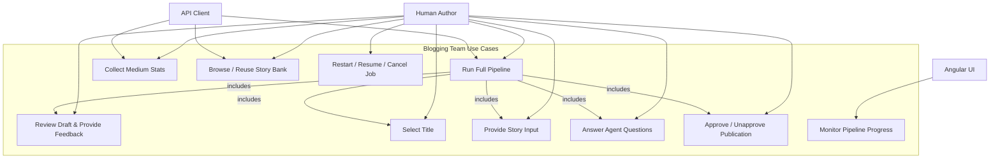
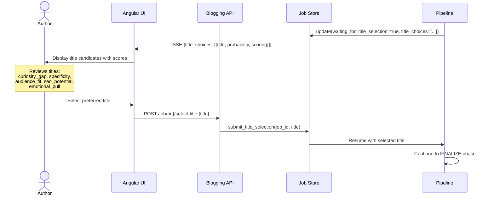
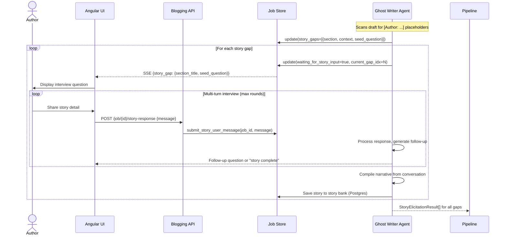
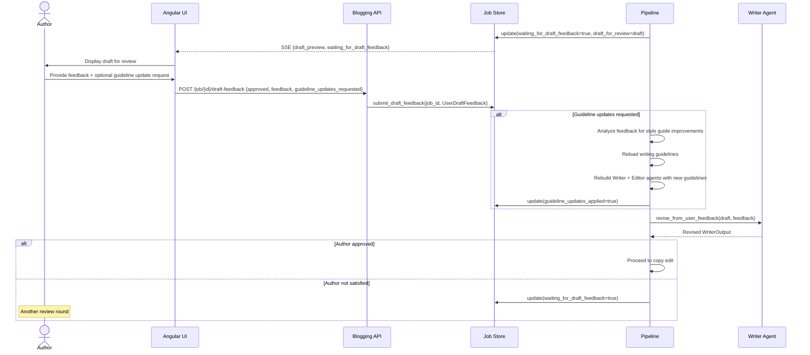
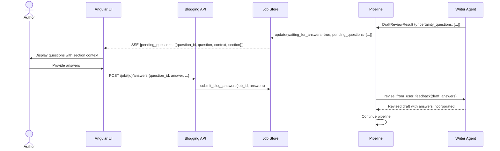
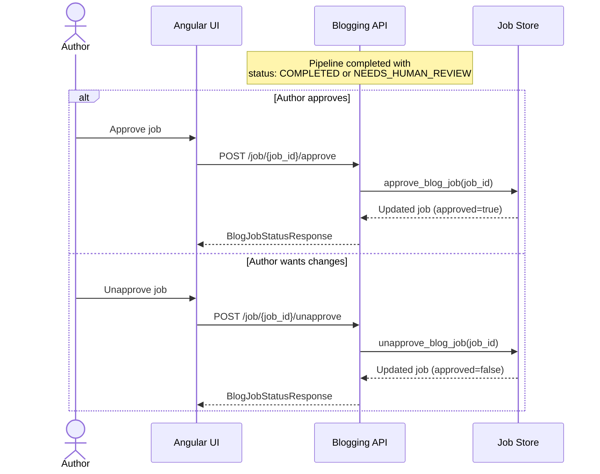
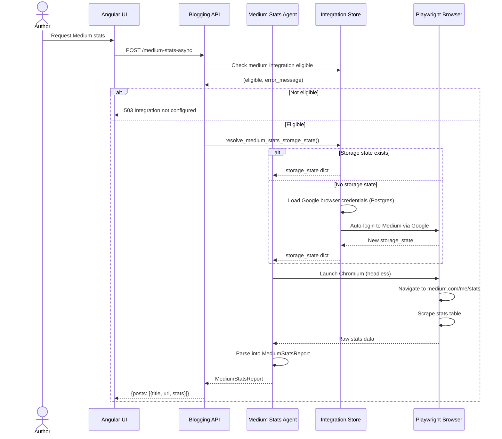
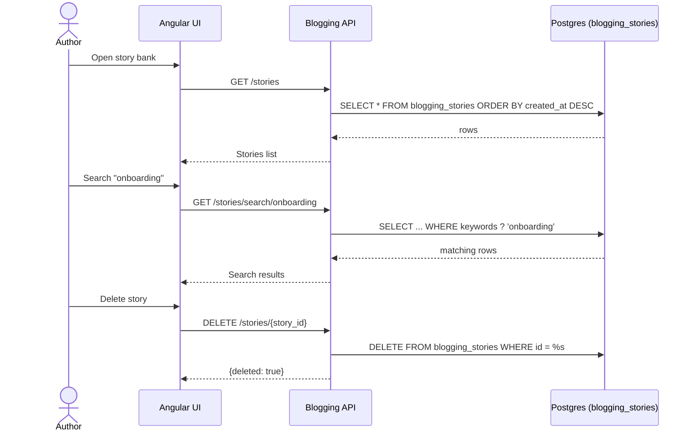

# Blogging Team — Use Cases

This document describes the actors, primary use cases, and detailed interaction sequences for the blogging agent suite.

---

## 1. Actors

| Actor | Type | Description |
|-------|------|-------------|
| **Human Author** | Primary | Content creator who initiates pipelines, provides feedback, selects titles, tells stories, and approves publications |
| **Angular UI** | System | Frontend client that renders progress, collects user inputs, and streams SSE events |
| **API Client** | System | Any HTTP client (CLI, script, integration) calling the REST API directly |
| **LLM Service** | Internal | Ollama/Claude inference backend used by all LLM-powered agents |
| **Temporal Server** | Internal | Durable workflow engine for long-running pipeline execution |
| **PostgreSQL** | Internal | Persistent store for job state, story bank, and integration credentials |
| **Medium.com** | External | Publishing platform; stats scraped via Playwright |
| **arXiv** | External | Academic paper repository searched during research |

---

## 2. Primary Use Cases



---

## 3. Use Case: Full Pipeline Execution

The primary use case — an author requests a complete blog post from brief to publishing-ready output.

### 3.1 Sequence Diagram

```mermaid
sequenceDiagram
    actor Author
    participant UI as Angular UI
    participant API as Blogging API
    participant JS as Job Store
    participant Pipeline as Pipeline Orchestrator
    participant WA as Writer Agent
    participant GW as Ghost Writer
    participant CE as Copy Editor
    participant Val as Validators
    participant FC as Fact Check Agent
    participant CA as Compliance Agent
    Author->>UI: Submit brief, audience, tone, profile
    UI->>API: POST /full-pipeline-async {brief, audience, ...}
    API->>JS: create_blog_job(job_id)
    API-->>UI: {job_id}
    UI->>API: GET /job/{job_id}/stream (SSE)

    Note over Pipeline: Phase 1: PLANNING (0-15%)
    API->>Pipeline: run_blog_full_pipeline_job()
    Pipeline->>WA: plan_content(PlanningInput)
    Note over WA: research_digest defaults to "";<br/>no ResearchAgent call in v2

    loop Refine until acceptable (max 5 iterations)
        WA->>WA: Generate / refine ContentPlan
        WA->>WA: Check requirements_analysis<br/>(plan_acceptable AND scope_feasible)
    end

    WA-->>Pipeline: PlanningPhaseResult
    Pipeline-->>UI: SSE {phase: planning, progress: 15}

    Note over Pipeline: Phase 2: DRAFT_INITIAL (15-30%)
    Pipeline->>WA: run(WriterInput)
    WA-->>Pipeline: WriterOutput (draft_v1)

    opt Story placeholders detected
        Pipeline->>GW: elicit_stories(StoryGap[])
        loop Per story gap
            GW-->>UI: SSE {waiting_for_story_input}
            Author->>UI: Provide story details
            UI->>API: POST /job/{id}/story-response
            API->>GW: deliver user message
        end
        GW-->>Pipeline: StoryElicitationResult[]
        Pipeline->>WA: Regenerate draft with stories
    end

    Pipeline-->>UI: SSE {phase: draft_initial, progress: 30}

    Note over Pipeline: Phase 3: DRAFT_REVIEW (30-45%)
    opt Uncertainty questions detected
        Pipeline-->>UI: SSE {waiting_for_answers, pending_questions}
        Author->>UI: Provide answers
        UI->>API: POST /job/{id}/answers
        Pipeline->>WA: revise_from_user_feedback()
    end

    Pipeline-->>UI: SSE {waiting_for_draft_feedback, draft_preview}
    Author->>UI: Review draft, provide feedback
    UI->>API: POST /job/{id}/draft-feedback
    Pipeline->>WA: revise_from_user_feedback()
    Pipeline-->>UI: SSE {phase: draft_review, progress: 45}

    Note over Pipeline: Phase 4: COPY_EDIT (45-60%)
    loop Copy edit iterations
        Pipeline->>CE: run(CopyEditorInput)
        CE-->>Pipeline: CopyEditorOutput {feedback_items}
        alt Editor approves
            Pipeline->>Pipeline: Break loop
        else Feedback provided
            Pipeline->>WA: revise_from_feedback(ReviseWriterInput)
            WA-->>Pipeline: WriterOutput (revised)
        end
    end
    Pipeline-->>UI: SSE {phase: copy_edit, progress: 60}

    Note over Pipeline: Phase 5-6: FACT_CHECK + COMPLIANCE (60-82%)
    Pipeline->>Val: run_validators(draft)
    Val-->>Pipeline: ValidatorReport
    Pipeline->>FC: run(draft)
    FC-->>Pipeline: FactCheckReport
    Pipeline->>CA: run(draft, brand_spec, validator_report)
    CA-->>Pipeline: ComplianceReport

    alt All gates PASS
        Pipeline-->>UI: SSE {phase: compliance, progress: 82}
    else Any gate FAIL
        Note over Pipeline: Phase 7: REWRITE_LOOP (82-90%)
        loop Max rewrite iterations
            Pipeline->>WA: revise_from_feedback(required_fixes)
            Pipeline->>Val: re-run validators
            Pipeline->>FC: re-run fact check
            Pipeline->>CA: re-run compliance
        end
    end

    Note over Pipeline: Phase 8: TITLE_SELECTION (90-96%)
    Pipeline-->>UI: SSE {waiting_for_title_selection, title_choices}
    Author->>UI: Select preferred title
    UI->>API: POST /job/{id}/select-title

    Note over Pipeline: Phase 9: FINALIZE (96-100%)
    Pipeline->>Pipeline: Generate PublishingPack
    Pipeline->>JS: complete_blog_job()
    Pipeline-->>UI: SSE {phase: finalize, progress: 100, status: COMPLETED}
```

---

## 4. Use Case: Human Collaboration Points

The pipeline pauses at multiple points for human input. Each pause sets a `waiting_for_*` flag on the job record and resumes when the corresponding API endpoint receives input.

### 4.1 Title Selection



### 4.2 Story Elicitation (Multi-turn Interview)



### 4.3 Draft Feedback with Guideline Updates



### 4.4 Uncertainty Question Resolution



---

## 5. Use Case: Approval Workflow

The API exposes `approve` and `unapprove` endpoints for completed or needs-human-review jobs. There is no `reject` endpoint — authors can unapprove and provide feedback via draft-feedback instead.

> **Note:** The pipeline orchestrator produces a `PublishingPack` artifact directly. The Publication Agent module provides models and platform formatters but is **not** invoked by the pipeline's `run_pipeline()` function.



---

## 6. Use Case: Medium Stats Collection



---

## 7. Use Case: Story Bank Reuse

Stories elicited by the Ghost Writer during a previous pipeline run are persisted to the `blogging_stories` Postgres table so they can be reused across posts. The API exposes browse, search, and delete endpoints.



During a new pipeline run, the Ghost Writer elicitation step queries this table for keyword-overlap matches against the current content plan so unchanged stories do not need to be re-interviewed.

---

## 8. API Endpoint Mapping

| Use Case | Method | Endpoint | Request Body | Response |
|----------|--------|----------|-------------|----------|
| Run full pipeline (sync) | POST | `/full-pipeline` | `FullPipelineRequest` | `FullPipelineResponse` |
| Start async pipeline | POST | `/full-pipeline-async` | `FullPipelineRequest` | `StartPipelineResponse {job_id}` |
| List jobs | GET | `/jobs` | — | `ListJobsResponse` |
| Poll job status | GET | `/job/{job_id}` | — | `BlogJobStatusResponse` |
| Stream progress (SSE) | GET | `/job/{job_id}/stream` | — | SSE events |
| Cancel job | POST | `/job/{job_id}/cancel` | — | `CancelJobResponse` |
| Resume job | POST | `/job/{job_id}/resume` | — | `StartPipelineResponse` |
| Restart job | POST | `/job/{job_id}/restart` | — | `StartPipelineResponse` |
| Delete job | DELETE | `/job/{job_id}` | — | `DeleteJobResponse` |
| Select title | POST | `/job/{job_id}/select-title` | `SelectTitleRequest {title}` | `BlogJobStatusResponse` |
| Rate title candidates | POST | `/job/{job_id}/rate-titles` | `RateTitlesRequest {ratings}` | `BlogJobStatusResponse` |
| Submit draft feedback | POST | `/job/{job_id}/draft-feedback` | `DraftFeedbackRequest {feedback, approved}` | `BlogJobStatusResponse` |
| Send story response | POST | `/job/{job_id}/story-response` | `StoryResponseRequest {message}` | `BlogJobStatusResponse` |
| Skip story gap | POST | `/job/{job_id}/skip-story-gap` | — | `BlogJobStatusResponse` |
| Submit answers | POST | `/job/{job_id}/answers` | `BlogAnswersRequest {answers}` | `BlogJobStatusResponse` |
| Approve job | POST | `/job/{job_id}/approve` | — | `BlogJobStatusResponse` |
| Unapprove job | POST | `/job/{job_id}/unapprove` | — | `BlogJobStatusResponse` |
| List artifacts | GET | `/job/{job_id}/artifacts` | — | `ArtifactListResponse` |
| Get artifact content | GET | `/job/{job_id}/artifacts/{artifact_name}` | — | JSON or file download |
| List stories | GET | `/stories` | — | `{stories: [...]}` |
| Get story | GET | `/stories/{story_id}` | — | Story record |
| Delete story | DELETE | `/stories/{story_id}` | — | `{deleted: true}` |
| Search stories | GET | `/stories/search/{keywords}` | — | `{matches: [...]}` |
| Medium stats (sync) | POST | `/medium-stats` | `MediumStatsRequest` | `MediumStatsReport` |
| Medium stats (async) | POST | `/medium-stats-async` | `MediumStatsRequest` | `StartPipelineResponse {job_id}` |
| Health check | GET | `/health` | — | `{status, brand_spec_configured}` |
