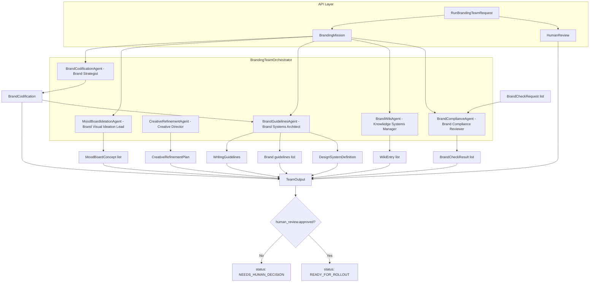
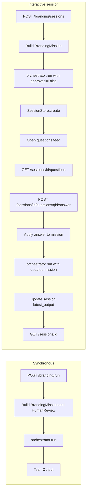
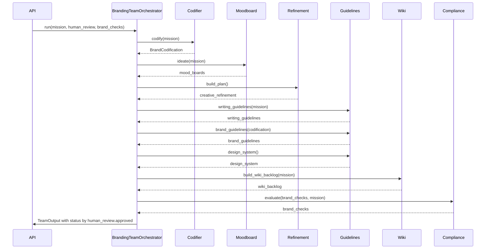

# Branding Strategy Team

This team defines and operationalizes an enterprise brand system through a coordinated group of specialist agents. It is structured as a **branding agency**: one client can own many brands, and the team assists with building, maintaining, and evolving each brand over time.

## Table of contents

- [What this team does](#what-this-team-does)
- [Agency model (clients and brands)](#agency-model-clients-and-brands)
- [Agent setup and flow](#agent-setup-and-flow)
- [API and session flow](#api-and-session-flow)
- [Agency API (clients, brands, run, outsourcing)](#agency-api-clients-brands-run-outsourcing)
- [Outsourcing](#outsourcing)
- [Elite deliverables](#elite-deliverables)
- [Integration with other teams](#integration-with-other-teams)
- [Notes on session behavior](#notes-on-session-behavior)

## What this team does

1. **Codifies brand identity** with positioning, promise, and narrative pillars.
2. **Ideates brand images** through multiple mood-board concepts.
3. **Guides refinement** with a structured creative workshop and decision framework.
4. **Defines writing guidelines, brand guidelines, and design system standards** for consistent delivery.
5. **Builds and maintains a brand wiki backlog** so the entire organization can work from a shared source of truth.
6. **Fields on-brand requests** by evaluating assets and returning confidence, rationale, and revision suggestions.
7. **Runs an interactive asynchronous clarification loop** where open questions are published to a feed and answered one-by-one.
8. **Manages clients and brands** so each client can have many brands, with versioned runs and evolution over time.
9. **Outsources** market research (competitive/similar brands) and design-asset requests to other teams when configured.

## Agency model (clients and brands)

- **One client, many brands.** Each client has an `id` and `name`; each brand belongs to one client and has a mission (company name, description, target audience, etc.), status (`draft` | `active` | `evolving` | `archived`), and versioned run history.
- **Lifecycle:** Create a client → create one or more brands (with mission) → **run** the orchestrator for a brand (output is stored as a new version) → **evolve** by updating the brand’s mission or status and re-running. The team can also **request market research** or **request design assets** for a brand; results are returned (and optionally attached to the brand context).
- **Persistence:** Clients and brands are stored in an in-memory store (thread-safe). Restarting the API clears the store; the design allows swapping to SQLite/Postgres later without changing the API surface.

## Agent setup and flow

The orchestrator coordinates six specialist agents. Inputs are `BrandingMission`, `HumanReview`, and optional `BrandCheckRequest` list; output is a single `TeamOutput` whose status depends on `human_review.approved`.



## API and session flow

**Synchronous:** `POST /branding/run` builds mission and human review, runs the orchestrator once, and returns `TeamOutput`.

**Interactive session:** create a session (orchestrator runs with `approved=False`), then read open questions, answer them one-by-one; each answer updates the mission and the orchestrator is re-run to refresh artifacts.



## Agent roles and outputs

| Agent | Role | Input | Output |
|-------|------|--------|--------|
| **BrandCodificationAgent** | Brand Strategist | BrandingMission | BrandCodification (positioning, promise, pillars) |
| **MoodBoardIdeationAgent** | Brand Visual Ideation Lead | BrandingMission | List of MoodBoardConcept |
| **CreativeRefinementAgent** | Creative Director | — | CreativeRefinementPlan (phases, prompts, criteria) |
| **BrandGuidelinesAgent** | Brand Systems Architect | Mission + Codification | WritingGuidelines, brand guidelines list, DesignSystemDefinition |
| **BrandWikiAgent** | Knowledge Systems Manager | BrandingMission | List of WikiEntry (backlog) |
| **BrandComplianceAgent** | Brand Compliance Reviewer | BrandCheckRequest list + Mission | List of BrandCheckResult |

### Orchestrator run sequence

Within a single `orchestrator.run()` call, agents are invoked in this order; all outputs are combined into `TeamOutput`.



## API

Start:

```bash
uvicorn branding_team.api.main:app --reload --host 0.0.0.0 --port 8012
```

### Synchronous team run

```http
POST /branding/run
```

Use this endpoint when you already have all required information and only need the final team output.

### Interactive asynchronous workflow

This workflow is designed for human-in-the-loop clarification and progressive refinement.

1. **Create session** and generate initial outputs plus open questions:

```http
POST /branding/sessions
```

2. **Read current session state** (mission + latest output + open/answered questions):

```http
GET /branding/sessions/{session_id}
```

3. **Read open-question feed** for the session:

```http
GET /branding/sessions/{session_id}/questions
```

4. **Answer one question at a time**; the mission is updated and branding artifacts are regenerated:

```http
POST /branding/sessions/{session_id}/questions/{question_id}/answer
```

### Example session creation payload

```json
{
  "company_name": "Northstar Labs",
  "company_description": "A product and AI enablement consultancy for B2B software teams",
  "target_audience": "VP Product and Design leaders",
  "values": ["clarity", "craft", "trust"],
  "differentiators": ["hands-on operators", "speed to value"],
  "desired_voice": "clear, practical, confident",
  "brand_checks": [
    {
      "asset_name": "Q3 product launch landing page",
      "asset_description": "Highlights measurable business outcomes with proof and concise messaging"
    }
  ]
}
```

### Example answer payload

```json
{
  "answer": "Use clear, practical, and direct language for technical buyers"
}
```

## Agency API (clients, brands, run, outsourcing)

All paths are under the branding API prefix (e.g. `/branding/...`).

| Method | Path | Description |
|--------|------|-------------|
| POST | `/branding/clients` | Create client; body `{ "name": "...", "contact_info": "...", "notes": "..." }`; returns 201 and `Client`. |
| GET | `/branding/clients` | List all clients. |
| GET | `/branding/clients/{client_id}` | Get one client; 404 if not found. |
| GET | `/branding/clients/{client_id}/brands` | List brands for client; 404 if client not found. |
| POST | `/branding/clients/{client_id}/brands` | Create brand; body mission-like + optional `name`; returns 201 and `Brand`; 404 if client not found. |
| GET | `/branding/clients/{client_id}/brands/{brand_id}` | Get brand (includes `latest_output`, `history`); 404 if not found. |
| PUT | `/branding/clients/{client_id}/brands/{brand_id}` | Update brand (partial mission or `status`); 404 if not found. |
| POST | `/branding/clients/{client_id}/brands/{brand_id}/run` | Run orchestrator for this brand; persist output as new version; returns `TeamOutput`; 404 if brand not found. Body: `{ "human_approved": true, "include_market_research": false, "include_design_assets": false, "brand_checks": [] }`. |
| POST | `/branding/clients/{client_id}/brands/{brand_id}/request-market-research` | Call Market Research adapter for this brand; returns `CompetitiveSnapshot`; 503 if service unavailable; 404 if brand not found. |
| POST | `/branding/clients/{client_id}/brands/{brand_id}/request-design-assets` | Request design assets (stub or StudioGrid when configured); returns `DesignAssetRequestResult`; 404 if brand not found. |

### Example: create client and brand, then run

```bash
# Create client
curl -X POST http://localhost:8012/branding/clients -H "Content-Type: application/json" -d '{"name": "Acme Corp"}'
# => {"id": "client_abc123...", "name": "Acme Corp", ...}

# Create brand (use client_id from above)
curl -X POST http://localhost:8012/branding/clients/client_abc123.../brands \
  -H "Content-Type: application/json" \
  -d '{"company_name": "Acme", "company_description": "A great company", "target_audience": "everyone"}'
# => {"id": "brand_xyz789...", "client_id": "client_abc123...", "name": "Acme", "status": "draft", ...}

# Run branding for this brand
curl -X POST http://localhost:8012/branding/clients/client_abc123.../brands/brand_xyz789.../run \
  -H "Content-Type: application/json" \
  -d '{"human_approved": true, "include_market_research": false, "include_design_assets": true}'
# => TeamOutput (codification, mood_boards, brand_guidelines, brand_book, design_asset_result, ...)
```

**Backward compatibility:** `POST /branding/run` and `POST /branding/sessions` (and all session/question endpoints) are unchanged. Request bodies for `/branding/run` and session creation may optionally include `client_id` and `brand_id`; when both are provided, the run is associated with that brand and the result is stored as a new version.

## Outsourcing

- **Market Research:** When `include_market_research` is true on a brand run, or when calling `POST .../request-market-research`, the branding team calls the **Market Research** team API (product concept = competitive/similar brands for the company, target users = brand’s target audience, business goal = differentiate and position). The response is mapped to a **CompetitiveSnapshot** (summary, similar_brands, insights, source). Configure `UNIFIED_API_BASE_URL` or `BRANDING_MARKET_RESEARCH_URL` so the branding API can reach the market research endpoint (e.g. `http://localhost:8080` when running under the unified server).
- **Design assets:** When `include_design_assets` is true on a brand run, or when calling `POST .../request-design-assets`, the branding team calls a design-asset adapter. If **StudioGrid** (or another design service) is mounted and `BRANDING_DESIGN_SERVICE_URL` is set, the adapter can call it; otherwise it returns a structured **stub** (`DesignAssetRequestResult` with status `pending` and a placeholder message). This keeps the orchestrator agnostic of whether a design service is available.

## Elite deliverables

In addition to codification, mood boards, guidelines, design system, wiki backlog, and brand checks, the team can produce:

- **BrandBook:** A consolidated document (markdown + optional structured sections) built from positioning, promise, pillars, voice principles, brand guidelines, and design system principles. Returned in `TeamOutput.brand_book`.
- **CompetitiveSnapshot:** From the Market Research team: summary, similar_brands, insights, source. Returned in `TeamOutput.competitive_snapshot` when `include_market_research` is true, or from `POST .../request-market-research`.
- **DesignAssetRequestResult:** From the design-asset adapter: request_id, status (e.g. pending/completed), artifacts list. Returned in `TeamOutput.design_asset_result` when `include_design_assets` is true, or from `POST .../request-design-assets`.

## Integration with other teams

- **Market Research API:** Used for competitive/similar-brands research. Set `UNIFIED_API_BASE_URL` or `BRANDING_MARKET_RESEARCH_URL` to the base URL of the server that hosts the market research API (e.g. unified API at `http://localhost:8080`). The branding team POSTs to `/api/market-research/market-research/run`.
- **StudioGrid (design system workflow):** Not currently mounted on the unified API. When StudioGrid is added and a “brand intake → design assets” contract is defined, set `BRANDING_DESIGN_SERVICE_URL` (or use the same base URL and path) so the design-asset adapter can call it instead of returning a stub.

## Notes on session behavior

- Sessions are currently stored **in memory** in the API process.
- Restarting the API clears active session state.
- Each answer is applied immediately to the mission context, then the orchestrator reruns to refresh output artifacts.
