# Branding Team — Architecture

## Overview

The branding team is a **5-phase enterprise brand development pipeline**
organized as a digital branding agency. Each of its specialist agents owns a
single phase of brand development, and the phases must execute in a strict
dependency order because each one consumes the outputs of its predecessors.

The team is structured around two intertwined ideas:

1. **Phase-gated pipeline** — the orchestrator sequences five phases
   (Strategic Core → Narrative & Messaging → Visual Identity →
   Channel Activation → Governance & Evolution), and a human review gate
   controls progression from one phase to the next. See
   `orchestrator.py:51-114` for the phase order and gate builder.
2. **Agency model** — a single `Client` can own many `Brand` entities; each
   `Brand` carries its own mission, status, current phase, and versioned
   run history. See `models.py:514-528` and `store.py:100-252`.

On top of this pipeline the team exposes **three concurrent API styles** —
synchronous one-shot runs, interactive Q&A sessions, and LLM-driven
conversations — so clients with very different starting points (fully
briefed vs. exploratory vs. chat-first) can all reach a consistent
`TeamOutput`.

## Architectural principles

- **Dependency order is enforced in code, not documentation.**
  `orchestrator.run()` only executes phase N+1 if phase N produced a
  non-`None` output, and the `_build_phase_gates()` helper marks earlier
  phases as `APPROVED`, the current phase as `PENDING_REVIEW` (or
  `APPROVED` if `human_review.approved`), and later phases as
  `NOT_STARTED`. See `orchestrator.py:69-81` and `orchestrator.py:184-234`.
- **Human-in-the-loop by default.** Every `TeamOutput` includes a
  `WorkflowStatus` that is only `READY_FOR_ROLLOUT` when all five phases
  completed *and* `human_review.approved` is true
  (`orchestrator.py:302-322`). Anything else returns
  `NEEDS_HUMAN_DECISION`.
- **Backward-compatible output shape.** Legacy bridge agents
  (`BrandCodificationAgent`, `MoodBoardIdeationAgent`,
  `CreativeRefinementAgent`, `BrandGuidelinesAgent`, `BrandWikiAgent`)
  still run on every pipeline execution so the legacy fields on
  `TeamOutput` (`codification`, `mood_boards`, `brand_guidelines`,
  `design_system`, `wiki_backlog`, etc.) stay populated for existing
  consumers. See `orchestrator.py:141-145` and `orchestrator.py:196-203`.
- **Composable external work via thin adapters.** Market research and
  design asset generation are delegated to sibling teams through HTTP
  adapters (`adapters/market_research.py`, `adapters/design_assets.py`).
  The orchestrator never imports the other teams directly — it only calls
  the adapter functions and tolerates their absence.
- **Persistence-agnostic API surface.** The public endpoints take and
  return Pydantic models; the underlying storage is SQLite today
  (`store.py:30-41`) with a Postgres schema already defined for a future
  migration (`postgres/__init__.py`). Swapping stores does not change the
  API contract.
- **Graceful LLM fallback.** The conversational assistant lazy-initializes
  the shared LLM client and, if the call fails, returns a hard-coded reply
  and suggested questions instead of surfacing an exception
  (`assistant/agent.py:181-195`). The FastAPI app also mounts even when
  `llm_service` is unavailable (`api/main.py:72-83`).

## Component diagram

```mermaid
flowchart TB
    subgraph clients [External clients]
        CLI[CLI / curl]
        UI[Angular UI]
        Agents[Other Khala teams]
    end

    subgraph gateway [Unified API gateway]
        UnifiedAPI["Unified API<br/>/api/branding/*<br/>unified_api/config.py:88-95"]
    end

    subgraph api_layer [FastAPI — branding_team/api/main.py]
        direction TB
        AgencyAPI["Agency API<br/>/clients, /brands"]
        RunAPI["Sync run<br/>POST /run<br/>POST /brands/{id}/run<br/>POST /brands/{id}/run/{phase}"]
        SessionAPI["Session API<br/>/sessions, /questions"]
        ConvAPI["Conversation API<br/>/conversations"]
        IntegAPI["Integration endpoints<br/>/request-market-research<br/>/request-design-assets"]
    end

    subgraph orch_layer [Orchestration — orchestrator.py]
        Orch["BrandingTeamOrchestrator<br/>run()  run_phase()"]
        Gates["Phase gate logic<br/>_build_phase_gates()"]
        BookBuilder["_build_brand_book()<br/>Consolidated BrandBook"]
    end

    subgraph agents_layer [Specialist agents — agents.py]
        direction TB
        P1["Phase 1<br/>StrategicCoreAgent"]
        P2["Phase 2<br/>NarrativeMessagingAgent"]
        P3["Phase 3<br/>VisualIdentityAgent"]
        P4["Phase 4<br/>ChannelActivationAgent"]
        P5["Phase 5<br/>GovernanceAgent"]
        Compliance["BrandComplianceAgent"]
        subgraph legacy [Legacy bridge agents]
            L1["BrandCodificationAgent"]
            L2["MoodBoardIdeationAgent"]
            L3["CreativeRefinementAgent"]
            L4["BrandGuidelinesAgent"]
            L5["BrandWikiAgent"]
        end
    end

    subgraph assistant_layer [Conversational assistant — assistant/]
        AssistantAgent["BrandingAssistantAgent<br/>agent.py"]
        Prompts["System + user prompts<br/>prompts.py"]
        LLM["llm_service.get_client<br/>('branding_assistant')"]
    end

    subgraph persistence [Persistence]
        BrandingStore["BrandingStore<br/>store.py (SQLite)"]
        SessionStore["BrandingSessionStore<br/>api/main.py (SQLite)"]
        ConvStore["BrandingConversationStore<br/>assistant/store.py"]
        DBPath["get_db_path()<br/>db.py"]
        PG["Postgres schema<br/>postgres/__init__.py"]
    end

    subgraph adapters [External integrations — adapters/]
        MR["request_market_research()<br/>market_research.py"]
        DA["request_design_assets()<br/>design_assets.py"]
    end

    subgraph runtime [Runtime wrappers]
        Temporal["BrandingWorkflow<br/>temporal/__init__.py<br/>task queue: branding-queue"]
    end

    CLI --> UnifiedAPI
    UI --> UnifiedAPI
    Agents --> UnifiedAPI
    UnifiedAPI --> api_layer

    AgencyAPI --> BrandingStore
    RunAPI --> Orch
    SessionAPI --> Orch
    ConvAPI --> AssistantAgent
    ConvAPI --> Orch
    IntegAPI --> MR
    IntegAPI --> DA

    Orch --> Gates
    Orch --> BookBuilder
    Orch --> P1 --> P2 --> P3 --> P4 --> P5
    Orch --> Compliance
    Orch --> L1
    Orch --> L2
    Orch --> L3
    Orch --> L4
    Orch --> L5

    Orch --> MR
    Orch --> DA

    AssistantAgent --> Prompts
    AssistantAgent --> LLM

    AgencyAPI --> BrandingStore
    SessionAPI --> SessionStore
    ConvAPI --> ConvStore
    BrandingStore --> DBPath
    SessionStore --> DBPath
    ConvStore --> DBPath
    BrandingStore -. future migration .-> PG
    SessionStore -. future migration .-> PG
    ConvStore -. future migration .-> PG

    Temporal -. wraps .-> Orch
```



## Key design decisions

### 1. Why five phases with gates

The five phases map onto how real brand systems are built: strategy first
(who are we?), then verbal identity (how do we talk?), then visual identity
(how do we look?), then activation (where do we show up?), then governance
(how do we stay on-brand?). Skipping ahead produces incoherent output — you
cannot define channel guidelines without a voice, and you cannot define a
voice without a positioning statement. The orchestrator encodes this as
`_PHASE_ORDER` (`orchestrator.py:52-58`) and only executes phase N+1 if
phase N's output is non-`None` (`orchestrator.py:207-234`). Gate status is
tracked explicitly in the `PhaseGate` model so the UI can show stakeholders
what they're approving (`models.py:370-375`).

### 2. Why legacy bridge agents are kept

The `TeamOutput` model still carries the legacy fields
(`codification`, `mood_boards`, `creative_refinement`, `writing_guidelines`,
`brand_guidelines`, `design_system`, `wiki_backlog`) and existing consumers
(including `_build_brand_book`, the design adapter, and the session API)
read them. Removing them would break those consumers. The legacy agents
are therefore invoked unconditionally on every run
(`orchestrator.py:196-203`) so every `TeamOutput` remains
structurally identical regardless of which phases actually ran.

### 3. Why three API styles coexist

Different entry points serve different user states:

- **Synchronous `POST /run`** (`api/main.py:685`) — used when the caller
  already has a full `RunBrandingTeamRequest`. One orchestrator call,
  one `TeamOutput` back. Fastest path for integration tests and
  programmatic callers.
- **Session API `POST /sessions`** (`api/main.py:716`) — used when the
  caller has a partial brief. The orchestrator runs in unapproved mode,
  the mission is analyzed for missing fields, and a question feed is
  published (`_build_open_questions`, `api/main.py:377-405`). Each
  answered question mutates the mission and reruns the orchestrator
  (`api/main.py:758-784`).
- **Conversation API `POST /conversations`** (`api/main.py:813`) — used
  when the caller has no structured brief at all. The
  `BrandingAssistantAgent` wraps the shared LLM client, extracts mission
  fields from free-form text (`assistant/agent.py:14-66`), and reruns
  the orchestrator whenever the mission becomes complete
  (`api/main.py:360-367`). A brand is auto-created the first time a
  company name shows up (`api/main.py:846-865`).

All three produce the same `TeamOutput`, so downstream UIs and integrations
can render the result without caring which path produced it.

### 4. Why SQLite is the default with Postgres ready

Today every store (`store.py:48-73`, `api/main.py:254-293`,
`assistant/store.py`) uses SQLite, falling back to a per-instance
`:memory:` database when no path is supplied (which keeps tests isolated)
and to a WAL-mode file-backed database otherwise. Production deployments
set `BRANDING_DB_PATH` (`db.py:11-19`) so all worker processes share one
file.

`postgres/__init__.py` declares a full Postgres schema
(`branding_clients`, `branding_brands`, `branding_sessions`,
`branding_conversations`, `branding_conv_messages`) registered via
`shared_postgres.register_team_schemas` at FastAPI startup
(`api/main.py:44-53`). This keeps the team ready for migration without
forcing Postgres onto local dev or test environments.

### 5. Why market research and design are adapters, not imports

The branding team calls the Market Research team through HTTP against
`/api/market-research/market-research/run` (`adapters/market_research.py:24`),
not through a direct Python import. This keeps team boundaries crisp: the
branding team can ship, test, and be deployed without requiring the Market
Research team's Python dependencies to resolve, and failures are isolated
to a `RuntimeError` that the orchestrator silently tolerates
(`orchestrator.py:273-280`). The design adapter is a deliberate stub until
a design service contract is defined (`adapters/design_assets.py:26-37`).

### 6. Why Temporal is optional

Most branding runs complete in seconds, so the default execution model is
a normal in-process Python call. When `TEMPORAL_ADDRESS` is set,
`temporal/__init__.py:39-40` registers `BrandingWorkflow` with
`shared_temporal.start_team_worker` on the `"branding-queue"` task queue
with a 2-hour `start_to_close_timeout`. This provides durable execution
for long-running brand builds without making Temporal a hard dependency
for the common case.

## Unified API mount

The branding team is mounted under `/api/branding` with a 120-second
timeout and the `content` cell tag. The full config entry lives at
`backend/unified_api/config.py:88-95`:

```python
"branding": TeamConfig(
    name="Branding",
    prefix="/api/branding",
    description="Brand strategy, moodboards, design and writing standards",
    tags=["branding", "design"],
    cell="content",
    timeout_seconds=120.0,
),
```

## Observability

The FastAPI app initializes OpenTelemetry with
`init_otel(service_name="branding-team", team_key="branding")` and
instruments itself via `instrument_fastapi_app(app, team_key="branding")`
on import (`api/main.py:37-63`). All routes are traced with the
`branding` team key for cross-service correlation.

## Cross-references

| Claim | Source |
|---|---|
| 5-phase pipeline order | `orchestrator.py:52-58` |
| Phase gate builder | `orchestrator.py:69-81` |
| Run loop with dependency guards | `orchestrator.py:184-234` |
| Status determination | `orchestrator.py:302-322` |
| Brand book builder | `orchestrator.py:380-474` |
| Legacy agents instantiated on run | `orchestrator.py:141-145` |
| `TeamOutput` shape incl. legacy fields | `models.py:471-498` |
| `Client` / `Brand` models | `models.py:514-528` |
| SQLite schema (clients, brands) | `store.py:30-41` |
| `BRANDING_DB_PATH` resolution | `db.py:11-19` |
| Postgres schema declaration | `postgres/__init__.py:17-71` |
| Postgres registration at startup | `api/main.py:44-53` |
| Market research HTTP call | `adapters/market_research.py:17-50` |
| Market research result mapping | `adapters/market_research.py:53-74` |
| Design adapter stub | `adapters/design_assets.py:16-37` |
| Temporal worker registration | `temporal/__init__.py:37-40` |
| Unified API mount config | `backend/unified_api/config.py:88-95` |
| OpenTelemetry instrumentation | `api/main.py:37-63` |
