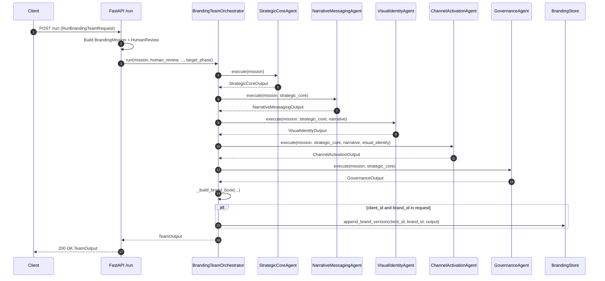
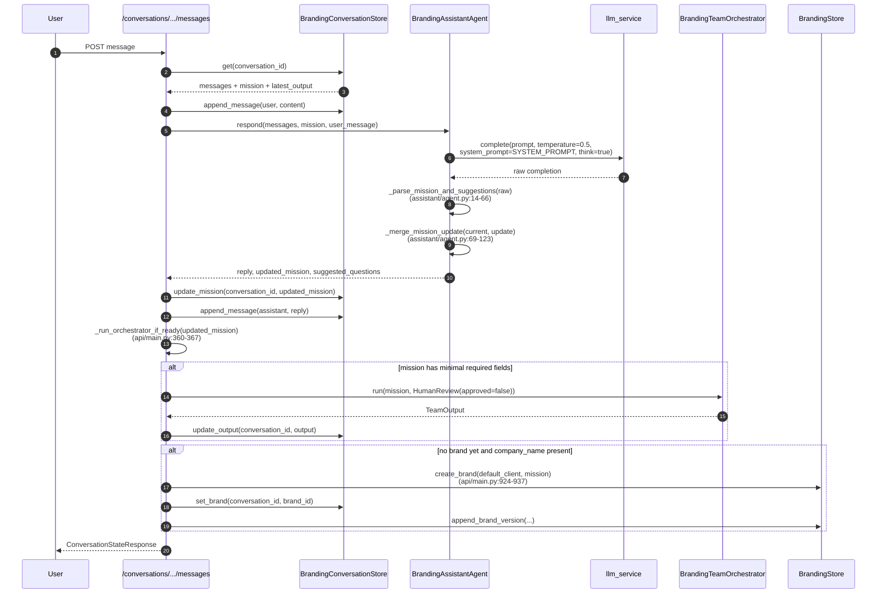
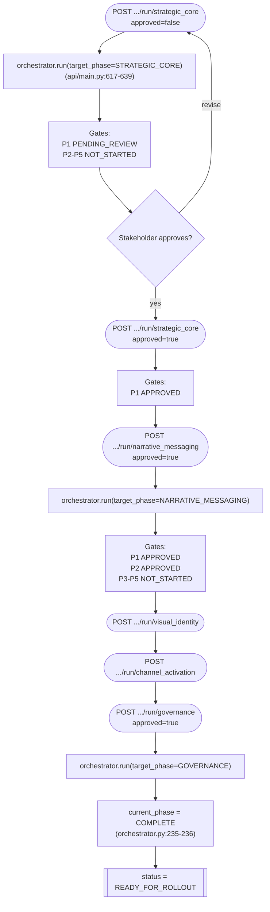
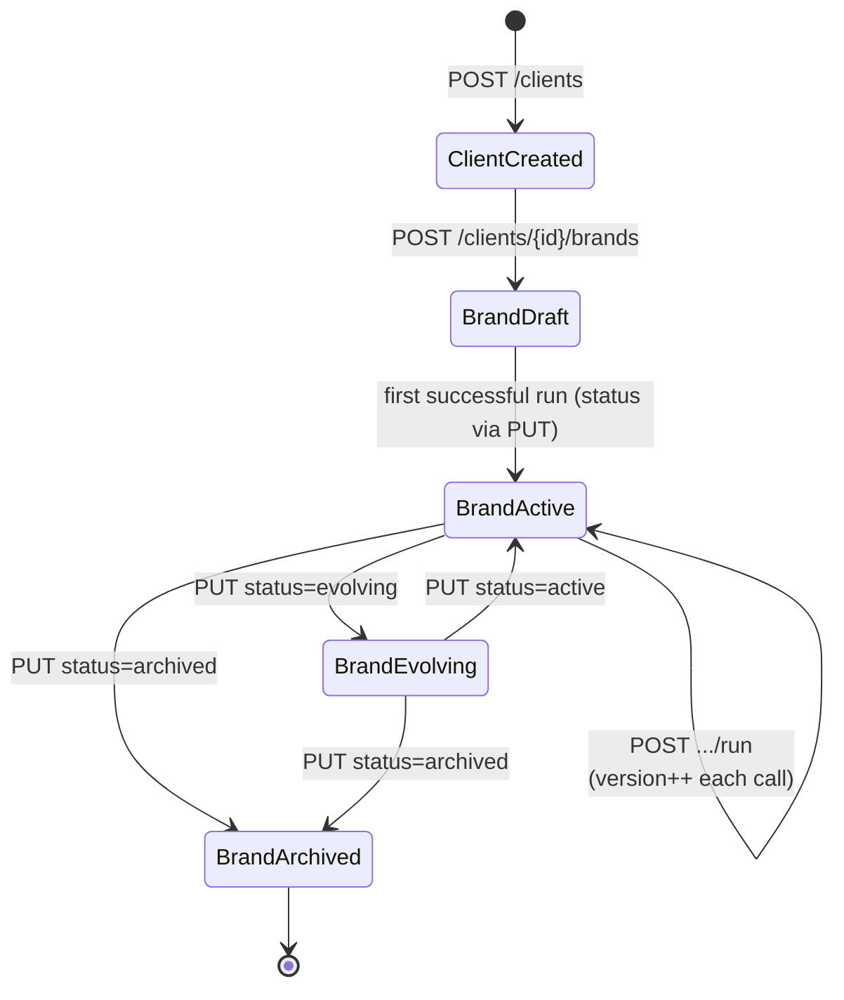
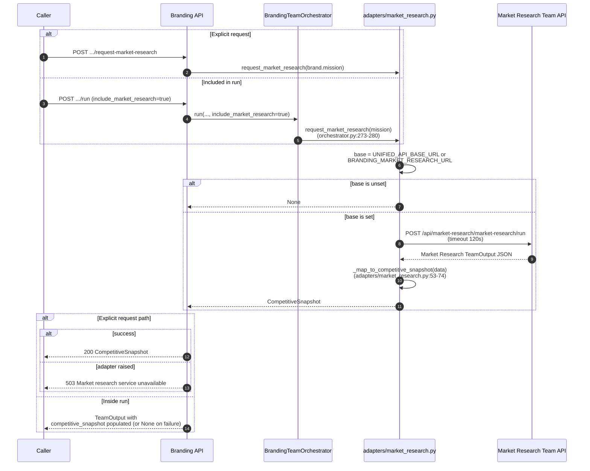
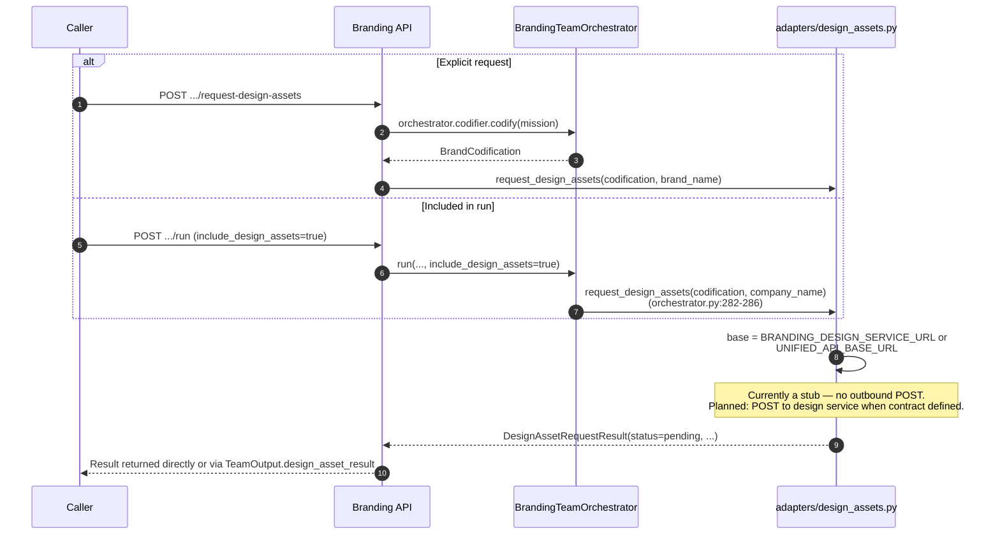
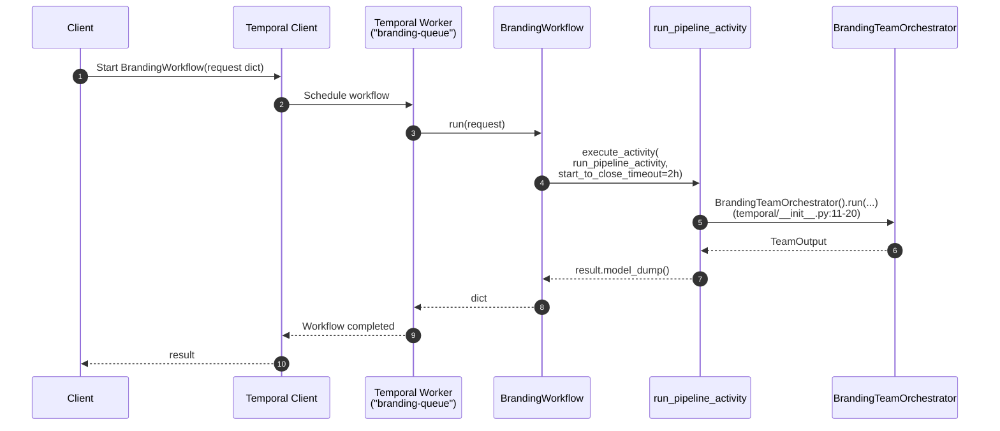

# Branding Team — Flow Charts

This document collects the operational flow and sequence diagrams for every
runtime path through the team. Each diagram is accompanied by a short
narrative and citations into the source code.

## 1. 5-phase orchestrator pipeline with phase gates

This is the core flow executed by `BrandingTeamOrchestrator.run()`
(`orchestrator.py:147-356`). Each phase is guarded by a dependency check
on the previous phase's output, and the final `WorkflowStatus` depends on
both `current_phase` and `human_review.approved`.

```mermaid
flowchart TB
    Start([run mission, human_review, brand_checks])
    Start --> ResolveStop["stop_idx = target_phase or last phase<br/>(orchestrator.py:184)"]
    ResolveStop --> P1["Phase 1 — Strategic Core<br/>strategic_core_agent.execute(mission)<br/>(orchestrator.py:187)"]
    P1 --> Legacy["Legacy bridge agents (always run)<br/>codifier · moodboard · refinement ·<br/>guidelines · wiki · compliance<br/>(orchestrator.py:196-203)"]
    Legacy --> G1{"stop_idx >= 1?"}
    G1 -- no --> Finalize
    G1 -- yes --> P2["Phase 2 — Narrative & Messaging<br/>narrative_agent.execute(mission, strategic_core)<br/>(orchestrator.py:210)"]
    P2 --> G2{"stop_idx >= 2 AND narrative?"}
    G2 -- no --> Finalize
    G2 -- yes --> P3["Phase 3 — Visual Identity<br/>visual_identity_agent.execute(<br/>mission, strategic_core, narrative)<br/>(orchestrator.py:216)"]
    P3 --> G3{"stop_idx >= 3 AND visual_identity?"}
    G3 -- no --> Finalize
    G3 -- yes --> P4["Phase 4 — Channel Activation<br/>channel_activation_agent.execute(...)<br/>(orchestrator.py:222)"]
    P4 --> G4{"stop_idx >= 4 AND channel_activation?"}
    G4 -- no --> Finalize
    G4 -- yes --> P5["Phase 5 — Governance & Evolution<br/>governance_agent.execute(mission, strategic_core)<br/>(orchestrator.py:233)"]
    P5 --> MarkComplete["current_phase = COMPLETE<br/>if human_review.approved<br/>(orchestrator.py:235-236)"]
    MarkComplete --> Finalize

    Finalize["Integrations: market research + design assets<br/>(orchestrator.py:273-286)"]
    Finalize --> Book["_build_brand_book(...)<br/>(orchestrator.py:288-298)"]
    Book --> Gates["_build_phase_gates(current_phase, approved)<br/>(orchestrator.py:300)"]
    Gates --> Status{"approved AND<br/>current_phase == COMPLETE?"}
    Status -- yes --> Ready["status = READY_FOR_ROLLOUT"]
    Status -- no --> NeedsHuman["status = NEEDS_HUMAN_DECISION"]
    Ready --> Persist
    NeedsHuman --> Persist
    Persist["store.append_brand_version(...)<br/>if store + brand_id<br/>(orchestrator.py:353-354)"]
    Persist --> Out([TeamOutput])
```

## 2. Synchronous `POST /run`

Used when the caller already has all the information needed and wants a
single response. `run_branding_team` (`api/main.py:685-708`).

## 3. Interactive session Q&A loop

Used when the caller has a partial brief and wants the team to ask
focused questions. Creates a `BrandingSession`, extracts open questions
from missing mission fields, and re-runs the orchestrator after each
answer.

```mermaid
flowchart LR
    Start([POST /sessions<br/>RunBrandingTeamRequest])
    Start --> Build[Build BrandingMission]
    Build --> Run1["orchestrator.run(<br/>approved=false)<br/>(api/main.py:729)"]
    Run1 --> Questions["_build_open_questions(mission)<br/>(api/main.py:377-405)"]
    Questions --> Create["session_store.create(mission, output)<br/>(api/main.py:295-306)"]
    Create --> Feed[["Session feed<br/>GET /sessions/{id}/questions<br/>(api/main.py:747)"]]

    Feed --> Answer["POST /sessions/{id}/questions/{qid}/answer<br/>(api/main.py:755)"]
    Answer --> Apply["_apply_answer(mission, question, answer)<br/>(api/main.py:426-437)"]
    Apply --> Mark["question.status = answered"]
    Mark --> OpenCheck{"open questions<br/>remaining?"}
    OpenCheck -- yes --> ReRun["orchestrator.run(<br/>approved=false)<br/>(api/main.py:782)"]
    OpenCheck -- no --> ReRunApproved["orchestrator.run(<br/>approved=true)<br/>(api/main.py:778-782)"]
    ReRun --> Save
    ReRunApproved --> Save
    Save["session_store.save(session_id, session)<br/>(api/main.py:783)"]
    Save --> Feed
    Save --> Done([Return BrandingSessionResponse])
```

## 4. Conversational chat flow

Used when the caller has no structured brief and wants the assistant to
extract a mission from free-form messages. Each turn parses the LLM's
structured output, merges mission fields, and optionally reruns the
orchestrator.

On LLM failure the assistant returns a canned reply and suggested
questions without propagating the exception
(`assistant/agent.py:188-195`), so chat remains responsive even when the
LLM backend is down.

## 5. Phase-gated approval workflow

Used when stakeholders approve phases one at a time. Each call advances
the `target_phase` and the orchestrator replays prior phases
deterministically before executing the new one.

The key insight is that `orchestrator.run` is deterministic: replaying
prior phases is cheap because they do not call LLMs in the current
implementation. Stakeholders can therefore progress one phase at a
time without the orchestrator losing state between calls.

## 6. Multi-brand agency lifecycle

This is the persistence / CRUD view of the agency model. A `Client` owns
many `Brand` entities, each of which accumulates versions over its
lifetime.

Each run appends a new `BrandVersionSummary` to `Brand.history` via
`append_brand_version` (`store.py:218-252`). The new version carries the
`WorkflowStatus` from that run so the history entry records *how* each
version ended.

## 7. Market research adapter call

Triggered either implicitly (`include_market_research=true` on a run) or
explicitly
(`POST /clients/{id}/brands/{brand_id}/request-market-research`).

Failure is deliberately asymmetric: the direct endpoint surfaces a 503
(`api/main.py:659-662`), while the run path tolerates failure silently
and continues (`orchestrator.py:278-280`).

## 8. Design asset adapter call

Today the design adapter is a stub: it never makes an outbound call and
always returns a placeholder `DesignAssetRequestResult` with
`status="pending"` (`adapters/design_assets.py:30-37`). The flow is still
wired through the same paths as the real integration will use.

## 9. Temporal workflow wrapping

When `TEMPORAL_ADDRESS` is set, `temporal/__init__.py:37-40` registers
`BrandingWorkflow` on the `"branding-queue"` task queue via
`shared_temporal.start_team_worker`. This provides durable execution for
long-running brand builds.

The 2-hour `start_to_close_timeout` is generous enough that any plausible
brand run — including slow sibling team calls — stays well within the
budget. Durable execution means a worker crash mid-run does not lose
state: Temporal reschedules the activity.
