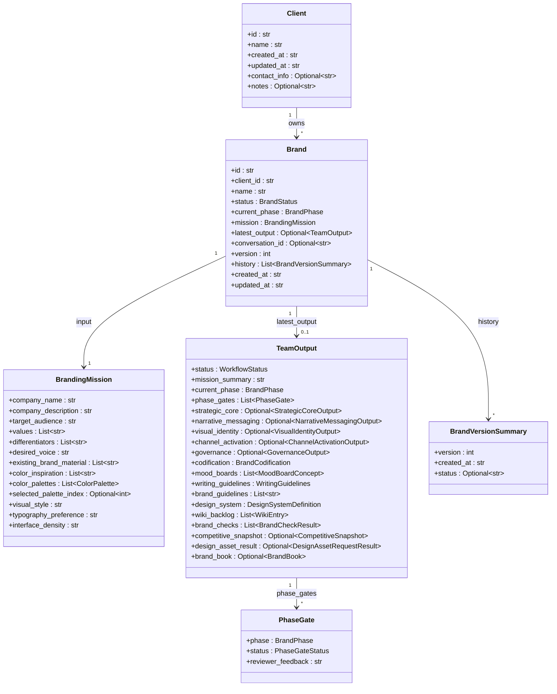
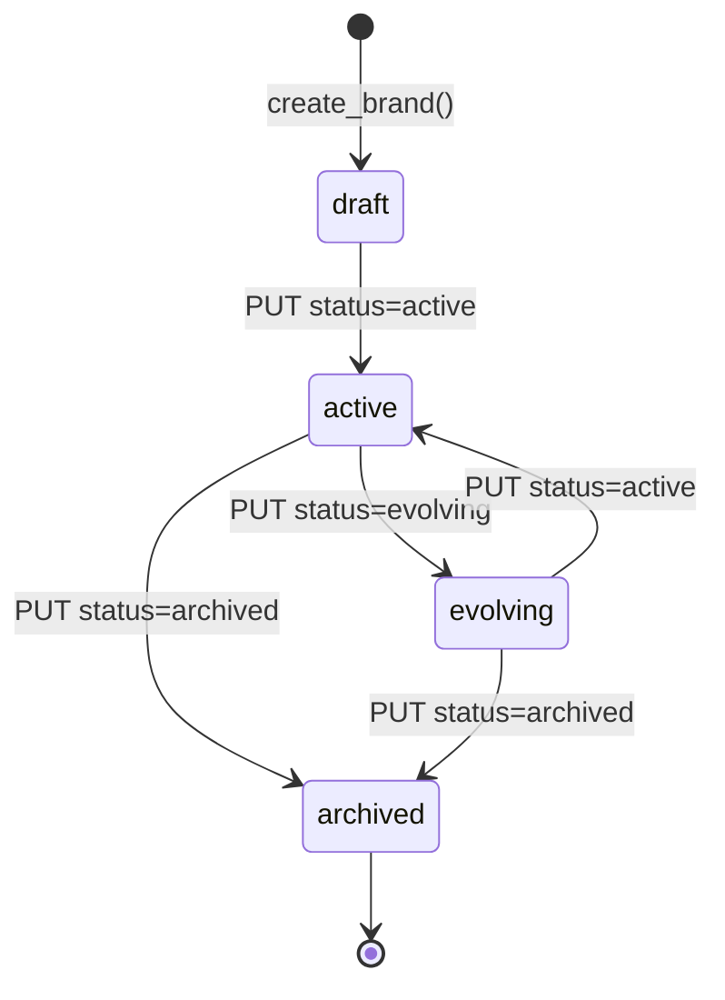
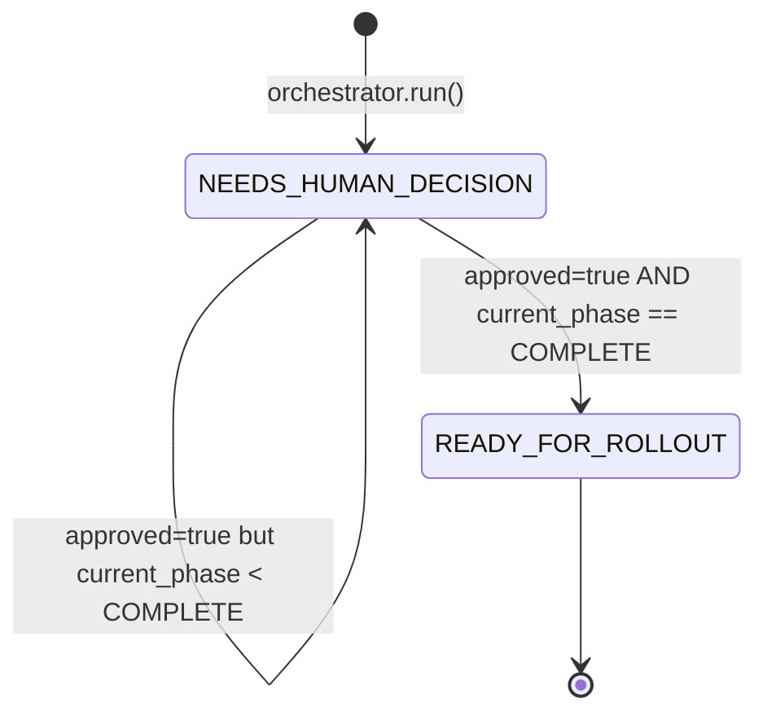
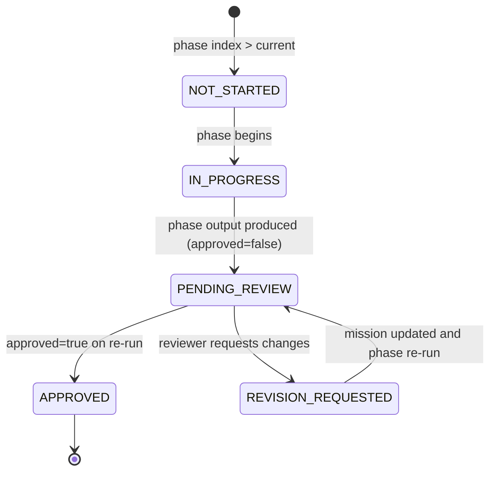

# Branding Team — System Design

This document is the technical reference for the branding team's internals.
It covers the module layout, the domain model, the runtime state machines,
the full API surface, the persistence story, LLM integration, external
adapters, runtime modes, and configuration.

## Module layout

```
backend/agents/branding_team/
├── __init__.py
├── README.md                # User-facing operational reference
├── agents.py                # 5 phase agents + compliance + 5 legacy bridge agents
├── orchestrator.py          # BrandingTeamOrchestrator (run / run_phase / brand book builder)
├── models.py                # All Pydantic models (mission, phase outputs, TeamOutput, Client, Brand)
├── store.py                 # BrandingStore — SQLite client/brand CRUD with version history
├── db.py                    # get_db_path() — resolves BRANDING_DB_PATH or default
├── data/                    # Default SQLite file location (created at runtime)
├── api/
│   └── main.py              # FastAPI app, request models, session store, route handlers
├── assistant/
│   ├── __init__.py          # Lazy init for BrandingConversationStore singleton
│   ├── agent.py             # BrandingAssistantAgent (LLM-backed conversational flow)
│   ├── prompts.py           # SYSTEM_PROMPT + USER_TURN_TEMPLATE
│   └── store.py             # BrandingConversationStore (messages, mission, latest output)
├── adapters/
│   ├── __init__.py
│   ├── market_research.py   # HTTP adapter to Market Research team
│   └── design_assets.py     # Design service adapter (stub today)
├── postgres/
│   └── __init__.py          # SCHEMA = TeamSchema(...) for shared_postgres
├── temporal/
│   └── __init__.py          # BrandingWorkflow + run_pipeline_activity
└── tests/
    ├── test_api.py
    ├── test_assistant.py
    ├── test_orchestrator.py
    └── test_store.py
```

## Domain model

The branding team manages three top-level entities and one aggregate output.



**Defined in** `models.py:514-528` (Brand), `models.py:23-31` (Client),
`models.py:76-91` (BrandingMission), `models.py:471-498` (TeamOutput),
`models.py:506-511` (BrandVersionSummary), `models.py:370-375` (PhaseGate).

Each phase has its own structured output model with rich nested types —
see `models.py:100-362` for the full set of `StrategicCoreOutput`,
`NarrativeMessagingOutput`, `VisualIdentityOutput`,
`ChannelActivationOutput`, and `GovernanceOutput` definitions.

## State machines

### Brand lifecycle

`BrandStatus` is set on `Brand.status` and transitions are driven by the
caller via `PUT /clients/{client_id}/brands/{brand_id}`. Defined at
`models.py:34-38`.



### Workflow status

`WorkflowStatus` (`models.py:41-43`) is set on every `TeamOutput` by the
orchestrator's status determination logic (`orchestrator.py:302-322`).



There is no transition *out* of `READY_FOR_ROLLOUT` inside a single run —
re-running the orchestrator produces a new `TeamOutput` which gets its own
status computed from scratch.

### Phase gate status

`PhaseGateStatus` (`models.py:57-64`) tags each `PhaseGate` entry
inside `TeamOutput.phase_gates`. The orchestrator's
`_build_phase_gates()` helper (`orchestrator.py:69-81`) populates each
phase as:



In the current code path, `_build_phase_gates()` directly emits
`APPROVED` for phases before the target index, `PENDING_REVIEW` or
`APPROVED` for the target index (depending on `approved`), and
`NOT_STARTED` for phases after. `IN_PROGRESS` and
`REVISION_REQUESTED` are part of the enum surface for future use.

## API surface

All endpoints live in `api/main.py` and mount under `/api/branding` on
the unified API. Three sets of endpoints coexist:

### Agency API — clients, brands, runs, adapters

| Method | Path | Handler (`api/main.py`) | Purpose |
|---|---|---|---|
| POST | `/clients` | `create_client` (L445) | Create client (201) |
| GET | `/clients` | `list_clients` (L454) | List all clients |
| GET | `/clients/{client_id}` | `get_client` (L459) | Get one client (404 if missing) |
| GET | `/clients/{client_id}/brands` | `list_brands` (L472) | List brands for a client |
| POST | `/clients/{client_id}/brands` | `create_brand` (L479) | Create brand; auto-attach or create conversation |
| GET | `/clients/{client_id}/brands/{brand_id}` | `get_brand` (L515) | Get brand incl. `latest_output` and `history` |
| PUT | `/clients/{client_id}/brands/{brand_id}` | `update_brand` (L523) | Partial mission update or status change |
| GET | `/clients/{client_id}/brands/{brand_id}/conversation` | `get_brand_conversation` (L577) | Get the single conversation linked to a brand |
| POST | `/clients/{client_id}/brands/{brand_id}/run` | `run_brand` (L597) | Run orchestrator; append new version |
| POST | `/clients/{client_id}/brands/{brand_id}/run/{phase}` | `run_brand_phase` (L617) | Run up to a specific `BrandPhase` |
| POST | `/clients/{client_id}/brands/{brand_id}/request-market-research` | `request_market_research_for_brand` (L647) | Call Market Research adapter; 503 if unavailable |
| POST | `/clients/{client_id}/brands/{brand_id}/request-design-assets` | `request_design_assets_for_brand` (L666) | Call design adapter (stub today) |

### One-shot / session API

| Method | Path | Handler | Purpose |
|---|---|---|---|
| POST | `/run` | `run_branding_team` (L685) | Synchronous one-shot; body = `RunBrandingTeamRequest` |
| POST | `/sessions` | `create_branding_session` (L716) | Create session with initial run (`approved=false`) |
| GET | `/sessions/{session_id}` | `get_branding_session` (L739) | Full session state |
| GET | `/sessions/{session_id}/questions` | `get_branding_questions` (L747) | Open questions feed |
| POST | `/sessions/{session_id}/questions/{question_id}/answer` | `answer_branding_question` (L755) | Answer one question; mutate mission; re-run orchestrator |

### Conversation (chat) API

| Method | Path | Handler | Purpose |
|---|---|---|---|
| POST | `/conversations` | `create_branding_conversation` (L813) | Create conversation; optional initial message + brand_id |
| POST | `/conversations/{conversation_id}/messages` | `send_branding_conversation_message` (L902) | Send message; assistant extracts mission updates; may re-run orchestrator |
| GET | `/conversations/{conversation_id}` | `get_branding_conversation` (L949) | Get conversation state |
| GET | `/conversations` | `list_branding_conversations` (L961) | List conversations, optional `brand_id` filter |
| POST | `/conversations/{conversation_id}/brand` | `attach_conversation_to_brand` (L983) | Attach an unattached conversation to a brand |

### Health

| Method | Path | Handler | Purpose |
|---|---|---|---|
| GET | `/health` | `health` (L1005) | Liveness probe |

## Persistence

### Why three stores

The team has three distinct persistence concerns and each has its own
SQLite-backed store:

1. **Clients + brands + versioned history** — `BrandingStore`
   (`store.py`).
2. **Interactive sessions + open question feed** — `BrandingSessionStore`
   (`api/main.py:246-327`).
3. **Chat conversations + messages + mission + latest output** —
   `BrandingConversationStore` (`assistant/store.py`).

All three share the same DB path resolver (`db.py:11-19`). Passing
`db_path=None` to any store produces an isolated per-instance
`:memory:` database — this is how the test suites stay independent.
Passing a path produces a WAL-mode file-backed database shared across
worker processes.

### SQLite schemas

**`BrandingStore` (`store.py:30-41`)**:

```sql
CREATE TABLE IF NOT EXISTS clients (
    id   TEXT PRIMARY KEY,
    data TEXT NOT NULL
);
CREATE TABLE IF NOT EXISTS brands (
    id        TEXT PRIMARY KEY,
    client_id TEXT NOT NULL,
    data      TEXT NOT NULL
);
CREATE INDEX IF NOT EXISTS idx_brands_client ON brands(client_id);
```

Clients and brands are stored as JSON-serialized Pydantic models in the
`data` column (`store.py:129-133`, `store.py:179-182`). Versions are
appended in place — `append_brand_version` (`store.py:218-252`) reads
the existing brand, increments `version`, appends a
`BrandVersionSummary` to `history`, updates `latest_output`, and
re-writes the row.

**`BrandingSessionStore` (`api/main.py:222-227`)**:

```sql
CREATE TABLE IF NOT EXISTS branding_sessions (
    session_id   TEXT PRIMARY KEY,
    session_json TEXT NOT NULL
);
```

Each row is a JSON dict containing the mission, list of questions, and
latest output (`_session_to_dict`, `api/main.py:230-243`).

**`BrandingConversationStore` (`assistant/store.py`)** stores two tables
— one for conversation headers and one for individual messages — and
enforces a unique constraint that prevents more than one live
conversation per brand.

### Postgres schema (future migration)

`postgres/__init__.py:17-71` declares a pure-data `TeamSchema` with five
tables that mirror the SQLite layout:

| Table | Purpose | Storage type |
|---|---|---|
| `branding_clients` | Client rows | `JSONB` |
| `branding_brands` | Brand rows (indexed on `client_id`) | `JSONB` |
| `branding_sessions` | Session rows | `JSONB` |
| `branding_conversations` | Conversation headers | `JSONB` + `brand_id` unique-where-not-null |
| `branding_conv_messages` | Conversation messages (FK `conversation_id`) | `TEXT` columns |

The `_lifespan` hook in `api/main.py:44-53` calls
`register_team_schemas(BRANDING_POSTGRES_SCHEMA)` at startup, which is a
no-op when `POSTGRES_HOST` is not set.

### SQLite vs. Postgres — at a glance

| Aspect | SQLite (today) | Postgres (ready) |
|---|---|---|
| Trigger | Default; no env vars | `POSTGRES_HOST` set, schema registered in lifespan |
| Isolation | Per-instance `:memory:` for tests; shared file for prod | Shared schema in `POSTGRES_DB` with `branding_` prefix |
| JSON columns | `TEXT` containing serialized Pydantic | Native `JSONB` |
| Brand indexing | `idx_brands_client` on `client_id` | `idx_branding_brands_client` on `client_id` |
| Per-brand conversation uniqueness | Enforced via migration in `assistant/store.py` | Partial unique index on `brand_id IS NOT NULL` |
| Concurrency | WAL mode with `synchronous=NORMAL` | Native Postgres MVCC |

## LLM integration

Only the `BrandingAssistantAgent` touches the shared LLM client. Everything
else in the pipeline (phase agents, compliance agent, legacy bridges) is
deterministic Python code — they do not call LLMs today.

**Initialization** (`assistant/agent.py:129-135`) happens lazily:

```python
def __init__(self, llm=None):
    if llm is None:
        from llm_service import get_client
        self._llm = get_client("branding_assistant")
    else:
        self._llm = llm
```

The FastAPI app wraps this in a second layer of laziness
(`api/main.py:72-83`): `assistant_agent` starts as `None`, and
`_get_assistant_agent()` only imports the real agent on first
conversation request. If construction fails, the handler returns HTTP
503 `"Branding assistant is temporarily unavailable"` instead of
crashing the app — so the rest of the team's endpoints remain usable
even when `llm_service` is not configured.

**LLM call** (`assistant/agent.py:181-195`):

```python
try:
    raw = self._llm.complete(
        prompt,
        temperature=0.5,
        system_prompt=SYSTEM_PROMPT,
        think=True,
    )
except Exception:
    reply_text = "I'm here to help build your brand. Could you tell me your company name and what you do?"
    suggested_questions = [...]
    return reply_text, current_mission, suggested_questions
```

**Response parsing** (`assistant/agent.py:14-66`) extracts three things
from the raw completion:

1. The natural-language reply text shown to the user.
2. A structured `mission` JSON block (in ```` ```mission ```` or
   ```` ```json ```` ) that gets merged into `BrandingMission` via
   `_merge_mission_update` (`assistant/agent.py:69-123`).
3. A `suggestions` array (in ```` ```suggestions ```` ) that becomes
   `ConversationStateResponse.suggested_questions`.

The `SYSTEM_PROMPT` in `assistant/prompts.py:11-99` instructs the LLM
to play brand strategist, follow the 5-phase framework, and emit the
mission + suggestions blocks.

## External integration contracts

### Market research

`adapters/market_research.py:17-50` POSTs to
`{base}/api/market-research/market-research/run` where `base` is
`UNIFIED_API_BASE_URL` or `BRANDING_MARKET_RESEARCH_URL`. Request body:

```json
{
  "product_concept": "Competitive and similar brands for {company_name}: {company_description}",
  "target_users": "{target_audience}",
  "business_goal": "Differentiate and position brand. Key differentiators: {diffs}",
  "human_approved": true,
  "human_feedback": "Branding team requested competitive snapshot."
}
```

The HTTP client has a 120-second timeout
(`adapters/market_research.py:41-45`). `_map_to_competitive_snapshot`
(`adapters/market_research.py:53-74`) rolls the Market Research
`TeamOutput` into a `CompetitiveSnapshot` with:

- `summary` from `mission_summary` or `recommendation.verdict`
- `similar_brands` from `market_signals[].signal` (capped at 20)
- `insights` from `recommendation.rationale` + `insights[].pain_points`
  (capped at 30)
- `source = "market_research_team"`

Errors (HTTP / timeout / parsing) are wrapped into a `RuntimeError`
which `orchestrator.run()` swallows to `None`
(`orchestrator.py:273-280`), while the direct endpoint
`request_market_research_for_brand` converts them to HTTP 503
(`api/main.py:659-662`).

### Design assets

`adapters/design_assets.py:16-37` is a deliberate stub. It reads
`BRANDING_DESIGN_SERVICE_URL` (or falls back to `UNIFIED_API_BASE_URL`)
but never actually POSTs — instead it always returns a
`DesignAssetRequestResult` with `status="pending"` and a placeholder
`artifacts` list describing the brand direction. This lets callers wire
the feature flag today and swap in a real design service later without
changing the orchestrator or API.

## Runtime modes

### Thread mode (default)

When `TEMPORAL_ADDRESS` is not set, `BrandingTeamOrchestrator` is a
plain Python class called synchronously from the FastAPI handlers
(`api/main.py:65`). Every phase agent runs in the request thread.
Most runs complete in seconds because the phase agents are deterministic
template expansion, not LLM calls.

### Temporal mode (optional)

`temporal/__init__.py:11-40` defines:

- `run_pipeline_activity(request: dict)` — a Temporal activity that
  rehydrates a `RunBrandingTeamRequest` and invokes the orchestrator.
- `BrandingWorkflow` — a Temporal workflow whose single
  `run()` method calls the activity with a 2-hour
  `start_to_close_timeout`.

Registration happens on import when `is_temporal_enabled()` returns
true: `start_team_worker("branding", WORKFLOWS, ACTIVITIES,
task_queue="branding-queue")`. This follows the team-wide Pattern A
described in the platform CLAUDE.md.

## Configuration reference

### Environment variables

| Variable | Consumer | Default | Purpose |
|---|---|---|---|
| `BRANDING_DB_PATH` | `db.py:13` | `{team_dir}/data/branding.db` | SQLite path shared by all three stores |
| `UNIFIED_API_BASE_URL` | `adapters/market_research.py:14`, `adapters/design_assets.py:13` | unset | Base URL for sibling team API calls |
| `BRANDING_MARKET_RESEARCH_URL` | `adapters/market_research.py:14` | unset | Explicit override for Market Research base URL |
| `BRANDING_DESIGN_SERVICE_URL` | `adapters/design_assets.py:13` | unset | Reserved for the future design service |
| `POSTGRES_HOST` / `POSTGRES_DB` / ... | `shared_postgres` via `api/main.py:48-50` | unset | When set, the Postgres schema is registered at startup |
| `TEMPORAL_ADDRESS` | `temporal/__init__.py` (via `shared_temporal.is_temporal_enabled`) | unset | When set, Temporal worker is registered on import |
| `LLM_PROVIDER`, `LLM_BASE_URL`, `LLM_MODEL` | `llm_service` via `assistant/agent.py:131` | provider-specific | Used by the conversational assistant |

### Unified API config entry

`backend/unified_api/config.py:88-95`:

```python
"branding": TeamConfig(
    name="Branding",
    prefix="/api/branding",
    description="Brand strategy, moodboards, design and writing standards",
    tags=["branding", "design"],
    cell="content",
    timeout_seconds=120.0,
),
```

The 120-second timeout matches the Market Research adapter's HTTP timeout
so a brand run that includes `include_market_research=True` can still
complete within the gateway budget.
