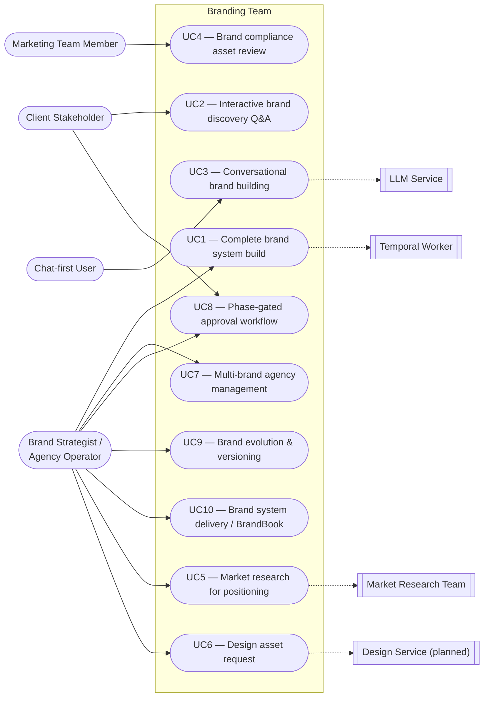

# Branding Team — Use Cases

This document enumerates the actors that interact with the branding team
and the scenarios they use it for. Each use case cites the entry-point
endpoint in `api/main.py` and the code paths that implement it.

## Actors

| Actor | Description |
|---|---|
| **Brand Strategist / Agency Operator** | Primary human user. Creates clients and brands, runs the pipeline, and curates the output for delivery. |
| **Client Stakeholder / Reviewer** | Human who approves phases, answers open questions, and signs off on `READY_FOR_ROLLOUT`. |
| **Marketing Team Member** | Submits assets for brand compliance review. Does not build new brands. |
| **Chat-first User** | A user with no structured brief who interacts through the conversation API and lets the assistant extract their brand mission from free-form text. |
| **Market Research Team** (external system) | Sibling Khala team called over HTTP via `adapters/market_research.py`. |
| **Design Service** (external system, planned) | Future sibling team or third-party service. Today the adapter returns a stub. |
| **LLM Service** (system actor) | Shared `llm_service` used by `BrandingAssistantAgent` for conversational mission extraction. |
| **Temporal Worker** (system actor) | Optional runtime wrapper registered on import when `TEMPORAL_ADDRESS` is set. |

## Use case diagram

Mermaid has no dedicated UML use-case notation; the flowchart below uses
the same actor-to-use-case convention adopted elsewhere in the repo.

## Use cases

### UC1 — Complete brand system build

- **Actor:** Brand Strategist
- **Trigger:** A fully-briefed brand is ready to run end-to-end.
- **Preconditions:** A `Client` and `Brand` exist with a complete
  `BrandingMission` (`models.py:76-91`).
- **Main flow:**
  1. Operator calls `POST /clients/{client_id}/brands/{brand_id}/run`
     (`api/main.py:597`) with `human_approved=true`.
  2. Orchestrator executes all 5 phases in order
     (`orchestrator.py:186-234`).
  3. Specialist agents run alongside to produce supporting deliverables
     (`orchestrator.py:196-203`).
  4. `_build_brand_book` consolidates all outputs into a `BrandBook`
     (`orchestrator.py:288-298`, `orchestrator.py:380-474`).
  5. `BrandingStore.append_brand_version` writes the new version and
     bumps `Brand.version` (`store.py:218-252`).
- **Postconditions:** `TeamOutput.status == READY_FOR_ROLLOUT`, brand
  history has a new version entry, and `latest_output` holds the full
  five-phase output.
- **Entry point:** `POST /api/branding/clients/{client_id}/brands/{brand_id}/run`

### UC2 — Interactive brand discovery via Q&A session

- **Actor:** Client Stakeholder (guided by a Brand Strategist)
- **Trigger:** The caller has partial information and wants the team to
  ask focused questions.
- **Preconditions:** The caller can supply at least
  `company_name`, `company_description`, and `target_audience`.
- **Main flow:**
  1. `POST /sessions` (`api/main.py:716`) runs the orchestrator once
     with `approved=false` (`api/main.py:729-734`).
  2. `_build_open_questions` (`api/main.py:377-405`) inspects the
     mission and emits a question for each missing field
     (`values`, `differentiators`, and a voice-approval question).
  3. UI calls `GET /sessions/{session_id}/questions` to read the feed
     (`api/main.py:747`).
  4. For each answer, `POST /sessions/{id}/questions/{qid}/answer`
     applies it via `_apply_answer` (`api/main.py:426-437`), marks the
     question `answered`, and reruns the orchestrator.
  5. When no open questions remain, `human_review.approved` is set to
     `true` automatically (`api/main.py:778-781`).
- **Postconditions:** All questions answered, mission fully populated,
  `latest_output` refreshed after each answer.
- **Entry points:** `POST /sessions`, `GET /sessions/{id}/questions`,
  `POST /sessions/{id}/questions/{qid}/answer`

### UC3 — Conversational brand building

- **Actors:** Chat-first User, LLM Service
- **Trigger:** User has no structured brief and wants to build the brand
  by chatting.
- **Preconditions:** `llm_service` is configured (or the assistant's
  fallback path will return canned replies — see
  `assistant/agent.py:188-195`).
- **Main flow:**
  1. `POST /conversations` (`api/main.py:813`) creates a conversation
     row via `BrandingConversationStore`. An optional
     `initial_message` is processed immediately.
  2. `POST /conversations/{conversation_id}/messages`
     (`api/main.py:902`) is called for each user turn.
  3. `BrandingAssistantAgent.respond` (`assistant/agent.py:137-199`)
     sends the prompt to the LLM, parses the reply, mission update, and
     suggestions (`assistant/agent.py:14-66`), and merges mission
     fields (`assistant/agent.py:69-123`).
  4. `_run_orchestrator_if_ready` (`api/main.py:360-367`) checks
     whether the mission has the minimal required fields and, if so,
     runs the orchestrator with `approved=false` to refresh output.
  5. Once the assistant extracts a real company name, the handler
     auto-creates a brand under a default client and attaches the
     conversation to it (`api/main.py:846-865`).
- **Postconditions:** Brand exists in the store, conversation is
  attached, mission is progressively refined, and each turn may
  refresh `latest_output`.
- **Entry points:** `POST /conversations`,
  `POST /conversations/{conversation_id}/messages`

### UC4 — Brand compliance asset review

- **Actor:** Marketing Team Member
- **Trigger:** A new marketing asset (landing page, ad, email) needs an
  on-brand verification before launch.
- **Preconditions:** The brand's mission is known. Assets are described
  by name + short description.
- **Main flow:**
  1. Caller includes `brand_checks` in any run request — for example
     `POST /run` (`api/main.py:685`) or a session-bound run.
  2. `BrandComplianceAgent.evaluate` (`agents.py:874-922`) computes
     on-brand confidence, rationale, and revision suggestions for each
     `BrandCheckRequest`.
  3. Results are returned as `TeamOutput.brand_checks`
     (`models.py:388-393`).
- **Postconditions:** Caller has per-asset `BrandCheckResult` entries
  with `is_on_brand`, `confidence`, `rationale`, and
  `revision_suggestions`.
- **Entry points:** Any run endpoint with non-empty `brand_checks`.

### UC5 — Market research for positioning

- **Actors:** Brand Strategist, Market Research Team
- **Trigger:** The strategist wants a competitive snapshot before
  locking positioning.
- **Preconditions:** `UNIFIED_API_BASE_URL` or
  `BRANDING_MARKET_RESEARCH_URL` is set so the adapter can reach the
  Market Research API.
- **Main flow:**
  1. Caller sets `include_market_research=true` on a brand run, or
     invokes
     `POST /clients/{client_id}/brands/{brand_id}/request-market-research`
     (`api/main.py:647`).
  2. `adapters/market_research.py:17-50` POSTs to
     `/api/market-research/market-research/run` with the brand's
     mission rephrased as `product_concept`, `target_users`, and
     `business_goal`.
  3. `_map_to_competitive_snapshot` (`adapters/market_research.py:53-74`)
     turns the Market Research `TeamOutput` into a
     `CompetitiveSnapshot` (summary, similar brands, insights, source).
- **Postconditions:** `TeamOutput.competitive_snapshot` is populated (on
  a run) or the dedicated endpoint returns the snapshot directly.
  Failures return HTTP 503 on the direct endpoint; the run endpoint
  silently sets `competitive_snapshot=None`.
- **Entry points:**
  `POST /clients/{client_id}/brands/{brand_id}/run`
  (with `include_market_research=true`) or
  `POST /clients/{client_id}/brands/{brand_id}/request-market-research`

### UC6 — Design asset request

- **Actors:** Brand Strategist, Design Service (planned)
- **Trigger:** After Strategic Core is approved, the strategist wants
  the design team to start producing assets.
- **Preconditions:** None (the adapter is a stub today).
- **Main flow:**
  1. Caller sets `include_design_assets=true` on a run, or invokes
     `POST /clients/{client_id}/brands/{brand_id}/request-design-assets`
     (`api/main.py:666`).
  2. `adapters/design_assets.py:16-37` generates a request id, returns
     a `DesignAssetRequestResult` with `status="pending"` and a
     placeholder artifacts list. When a real design service is wired
     up, the adapter will POST to it without changing the API.
- **Postconditions:** `TeamOutput.design_asset_result` is populated or
  the dedicated endpoint returns the stub.
- **Entry points:**
  `POST /clients/{client_id}/brands/{brand_id}/run`
  (with `include_design_assets=true`) or
  `POST /clients/{client_id}/brands/{brand_id}/request-design-assets`

### UC7 — Multi-brand agency management

- **Actor:** Brand Strategist
- **Trigger:** The agency needs to organize many clients, each with one
  or more brands.
- **Preconditions:** None.
- **Main flow:**
  1. Strategist creates clients via `POST /clients`
     (`api/main.py:445`) and lists / fetches them via
     `GET /clients` and `GET /clients/{client_id}`.
  2. For each client, strategist creates brands via
     `POST /clients/{client_id}/brands` (`api/main.py:479`), which
     also creates or attaches a conversation for the brand.
  3. Per-client brand listing via
     `GET /clients/{client_id}/brands` (`api/main.py:472`).
  4. `BrandingStore` keeps clients and brands in the SQLite `clients`
     and `brands` tables indexed by `client_id`
     (`store.py:30-41`, `store.py:156-183`).
- **Postconditions:** All client/brand data is persistent across
  restarts (WAL-mode file-backed SQLite at `BRANDING_DB_PATH`).
- **Entry points:** `/clients`, `/clients/{id}`,
  `/clients/{id}/brands`, `/clients/{id}/brands/{brand_id}`

### UC8 — Phase-gated approval workflow

- **Actors:** Brand Strategist, Client Stakeholder
- **Trigger:** Stakeholders want to approve each phase independently
  rather than signing off on the whole brand at once.
- **Preconditions:** Brand exists; stakeholder review process defined.
- **Main flow:**
  1. Strategist calls
     `POST /clients/{client_id}/brands/{brand_id}/run/strategic_core`
     with `human_approved=false` (`api/main.py:617`). Only Phase 1 runs.
  2. Phase gates: Phase 1 `PENDING_REVIEW`, Phases 2–5 `NOT_STARTED`
     (`orchestrator.py:69-81`).
  3. Stakeholder reviews the output; strategist re-runs with
     `human_approved=true` on the same phase → Phase 1 `APPROVED`.
  4. Strategist advances to the next phase by calling
     `POST .../run/narrative_messaging`. The orchestrator replays Phase
     1 deterministically and executes Phase 2 (`orchestrator.py:207-211`).
  5. Loop until `target_phase` is `governance` and the final call uses
     `human_approved=true`.
- **Postconditions:** All phase gates `APPROVED`, `current_phase =
  COMPLETE`, `status = READY_FOR_ROLLOUT`.
- **Entry point:** `POST /clients/{client_id}/brands/{brand_id}/run/{phase}`

### UC9 — Brand evolution & versioning

- **Actor:** Brand Strategist
- **Trigger:** An existing brand needs a refresh — new positioning, new
  audience, rebrand, etc.
- **Preconditions:** Brand exists with at least one prior version.
- **Main flow:**
  1. Strategist updates the mission via
     `PUT /clients/{client_id}/brands/{brand_id}` (`api/main.py:523`).
  2. Strategist reruns the orchestrator via
     `POST /clients/{client_id}/brands/{brand_id}/run`.
  3. `append_brand_version` (`store.py:218-252`) increments
     `Brand.version`, appends a `BrandVersionSummary` to `history`,
     replaces `latest_output`, and updates `current_phase`.
  4. `GET /clients/{client_id}/brands/{brand_id}` returns the refreshed
     brand with full version history.
- **Postconditions:** `Brand.version` incremented, `Brand.history` has a
  new entry, `Brand.latest_output` points at the new run.
- **Entry points:** `PUT /clients/{id}/brands/{brand_id}`,
  `POST /clients/{id}/brands/{brand_id}/run`

### UC10 — Brand system delivery via BrandBook

- **Actor:** Brand Strategist
- **Trigger:** All phases complete and approved; time to hand off the
  brand to the client or internal stakeholders.
- **Preconditions:** `TeamOutput.status == READY_FOR_ROLLOUT`.
- **Main flow:**
  1. `orchestrator.run()` calls `_build_brand_book`
     (`orchestrator.py:288-298`, `orchestrator.py:380-474`) on every
     run — not just on the last one.
  2. `_build_brand_book` assembles a markdown `content` string and a
     structured `sections` dict from the strategic core (purpose,
     mission, vision, positioning, promise, core values), narrative
     (story, tagline, messaging pillars), visual identity (color,
     typography, voice), channel guidelines, and governance.
  3. Result appears on `TeamOutput.brand_book`.
- **Postconditions:** A single, consolidated `BrandBook` markdown
  document is available for export / PDF generation / wiki publication.
- **Entry point:** Any run endpoint returning a populated `TeamOutput`
  (the brand book is always built, even during intermediate runs).
