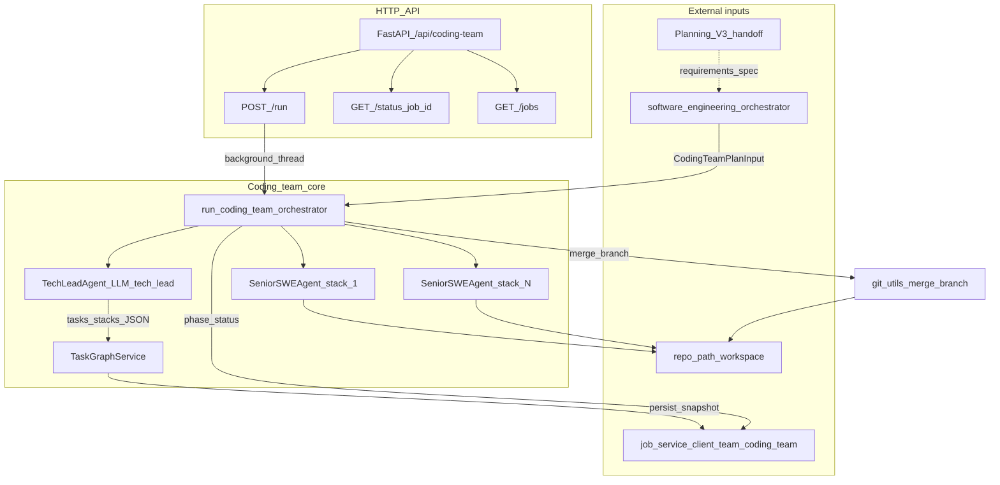
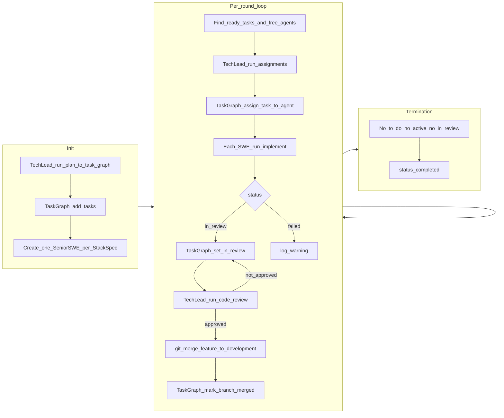

# Coding Team

The **coding_team** is a **sub-team of the Software Engineering team**. It implements the main implementation path after planning: the SE orchestrator hands off to it; it receives the adapted plan from Planning V3, generates a Task Graph, and executes work through a Tech Lead and multiple stack-specialist Senior Software Engineers. The public API remains at `/api/coding-team` for direct jobs and health checks; logically it sits under Software Engineering in the platform hierarchy.

## Architecture (Mermaid)

### Components and data flow

### Execution loop inside the orchestrator

Phases: `task_graph` → `coding` → `completed`. The orchestrator runs up to many rounds until no `to_do` tasks remain, no agent holds an active task, and nothing is `in_review`.

## Structure

| Component | Role |
|-----------|------|
| **Tech Lead** | Receives plan from Planning team; generates Task Graph (tasks + dependencies); defines tech stacks; creates one Senior SWE agent per stack; grooms backlog (acceptance criteria, out of scope, context, subtasks, priority, dependencies); assigns tasks; code review, UAT, security review; merges feature branches; assigns next task only after current task's branch is merged. |
| **Senior Software Engineer** | One per stack (e.g. frontend, backend, devops). Requests assigned task from Task Graph; implements (code + tests); runs tests and linter until pass; commits with semantic style; marks task In Review; hands off feature branch to Tech Lead. Single task at a time. |
| **Task Graph** | Stores tasks and dependencies per job. Tech Lead adds/updates tasks and assigns; Senior SWEs request their assigned task. Enforces one active task per agent and "next task only after merge." |

## Task Graph semantics

- **Tasks** have id, title, description, dependencies, status (e.g. To Do, in_progress, in_review, merged), assigned_agent_id, feature_branch, merged_at, acceptance_criteria, out_of_scope, priority, and optional **subtasks** (with subtask dependencies).
- **Assign** task T to agent A: allowed only if A has no current task or A's current task has status merged, and T's dependencies are satisfied (all dependency tasks merged).
- **Get task for agent A**: returns the single task assigned to A that is not merged (in_progress or in_review).
- **Mark branch merged** for task T: set T.status = merged, T.merged_at = now; agent A is then free for next assignment.

## One task per agent / new task only after merge

- Each Senior SWE has at most one **active** (non-merged) task at a time.
- The Tech Lead (or orchestrator) assigns a **new** task to an agent only after that agent's current task's feature branch has been **merged** into the development branch. The Task Graph and orchestrator enforce this via state.

## Package layout

- `models.py` – Pydantic models (StackSpec, Task, SeniorEngineerSpec, CodingTeamPlanInput, job state).
- `task_graph.py` – Task Graph service (per-job; add_task, assign_task_to_agent, get_task_for_agent, mark_branch_merged, etc.).
- `tech_lead_agent/` – Tech Lead agent (prompts, agent class): plan → Task Graph + stacks; grooming; assignments; review/merge.
- `senior_software_engineer_agent/` – Senior SWE agent (parameterized by StackSpec): request task, implement, tests, linter, commit, In Review, hand off.
- `orchestrator.py` – Coordinates Tech Lead and Senior SWEs; init (plan → Task Graph, create SWEs), loop (assign → implement → review → merge).
- `api/main.py` – FastAPI: POST /run, GET /status/{job_id}, GET /jobs.
- Job store uses the same pattern as software_engineering_team (e.g. CentralJobManager with team="coding_team").

## Process flows

- **Tech Lead**: Get next task from backlog → Groom task (acceptance criteria, out of scope, context from specs/plans, subtasks, priority, dependencies) → Update to To Do → Assign to team member → repeat until backlog groomed. See plan section 2a.
- **Senior SWE**: Review assigned tasks → Choose next task (deps satisfied) → If subtasks, choose next subtask → Create feature branch → Plan changes → Make changes → Tests (loop until pass) → Linter (loop until pass) → Commit (semantic style) → If more subtasks loop else Mark In Review → Send feature branch to Tech Lead. See plan section 2b.

## Strands platform

This package is part of the [Strands Agents](../../../README.md) monorepo (Unified API, Angular UI, and full team index).
