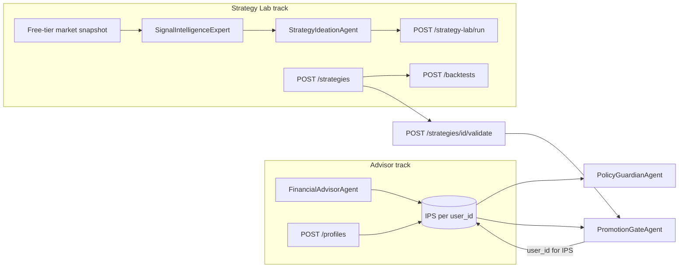

# Investment Team

A multi-agent investment organization covering equities, bonds/Treasuries, options, real estate, FX, crypto, and optional commodities with IPS-first constraints.

## Two tracks: Advisor (user profile) vs Strategy Lab (no profile)

The package combines two logical workflows behind one HTTP API (`/api/investment`):

| Track | Purpose | Requires `InvestmentProfile` / IPS? |
|-------|---------|--------------------------------------|
| **Financial advisor** | Build IPS, proposals, portfolio checks, promotion to paper/live for a **specific user**, committee memos | **Yes** — endpoints use `user_id` and load/store IPS |
| **Strategy lab & research** | LLM-driven strategy ideation, swing-trading backtests, generic strategy specs and validation records | **No** — operates on `StrategySpec`, backtests, and lab records only |

Promotion from a validated strategy to **paper/live under a client** is the bridge: `POST /promotions/decide` loads IPS by `user_id` and runs `PromotionGateAgent` with that IPS.



### Implemented agents — profile requirement

| Agent | Requires user / IPS? | Notes |
|-------|----------------------|--------|
| **FinancialAdvisorAgent** | Yes | Session and `InvestmentProfile.user_id` |
| **PolicyGuardianAgent** | Yes (IPS) | `check_portfolio(ips, proposal)` |
| **PromotionGateAgent** | Yes (IPS) | Live/paper gates from IPS |
| **ValidationAgent** | No | Only `ValidationReport` checklist |
| **InvestmentCommitteeAgent** | Yes (user id) | Memo `prepared_for_user_id` |
| **SignalIntelligenceExpert** | No | Prior lab results + `MarketLabContext` (free-tier APIs); brief persisted on `StrategyLabRecord` |
| **StrategyIdeationAgent** | No | Prior lab results + optional precomputed signal brief (Policy B: one brief per batch) |
| **InvestmentTeamOrchestrator** | Mixed | Promotion needs IPS; web tool coordinator has no profile |
| **InvestmentWebInterfaceCoordinator** | No investment profile | Provider login/config only |

### HTTP endpoints — profile requirement

**Requires `user_id` / IPS in store**

- `POST /profiles`, `GET /profiles/{user_id}`
- `POST /proposals/create`, `POST /proposals/{proposal_id}/validate`
- `POST /promotions/decide`
- `POST /memos`
- `POST /advisor/sessions` (and messages / complete)

**Does not require a user investment profile**

- `POST /strategies`, `POST /strategies/{strategy_id}/validate`
- `POST /backtests`, `GET /backtests`
- `POST /strategy-lab/run`, `GET /strategy-lab/results`
- `DELETE /strategy-lab/records/{lab_record_id}` — remove one lab run (record, linked `strat-lab-*` / `bt-lab-*` jobs, paper sessions for that lab id)
- `DELETE /strategy-lab/storage` — purge strategy lab rows from the job service (lab records, `strat-lab-*` / `bt-lab-*` strategies and backtests, and all paper-trading sessions)
- `GET /workflow/status`, `GET /workflow/queues`

**Clearing strategy lab data in Postgres directly** (job DB `khala_jobs`, table `jobs`):

```sql
DELETE FROM jobs WHERE team = 'investment_strategy_lab_records';
DELETE FROM jobs WHERE team = 'investment_strategies' AND job_id LIKE 'strat-lab-%';
DELETE FROM jobs WHERE team = 'investment_backtests' AND job_id LIKE 'bt-lab-%';
DELETE FROM jobs WHERE team = 'investment_paper_trading_sessions';
```

Prefer `DELETE /strategy-lab/storage` when the investment API is running so the same logic applies in local file-cache mode too.

### Catalog-only agents (`agent_catalog.py`)

Core catalog roles that take **IPS / profile-shaped** inputs: Financial Advisor, IPS Generator, Asset Universe Builder, Portfolio Architect, Global Risk Manager, Explainability and Audit. Specialist desks (equities, crypto, options, etc.) are metadata for future orchestration; pure research/backtest roles are profile-agnostic in principle, while execution planners imply a target book or IPS when tied to a client.

## What this package implements

- **Core data model** for portfolio, strategy, validation, promotion, execution, and private-deal workflows.
- **Agent roles** with separation-of-duties and risk-veto mechanics.
- **Universal promotion checklist** that decides `reject | revise | paper | live`.
- **Orchestration state machine** with queueing, escalation, and safe degradation to `monitor_only` when data integrity fails.
- **Audit context fields** for snapshot IDs, assumptions, gate traces, and agent versions on key artifacts.

## Agent roles and interfaces

- **PolicyGuardianAgent**
  - Input: `IPS`, `PortfolioProposal`
  - Output: list of IPS violations
  - Invariant: IPS caps and exclusions are hard constraints.
  - Checks: position caps, aggregated asset-class caps, options/crypto permissions, speculative sleeve cap.

- **ValidationAgent**
  - Input: `ValidationReport`
  - Output: missing/failed checklist items
  - Invariant: required checks include backtest quality, walk-forward, stress, costs, and liquidity impact.

- **PromotionGateAgent**
  - Input: `StrategySpec`, `ValidationReport`, `IPS`, proposer/approver identities, risk veto flag, human live approval flag
  - Output: `PromotionDecision`
  - Invariants:
    - proposer cannot self-approve,
    - risk veto always rejects,
    - missing validation forces revise,
    - live promotion requires explicit IPS live enablement,
    - if IPS requires human approval for live, promotion remains paper until approved.

- **InvestmentCommitteeAgent**
  - Input: recommendation context and dissenting views
  - Output: `InvestmentCommitteeMemo`

## Universal promotion checklist

The gate runs these checks in order:
1. Separation of duties (reject on violation)
2. Risk veto (reject)
3. Required validation completeness and pass criteria (revise if incomplete/failing)
4. IPS live-trading permission (paper if not enabled)
5. Human live approval (paper if pending)
6. Promote to live only if all gates pass

Each decision records per-gate outcomes in `PromotionDecision.gate_results` and captures audit context.

## Orchestration and safety

`InvestmentTeamOrchestrator` manages queues:
- `research`
- `portfolio_design`
- `validation`
- `promotion`
- `execution`
- `escalation`

Safety defaults:
- Default workflow mode is controlled by `IPS.default_mode` and should typically be `monitor_only`.
- If data integrity fails, orchestrator degrades to `monitor_only` and logs the event.
- Reject/revise decisions auto-enqueue escalation.

## JSON schemas

- `schemas/investment_profile.schema.json` contains the implementation-ready schema for the user profile object.
- Remaining contract objects are represented as typed Pydantic models in `models.py`.

## Spec coverage additions

- `spec_models.py` now includes codex-friendly Pydantic representations for the full v1 spec entities, including `IPSV1`, `StrategySpecV1`, `ValidationReportV1`, `PromotionDecisionV1`, deal underwriting, diligence, and IC memo artifacts.
- `agent_catalog.py` defines the core cross-asset agent catalog and specialist desk lineup (equities, bonds/treasuries, options, crypto, FX, real estate) for orchestration and UI introspection.


## Backtesting workflow

The Investment Team API includes first-class backtesting endpoints so trading agents can submit strategy specs for evaluation and persist outcomes for future learning:

- `POST /strategies` creates a strategy specification.
- `POST /backtests` submits an async backtest job and returns `{job_id, status}`; the deterministic simulation runs in the background and, when complete, records the result alongside configuration, timestamps, and submitter identity.
- `GET /backtests/status/{job_id}` polls a submitted backtest; the completed `RunBacktestResponse` lives in the `result` field. Supporting routes: `GET /backtests/jobs`, `POST /backtests/jobs/{id}/cancel`, `DELETE /backtests/jobs/{id}`.
- `GET /backtests` returns recorded backtests (optionally filter with `?strategy_id=<id>`).

Stored `BacktestRecord` objects include strategy details, run configuration, and performance metrics (`total_return_pct`, `annualized_return_pct`, `volatility_pct`, `sharpe_ratio`, `max_drawdown_pct`, `win_rate_pct`, and `profit_factor`) so agents can compare what has been tried over time.

## System design docs

Engineer-facing architecture details live under [`system_design/`](./system_design/README.md):

- [`architecture.md`](./system_design/architecture.md) — C4 container view.
- [`system_design.md`](./system_design/system_design.md) — component view + domain model class diagram.
- [`use_cases.md`](./system_design/use_cases.md) — use-case diagram grouped by actor and track.
- [`flow_charts.md`](./system_design/flow_charts.md) — sequence/state diagrams for advisor, Strategy Lab batch, promotion gate, orchestrator mode.
- [`strategy_lab_pipeline.md`](./system_design/strategy_lab_pipeline.md) — per-cycle pipeline (`ideating → fetching_data → analyzing → paper_trading? → complete`), phase events, winner gate, skip paths.
- [`paper_trading_integration.md`](./system_design/paper_trading_integration.md) — paper trading as an integrated cycle step: winner gate, config, failure contract, linkage to `StrategyLabRecord`.
- [`trade_record_schema.md`](./system_design/trade_record_schema.md) — every `TradeRecord` field, including bid vs fill prices and order-type fields used for post-hoc execution analysis.

## Khala platform

This package is part of the [Khala](../../../README.md) monorepo (Unified API, Angular UI, and full team index).
