# Architecture — Investment Team

A C4-style **container view** of the investment team. It shows the major
runtime pieces, the boundaries between them, and the external services they
depend on. For the detailed component view and data model, see
[`system_design.md`](./system_design.md).

## Container diagram

```mermaid
flowchart TB
  subgraph clients[Clients]
    UI[Angular 19 UI<br/>user-interface/]
    OtherTeams[Other Khala teams<br/>e.g. SE, planning_v3]
    CLI[External callers / CLI]
  end

  subgraph gateway[Khala Unified API — port 8080]
    UAPI[unified_api/main.py<br/>Security Gateway<br/>mounts /api/investment]
  end

  subgraph invteam[Investment Team — backend/agents/investment_team/]
    direction TB

    subgraph api_layer[API Layer — api/main.py]
      AdvisorEP[Advisor endpoints<br/>/profiles /proposals<br/>/advisor/sessions /memos]
      LabEP[Strategy Lab endpoints<br/>/strategy-lab/run<br/>/strategy-lab/runs/.../stream<br/>/strategy-lab/paper-trade]
      SharedEP[Shared endpoints<br/>/strategies /backtests<br/>/promotions/decide<br/>/workflow/status]
    end

    subgraph core_agents[Core Agents — agents.py]
      FA[FinancialAdvisorAgent<br/>L420-933]
      PG[PolicyGuardianAgent<br/>L49-103]
      VA[ValidationAgent<br/>L106-128]
      PGate[PromotionGateAgent<br/>L131-302]
      IC[InvestmentCommitteeAgent<br/>L303-407]
    end

    subgraph lab_agents[Strategy Lab Agents — agents/]
      SIE[SignalIntelligenceExpert<br/>signal_intelligence_agent.py]
      SIA[StrategyIdeationAgent<br/>strategy_ideation_agent.py]
      BTA[BacktestingAgent<br/>backtesting_agent.py]
      PTA[PaperTradingAgent<br/>paper_trading_agent.py]
      TSE[TradeSimulationEngine<br/>trade_simulator.py]
    end

    subgraph orch[Orchestration — orchestrator.py]
      ORCH[InvestmentTeamOrchestrator]
      WS[WorkflowState<br/>6 queues + mode + audit_log]
    end

    subgraph worker[Background Worker — api/main.py]
      Worker[_strategy_lab_worker<br/>daemon thread per run_id<br/>L1083]
      Cycle[_run_one_strategy_lab_cycle<br/>L902]
      EventBus[job_event_bus.py<br/>SSE fan-out<br/>76 lines]
    end

    subgraph persistence[Persistence]
      PDict[_PersistentDict<br/>dict-like wrapper<br/>api/main.py L85]
      Buckets[(_profiles, _proposals,<br/>_strategies, _validations,<br/>_backtests, _strategy_lab_records,<br/>_paper_trading_sessions,<br/>_advisor_sessions)]
    end

    subgraph tools[Tool Agents]
      Coord[InvestmentWebInterfaceCoordinator<br/>tool_agents/web_interfaces/coordinator.py]
      QC[QuantConnectAgent]
      TV[TradingViewAgent]
    end

    subgraph data[Market Data]
      MDS[MarketDataService<br/>multi-provider OHLCV]
      MLDP[FreeTierMarketDataProvider<br/>market_lab_data/free_tier.py]
    end
  end

  subgraph external[External Services]
    JS[(Khala Job Service<br/>Postgres khala_jobs)]
    LLM[LLM Service<br/>Ollama / Claude]
    YF[Yahoo Finance<br/>yfinance]
    TD[Twelve Data]
    CG[CoinGecko]
    AV[Alpha Vantage]
    FRED[FRED<br/>US 10Y yield]
    FRANK[Frankfurter<br/>FX]
    QCWeb[QuantConnect<br/>Playwright]
    TVWeb[TradingView<br/>Playwright]
  end

  UI --> UAPI
  OtherTeams --> UAPI
  CLI --> UAPI
  UAPI --> AdvisorEP
  UAPI --> LabEP
  UAPI --> SharedEP

  AdvisorEP --> FA
  AdvisorEP --> PG
  AdvisorEP --> IC
  SharedEP --> VA
  SharedEP --> PGate
  SharedEP --> ORCH

  LabEP --> Worker
  Worker --> Cycle
  Cycle --> SIE
  Cycle --> SIA
  Cycle --> BTA
  BTA --> TSE
  LabEP --> PTA
  PTA --> TSE

  ORCH --> PG
  ORCH --> PGate
  ORCH --> WS
  ORCH --> Coord
  Coord --> QC
  Coord --> TV
  QC --> QCWeb
  TV --> TVWeb

  FA --> LLM
  IC --> LLM
  SIE --> LLM
  SIA --> LLM
  BTA --> LLM
  PTA --> LLM

  SIE --> MLDP
  BTA --> MDS
  PTA --> MDS

  MDS --> YF
  MDS --> TD
  MDS --> CG
  MDS --> AV
  MLDP --> FRANK
  MLDP --> FRED
  MLDP --> CG

  AdvisorEP --> PDict
  LabEP --> PDict
  SharedEP --> PDict
  Worker --> PDict
  PDict --> Buckets
  Buckets --> JS

  Worker --> EventBus
  EventBus -->|"SSE /strategy-lab/runs/{id}/stream"| UI
```

## Design decisions

### 1. Two tracks behind one prefix

Advisor and Strategy Lab could have been separate teams, but they live together
because the **promotion gate is the bridge**: a Strategy Lab strategy that
passes validation is only promotable to paper/live when it is evaluated against
a specific client's IPS. Keeping both tracks in one package lets
`PromotionGateAgent` depend on both `StrategySpec` (lab side) and `IPS`
(advisor side) without cross-team imports. This framing is authoritative in
[`../README.md`](../README.md):1-56.

### 2. IPS-first, hard-constraint model

Every advisor-side recommendation must survive `PolicyGuardianAgent`
([`agents.py`](../agents.py):49-103) before it can reach a user. IPS caps
(per-position, asset-class, speculative sleeve) and explicit permissions
(options, crypto, live trading) are treated as **hard constraints** — not
soft scores. A proposal that violates them is rejected outright and never
reaches the Investment Committee agent. This is the team's most important
invariant.

### 3. Separation of duties is structural

`PromotionGateAgent.decide` ([`agents.py`](../agents.py):131-302) refuses to
let the same agent propose and approve a strategy. This isn't a policy toggle
— it is the first gate in the six-gate checklist, and a failure short-circuits
the remaining gates to `reject`. The orchestrator does not offer an override.

### 4. Universal 6-gate promotion checklist

The same gate logic runs regardless of which track originated a strategy:

1. Separation of duties (reject on violation)
2. Risk veto (reject)
3. Required validation completeness & pass criteria (revise if incomplete)
4. IPS live-trading permission (fall back to paper if not enabled)
5. Human live-approval flag (paper if pending)
6. Live promotion only if every gate passes

Every decision is recorded as a `PromotionDecision.gate_results` list with an
`AuditContext`, so every outcome is traceable back to the inputs and gates.
See [`flow_charts.md`](./flow_charts.md) for the decision tree.

### 5. Safe-by-default workflow mode

`InvestmentTeamOrchestrator.bootstrap` ([`orchestrator.py`](../orchestrator.py):69-71)
reads `IPS.default_mode` at startup and is expected to begin in
`WorkflowMode.MONITOR_ONLY`. Any data-integrity failure triggers
`handle_data_integrity(False)` which **unconditionally degrades** the workflow
to `monitor_only` and writes
`data_integrity_failed:degrade_to_monitor_only` to the audit log
([`orchestrator.py`](../orchestrator.py):77-80). There is no auto-recovery —
the mode only rises again through an explicit operator action. This is the
team's second-most-important invariant.

### 6. Persistence via the Khala job service (not a team schema)

Unlike teams that own a Postgres schema via `shared_postgres`, the investment
team persists **everything** through the job service:

- `_PersistentDict` ([`api/main.py`](../api/main.py):85) presents a dict-like
  interface backed by `JobServiceClient`.
- Separate logical buckets per artifact type: `investment_profiles`,
  `investment_proposals`, `investment_strategies`, `investment_validations`,
  `investment_backtests`, `investment_strategy_lab_records`,
  `investment_paper_trading_sessions`, `investment_advisor_sessions`.
- Survives server restart; no in-memory-only state for artifacts.

Trade-off: the team does **not** publish a `shared_postgres` `SCHEMA` constant
— artifact storage is opaque to the job DB. Operators cleaning up strategy-lab
data query the `jobs` table directly (see
[`../README.md`](../README.md):77-86) or use `DELETE /strategy-lab/storage`.

### 7. Background worker, not Temporal (yet)

A strategy-lab run is a long-running, multi-cycle loop (signal → ideation →
backtest → analysis → self-review). Today each run spawns a **daemon thread**
via `_strategy_lab_worker` ([`api/main.py`](../api/main.py):1083). Run state
lives in an `_active_runs` dict and is also persisted through `_PersistentDict`
so a restart can reload in-flight runs (`_load_run_from_job_service`).

Temporal activities are declared in
[`temporal/__init__.py`](../temporal/__init__.py) but are **not yet wired** to
the API layer. This is a deliberate staged migration documented in
[`../ARCHITECTURE_REVIEW.md`](../ARCHITECTURE_REVIEW.md) (Phase 3).

### 8. SSE fan-out for run progress

Clients don't poll the worker — they subscribe to cycle events. The worker
publishes to a per-run topic in
[`api/job_event_bus.py`](../api/job_event_bus.py) (76 lines of queue-per-subscriber
fan-out), and `GET /strategy-lab/runs/{run_id}/stream`
([`api/main.py`](../api/main.py):1550) drains the queue as an HTTP SSE stream
to the Angular UI. A polling fallback (`/strategy-lab/runs/{run_id}/status`,
line 1534) is also exposed.

### 9. Market data is tiered by free vs pay

Two distinct providers exist on purpose:

- **`MarketDataService`** ([`market_data_service.py`](../market_data_service.py))
  is the OHLCV fetcher the backtester uses. It prioritizes Yahoo Finance
  (`yfinance`), falls back to Twelve Data, CoinGecko for crypto, and Alpha
  Vantage only if `ALPHA_VANTAGE_API_KEY` is set.
- **`FreeTierMarketDataProvider`**
  ([`market_lab_data/free_tier.py`](../market_lab_data/free_tier.py)) is a
  narrower *snapshot* used by `SignalIntelligenceExpert` to build a brief for
  the ideation step. It pulls FX from Frankfurter, the US 10-year from FRED
  (optional `FRED_API_KEY`), and crypto from CoinGecko. Cache TTL and timeout
  are tunable via `STRATEGY_LAB_MARKET_DATA_CACHE_TTL_SEC` and
  `STRATEGY_LAB_MARKET_DATA_FETCH_TIMEOUT_SEC`.

Keeping them separate means the signal-intelligence pipeline can evolve its
prompt-side data shape without destabilizing the backtester.

### 10. LLM access goes through the shared service

Every agent takes an `LLMClient` from `backend/agents/llm_service/` and calls
`.complete_json(...)`. Provider (Ollama vs Claude), base URL, and model are
selected by `LLM_PROVIDER`, `LLM_BASE_URL`, and `LLM_MODEL` — the same
environment variables used by every other Khala team.

## Environment variables consumed by this team

| Variable | Purpose |
|---|---|
| `ALPHA_VANTAGE_API_KEY` | Optional OHLCV fallback in `MarketDataService` |
| `FRED_API_KEY` | Optional US 10Y yield in strategy-lab snapshot |
| `STRATEGY_LAB_MARKET_DATA_FETCH_TIMEOUT_SEC` | Per-fetch timeout (default 8.0) |
| `STRATEGY_LAB_MARKET_DATA_CACHE_TTL_SEC` | Snapshot cache TTL (default 120.0) |
| `STRATEGY_LAB_MARKET_DATA_PROVIDER` | Provider key (only `free_tier` is implemented) |
| `STRATEGY_LAB_SIGNAL_EXPERT_ENABLED` | Toggles the signal-intelligence step |
| `LLM_PROVIDER` / `LLM_BASE_URL` / `LLM_MODEL` | Shared LLM client config |
| `POSTGRES_HOST` (+ friends) | Enables job-service persistence (required for non-trivial use) |

## Known issues & roadmap

Architectural critiques and the phased migration plan (Phase 0 foundation
cleanup through Phase 3+ Temporal / Strands SDK migration) live in
[`../ARCHITECTURE_REVIEW.md`](../ARCHITECTURE_REVIEW.md). This document
describes the current design; that document describes where it is headed.
