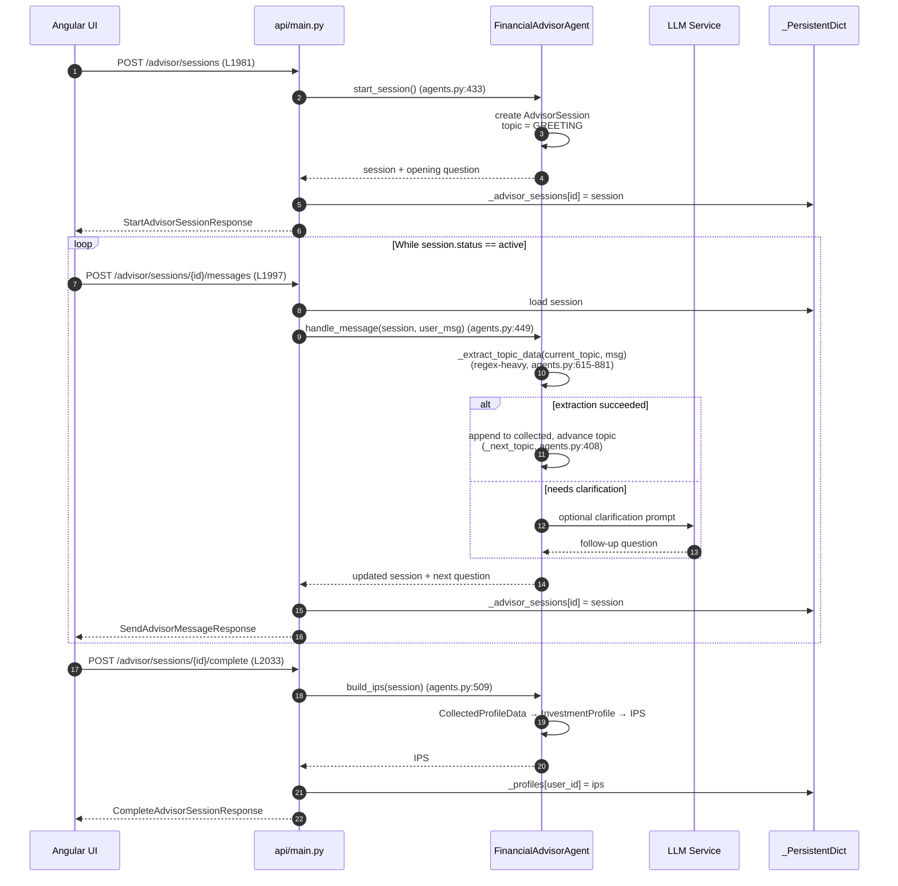
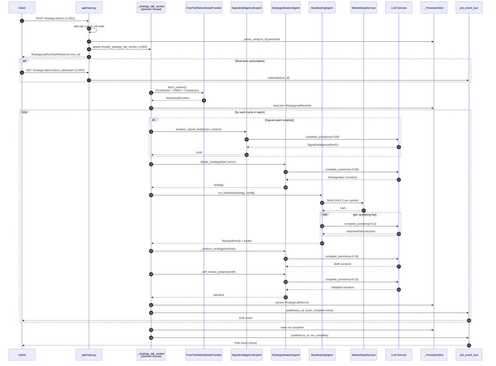
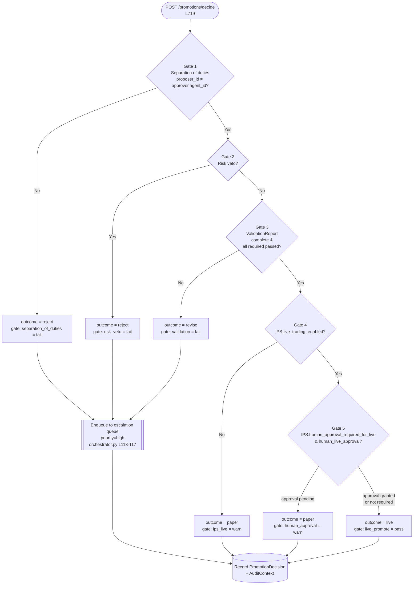
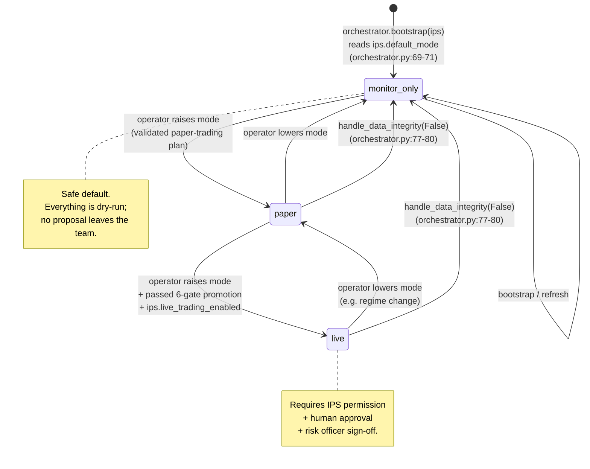

# Flow Charts — Investment Team

Four diagrams covering the most important end-to-end paths through the
investment team:

1. [Advisor session → IPS](#1-advisor-session--ips-flow) (sequence diagram)
2. [Strategy Lab batch run](#2-strategy-lab-batch-run-flow) (sequence diagram)
3. [Promotion-gate decision tree](#3-promotion-gate-decision-tree) (flowchart)
4. [Orchestrator workflow mode](#4-orchestrator-workflow-mode) (state diagram)

Line references point to [`api/main.py`](../api/main.py),
[`agents.py`](../agents.py), and [`orchestrator.py`](../orchestrator.py).

---

## 1. Advisor session → IPS flow

Conversational flow that walks a user through topics to accumulate a
`CollectedProfileData` object, converts it to an `InvestmentProfile`, and
wraps it in an `IPS`.

**Key notes**

- Regex extraction (≈266 lines in `agents.py`:615-881) is deliberately local /
  deterministic so profile data never leaves the process when building the
  IPS. This is flagged as HIGH-4 in
  [`../ARCHITECTURE_REVIEW.md`](../ARCHITECTURE_REVIEW.md) — a future local-LLM
  extractor is planned.
- Topic order is a strict DAG driven by `_next_topic`
  ([`agents.py`](../agents.py):408): `GREETING → RISK → HORIZON → INCOME →
  NET_WORTH → SAVINGS → TAX → LIQUIDITY → GOALS → PREFERENCES → CONSTRAINTS →
  REVIEW`.
- `build_ips` sets `IPS.default_mode` from collected preferences; typically
  `WorkflowMode.MONITOR_ONLY` so promotion is always opt-in.

---

## 2. Strategy Lab batch run flow

The long-running flow kicked off by `POST /strategy-lab/run`. The API returns
immediately with a `run_id`; the worker thread runs the per-cycle loop and
publishes SSE events that the UI subscribes to.

**Key notes**

- The per-bar LLM call inside `BacktestingAgent.run_backtest` is expensive —
  it's the CRITICAL-1 issue in
  [`../ARCHITECTURE_REVIEW.md`](../ARCHITECTURE_REVIEW.md). The long-term plan
  is rule compilation + batched Tier-2 evaluation.
- Worker state lives in both an in-memory `_active_runs` dict **and** the
  `_PersistentDict` bucket so restarts can reload in-flight runs via
  `_load_run_from_job_service`.
- `STRATEGY_LAB_SIGNAL_EXPERT_ENABLED` toggles the signal-expert step off for
  A/B comparison or cost control.
- Polling clients can use `GET /strategy-lab/runs/{run_id}/status` (L1534)
  instead of SSE.

---

## 3. Promotion-gate decision tree

Six-gate checklist from `PromotionGateAgent.decide`
([`agents.py`](../agents.py):131-302). Each gate either short-circuits to a
terminal outcome (`reject`), falls through to a softer outcome (`revise` /
`paper`), or continues to the next gate. Rejects and revises auto-enqueue to
the `escalation` queue in
[`orchestrator.py`](../orchestrator.py):113-117.

**Key notes**

- Every gate writes a `GateCheckResult(gate, result, details)` to
  `PromotionDecision.gate_results`, so the full trace survives in persistence
  (`investment_strategies` bucket) for audit.
- `PromotionDecision.audit: AuditContext` captures the snapshot ID,
  assumptions, and agent version that produced the decision.
- The gate is the **only** path between a validated strategy and paper/live
  execution — all tracks funnel through here.

---

## 4. Orchestrator workflow mode

`WorkflowMode` governs what the orchestrator will let through. It is
initialized from `IPS.default_mode` at bootstrap, can be raised by explicit
operator action, and is automatically clamped to `monitor_only` on any
data-integrity failure.

**Key notes**

- `handle_data_integrity(False)` writes
  `data_integrity_failed:degrade_to_monitor_only` to `WorkflowState.audit_log`
  and cannot be overridden without operator intervention.
- `GET /workflow/status` ([`api/main.py`](../api/main.py):756) exposes the
  current mode plus the full audit log so an operator can see exactly why
  a degrade happened.
- Mode transitions that *raise* the mode (`monitor_only → paper → live`) are
  **not** automatic — they require explicit operator calls. The only automatic
  transition in the system is the degrade to `monitor_only`.
