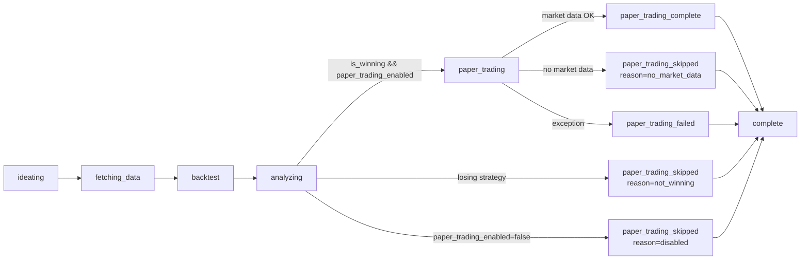

# Strategy Lab — Pipeline

The Strategy Lab runs one or more sequential research cycles. Each cycle
generates a fresh strategy, runs a historical backtest, analyzes the
result, and (when the backtest passes the winner gate) paper-trades it on
recent market data.

## Cycle diagram



The pipeline lives in
[`api/main.py::_run_one_strategy_lab_cycle`](../api/main.py) and
[`api/main.py::_strategy_lab_worker`](../api/main.py).

## Winner gate

```python
is_winning = result.annualized_return_pct > 8.0
```

This flag is the single source of truth: `/strategy-lab/paper-trade`
(standalone endpoint) and the integrated cycle both refuse to paper-trade
a non-winning strategy. A losing strategy is still persisted as a
`StrategyLabRecord` with `is_winning=False`, and
`paper_trading_status="skipped"`, `paper_trading_skipped_reason="not_winning"`.

## Phase events

Every cycle emits phase events via the `on_phase(phase, data)` callback.
The strategy-lab worker forwards them as SSE `progress` events. The
canonical list is:

| Phase | When emitted | Data fields |
|---|---|---|
| `ideating` | Start of cycle; also on re-ideation retry | `{ retry?, excluded? }` |
| `fetching_data` | After ideation, before backtest | `{ strategy: {asset_class, hypothesis}, retry? }` |
| `analyzing` | After backtest, before narrative | `{ strategy, metrics }` |
| `paper_trading` | Entering the paper-trading step (winners only) | `{ strategy }` |
| `paper_trading_complete` | Paper trading finished successfully | `{ session_id, verdict, trade_count }` |
| `paper_trading_skipped` | Paper trading did not run | `{ reason, detail? }` |
| `paper_trading_failed` | Paper trading raised an exception (non-fatal) | `{ detail }` |
| `complete` | Cycle fully persisted | `{ record_id, is_winning, metrics, paper_trading_status, paper_trading_verdict }` |

UI clients should treat unknown phase names as opaque and ignore them.

## Skip reasons

| `paper_trading_skipped_reason` | Meaning |
|---|---|
| `not_winning` | Backtest `annualized_return_pct <= 8.0` — paper trading never runs. |
| `disabled` | `RunStrategyLabRequest.paper_trading_enabled = false` — explicit opt-out. |
| `no_market_data` | `MarketDataService` could not fetch live OHLCV data for the strategy's asset class — retry later. |
| `no_strategy_code` | The orchestrator produced a winning record but no compilable `strategy_code` (e.g. refinement loop exhausted) — nothing to execute in the sandbox. |

## Failure isolation

A paper-trading failure is **non-fatal** for the cycle. The winning
backtest still produces a valid `StrategyLabRecord`; the failure is
recorded on the record as:

- `paper_trading_status = "failed"`
- `paper_trading_error = "<stringified exception, truncated to 500 chars>"`

This lets the user retry manually via `POST /strategy-lab/paper-trade`
with the `lab_record_id` once the underlying cause is fixed.

## Re-running paper trading

The standalone `POST /strategy-lab/paper-trade` endpoint is unchanged.
Use it to run (or re-run) paper trading against a specific winning
`lab_record_id` — typical use cases:

- A cycle recorded `paper_trading_status = "failed"` or
  `paper_trading_skipped_reason = "no_market_data"` and you want to retry.
- You want a second paper-trading pass with different parameters
  (longer lookback, higher `max_evaluations`, stricter `min_trades`).

Each invocation writes a new `PaperTradingSession`; the record's
`paper_trading_session_id` continues to point at the original session
from the cycle.
