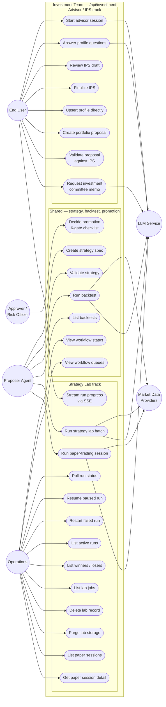

# Use Cases — Investment Team

UML-style use case view. Actors are on the left and right; the system boundary
in the middle groups every investment-team use case. Each use case is mapped
to the HTTP endpoint that triggers it and the agent(s) that handle it.

## Actors

| Actor | Role |
|---|---|
| **End User** | Retail investor using the Angular UI — drives the advisor conversation, reviews proposals and memos |
| **Proposer Agent** | Upstream agent (another Khala team, a CLI, or a human operator) that submits strategies for validation and promotion |
| **Approver / Risk Officer** | Separate principal that holds risk-veto and human-approval authority; enforces separation of duties |
| **Operations** | Admin role responsible for workflow monitoring and lab storage cleanup |
| **Market Data Providers** *(secondary)* | External OHLCV and snapshot sources (Yahoo Finance, Twelve Data, CoinGecko, Alpha Vantage, FRED, Frankfurter) |
| **LLM Service** *(secondary)* | Ollama / Claude inference backend used by every agent |

## Use case diagram

> *Mermaid flowchart is used here as a pragmatic stand-in for a classical UML
> use-case diagram — GitHub does not ship a dedicated use-case renderer.
> Actors are circular nodes, use cases are ovals (`([ ])`), and the system
> boundary is the subgraph labeled "Investment Team".*

## Use case → endpoint → agent map

### Advisor / IPS track

| Use case | Endpoint | Agent(s) | Persists to |
|---|---|---|---|
| Start advisor session | `POST /advisor/sessions` | `FinancialAdvisorAgent.start_session` ([`agents.py`](../agents.py):433) | `investment_advisor_sessions` |
| Answer profile questions | `POST /advisor/sessions/{id}/messages` | `FinancialAdvisorAgent.handle_message` ([`agents.py`](../agents.py):449) | `investment_advisor_sessions` |
| Review IPS draft | `GET /advisor/sessions/{id}` | — (read-only) | `investment_advisor_sessions` |
| Finalize IPS | `POST /advisor/sessions/{id}/complete` | `FinancialAdvisorAgent.build_ips` ([`agents.py`](../agents.py):509) | `investment_profiles` |
| Upsert profile directly | `POST /profiles` | — | `investment_profiles` |
| Get profile / IPS | `GET /profiles/{user_id}` | — (read-only) | `investment_profiles` |
| Create portfolio proposal | `POST /proposals/create` | — | `investment_proposals` |
| Get proposal | `GET /proposals/{proposal_id}` | — (read-only) | `investment_proposals` |
| Validate proposal against IPS | `POST /proposals/{proposal_id}/validate` | `PolicyGuardianAgent.check_portfolio` ([`agents.py`](../agents.py):49) | `investment_proposals` |
| Request investment committee memo | `POST /memos` | `InvestmentCommitteeAgent.draft_memo` ([`agents.py`](../agents.py):303) | — |

### Shared — strategy, backtest, promotion

| Use case | Endpoint | Agent(s) | Persists to |
|---|---|---|---|
| Create strategy spec | `POST /strategies` | — | `investment_strategies` |
| Validate strategy | `POST /strategies/{id}/validate` | `ValidationAgent.checklist_failures` ([`agents.py`](../agents.py):106) | `investment_validations` |
| Run backtest | `POST /backtests` | `BacktestingAgent.run_backtest` | `investment_backtests` |
| List backtests | `GET /backtests` | — (read-only) | `investment_backtests` |
| Decide promotion | `POST /promotions/decide` | `InvestmentTeamOrchestrator.promotion_decision` → `PromotionGateAgent.decide` ([`orchestrator.py`](../orchestrator.py):92, [`agents.py`](../agents.py):131) | audit log + escalation queue on reject/revise |
| View workflow status | `GET /workflow/status` | `InvestmentTeamOrchestrator` | — |
| View workflow queues | `GET /workflow/queues` | `InvestmentTeamOrchestrator` | — |
| Health check | `GET /health` | — | — |

### Strategy Lab track

| Use case | Endpoint | Agent(s) | Persists to |
|---|---|---|---|
| Run strategy lab batch | `POST /strategy-lab/run` | `_strategy_lab_worker` → `SignalIntelligenceExpert` → `StrategyIdeationAgent` → `BacktestingAgent` | `investment_strategy_lab_records` |
| Stream run progress | `GET /strategy-lab/runs/{id}/stream` | `job_event_bus` subscription | — |
| Poll run status | `GET /strategy-lab/runs/{id}/status` | `_active_runs` + `_load_run_from_job_service` | — |
| Resume paused run | `POST /strategy-lab/runs/{id}/resume` | `_strategy_lab_worker` | `investment_strategy_lab_records` |
| Restart failed run | `POST /strategy-lab/runs/{id}/restart` | `_strategy_lab_worker` | `investment_strategy_lab_records` |
| List active runs | `GET /strategy-lab/runs` | `_active_runs` | — |
| List winners / losers | `GET /strategy-lab/results` | — (read-only) | `investment_strategy_lab_records` |
| List lab jobs | `GET /strategy-lab/jobs` | — (read-only) | `investment_strategy_lab_records` |
| Delete lab record | `DELETE /strategy-lab/records/{id}` | — | `investment_strategy_lab_records` + linked strategies / backtests / paper sessions |
| Purge lab storage | `DELETE /strategy-lab/storage` | — | all strategy-lab buckets |
| Run paper-trading session | `POST /strategy-lab/paper-trade` | `PaperTradingAgent.run_paper_trading` | `investment_paper_trading_sessions` |
| List paper sessions | `GET /strategy-lab/paper-trade/results` | — (read-only) | `investment_paper_trading_sessions` |
| Get paper session detail | `GET /strategy-lab/paper-trade/{session_id}` | — (read-only) | `investment_paper_trading_sessions` |

## Profile requirement per use case

Matches the authoritative list in [`../README.md`](../README.md):58-76.

**Requires `user_id` / IPS loaded from store:**
`POST /profiles`, `GET /profiles/{user_id}`,
`POST /proposals/create`, `POST /proposals/{proposal_id}/validate`,
`POST /promotions/decide`, `POST /memos`,
`POST /advisor/sessions` (and messages / complete).

**Does not require a user investment profile:**
`POST /strategies`, `POST /strategies/{strategy_id}/validate`,
`POST /backtests`, `GET /backtests`,
`POST /strategy-lab/run`, `GET /strategy-lab/results`,
`DELETE /strategy-lab/records/{lab_record_id}`, `DELETE /strategy-lab/storage`,
`GET /workflow/status`, `GET /workflow/queues`, and every other
`/strategy-lab/*` endpoint.
