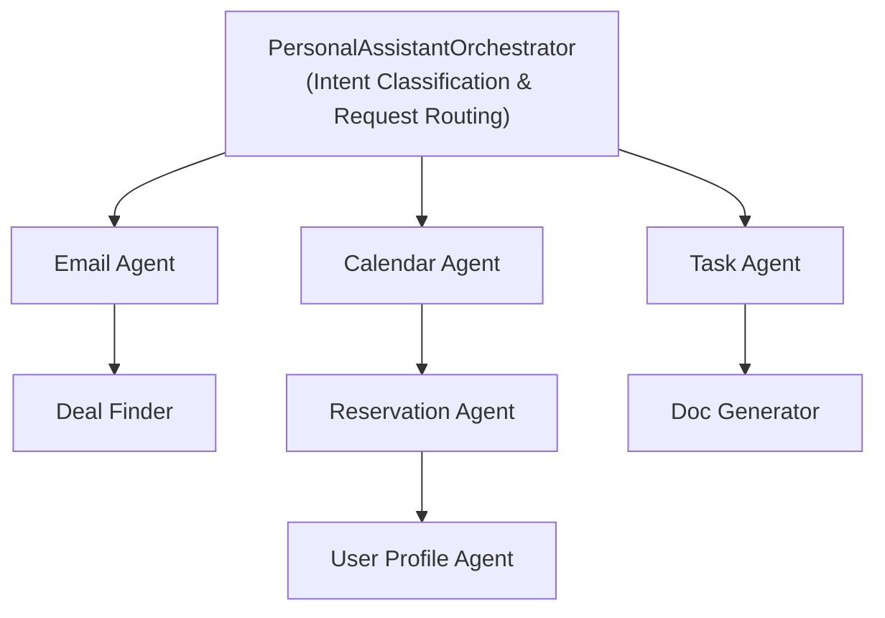

# Personal Assistant Agent Team

A comprehensive personal assistant agent team that manages email, calendars, tasks, deals, reservations, and maintains a rich user profile document system capturing preferences, goals, and personal details.

## Architecture



## Features

### User Profile Management
- Comprehensive profile storage across 10 categories (identity, preferences, goals, lifestyle, professional, relationships, financial, health, travel, shopping)
- Automatic preference learning from conversations
- YAML-based storage for human readability
- Profile summary generation for use in prompts

### Email Management
- IMAP/SMTP support for any email provider
- OAuth2 support for Gmail and Outlook
- Email summarization with key point extraction
- Event extraction from emails
- Draft composition matching user's voice
- Smart reply suggestions

### Calendar Management
- Google Calendar integration
- Event creation from natural language
- Smart scheduling suggestions
- Conflict detection
- Free slot finder

### Task Management
- Multiple task lists (groceries, todos, etc.)
- Natural language item addition
- Priority and due date tracking
- Item categorization for grocery lists
- Task completion tracking

### Deal Finding
- Web search for deals matching preferences
- Wishlist tracking with price alerts
- Relevance scoring based on user profile
- Personalized deal recommendations

### Reservation Management
- Restaurant recommendations based on preferences
- Reservation tracking
- Natural language reservation parsing
- Venue search and scoring

### Document Generation
- Process documentation (how-to guides)
- Checklists with time estimates
- Templates with placeholders
- Standard Operating Procedures
- Meeting agendas

## Quick Start

### 1. Install Dependencies

```bash
cd agents/personal_assistant_team
pip install -r requirements.txt
```

### 2. Configure Environment

Copy `.env.example` to `.env` and configure:

```bash
cp .env.example .env

# Generate an encryption key
python -c "from cryptography.fernet import Fernet; print(Fernet.generate_key().decode())"

# Add the key to .env as PA_CREDENTIAL_KEY
```

### 3. Start the API Server

```bash
python -m agent_implementations.run_api_server
```

The server will start on http://127.0.0.1:8015

### 4. Make Requests

```bash
# Send a request to the assistant (returns a job_id)
curl -X POST "http://127.0.0.1:8015/assistant/jobs?user_id=user123" \
  -H "Content-Type: application/json" \
  -d '{"message": "Add milk and eggs to my grocery list"}'

# Poll for the result
curl "http://127.0.0.1:8015/assistant/jobs/{job_id}"

# Get user profile
curl "http://127.0.0.1:8015/users/user123/profile"

# List task lists
curl "http://127.0.0.1:8015/users/user123/tasks/lists"
```

## API Endpoints

### Assistant
- `POST /assistant/jobs?user_id={user_id}` - Submit a free-form assistant request (returns `{job_id, status}`)
- `GET /assistant/jobs/{job_id}` - Poll for job status and result
- `POST /assistant/jobs/{job_id}/cancel` - Cancel a running job
- `DELETE /assistant/jobs/{job_id}` - Delete a job from the store
- `GET /users/{user_id}/assistant/jobs` - List a user's jobs

### Profile
- `GET /users/{user_id}/profile` - Get full profile
- `POST /users/{user_id}/profile` - Update profile category
- `GET /users/{user_id}/profile/summary` - Get profile summary

### Email
- `POST /users/{user_id}/email/connect` - Connect email account
- `GET /users/{user_id}/email/inbox` - Fetch emails
- `POST /users/{user_id}/email/draft` - Create email draft

### Calendar
- `GET /users/{user_id}/calendar/events` - List events
- `POST /users/{user_id}/calendar/events` - Create event
- `POST /users/{user_id}/calendar/events/from-text` - Create event from text

### Tasks
- `GET /users/{user_id}/tasks/lists` - List all task lists
- `POST /users/{user_id}/tasks/lists` - Create task list
- `POST /users/{user_id}/tasks/lists/{list_id}/items` - Add item
- `POST /users/{user_id}/tasks/from-text` - Add items from text
- `GET /users/{user_id}/tasks/pending` - Get pending tasks

### Deals
- `GET /users/{user_id}/deals` - Search deals
- `GET /users/{user_id}/deals/personalized` - Get personalized deals
- `GET /users/{user_id}/deals/wishlist` - Get wishlist
- `POST /users/{user_id}/deals/wishlist` - Add to wishlist

### Reservations
- `GET /users/{user_id}/reservations` - List reservations
- `POST /users/{user_id}/reservations` - Create reservation
- `POST /users/{user_id}/reservations/from-text` - Create from text
- `GET /users/{user_id}/reservations/restaurants/recommend` - Get recommendations

### Documents
- `POST /users/{user_id}/documents/process` - Generate process doc
- `POST /users/{user_id}/documents/checklist` - Generate checklist
- `GET /users/{user_id}/documents` - List documents
- `GET /users/{user_id}/documents/{doc_id}` - Get document content

## Environment Variables

| Variable | Description | Default |
|----------|-------------|---------|
| `LLM_PROVIDER` | LLM provider (ollama, dummy) | ollama |
| `LLM_MODEL` | LLM model name | llama3.2 |
| `LLM_BASE_URL` | Ollama base URL | http://127.0.0.1:11434 |
| `PA_HOST` | API server host | 0.0.0.0 |
| `PA_PORT` | API server port | 8015 |
| `PA_CREDENTIAL_KEY` | Fernet encryption key | (required) |
| `OLLAMA_API_KEY` | Ollama API key for web search (e.g. from https://ollama.com/settings/keys) | (optional) |
| `GOOGLE_CLIENT_ID` | Google OAuth client ID | (optional) |
| `GOOGLE_CLIENT_SECRET` | Google OAuth client secret | (optional) |

## Directory Structure

```
personal_assistant_team/
├── __init__.py
├── models.py                    # Shared Pydantic models
├── prompts.py                   # Shared prompt templates
├── requirements.txt
├── .env.example
├── README.md
├── orchestrator/                # Main orchestrator
│   ├── agent.py
│   ├── models.py
│   └── prompts.py
├── user_profile_agent/          # Profile management
│   ├── agent.py
│   ├── models.py
│   └── prompts.py
├── email_agent/                 # Email operations
│   ├── agent.py
│   ├── models.py
│   └── prompts.py
├── calendar_agent/              # Calendar management
│   ├── agent.py
│   ├── models.py
│   └── prompts.py
├── task_agent/                  # Task/todo management
│   ├── agent.py
│   ├── models.py
│   └── prompts.py
├── deal_finder_agent/           # Deal discovery
│   ├── agent.py
│   ├── models.py
│   └── prompts.py
├── reservation_agent/           # Reservations
│   ├── agent.py
│   ├── models.py
│   └── prompts.py
├── doc_generator_agent/         # Document generation
│   ├── agent.py
│   ├── models.py
│   └── prompts.py
├── tools/                       # Tool agents
│   ├── email_tools.py
│   ├── calendar_tools.py
│   ├── web_search.py
│   └── web_fetch.py
├── shared/                      # Shared utilities
│   ├── credential_store.py
│   ├── user_profile_store.py
│   └── llm.py
├── api/                         # FastAPI server
│   └── main.py
├── agent_implementations/
│   └── run_api_server.py
└── tests/                       # Unit tests
    ├── conftest.py
    ├── test_models.py
    ├── test_user_profile_store.py
    ├── test_credential_store.py
    └── test_task_agent.py
```

## Testing

```bash
cd agents/personal_assistant_team
pytest tests/ -v
```

## Usage Examples

### Example 1: Managing Groceries

```python
from personal_assistant_team.orchestrator import PersonalAssistantOrchestrator
from personal_assistant_team.shared.llm import get_llm_client

llm = get_llm_client()
assistant = PersonalAssistantOrchestrator(llm)

response = assistant.run(OrchestratorRequest(
    user_id="user123",
    message="Add milk, eggs, and bread to my grocery list"
))
print(response.message)
```

### Example 2: Scheduling a Meeting

```python
response = assistant.run(OrchestratorRequest(
    user_id="user123",
    message="Schedule a team meeting for tomorrow at 2pm"
))
```

### Example 3: Finding Deals

```python
response = assistant.run(OrchestratorRequest(
    user_id="user123",
    message="Find me deals on running shoes"
))
```

### Example 4: Updating Profile

```python
response = assistant.run(OrchestratorRequest(
    user_id="user123",
    message="I love Italian food but I'm allergic to shellfish"
))
# Profile will be automatically updated with these preferences
```

## Khala platform

This package is part of the [Khala](../../../README.md) monorepo (Unified API, Angular UI, and full team index).
