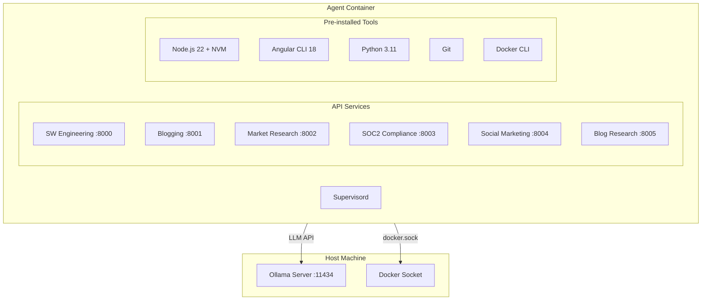

# Docker Agent Environment Packaging

## Architecture Overview




## Files to Create

### 1. Dockerfile (`[Dockerfile](Dockerfile)`)

Multi-stage build with:

- **Base stage**: Python 3.11-slim with system dependencies
- **Node stage**: NVM + Node.js 22.12 + Angular CLI 18
- **Final stage**: Combined runtime with all tools

Key components:

- Python 3.11 with pip dependencies from all teams
- NVM with Node.js 22.12 (Angular CLI requirement)
- Angular CLI 18 globally installed
- Git for repository operations
- Docker CLI for DevOps agent operations (no daemon - uses host socket)
- Non-root user `agent` for security

### 2. docker-compose.yml (`[docker-compose.yml](docker-compose.yml)`)

Service definition with:

- Volume mount for `/var/run/docker.sock` (Docker CLI access)
- Volume mount for workspace directory
- Port mappings for all 6 APIs (8000-8005)
- Environment variables for Ollama connection (`SW_LLM_BASE_URL=http://host.docker.internal:11434`)
- `extra_hosts` for `host.docker.internal` on Linux

### 3. Supervisor Configuration (`[supervisord.conf](supervisord.conf)`)

Process manager to run all 6 API servers:

- `software_engineering_api` on port 8000
- `blogging_api` on port 8001
- `market_research_api` on port 8002
- `soc2_compliance_api` on port 8003
- `social_marketing_api` on port 8004
- `blog_research_api` on port 8005

### 4. Entrypoint Script (`[entrypoint.sh](entrypoint.sh)`)

Startup script that:

- Sources NVM for Node.js availability
- Verifies tool availability (node, ng, git, docker)
- Starts supervisord

### 5. .dockerignore (`[.dockerignore](.dockerignore)`)

Excludes unnecessary files from build context

## Key Design Decisions

### Docker-in-Docker Approach

Using **Docker socket binding** (mounting `/var/run/docker.sock`) rather than true DinD because:

- The DevOps agent only needs to run `docker build` for verification
- Simpler setup without `--privileged` flag
- Lower overhead than running a nested daemon

Security consideration: The socket mount gives container access to host Docker daemon. For production, consider:

- Running on a dedicated CI/build host
- Using Docker's allowlist features for trusted images
- Implementing command restrictions

### Port Allocation


| Port | Team                 | Endpoint Prefix                             |
| ---- | -------------------- | ------------------------------------------- |
| 8000 | Software Engineering | `/run-team`, `/clarification`, `/execution` |
| 8001 | Blogging             | `/research-and-review`, `/full-pipeline`    |
| 8002 | Market Research      | `/market-research`                          |
| 8003 | SOC2 Compliance      | `/soc2-audit`                               |
| 8004 | Social Marketing     | `/social-marketing`                         |
| 8005 | Blog Research (root) | `/research-and-review`                      |


### Ollama Connection

The container connects to the host's Ollama server using:

- `host.docker.internal:11434` (Docker Desktop on macOS/Windows)
- `extra_hosts: ["host.docker.internal:host-gateway"]` for Linux

Environment variable `SW_LLM_BASE_URL` configures the connection.

## Usage

```bash
# Build the image
docker build -t khala .

# Run with docker-compose (recommended)
docker-compose up -d

# Or run directly
docker run -d \
  -v /var/run/docker.sock:/var/run/docker.sock \
  -v $(pwd)/workspace:/workspace \
  -p 8000-8005:8000-8005 \
  -e SW_LLM_BASE_URL=http://host.docker.internal:11434 \
  --add-host=host.docker.internal:host-gateway \
  khala

# Check health
curl http://localhost:8000/health
curl http://localhost:8001/health
# ... etc
```

## Dependencies Consolidated

All Python dependencies from:

- `[requirements.txt](requirements.txt)` (root)
- `[software_engineering_team/requirements.txt](software_engineering_team/requirements.txt)`
- `[blogging/requirements.txt](blogging/requirements.txt)`

Will be merged into a single consolidated requirements file in the Docker build.