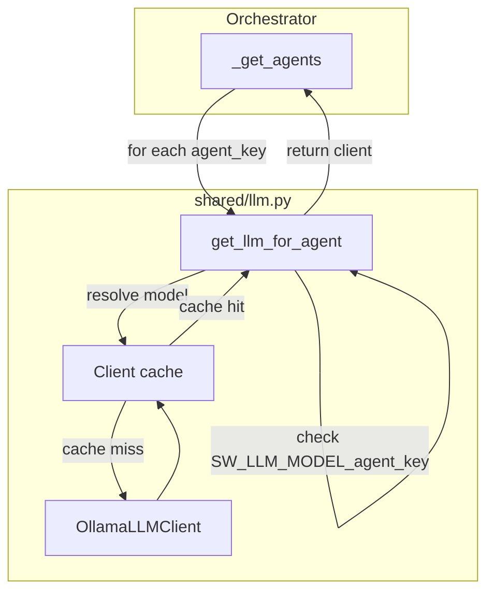

# Per-Agent Model Configuration Plan

## Current State

- All agents share a single LLM client from `get_llm_client()`, which reads `SW_LLM_MODEL` (default: `qwen3-coder-next`).
- `[orchestrator.py](software_engineering_team/orchestrator.py)` calls `get_llm_client()` once, then `_get_agents(llm)` passes that client to every agent (lines 1246-1247, 2031-2032).
- `[run_team.py](software_engineering_team/agent_implementations/run_team.py)` uses a global `LLM = get_llm_client()` for all agents.

## Design

### Model Selection Priority

For each agent, resolve model in this order:

1. `SW_LLM_MODEL_<agent_key>` (e.g. `SW_LLM_MODEL_backend`) - per-agent override
2. `SW_LLM_MODEL` - global fallback (preserves "single model" behavior)
3. `AGENT_DEFAULT_MODELS[agent_key]` - recommended default for that agent
4. `qwen3-coder-next:cloud` - hardcoded fallback

### Recommended Default Mapping (all :cloud versions)

| Model                      | Agents                                                                                                                                                                                 |
| -------------------------- | -------------------------------------------------------------------------------------------------------------------------------------------------------------------------------------- |
| **qwen3-coder-next:cloud** | backend, frontend, code_review, repair, devops, dbc_comments                                                                                                                           |
| **qwen3.5:cloud**            | tech_lead, architecture, spec_intake, project_planning, integration                                                                                                                    |
| **qwen3.5:cloud**          | api_contract, data_architecture, ui_ux, frontend_architecture, infrastructure, devops_planning, qa_test_strategy, security_planning, observability, acceptance_verifier, documentation |
| **minimax-m2.5:cloud**     | qa, security, accessibility                                                                                                                                                            |

`git_setup` has no LLM (no change).

### Client Caching

Cache `OllamaLLMClient` instances by `(model, base_url, timeout)` to avoid creating duplicate clients when multiple agents share the same model.

### Dummy Provider

When `SW_LLM_PROVIDER=dummy`, all agents receive `DummyLLMClient` regardless of model config (no behavior change).

---

## Implementation

### 1. Add per-agent model resolution in `[shared/llm.py](software_engineering_team/shared/llm.py)`

- Add `AGENT_DEFAULT_MODELS: dict[str, str]` with the mapping above.
- Add `get_llm_for_agent(agent_key: str)` that:
  - Returns `DummyLLMClient()` when provider is `dummy`.
  - Resolves model via: `SW_LLM_MODEL_<key>` → `SW_LLM_MODEL` → `AGENT_DEFAULT_MODELS[key]` → `"qwen3-coder-next"`.
  - Uses a module-level cache `_client_cache: dict[tuple[str, str, float], OllamaLLMClient]` keyed by `(model, base_url, timeout)`.
  - Creates `OllamaLLMClient(model=..., base_url=..., timeout=...)` and caches it.
- Keep `get_llm_client()` unchanged for backward compatibility (callers that don't use per-agent config).

### 2. Update `[orchestrator.py](software_engineering_team/orchestrator.py)`

- Change `_get_agents(llm)` → `_get_agents()` (no parameter).
- For each agent (except `git_setup`), call `get_llm_for_agent(key)` and pass the result to the agent constructor.
- In `run_orchestrator` and `run_failed_tasks`: remove `llm = get_llm_client()` and pass nothing to `_get_agents()`.

### 3. Update `[agent_implementations/run_team.py](software_engineering_team/agent_implementations/run_team.py)`

- Replace `LLM = get_llm_client()` with per-agent calls: `get_llm_for_agent("architecture")`, `get_llm_for_agent("tech_lead")`, etc., when constructing each agent.

### 4. Update `[README.md](software_engineering_team/README.md)`

- Add a new subsection "Per-agent model configuration" under LLM configuration.
- Document `SW_LLM_MODEL_<agent_key>` (e.g. `SW_LLM_MODEL_backend`, `SW_LLM_MODEL_tech_lead`).
- Document the recommended default mapping and that `SW_LLM_MODEL` remains the global fallback.
- Example: `export SW_LLM_MODEL_tech_lead=qwen3.5` to override only Tech Lead.

---

## Data Flow (After Change)

---

## Files to Modify

| File                                                                                                                         | Changes                                                                                        |
| ---------------------------------------------------------------------------------------------------------------------------- | ---------------------------------------------------------------------------------------------- |
| `[software_engineering_team/shared/llm.py](software_engineering_team/shared/llm.py)`                                         | Add `AGENT_DEFAULT_MODELS`, `get_llm_for_agent()`, client cache                                |
| `[software_engineering_team/orchestrator.py](software_engineering_team/orchestrator.py)`                                     | `_get_agents()` no-arg, use `get_llm_for_agent(key)`; remove `get_llm_client()` from run paths |
| `[software_engineering_team/agent_implementations/run_team.py](software_engineering_team/agent_implementations/run_team.py)` | Use `get_llm_for_agent()` per agent                                                            |
| `[software_engineering_team/README.md](software_engineering_team/README.md)`                                                 | Document per-agent env vars and defaults                                                       |

---

## Testing

- Unit test `get_llm_for_agent`: mock env, assert correct model resolution order and that cache returns same client for same model.
- Existing orchestrator and agent tests should pass; they use `DummyLLMClient` or mock LLMs, so no changes needed if `get_llm_for_agent` returns dummy when provider is dummy.

---

## Sub-Agents (Tech Lead, Backend, Frontend)

Tech Lead creates sub-agents (BackendPlanningAgent, FrontendPlanningAgent, SpecChunkAnalyzer, etc.) and passes `self.llm` to them. Those sub-agents will use whatever model the Tech Lead has. No change in this plan; sub-agents inherit the parent's model. Future enhancement could add per-sub-agent config if needed.