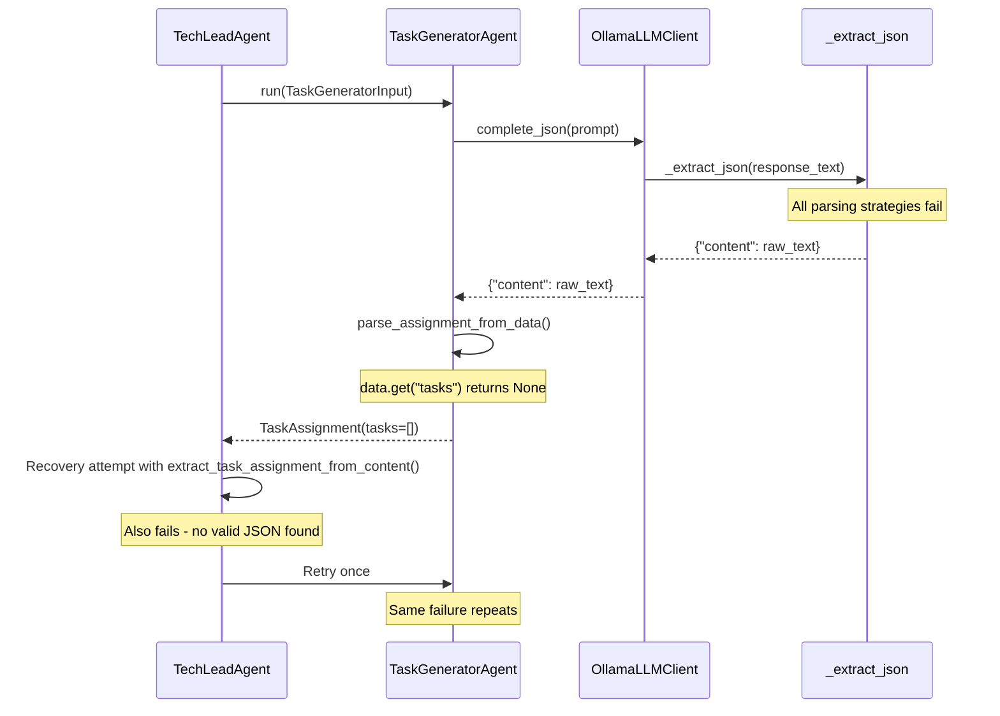

# Task Generator 0 Tasks - Root Cause Analysis

## Problem Statement

The Tech Lead agent receives 0 tasks from the Task Generator, triggering the warning:

```
Could not parse structured JSON from LLM response; returning raw content wrapper | failure_class=json_parse_failure
Tech Lead: got 0 tasks from Task Generator, retrying once
```

## Root Cause Analysis

### Data Flow




### Core Issue

The `qwen3.5:cloud` model is not returning valid JSON that the parsing logic can extract. The failure cascades through multiple recovery attempts:

1. **Primary JSON parse** ([llm.py:738-740](software_engineering_team/shared/llm.py)) - `json.loads()` fails
2. **Repaired JSON parse** ([llm.py:742-746](software_engineering_team/shared/llm.py)) - Trailing comma fix doesn't help
3. **Object extraction** ([llm.py:747-756](software_engineering_team/shared/llm.py)) - Regex `\{.*\}` doesn't find valid JSON
4. **Code block extraction** ([llm.py:775-795](software_engineering_team/shared/llm.py)) - No code blocks with expected keys
5. **Task assignment recovery** ([llm.py:816-827](software_engineering_team/shared/llm.py)) - `extract_task_assignment_from_content()` finds no tasks
6. **Final fallback** ([llm.py:831-834](software_engineering_team/shared/llm.py)) - Returns `{"content": text}` wrapper

### Why This Happens

The `qwen3.5:cloud` model is likely returning:

- Plain text explanation instead of JSON
- JSON with severe syntax errors (unbalanced braces, invalid escaping)
- JSON embedded in markdown with surrounding text that confuses extraction
- Truncated response due to context/output limits

## Key Files Involved


| File                                                                                                                   | Role                                                              |
| ---------------------------------------------------------------------------------------------------------------------- | ----------------------------------------------------------------- |
| `[tech_lead_agent/agent.py](software_engineering_team/tech_lead_agent/agent.py)`                                       | Calls TaskGeneratorAgent, handles 0-task recovery (lines 389-457) |
| `[planning_team/task_generator_agent/agent.py](software_engineering_team/planning_team/task_generator_agent/agent.py)` | Builds prompt, calls LLM, returns raw dict (lines 37-196)         |
| `[shared/llm.py](software_engineering_team/shared/llm.py)`                                                             | JSON extraction with multiple fallbacks (lines 730-834)           |
| `[shared/task_parsing.py](software_engineering_team/shared/task_parsing.py)`                                           | Parses dict into TaskAssignment (lines 14-56)                     |
| `[shared/llm_response_utils.py](software_engineering_team/shared/llm_response_utils.py)`                               | Raw content recovery utilities (lines 16-72)                      |


## Implementation Plan

All four fixes will be implemented as layered defenses:

### 1. Add format:json to Ollama Requests (Primary Fix)

**File:** `[shared/llm.py](software_engineering_team/shared/llm.py)` line ~855

Add `"format": "json"` unconditionally to the Ollama request payload. This instructs models that support it to output only valid JSON.

```python
payload = {
    "model": self.model,
    "temperature": temperature,
    "max_tokens": max_tokens,
    "format": "json",  # Force JSON output mode
    "messages": [
        {"role": "system", "content": system_message},
        {"role": "user", "content": prompt},
    ],
}
```

### 2. Strengthen System Prompt (Reinforcement)

**File:** `[shared/llm.py](software_engineering_team/shared/llm.py)` line ~842

Update the system message to be more explicit about JSON-only output:

```python
system_message = (
    "You are a strict JSON generator. Your ENTIRE response must be a single valid JSON object. "
    "Do NOT include any text before or after the JSON. Do NOT use markdown code fences. "
    "Do NOT include explanatory text. Do NOT include thinking or reasoning. "
    "Start your response with { and end with }. Output valid JSON only."
)
```

### 3. Add Debug Logging (Diagnostics)

**File:** `[shared/llm.py](software_engineering_team/shared/llm.py)` before line 831

Add DEBUG-level logging before the final fallback to capture what the model actually returned:

```python
logger.debug(
    "Raw LLM response that failed all JSON extraction strategies (first 2000 chars):\n%s",
    text[:2000],
)
logger.warning(
    "Could not parse structured JSON from LLM response; returning raw content wrapper | failure_class=json_parse_failure",
)
```

### 4. Enhance Recovery Logic (Defense-in-Depth)

**File:** `[shared/llm_response_utils.py](software_engineering_team/shared/llm_response_utils.py)` in `extract_task_assignment_from_content()`

Add handling for common model output patterns:

```python
def extract_task_assignment_from_content(content: str) -> Optional[Dict[str, Any]]:
    if not content or not content.strip():
        return None
    stripped = content.strip()
    
    # Strip thinking/reasoning blocks that some models emit
    stripped = re.sub(r"<think>.*?</think>", "", stripped, flags=re.DOTALL)
    stripped = re.sub(r"<thinking>.*?</thinking>", "", stripped, flags=re.DOTALL)
    stripped = re.sub(r"<reasoning>.*?</reasoning>", "", stripped, flags=re.DOTALL)
    
    # Extract JSON from XML-style tags if present
    json_tag_match = re.search(r"<json>\s*(.*?)\s*</json>", stripped, flags=re.DOTALL)
    if json_tag_match:
        stripped = json_tag_match.group(1).strip()
    
    # ... rest of existing logic ...
```

## Expected Outcome

With all four fixes in place:

1. **format:json** tells the model to output JSON directly (most effective for models that support it)
2. **Stronger prompt** reinforces JSON-only output for models that ignore format param
3. **Debug logging** enables diagnosis when issues occur
4. **Enhanced recovery** salvages useful output even when model partially fails

The fixes are complementary - if one layer fails, the next provides backup.