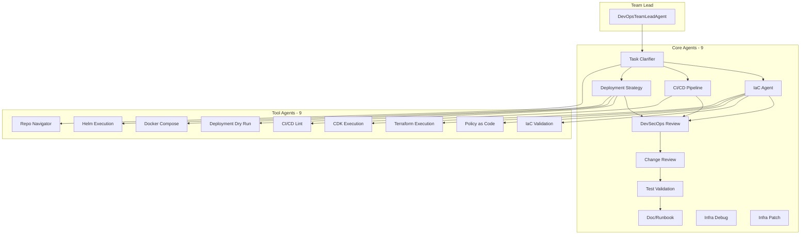
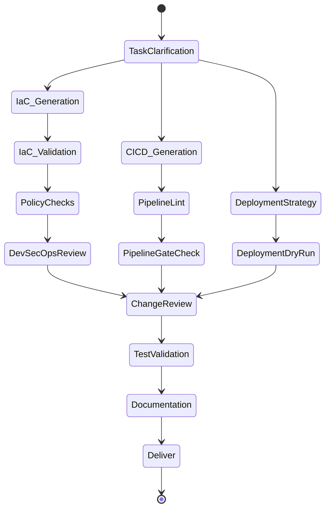

# DevOps Team

The DevOps Team is a comprehensive infrastructure and deployment automation system with 9 specialized agents and 9 tool agents, orchestrated through a gate-based workflow with environment-aware policies.

## Architecture



## Core Agents (9)

| Agent | Purpose | Output |
|-------|---------|--------|
| **Task Clarifier** | Parse and normalize task specifications | `DevOpsTaskSpec` |
| **IaC Agent** | Generate infrastructure code (Terraform, CDK, etc.) | IaC files |
| **CI/CD Pipeline** | Create CI/CD pipelines (GitHub Actions, GitLab CI) | Pipeline config |
| **Deployment Strategy** | Design deployment approach (blue-green, canary, etc.) | Strategy config |
| **DevSecOps Review** | Security review of infrastructure changes | Security findings |
| **Change Review** | Review infrastructure changes for risk | Change assessment |
| **Test Validation** | Validate infrastructure tests pass | Test results |
| **Doc/Runbook** | Generate documentation and runbooks | Runbook docs |
| **Infra Debug** | Debug infrastructure issues | Debug analysis |
| **Infra Patch** | Apply patches to fix issues | Patched files |

## Tool Agents (9)

| Tool Agent | Purpose | Input |
|------------|---------|-------|
| **IaC Validation** | Validate Terraform/CDK/CloudFormation | IaC files |
| **Policy as Code** | Enforce policies (OPA, Sentinel) | Policy rules |
| **CI/CD Lint** | Lint pipeline configurations | Pipeline files |
| **Deployment Dry Run** | Simulate deployments | Deployment config |
| **Repo Navigator** | Navigate and analyze repositories | Repo path |
| **Terraform Execution** | Run Terraform commands | Terraform files |
| **CDK Execution** | Run AWS CDK commands | CDK app |
| **Docker Compose** | Run Docker Compose operations | Compose files |
| **Helm Execution** | Run Helm chart operations | Helm charts |

## Workflow



## Quality Gates

The workflow enforces 8 required gates before completion:

| Gate | Description | Blocking |
|------|-------------|----------|
| `iac_validate` | IaC syntax and structure validation | Yes |
| `iac_validate_fmt` | IaC formatting compliance | Yes |
| `policy_checks` | Policy-as-code compliance | Yes |
| `pipeline_lint` | CI/CD pipeline linting | Yes |
| `pipeline_gate_check` | Pipeline gate verification | Yes |
| `deployment_dry_run` | Deployment simulation | Yes |
| `security_review` | DevSecOps security review | Yes |
| `change_review` | Change impact review | Yes |

All gates must pass before the workflow can complete.

## Environment Policies

Different environments have different requirements:

| Environment | Auto Deploy | Approval | Rollback Test | Policy Strictness |
|-------------|-------------|----------|---------------|-------------------|
| `dev` | Yes | No | No | Low |
| `staging` | Yes | No | Yes | Medium |
| `production` | No | Yes | Yes | High |

## Usage

### Programmatic

```python
from shared.llm import LLMClient
from devops_team.orchestrator import DevOpsTeamLeadAgent
from devops_team.models import DevOpsTaskSpec
from pathlib import Path

llm = LLMClient()
lead = DevOpsTeamLeadAgent(llm)

spec = DevOpsTaskSpec(
    task_id="devops-001",
    title="Setup Kubernetes Deployment",
    environment="staging",
    platform_scope=PlatformScope(
        cloud="aws",
        runtime="kubernetes",
        environments=["dev", "staging", "production"],
    ),
    goal=TaskGoal(summary="Deploy application to EKS with blue-green strategy"),
    constraints=DevOpsConstraints(
        iac=IaCConstraints(preferred="terraform"),
        ci_cd=CicdConstraints(platform="github-actions"),
        deployment=DeploymentConstraints(strategy="blue-green", tooling="helm"),
    ),
    acceptance_criteria=[
        "Deployment completes without errors",
        "Health checks pass within 5 minutes",
        "Rollback mechanism tested",
    ],
)

result = lead.run_task(spec, repo_path=Path("/path/to/repo"))

if result.success:
    pkg = result.completion_package
    print(f"Status: {pkg.status}")
    print(f"Files changed: {pkg.files_changed}")
    print(f"Quality gates: {pkg.quality_gates}")
else:
    print(f"Failed: {result.failure_reason}")
```

## Task Specification

The `DevOpsTaskSpec` model defines all task inputs:

```python
class DevOpsTaskSpec(BaseModel):
    task_id: str              # Required unique ID
    title: str                # Task title
    priority: str             # critical, high, medium, low
    environment: str          # dev, staging, production
    platform_scope: PlatformScope  # Cloud, runtime, environments
    repo_context: RepoContext     # App, infra, pipeline repos
    goal: TaskGoal                # Task objective
    scope: TaskScope              # Included/excluded items
    constraints: DevOpsConstraints  # IaC, CI/CD, deployment preferences
    acceptance_criteria: List[str]  # Success criteria
    risk_level: RiskLevel          # low, medium, high, critical
    rollback_requirements: List[str]  # Rollback needs
    security_constraints: List[str]   # Security requirements
```

## Completion Package

The workflow produces a `DevOpsCompletionPackage`:

```python
class DevOpsCompletionPackage(BaseModel):
    task_id: str
    status: Literal["completed", "failed", "blocked"]
    files_changed: List[str]
    acceptance_criteria_trace: List[CriterionTrace]  # Criteria → implementation mapping
    quality_gates: Dict[str, GateStatus]  # Gate results
    release_readiness: ReleaseReadiness   # Deployment readiness
    notes: List[str]
    risks_remaining: List[str]
    git_operations: GitOperationsMetadata  # Branch, commits, merge info
    handoff: HandoffInfo  # Approval requirements, runbook status
```

## Infrastructure as Code Support

| Platform | Tool | Validation |
|----------|------|------------|
| **AWS** | Terraform, CDK, CloudFormation | `terraform validate`, `cdk synth` |
| **Azure** | Terraform, ARM templates | `terraform validate` |
| **GCP** | Terraform, Deployment Manager | `terraform validate` |
| **Kubernetes** | Helm, Kustomize | `helm lint`, dry-run |

## CI/CD Platform Support

| Platform | Lint Tool |
|----------|-----------|
| **GitHub Actions** | actionlint |
| **GitLab CI** | gitlab-ci-lint |
| **Jenkins** | Jenkinsfile validation |
| **Azure DevOps** | YAML schema validation |

## Deployment Strategies

| Strategy | Description | Use Case |
|----------|-------------|----------|
| **Rolling** | Gradual pod replacement | Default, minimal disruption |
| **Blue-Green** | Full environment swap | Zero downtime, instant rollback |
| **Canary** | Percentage-based rollout | Risk mitigation, gradual exposure |
| **Recreate** | Full teardown and recreate | Development, testing |

## Directory Structure

```
devops_team/
├── orchestrator.py           # DevOpsTeamLeadAgent
├── models.py                 # DevOpsTaskSpec, CompletionPackage, etc.
├── task_clarifier/           # Task parsing and normalization
│   ├── agent.py
│   ├── prompts.py
│   └── models.py
├── iac_agent/                # Infrastructure as Code generation
├── cicd_pipeline_agent/      # CI/CD pipeline generation
├── deployment_strategy_agent/  # Deployment strategy design
├── devsecops_review_agent/   # Security review
├── change_review_agent/      # Change impact review
├── test_validation_agent/    # Test validation
├── doc_runbook_agent/        # Documentation and runbooks
├── infra_debug_agent/        # Infrastructure debugging
├── infra_patch_agent/        # Infrastructure patching
└── tool_agents/
    ├── iac_validation.py     # IaC validation tool
    ├── policy_as_code.py     # Policy enforcement
    ├── cicd_lint.py          # Pipeline linting
    ├── deployment_dry_run.py # Deployment simulation
    ├── repo_navigator.py     # Repository analysis
    ├── terraform_execution.py  # Terraform runner
    ├── cdk_execution.py      # CDK runner
    ├── docker_compose_execution.py  # Docker Compose runner
    └── helm_execution.py     # Helm runner
```

## Integration with SE Team

The DevOps Team is invoked by the main Software Engineering Team orchestrator:

1. SE Team completes backend/frontend development
2. DevOps task is created with infrastructure requirements
3. DevOps Team Lead orchestrates agents through the gate-based workflow
4. Completion package is returned to SE Team
5. SE Team proceeds with integration testing or delivery

## Strands platform

This package is part of the [Strands Agents](../../../../README.md) monorepo (Unified API, Angular UI, and full team index).
