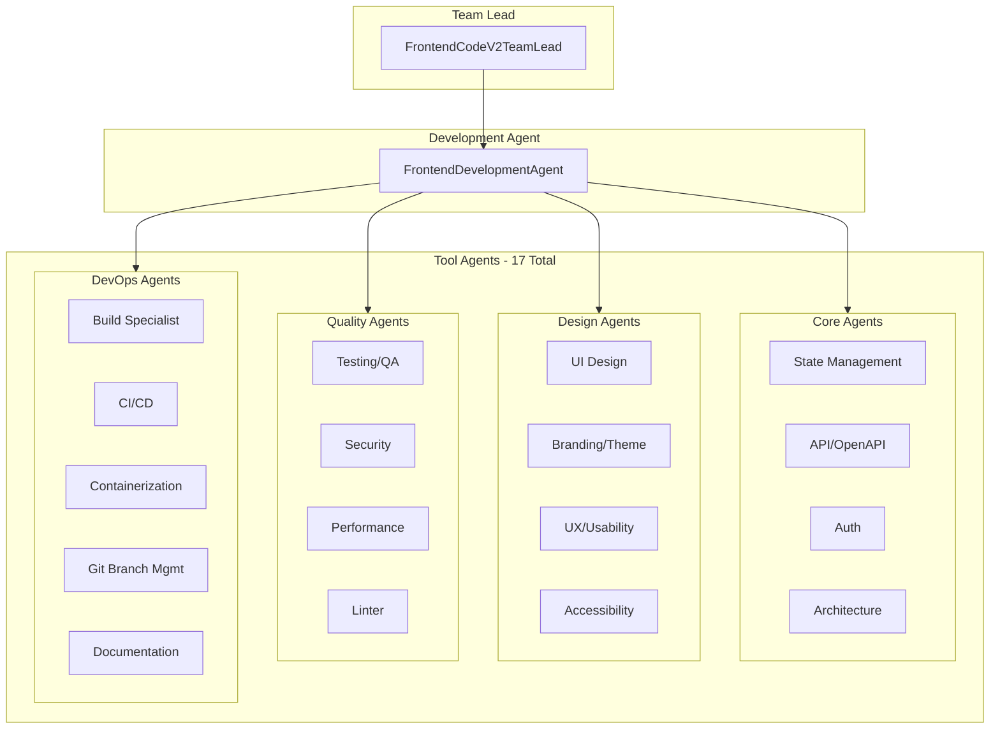
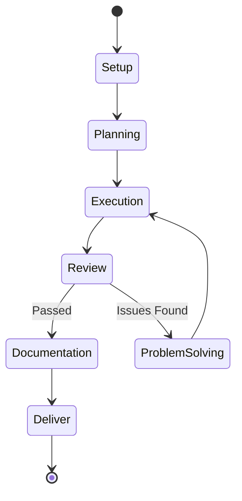

# Frontend Code V2 Team

The Frontend Code V2 Team is a standalone frontend development system that produces production-ready UI code through a 7-phase workflow with 17 specialized tool agents.

## Architecture



### Two-Layer Structure

| Layer | Component | Responsibility |
|-------|-----------|----------------|
| Team Lead | `FrontendCodeV2TeamLead` | Setup phase (repo init, branching), delegates to Development Agent |
| Development Agent | `FrontendDevelopmentAgent` | Executes 5-phase cycle (Planning → Execution → Review → Problem-solving → Deliver) |

## Workflow Phases



### Phase Details

| Phase | Purpose | Output |
|-------|---------|--------|
| **Setup** | Initialize repo, create branches, base README | `SetupResult` |
| **Planning** | Generate microtasks from spec, identify components | `PlanningResult` with microtasks |
| **Execution** | Route microtasks to tool agents, produce code | `ExecutionResult` with files |
| **Review** | Code review, accessibility, performance, security | `ReviewResult` with issues |
| **Problem Solving** | Apply fixes for review issues | `ProblemSolvingResult` |
| **Documentation** | Component docs, Storybook, README updates | `DocumentationPhaseResult` |
| **Deliver** | Commit, merge to main branch | `DeliverResult` |

The Review → Problem Solving → Execution cycle repeats up to 5 times until review passes.

## Tool Agents (17 Total)

### Core Development

| Agent | Tasks | Review Focus |
|-------|-------|--------------|
| **State Management** | Redux, Zustand, Context setup | State architecture |
| **API/OpenAPI** | API client generation, type definitions | API contract compliance |
| **Auth** | Login/logout UI, token handling, protected routes | Auth flow security |
| **Architecture** | Component structure, module organization | Code organization |

### Design & UX

| Agent | Tasks | Review Focus |
|-------|-------|--------------|
| **UI Design** | Components, layouts, responsive design | Visual consistency |
| **Branding/Theme** | Theme config, colors, typography, design tokens | Brand compliance |
| **UX/Usability** | User flows, interactions, error handling | Usability best practices |
| **Accessibility** | ARIA labels, keyboard nav, screen reader support | WCAG 2.2 compliance |

### Quality & Performance

| Agent | Tasks | Review Focus |
|-------|-------|--------------|
| **Testing/QA** | Unit tests, component tests, E2E tests | Test coverage |
| **Security** | XSS prevention, CSP, input sanitization | Frontend security |
| **Performance** | Code splitting, lazy loading, bundle optimization | Core Web Vitals |
| **Linter** | ESLint/Prettier config, code formatting | Code style |

### DevOps & Infrastructure

| Agent | Tasks | Review Focus |
|-------|-------|--------------|
| **Build Specialist** | Webpack/Vite config, build optimization | Build performance |
| **CI/CD** | GitHub Actions, deployment pipelines | Pipeline reliability |
| **Containerization** | Dockerfile, nginx config | Container best practices |
| **Git Branch Management** | Branch creation, commits, merges | - |
| **Documentation** | Component docs, README, Storybook stories | Doc completeness |

## Microtask System

Work is broken into discrete microtasks during the Planning phase:

```python
class Microtask(BaseModel):
    id: str              # Unique kebab-case ID, e.g. "mt-add-login-component"
    title: str           # Short human-readable title
    description: str     # What needs to be done
    tool_agent: ToolAgentKind  # Which agent handles this
    status: MicrotaskStatus    # pending, in_progress, completed, etc.
    depends_on: List[str]      # Prerequisite microtask IDs
    output_files: Dict[str, str]  # Files produced (path → content)
    notes: str           # Agent recommendations
```

## Usage

### Programmatic

```python
from shared.llm import LLMClient
from frontend_code_v2_team.orchestrator import FrontendCodeV2TeamLead
from pathlib import Path

llm = LLMClient()
lead = FrontendCodeV2TeamLead(llm)

result = lead.run_workflow(
    task_id="task-001",
    task_title="User Dashboard",
    task_description="Build dashboard with charts, user profile, and settings...",
    repo_path=Path("/path/to/repo"),
    framework="angular",  # or "react", "vue"
)

if result.success:
    print(f"Frontend complete: {result.summary}")
    print(f"Files created: {list(result.final_files.keys())}")
else:
    print(f"Failed: {result.failure_reason}")
```

### With Job Updates

```python
def update_job(**kwargs):
    print(f"Progress: {kwargs.get('progress', 0)}%")
    print(f"Phase: {kwargs.get('current_phase', 'unknown')}")

result = lead.run_workflow(
    task_id="task-001",
    task_title="Login Page",
    task_description="Modern login with OAuth options",
    repo_path=repo_path,
    job_updater=update_job,
)
```

## Framework Support

The team supports multiple frontend frameworks:

| Framework | Version | Features |
|-----------|---------|----------|
| **Angular** | 17+ | Standalone components, signals, new control flow |
| **React** | 18+ | Hooks, Server Components, Suspense |
| **Vue** | 3+ | Composition API, `<script setup>` |

Framework is auto-detected from existing code or specified in task description.

## Accessibility Standards

The Accessibility agent enforces WCAG 2.2 compliance:

| Level | Requirements |
|-------|-------------|
| **A** | Basic accessibility (required) |
| **AA** | Enhanced accessibility (default target) |
| **AAA** | Highest level (when requested) |

Checks include:
- Semantic HTML structure
- ARIA attributes and roles
- Keyboard navigation
- Color contrast ratios
- Focus management
- Screen reader compatibility

## Output Files

The workflow produces files in `{repo_path}/frontend/`:

```
frontend/
├── src/
│   ├── app/
│   │   ├── components/     # UI components
│   │   ├── pages/          # Page components
│   │   ├── services/       # API services
│   │   ├── store/          # State management
│   │   ├── utils/          # Utilities
│   │   └── styles/         # Global styles
│   ├── assets/             # Static assets
│   └── environments/       # Environment configs
├── tests/
│   ├── unit/
│   ├── component/
│   └── e2e/
├── .storybook/             # Storybook config
├── Dockerfile
├── nginx.conf
├── package.json
├── tsconfig.json
└── README.md
```

## Configuration

| Variable | Description | Default |
|----------|-------------|---------|
| `MAX_REVIEW_ITERATIONS` | Max review → problem-solving cycles | 100 |

## Directory Structure

```
frontend_code_v2_team/
├── orchestrator.py        # FrontendCodeV2TeamLead, FrontendDevelopmentAgent
├── models.py              # Phase, Microtask, all result models
├── prompts.py             # LLM prompts for phases
├── output_templates.py    # Code templates
├── phases/
│   ├── setup.py           # Repo initialization
│   ├── planning.py        # Microtask generation
│   ├── execution.py       # Run microtasks via tool agents
│   ├── review.py          # Code review, a11y, performance
│   ├── problem_solving.py # Fix issues
│   ├── documentation.py   # Add docs, Storybook
│   └── deliver.py         # Commit and merge
└── tool_agents/
    ├── state_management/  # State management setup
    ├── auth/              # Auth UI components
    ├── api_openapi/       # API client generation
    ├── architecture/      # Component architecture
    ├── ui_design/         # UI components
    ├── branding_theme/    # Theme and design tokens
    ├── ux_usability/      # UX improvements
    ├── accessibility/     # WCAG compliance
    ├── testing_qa/        # Tests
    ├── security/          # Frontend security
    ├── performance/       # Performance optimization
    ├── linter/            # Code linting
    ├── build_specialist/  # Build configuration
    ├── cicd/              # CI/CD pipelines
    ├── containerization/  # Docker
    ├── git_branch_management/  # Git operations
    └── documentation/     # Documentation
```

## Integration with SE Team

Frontend Code V2 is called by the main Software Engineering Team orchestrator for frontend tasks:

1. SE Team receives a task classified as "frontend"
2. Task is delegated to `FrontendCodeV2TeamLead`
3. Frontend V2 completes the 7-phase workflow
4. Results are returned to SE Team orchestrator
5. SE Team proceeds with integration, DevOps, etc.

## Strands platform

This package is part of the [Strands Agents](../../../../README.md) monorepo (Unified API, Angular UI, and full team index).
