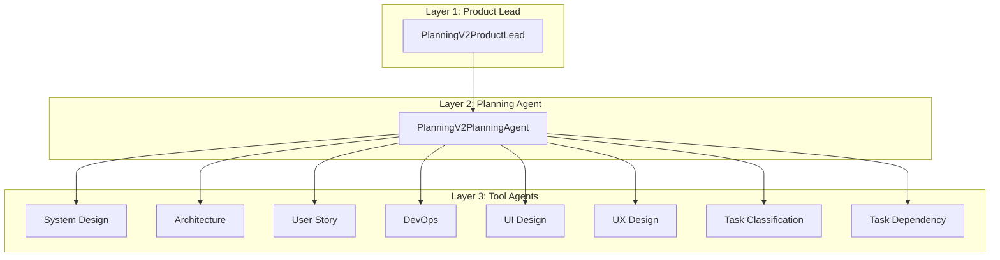
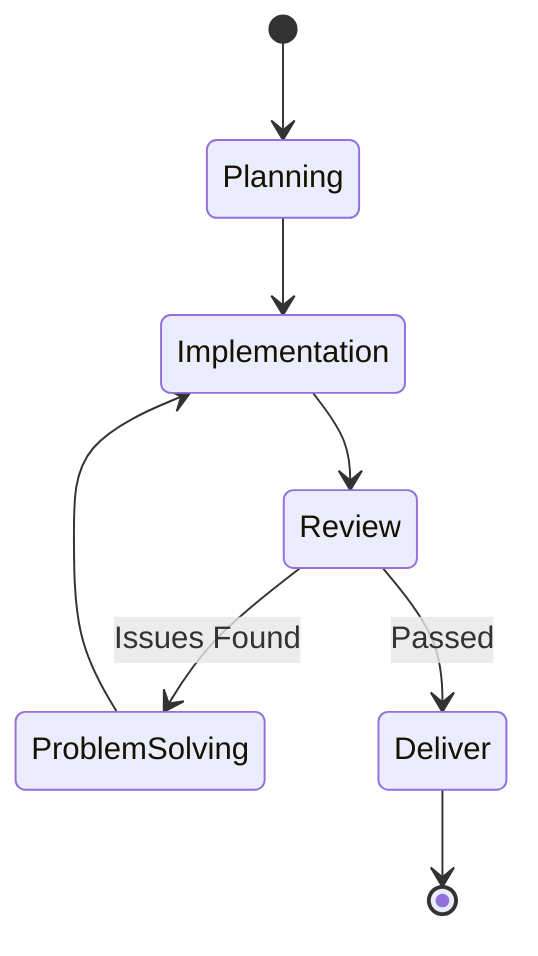

# Planning V2 Team

The Planning V2 Team is a standalone 3-layer planning system that produces comprehensive project plans from **pre-validated specifications**. It uses 8 specialized tool agents organized across 5 workflow phases.

**Important:** This team expects to receive a complete, validated specification that requires no expansion or clarification. Use the Product Requirements Analysis agent or similar upstream process to validate specs before passing them to Planning V2. The team will not expand or clarify the specification.

## Architecture



### Three-Layer Structure

| Layer | Component | Responsibility |
|-------|-----------|----------------|
| 1 | `PlanningV2ProductLead` | Spec intake, inspiration handling, optional Product Analysis integration |
| 2 | `PlanningV2PlanningAgent` | Orchestrates tool agents across 5 phases |
| 3 | Tool Agents (8) | Specialized planning tasks (design, architecture, stories, etc.) |

## Workflow Phases



### Phase Details

| Phase | Purpose | Tool Agents Involved |
|-------|---------|---------------------|
| **Planning** | Generate high-level design, architecture, milestones | System Design, Architecture, User Story, DevOps, UI Design |
| **Implementation** | Create detailed task breakdown, user stories, file structure | All 8 agents |
| **Review** | Verify consistency, completeness, spec alignment | System Design, Architecture, User Story, Task Dependency |
| **Problem Solving** | Resolve issues identified in review | System Design, Architecture, User Story |
| **Deliver** | Finalize plan, commit artifacts | System Design, Architecture, User Story |

The Review → Problem Solving → Implementation cycle repeats up to 5 times until review passes.

## Tool Agents

| Agent | Phases | Purpose |
|-------|--------|---------|
| **System Design** | All | Overall system architecture and component design |
| **Architecture** | All | Technical architecture, patterns, infrastructure |
| **User Story** | Planning, Implementation, Review, Problem Solving, Deliver | User stories, acceptance criteria |
| **DevOps** | Planning, Implementation | CI/CD, deployment, infrastructure-as-code |
| **UI Design** | Planning, Implementation | Visual design, component library, styling |
| **UX Design** | Implementation | User experience, flows, accessibility |
| **Task Classification** | Implementation | Categorize tasks by type (frontend, backend, devops, etc.) |
| **Task Dependency** | Review | Analyze dependencies between tasks |

## Usage

### Programmatic

```python
from shared.llm import LLMClient
from planning_v2_team.orchestrator import PlanningV2ProductLead
from pathlib import Path

llm = LLMClient()
lead = PlanningV2ProductLead(llm)

result = lead.run_workflow(
    spec_content="# My Project\n\nDescription of what to build...",
    repo_path=Path("/path/to/repo"),
    inspiration_content="Optional moodboard or reference content",
    use_product_analysis=True,  # Optional: run Product Analysis first
)

if result.success:
    print(f"Planning complete: {result.summary}")
    print(f"Final spec: {result.final_spec_content}")
else:
    print(f"Planning failed: {result.failure_reason}")
```

### With Job Updates

```python
def update_job(**kwargs):
    print(f"Progress: {kwargs.get('progress', 0)}%")
    print(f"Phase: {kwargs.get('current_phase', 'unknown')}")
    print(f"Status: {kwargs.get('status_text', '')}")

result = lead.run_workflow(
    spec_content=spec,
    repo_path=repo,
    job_updater=update_job,
    job_id="job-123",
)
```

## Output Artifacts

The workflow creates/updates files in `{repo_path}/plan/`:

| File | Content |
|------|---------|
| `product_spec.md` | Final validated specification |
| `architecture.md` | System architecture document |
| `tech_stack.md` | Technology choices and rationale |
| `file_structure.md` | Project file/folder layout |
| `user_stories.md` | Complete user stories |
| `task_breakdown.md` | Task hierarchy (Initiatives → Epics → Stories → Tasks) |
| `devops_plan.md` | CI/CD and deployment strategy |
| `ui_design.md` | UI/UX design guidelines |

## Models

### Phase Results

```python
PlanningPhaseResult   # Goals, architecture, milestones, dependencies
ImplementationPhaseResult  # Assets created/updated
ReviewPhaseResult     # Pass/fail with issues
ProblemSolvingPhaseResult  # Fixes applied
DeliverPhaseResult    # Final spec content
```

### Workflow Result

```python
class PlanningV2WorkflowResult(BaseModel):
    success: bool
    current_phase: Optional[Phase]
    summary: str
    failure_reason: str
    planning_result: Optional[PlanningPhaseResult]
    implementation_result: Optional[ImplementationPhaseResult]
    review_result: Optional[ReviewPhaseResult]
    problem_solving_result: Optional[ProblemSolvingPhaseResult]
    deliver_result: Optional[DeliverPhaseResult]
    user_answers: Dict[str, Any]
    final_spec_content: Optional[str]
```

## Configuration

| Variable | Description | Default |
|----------|-------------|---------|
| `MAX_REVIEW_ITERATIONS` | Max review → problem-solving cycles | 100 |

## Directory Structure

```
planning_v2_team/
├── orchestrator.py        # PlanningV2ProductLead, PlanningV2PlanningAgent
├── models.py              # Phase, ToolAgentKind, all result models
├── prompts.py             # LLM prompts for phases
├── phases/
│   ├── planning.py        # Planning phase
│   ├── implementation.py  # Implementation phase
│   ├── review.py          # Review phase
│   ├── problem_solving.py # Problem-solving phase
│   └── deliver.py         # Deliver phase
└── tool_agents/
    ├── system_design/     # System Design tool agent
    ├── architecture/      # Architecture tool agent
    ├── user_story/        # User Story tool agent
    ├── devops/            # DevOps tool agent
    ├── ui_design/         # UI Design tool agent
    ├── ux_design/         # UX Design tool agent
    ├── task_classification/  # Task Classification tool agent
    └── task_dependency/   # Task Dependency tool agent
```

## Integration with SE Team

Planning V2 can be integrated with the Software Engineering Team orchestrator:

1. SE Team receives a job request
2. Product Requirements Analysis validates the spec
3. If `use_planning_v2=True`, delegates to Planning V2
4. Planning V2 produces artifacts in `plan/`
5. SE Team reads plan and proceeds to execution

**Note:** The specification must be validated before passing to Planning V2. The team does not perform spec review or expansion.

## Strands platform

This package is part of the [Strands Agents](../../../../README.md) monorepo (Unified API, Angular UI, and full team index).
