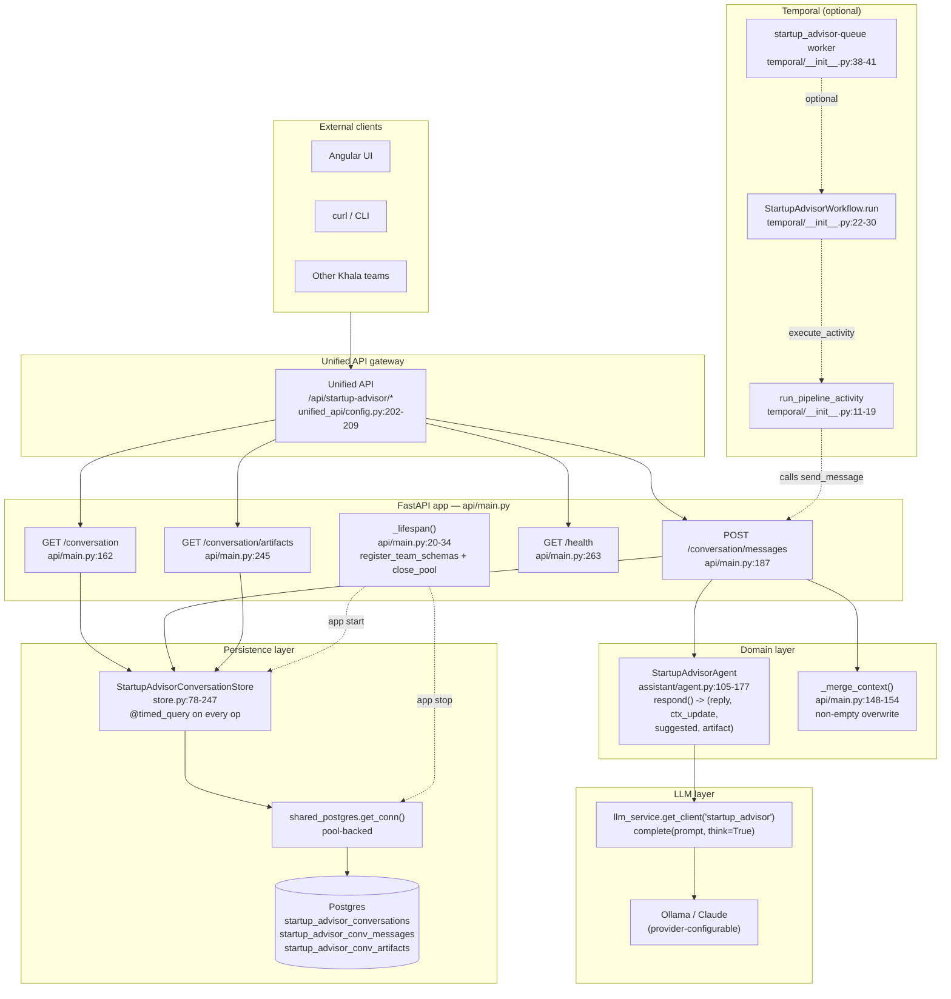

# Startup Advisor — Architecture

## Overview

The startup advisor is a **probing-dialogue advisory service**: it
talks to a founder, asks one to three focused questions at a time,
accumulates structured facts about the startup, and — once it has
gathered enough context on a topic — produces a structured artifact
(action plan, GTM strategy, fundraising brief, etc.).

Unlike the larger teams in the Khala monorepo (software engineering,
branding, investment), it is intentionally small:

1. **No orchestrator module.** The FastAPI route handler
   `send_message` (`api/main.py:187-242`) is the entire coordination
   layer. It calls the store, calls the single specialist agent, and
   writes the results back.
2. **One specialist agent.** `StartupAdvisorAgent`
   (`assistant/agent.py:105-177`) is the only domain agent in the
   team. It talks to an LLM through `llm_service.get_client` with
   `think=True` (chain-of-thought) and returns a JSON object the
   handler decodes.
3. **Singleton conversation.** Exactly one conversation row lives in
   `startup_advisor_conversations` per deployment. Every request
   resolves the conversation through `get_or_create_singleton`
   (`store.py:231-247`) rather than accepting a `conversation_id`
   path parameter.

## Architectural principles

- **Single persistent conversation per deployment.**
  `get_or_create_singleton()` in `store.py:231-247` returns the
  oldest row by `created_at`, creating one if the table is empty.
  The four endpoints in `api/main.py` all start from this singleton
  rather than accepting a `conversation_id`. This is a deliberate
  product choice — the advisor is modelled as a long-running
  coaching relationship, not as one-shot sessions.
- **Stateless store backed by a connection pool.**
  `StartupAdvisorConversationStore.__init__` takes no arguments and
  holds no state (`store.py:88-90`). Every method opens a
  short-lived connection through `shared_postgres.get_conn()`
  (`store.py:29`), which is pool-backed, and each method is wrapped
  in `@timed_query` so slow reads and writes surface as structured
  log lines (`store.py:92,105,132,156,167,186,206,230`).
- **Structured-output LLM contract.** The agent does not return
  free text. `SYSTEM_PROMPT` in `assistant/agent.py:16-72` instructs
  the model to emit a JSON object with four fields (`reply`,
  `context_update`, `suggested_questions`, `artifact`), and
  `_parse_response` in `assistant/agent.py:87-102` decodes it with
  a markdown-fence-stripping regex. This is what lets a single HTTP
  response carry both the chat reply and the side-effects (context
  delta + optional artifact).
- **Non-empty-only context merge.** `_merge_context` in
  `api/main.py:148-154` only overwrites an existing key when the
  new value is neither `None` nor the empty string. This prevents a
  noisy LLM turn from wiping facts that have already been
  established earlier in the conversation.
- **Graceful LLM fallback.** If `self._llm.complete` raises, the
  agent catches the exception, logs it, and returns a hard-coded
  reply with three canned probing questions and no context update
  (`assistant/agent.py:146-164`). The founder never sees a 500.
- **Observability wired in at every layer.** The FastAPI app calls
  `init_otel(service_name="startup-advisor", team_key="startup_advisor")`
  at import time and `instrument_fastapi_app` once the app object
  exists (`api/main.py:17,43`). Every store method carries a
  `@timed_query(store=_STORE, op=...)` decorator
  (`store.py:92,105,132,156,167,186,206,230`).
- **Optional Temporal mode.** `temporal/__init__.py:38-41` starts a
  `startup_advisor-queue` worker only when
  `shared_temporal.is_temporal_enabled()` returns true (i.e. when
  `TEMPORAL_ADDRESS` is set). The team works identically in thread
  mode without Temporal.
- **Lazy module-level singletons.** Both the store
  (`store.py:254-266`) and the agent (`assistant/agent.py:170-177`)
  are instantiated on first use through module-level
  `get_conversation_store()` / `get_advisor_agent()` helpers. The
  FastAPI handlers never import them eagerly — they go through
  `_get_store` / `_get_agent` (`api/main.py:108-117`) so
  `import startup_advisor.api.main` stays cheap and never touches
  Postgres or the LLM at import time.

## Component diagram

## Key design decisions

### 1. Singleton conversation instead of per-session IDs

**Decision.** The team exposes `GET /conversation`,
`POST /conversation/messages`, and `GET /conversation/artifacts`
with no `conversation_id` path parameter. Internally, every call
resolves the single row via `get_or_create_singleton`
(`store.py:231-247`, called from `api/main.py:166,193,249`).

**Why.** The product is modelled as a long-lived coaching
relationship. A founder returning a week later should land back in
the same conversation with the advisor still remembering stage,
team size, runway, and prior artifacts. Exposing session IDs would
add client-side state (cookies, local storage) for no product
benefit.

**Trade-off.** This means the store layer still supports multiple
conversations (`create`, `list_conversations`, `get(conversation_id)`
in `store.py:92-103,207-228`) but the API intentionally surfaces
only one. If a multi-tenant deployment is needed later, the API
layer is the only thing that has to change.

### 2. JSON-structured LLM output (reply + side-effects)

**Decision.** `SYSTEM_PROMPT` in `assistant/agent.py:53-72`
mandates a JSON object with `reply`, `context_update`,
`suggested_questions`, and `artifact`. `_parse_response` in
`assistant/agent.py:87-102` strips markdown fencing and decodes it;
on decode failure it falls back to returning the raw text as
`reply` and empty defaults for the other three fields.

**Why.** A single LLM round trip has to carry three distinct
side-effects: the chat reply that the UI renders, the structured
facts to merge into the persistent context, and an optional
artifact to persist and display. Parsing them out of one JSON
object is cheaper and more reliable than making three separate
calls or asking the LLM to emit a custom delimiter format.

### 3. Non-empty-only context merge

**Decision.** `_merge_context` in `api/main.py:148-154` iterates
over the update dict and only writes back keys whose value is
neither `None` nor `""`.

**Why.** LLMs intermittently emit partial `context_update` dicts
with empty strings for keys they have "no update for". Without
the filter, a later turn could wipe `startup_name` or
`target_audience` that were established five turns earlier. The
filter is the defence against that.

### 4. No orchestrator module

**Decision.** Unlike the software engineering team (with a
`TeamLead`) or branding team (with a 5-phase orchestrator class),
the startup advisor has no separate orchestration layer. The
FastAPI handler `send_message` directly sequences the store +
agent calls (`api/main.py:187-242`).

**Why.** There is only one agent, no phase gates, no fan-out, and
no human-in-the-loop gate. A dedicated orchestrator would add a
layer of indirection without carrying any logic. The team can
grow into one later if a second specialist agent is added; for
now the handler is the orchestrator.

### 5. Lazy singletons for store and agent

**Decision.** `_get_store` and `_get_agent` (`api/main.py:108-117`)
import and resolve the module-level helpers
`get_conversation_store()` (`store.py:257-266`) and
`get_advisor_agent()` (`assistant/agent.py:173-177`) on first call.

**Why.** Deferred import keeps `import startup_advisor.api.main`
free of Postgres handshakes and LLM client construction. That
matters for test collection, for the unified API boot path
(which imports every team module eagerly), and for the Temporal
activity which re-imports `send_message` on every invocation
(`temporal/__init__.py:13`).

### 6. Optional Temporal wrapper reusing `send_message`

**Decision.** The Temporal activity
`run_pipeline_activity` (`temporal/__init__.py:11-19`) simply
deserializes the request into `SendMessageRequest`, calls
`send_message(req)`, and serializes the result via
`model_dump()`. The workflow executes that single activity with
a 30-minute `start_to_close_timeout`
(`temporal/__init__.py:22-30`).

**Why.** The team has no long-running compute, no phases, and no
retries that require Temporal's durability. The wrapper exists
only so the team can be driven through a Temporal workflow
alongside other teams in the monorepo — there is no separate
Temporal code path, and the thread-mode handler remains the
canonical implementation.
