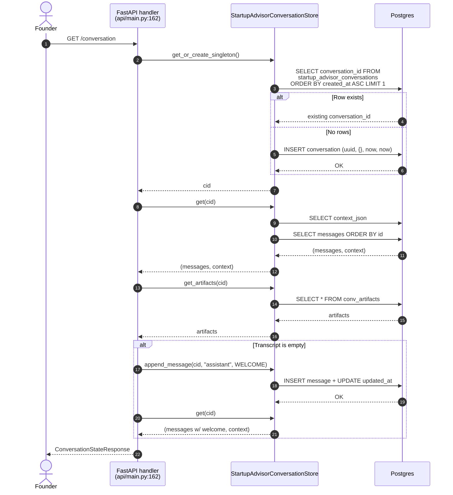
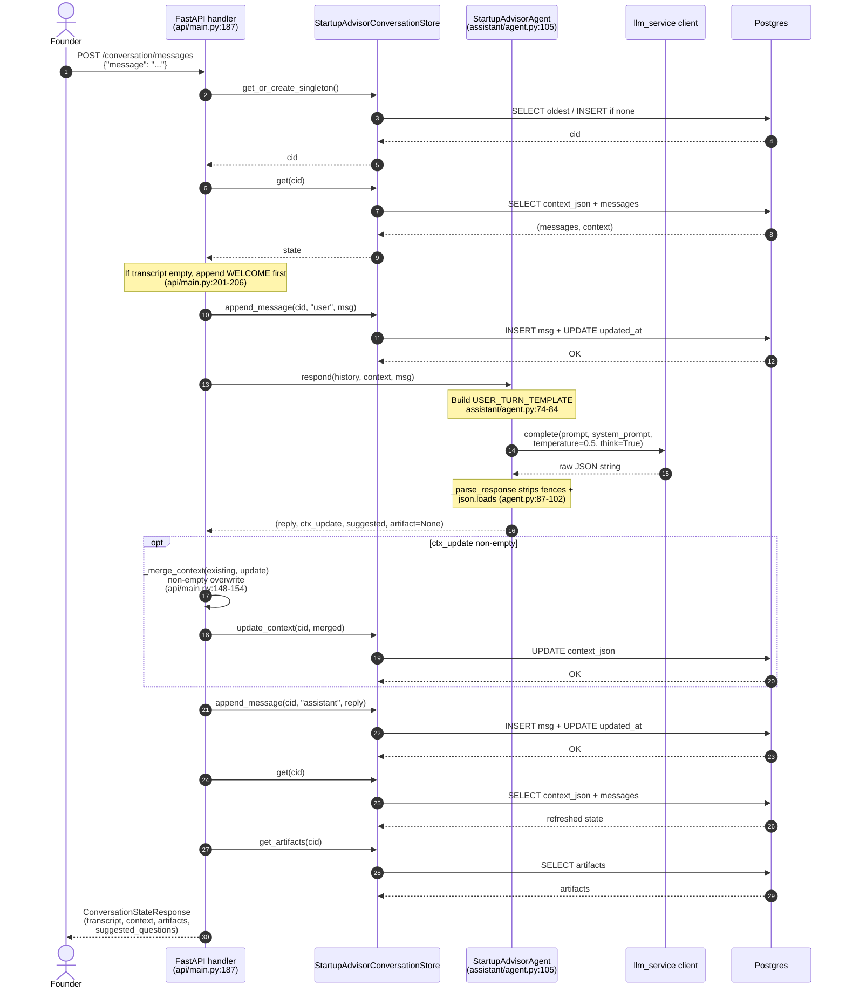
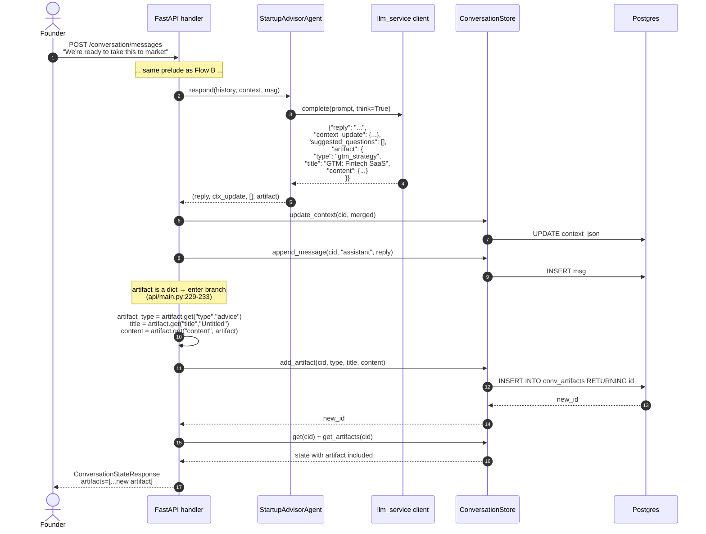
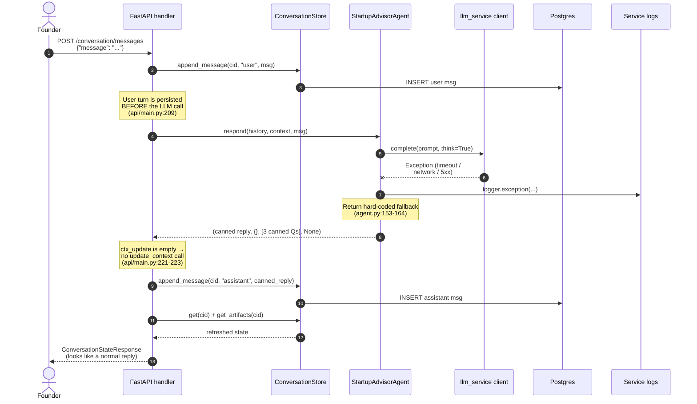
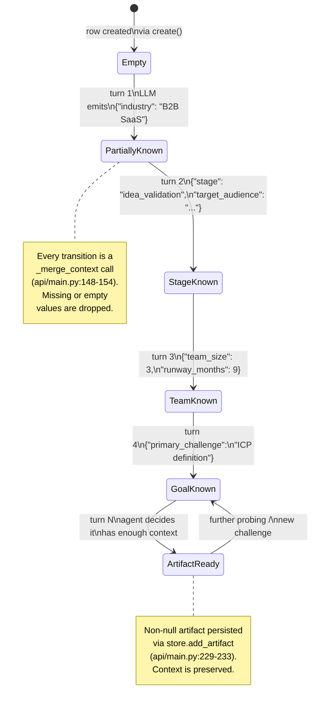
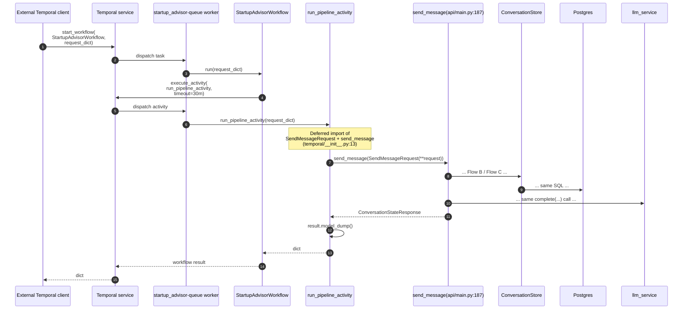
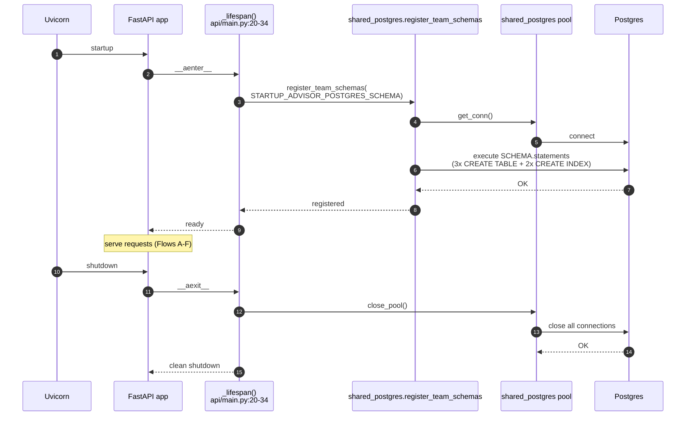

# Startup Advisor — Flow Charts

Sequence diagrams and state charts for every runtime path in the
startup advisor team. Each diagram is citation-linked to the source
file + line range that implements the flow.

## Flow A — Get or create conversation

Entry point: `GET /api/startup-advisor/conversation` →
`get_or_create_conversation` at `api/main.py:162-184`.

The welcome-insertion branch at `api/main.py:175-180` only runs on
the very first call after the row has just been created.
`_DEFAULT_SUGGESTED` (`api/main.py:101-105`) is returned as the
`suggested_questions` array whenever the transcript has 0 or 1
entries.

---

## Flow B — Probing dialogue turn (no artifact)

Entry point: `POST /api/startup-advisor/conversation/messages` →
`send_message` at `api/main.py:187-242`. This is the hot path for
UC-2.

Key code references:

- User-turn persistence before the LLM call (`api/main.py:209`) —
  guarantees the message is stored even if the LLM call later
  raises (see Flow D).
- Transcript assembly (`api/main.py:212-213`) includes the new
  user message so the LLM sees it as part of history.
- Reload + artifact fetch after the LLM response
  (`api/main.py:236-240`) — the response always reflects the
  latest persisted state.

---

## Flow C — Turn that yields an artifact

Same handler (`api/main.py:187-242`), highlighting the
`add_artifact` branch at `api/main.py:229-233`.

Note that the artifact payload is stored as `JSONB` and is
free-form: the store accepts any dict shape
(`store.py:167-184`) and the API returns it verbatim through
`ArtifactResponse.payload`.

---

## Flow D — LLM failure fallback

Triggered inside `StartupAdvisorAgent.respond` at
`assistant/agent.py:146-164`. This is UC-5.

The founder sees a normal reply with three canned probing
questions. The failure is visible only in service logs via
`logger.exception("LLM call failed for startup advisor")`.

---

## Flow E — Context accumulation state chart

Shows how the JSON `context` field on
`startup_advisor_conversations` evolves turn by turn. The merge
strategy is at `api/main.py:148-154`: non-empty values overwrite,
`None` / `""` are ignored.

The context JSON is replaced, not patched, at the database level —
`update_context` writes the full merged dict in one statement
(`store.py:156-165`). The non-empty filter lives in the handler,
not the store, so tests can drive the store with full-overwrite
semantics directly.

---

## Flow F — Temporal workflow path (optional)

Only active when `is_temporal_enabled()` is true. Code lives in
`temporal/__init__.py:11-41`.

The Temporal path is a thin wrapper — no alternate SQL, no
alternate agent, no alternate context merge. If you need to trace a
Temporal-triggered message, the breakpoints are the same ones used
for Flow B / Flow C.

---

## Flow G — Startup & shutdown lifespan

`_lifespan` at `api/main.py:20-34` wraps the FastAPI app.

Both the registration and the pool close are wrapped in
`try/except`: registration failure logs via `logger.exception` but
still yields so the app starts (`api/main.py:26-28`), and pool
close failure is logged at `warning` level only
(`api/main.py:33-34`). The team never crashes its own lifespan.

Separately, at module import time, `init_otel` is called at
`api/main.py:17` and `instrument_fastapi_app(app,
team_key="startup_advisor")` at `api/main.py:43` — these happen
before the lifespan runs and do not block on Postgres.

If Temporal is enabled, the `startup_advisor-queue` worker also
starts at import time via
`start_team_worker("startup_advisor", WORKFLOWS, ACTIVITIES,
task_queue="startup_advisor-queue")` in
`temporal/__init__.py:38-41`. This is independent of the FastAPI
lifespan.
