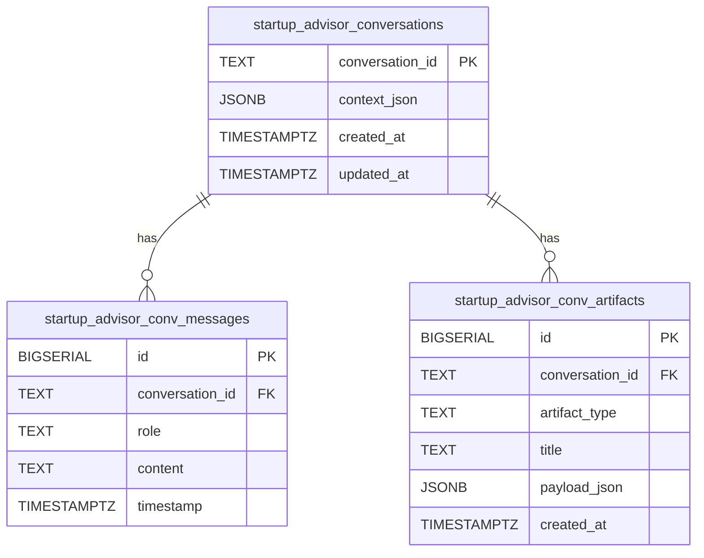

# Startup Advisor — System Design

This document describes the internal structure of the startup advisor
team: module layout, domain model, API surface, persistence schema,
LLM integration, runtime modes, and configuration.

## Module layout

```
backend/agents/startup_advisor/
├── README.md                     # User-facing operational reference (3 lines)
├── __init__.py                   # Empty module init
├── api/
│   ├── __init__.py
│   └── main.py                   # FastAPI app, 4 endpoints, request/response models
├── assistant/
│   ├── __init__.py
│   └── agent.py                  # StartupAdvisorAgent + system prompt + JSON parser
├── postgres/
│   └── __init__.py               # TeamSchema (3 tables + 2 indexes)
├── store.py                      # StartupAdvisorConversationStore (Postgres DAL)
├── temporal/
│   └── __init__.py               # StartupAdvisorWorkflow + run_pipeline_activity
├── system_design/                # This folder
│   ├── README.md
│   ├── architecture.md
│   ├── system_design.md
│   ├── use_cases.md
│   └── flow_charts.md
└── tests/
    ├── __init__.py
    └── test_store.py             # Store unit tests with a fake psycopg cursor
```

## Domain model

The team uses three layers of data models. All three are deliberately
thin: there is no ORM and no domain service layer between them.

### API-layer Pydantic models (`api/main.py:51-88`)

| Model | Line | Purpose |
|---|---|---|
| `CreateConversationRequest` | 51-54 | Unused reserve shape (no endpoint currently consumes it; kept for a possible future "new session" endpoint). |
| `SendMessageRequest` | 57-58 | Single required field `message: str` with `min_length=1`. |
| `ConversationMessageResponse` | 61-64 | One turn in the transcript: `role`, `content`, `timestamp` (ISO-8601). |
| `ArtifactResponse` | 67-72 | A generated deliverable: `artifact_id`, `artifact_type`, `title`, `payload` (free-form dict), `created_at`. |
| `ConversationStateResponse` | 75-80 | Full state returned from every turn: `conversation_id`, `messages[]`, `context` (accumulated founder facts), `artifacts[]`, `suggested_questions[]`. |
| `ConversationSummaryResponse` | 83-87 | Reserve shape mirroring the store-layer `ConversationSummary`. |

### Store-layer dataclasses (`store.py:54-75`)

| Model | Line | Purpose |
|---|---|---|
| `StoredMessage` | 54-58 | Row projection from `startup_advisor_conv_messages` (`role`, `content`, `timestamp`). |
| `StoredArtifact` | 61-67 | Row projection from `startup_advisor_conv_artifacts` (`artifact_id`, `artifact_type`, `title`, `payload`, `created_at`). |
| `ConversationSummary` | 70-75 | Projection used by `list_conversations()` — `conversation_id`, `created_at`, `updated_at`, `message_count`. |

`_row_ts` at `store.py:41-51` normalises a psycopg `datetime` to
ISO-8601 so the public dataclass contract always exposes timestamps
as strings.

### LLM-layer JSON contract (`assistant/agent.py:53-72,87-102`)

Every call to `StartupAdvisorAgent.respond` expects the LLM to emit
exactly this shape:

```json
{
  "reply": "<conversational response>",
  "context_update": {"startup_name": "Acme", "stage": "mvp", "team_size": 3},
  "suggested_questions": ["<up to 3 follow-up prompts>"],
  "artifact": null
}
```

When `artifact` is non-null it must be a dict of the form
`{"type": "<artifact_type>", "title": "<short title>", "content": {...}}`.
`_parse_response` (`assistant/agent.py:87-102`) strips markdown
code fences before decoding and, on decode failure, returns the raw
text as `reply` plus empty defaults so the handler never has to
special-case malformed LLM output.

The **context keys** the prompt instructs the model to extract
(`assistant/agent.py:63-67`): `startup_name`, `stage`, `industry`,
`target_audience`, `team_size`, `revenue`, `runway_months`,
`primary_challenge`, `business_model`, `competitors`,
`traction_metrics`, `funding_status`, plus any other structured facts
the founder shares.

## API surface

All endpoints are mounted under `/api/startup-advisor` via the Unified
API. The `TeamConfig` entry lives at
`backend/unified_api/config.py:202-209`.

| Method | Path | Request | Response | File / line | Description |
|---|---|---|---|---|---|
| GET | `/conversation` | — | `ConversationStateResponse` | `api/main.py:162-184` | Resolve the singleton conversation, creating it and inserting the welcome message if the row is empty. Returns the default suggested questions when the transcript has 0 or 1 messages. |
| POST | `/conversation/messages` | `SendMessageRequest` | `ConversationStateResponse` | `api/main.py:187-242` | Append the user message, call the advisor agent, merge context updates, persist the reply + optional artifact, and return the refreshed state. |
| GET | `/conversation/artifacts` | — | `list[ArtifactResponse]` | `api/main.py:245-260` | List every artifact generated on the singleton conversation, ordered by insertion `id`. |
| GET | `/health` | — | `dict[str, str]` | `api/main.py:263-265` | Liveness probe — returns `{"status": "ok"}`. |

The welcome message body (`_WELCOME_MESSAGE` at
`api/main.py:94-99`) and the default starter prompts
(`_DEFAULT_SUGGESTED` at `api/main.py:101-105`) are module-level
constants rather than LLM output so that a brand-new conversation is
bootstrapped deterministically without touching the LLM.

## Persistence layer

### Schema (`postgres/__init__.py:11-46`)

Three tables plus two indexes. The DDL is registered by the FastAPI
lifespan via `shared_postgres.register_team_schemas(SCHEMA)`
(`api/main.py:20-28`) and the team registers its `TeamSchema`
constant at module-import time so the schema registry stays pure
data (Pattern B in the `shared_postgres` README).



Indexes:

- `idx_startup_advisor_conv_messages_conv` on
  `startup_advisor_conv_messages(conversation_id)`
  (`postgres/__init__.py:28-29`).
- `idx_startup_advisor_conv_artifacts_conv` on
  `startup_advisor_conv_artifacts(conversation_id)`
  (`postgres/__init__.py:38-39`).

Note that there are no declared foreign-key constraints: the
relationship is enforced in application code via `append_message`,
which checks the parent row exists before inserting
(`store.py:138-144`).

### Store public API (`store.py:78-247`)

| Method | Line | SQL | Notes |
|---|---|---|---|
| `create(conversation_id=None, context=None)` | 92-103 | INSERT conversation with UUID, empty JSONB context, UTC timestamps | Accepts an explicit id for tests; returns the id. |
| `get(conversation_id)` | 105-130 | SELECT context_json + SELECT messages ORDER BY id | Returns `(messages, context)` or `None`. |
| `append_message(conversation_id, role, content)` | 132-154 | INSERT into messages + UPDATE `updated_at` | Rejects unknown roles (only `user`, `assistant`); returns `False` if parent row missing. |
| `update_context(conversation_id, context)` | 156-165 | UPDATE `context_json` + `updated_at` | Replaces the full context JSON. |
| `add_artifact(conversation_id, artifact_type, title, payload)` | 167-184 | INSERT RETURNING id | Returns the new artifact row id as `int`. |
| `get_artifacts(conversation_id)` | 186-204 | SELECT all artifacts ORDER BY id | Returns `list[StoredArtifact]`. |
| `list_conversations()` | 206-228 | LEFT JOIN count ORDER BY `updated_at` DESC | Returns `list[ConversationSummary]`; used by tooling, not the API. |
| `get_or_create_singleton()` | 230-247 | SELECT oldest by `created_at` LIMIT 1; CREATE if empty | The entry point used by every API handler. |

Every method is wrapped in `@timed_query(store="startup_advisor",
op=...)` from `shared_postgres.metrics`
(`store.py:92,105,132,156,167,186,206,230`) so slow queries are
logged as structured JSON without needing a Prometheus exporter.

### Lazy singleton (`store.py:254-266`)

`get_conversation_store()` returns a process-wide
`StartupAdvisorConversationStore` instance. The store holds no
state; the singleton exists purely to give callers a stable
identity for mocking in tests.

## LLM integration

`StartupAdvisorAgent` (`assistant/agent.py:105-177`) wraps an
`llm_service.LLMClient`:

1. **Constructor.** Accepts an injected `llm` (for tests) or lazily
   resolves `llm_service.get_client("startup_advisor")` on first
   use (`assistant/agent.py:108-114`).
2. **Prompt assembly (`respond`).** Builds a transcript string by
   prefixing each history turn with `Founder: ` or `Assistant: `,
   then fills `USER_TURN_TEMPLATE` (`assistant/agent.py:74-84`)
   with the accumulated context (pretty-printed JSON), the
   transcript, and the latest message.
3. **LLM call.** `self._llm.complete(prompt, temperature=0.5,
   system_prompt=SYSTEM_PROMPT, think=True)`
   (`assistant/agent.py:146-152`). `think=True` asks the model for
   chain-of-thought reasoning before emitting the JSON payload.
4. **Response parsing.** `_parse_response`
   (`assistant/agent.py:87-102`) strips markdown fences and decodes
   the JSON, returning a 4-tuple
   `(reply, context_update, suggested_questions, artifact)`.
5. **Fallback.** If `complete` raises anything, the handler logs via
   `logger.exception` and returns a hard-coded reply plus three
   canned probing questions
   (`assistant/agent.py:153-164`).

### System prompt (`assistant/agent.py:16-72`)

The `SYSTEM_PROMPT` anchors the advisor persona with explicit
frameworks:

- Y Combinator
- Paul Graham essays
- Techstars, MassChallenge, Founder Institute, Entrepreneur First
- First Round Review
- Disciplined Entrepreneurship (Bill Aulet)
- The Mom Test (Rob Fitzpatrick)

And it enumerates the **six artifact types** the agent may emit:

| Artifact type | Purpose |
|---|---|
| `action_plan` | Prioritised list of next steps |
| `customer_discovery_guide` | Interview questions + ICP definition |
| `gtm_strategy` | Go-to-market plan with channels and metrics |
| `fundraising_brief` | Investor narrative and financial highlights |
| `competitive_analysis` | Market positioning and differentiation |
| `milestone_roadmap` | Time-bound milestones with success metrics |

## Runtime modes

### Thread mode (default)

Every request is handled in the FastAPI worker thread. The handler
is synchronous (`def send_message(...)` at `api/main.py:188`),
which keeps psycopg's sync cursor and the LLM's blocking HTTP
client on the calling thread. No background workers are required.

### Temporal mode (optional)

When `shared_temporal.is_temporal_enabled()` returns true,
`temporal/__init__.py:38-41` starts a `startup_advisor-queue`
worker at import time. The worker exposes:

- **`StartupAdvisorWorkflow`** (`temporal/__init__.py:22-30`) —
  single-activity workflow with a 30-minute
  `start_to_close_timeout`.
- **`run_pipeline_activity`** (`temporal/__init__.py:11-19`) —
  deserialises the request dict into `SendMessageRequest`, calls
  `send_message(req)`, and returns `result.model_dump()` so the
  workflow output is JSON-serializable.

The exported symbols are:

```python
WORKFLOWS = [StartupAdvisorWorkflow]
ACTIVITIES = [run_pipeline_activity]
```

which is the Pattern A shape expected by
`shared_temporal.start_team_worker`.

## Configuration

### Environment variables consumed

| Variable | Used for | Read by |
|---|---|---|
| `POSTGRES_HOST` / `POSTGRES_PORT` / `POSTGRES_USER` / `POSTGRES_PASSWORD` / `POSTGRES_DB` | Connection to Postgres (required — no SQLite fallback). | `shared_postgres.get_conn()` (called from `store.py:96,107,137,159,176,188,208,239`). |
| `POSTGRES_POOL_MIN_SIZE` / `POSTGRES_POOL_MAX_SIZE` / `POSTGRES_SLOW_QUERY_MS` | Pool sizing + slow-query threshold. | `shared_postgres` pool + `@timed_query`. |
| `TEMPORAL_ADDRESS` (+ `TEMPORAL_NAMESPACE`, `TEMPORAL_TASK_QUEUE`) | Enable the optional Temporal worker. | `shared_temporal.is_temporal_enabled()` at `temporal/__init__.py:38`. |
| `LLM_PROVIDER` / `LLM_BASE_URL` / `LLM_MODEL` / `OLLAMA_API_KEY` | LLM provider selection. | `llm_service.get_client("startup_advisor")` at `assistant/agent.py:112`. |

### Team mount (`unified_api/config.py:202-209`)

```python
"startup_advisor": TeamConfig(
    name="Startup Advisor",
    prefix="/api/startup-advisor",
    description="Persistent conversational startup advisor with probing dialogue and artifact generation",
    tags=["startup", "advisor", "coaching", "strategy"],
    cell="business",
    timeout_seconds=120.0,
),
```

- **`prefix`** — every endpoint is served under `/api/startup-advisor`.
- **`cell`** — `business`, grouping the team with other
  business-domain teams for failure-domain isolation.
- **`timeout_seconds`** — 120 seconds, which bounds the full
  request round-trip including the LLM call.

### Observability

- `init_otel(service_name="startup-advisor", team_key="startup_advisor")`
  runs at module import (`api/main.py:17`).
- `instrument_fastapi_app(app, team_key="startup_advisor")`
  runs immediately after the `FastAPI(...)` constructor
  (`api/main.py:43`).
- `@timed_query` emits structured slow-query log lines on every
  store operation (`store.py:92,105,132,156,167,186,206,230`).
