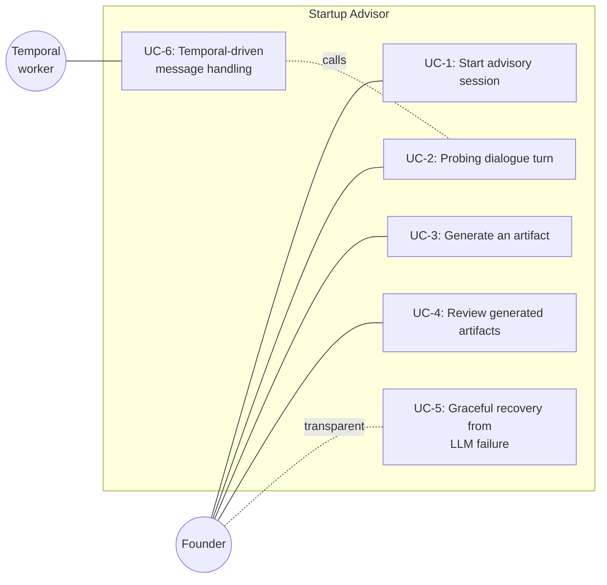

# Startup Advisor — Use Cases

This document enumerates the actors that interact with the startup
advisor team and the concrete use cases it supports. Every use case
is traceable to an entry-point endpoint or workflow defined in the
team's code.

## Actors

| Actor | Role | Interaction style |
|---|---|---|
| **Founder** (primary) | A human founder seeking advisory guidance. Sends free-text messages, receives probing questions and eventually artifacts. | HTTPS via the Angular UI or `curl`. |
| **Unified API** (system) | The gateway at `/api/startup-advisor/*` that proxies to this team. Managed in `backend/unified_api/config.py:202-209`. | Mounts the FastAPI sub-app. |
| **Temporal worker** (system, optional) | A `startup_advisor-queue` worker started at import time when `is_temporal_enabled()` is true. Runs `StartupAdvisorWorkflow` on demand. | Only live when `TEMPORAL_ADDRESS` is configured (`temporal/__init__.py:38-41`). |

## Use-case overview

---

## UC-1 — Start advisory session

- **Entry point.** `GET /api/startup-advisor/conversation` →
  `get_or_create_conversation` (`api/main.py:162-184`).
- **Actors.** Founder, Unified API.
- **Trigger.** The founder opens the advisor UI or hits the
  endpoint for the first time.
- **Preconditions.**
  - Postgres is reachable and the `shared_postgres` pool is
    healthy.
  - `register_team_schemas(SCHEMA)` has completed in the FastAPI
    lifespan so the three tables exist (`api/main.py:20-28`).
- **Main flow.**
  1. Handler calls `store.get_or_create_singleton()`
     (`api/main.py:166`). The existing row is returned.
  2. Handler calls `store.get(cid)` to load messages + context.
  3. Artifacts are loaded via `store.get_artifacts(cid)`.
  4. The transcript + context + artifacts are returned as a
     `ConversationStateResponse`. If the transcript has 0 or 1
     messages, the default suggested questions from
     `_DEFAULT_SUGGESTED` (`api/main.py:101-105`) are attached.
- **Alternate flow — first ever call (empty database).**
  1. `get_or_create_singleton` finds no row, calls `create`
     (`store.py:247`), and returns the new UUID.
  2. `store.get(cid)` returns an empty transcript.
  3. The handler detects `len(messages) == 0` and appends the
     welcome message as an `assistant` turn via `append_message`
     (`api/main.py:175-180`).
  4. State is reloaded and returned.
- **Postconditions.** Exactly one row exists in
  `startup_advisor_conversations`. The response contains the
  welcome message as the first transcript entry.
- **Failure modes.** A Postgres outage bubbles up as HTTP 500 from
  the `store.get` check at `api/main.py:168-169`.

---

## UC-2 — Probing dialogue turn

- **Entry point.** `POST /api/startup-advisor/conversation/messages`
  → `send_message` (`api/main.py:187-242`).
- **Actors.** Founder, Unified API.
- **Trigger.** The founder submits a free-text message (for
  example: "I'm validating a B2B SaaS idea for accounting teams").
- **Preconditions.** A singleton conversation exists (UC-1 may
  have been called implicitly; `send_message` calls
  `get_or_create_singleton` itself at `api/main.py:193`).
- **Main flow.**
  1. Handler resolves the singleton conversation.
  2. If the transcript is empty, the welcome message is appended
     first (`api/main.py:201-206`) so the LLM sees the advisor's
     greeting.
  3. The founder's message is persisted via `append_message`
     (`api/main.py:209`).
  4. `msg_pairs` is built from the transcript including the new
     user turn (`api/main.py:212-213`).
  5. `agent.respond(msg_pairs, context, payload.message)` is
     called (`api/main.py:216-218`). The agent formats
     `USER_TURN_TEMPLATE`, calls the LLM with `think=True`, and
     returns a 4-tuple.
  6. `_merge_context` merges only non-empty fields back into the
     context (`api/main.py:148-154,221-223`) and
     `store.update_context` persists it.
  7. The advisor's reply is persisted via `append_message`
     (`api/main.py:226`).
  8. The artifact branch (UC-3) is skipped because
     `artifact is None`.
  9. State is reloaded via `store.get` + `store.get_artifacts` and
     returned with the LLM-supplied `suggested_questions`.
- **Postconditions.**
  - Two new rows exist in `startup_advisor_conv_messages` (the
    user turn and the advisor reply).
  - `context_json` on the singleton row may have been updated
    with new keys.
- **Failure modes.** UC-5 handles LLM failure transparently; any
  Postgres failure raises HTTP 500 from the reload check at
  `api/main.py:237-238`.

---

## UC-3 — Generate an artifact

- **Entry point.** `POST /api/startup-advisor/conversation/messages`
  → same handler as UC-2 (`api/main.py:187-242`).
- **Actors.** Founder, Unified API.
- **Trigger.** The LLM decides — based on the accumulated context
  — that it has enough information to produce a structured
  deliverable and returns a non-null `artifact` field.
- **Preconditions.** Enough probing-dialogue turns have happened
  that `context_json` contains the keys the system prompt expects
  for the relevant artifact type (see
  `assistant/agent.py:63-67`).
- **Main flow.**
  1. Steps 1-7 of UC-2.
  2. Handler checks `artifact and isinstance(artifact, dict)`
     (`api/main.py:229`).
  3. `artifact_type`, `title`, and `content` are extracted with
     safe defaults (`api/main.py:230-232`).
  4. `store.add_artifact(cid, artifact_type, title, content)` is
     called (`api/main.py:233`), inserting the row and returning
     the new id.
  5. State is reloaded and the artifact is included in the
     `artifacts[]` array on the response
     (`ConversationStateResponse`).
- **Artifact subtypes.** Exactly the six types enumerated in the
  system prompt (`assistant/agent.py:39-44`):
  `action_plan`, `customer_discovery_guide`, `gtm_strategy`,
  `fundraising_brief`, `competitive_analysis`,
  `milestone_roadmap`. The agent may also emit any other `type`
  string; the store does not validate the vocabulary.
- **Postconditions.** A new row exists in
  `startup_advisor_conv_artifacts` and is visible on subsequent
  `GET /conversation/artifacts` calls (UC-4).

---

## UC-4 — Review generated artifacts

- **Entry point.** `GET /api/startup-advisor/conversation/artifacts`
  → `list_artifacts` (`api/main.py:245-260`).
- **Actors.** Founder, Unified API.
- **Trigger.** The founder wants to re-read past deliverables
  without scrolling through the full transcript.
- **Preconditions.** Singleton conversation exists. Zero or more
  artifacts are present.
- **Main flow.**
  1. Handler resolves the singleton via
     `store.get_or_create_singleton` (`api/main.py:249`).
  2. `store.get_artifacts(cid)` is called (`api/main.py:250`),
     returning artifacts ordered by insertion id.
  3. Each `StoredArtifact` is mapped to an `ArtifactResponse`.
- **Postconditions.** Read-only. No state changes.

---

## UC-5 — Graceful recovery from LLM failure

- **Entry point.** Triggered inside UC-2 / UC-3 when
  `self._llm.complete` raises.
- **Actors.** Founder (experiences a normal-looking response),
  Unified API.
- **Trigger.** The LLM backend returns an error, times out, or is
  unreachable while processing a `POST /conversation/messages`
  request.
- **Preconditions.** The handler has already persisted the user's
  turn (`api/main.py:209` runs before the LLM call at
  `api/main.py:216`).
- **Main flow.**
  1. `StartupAdvisorAgent.respond` wraps the `complete` call in
     `try/except Exception` (`assistant/agent.py:146-164`).
  2. On exception, `logger.exception("LLM call failed for startup
     advisor")` is emitted.
  3. The agent returns a hard-coded fallback 4-tuple:
     - `reply`: "I'm here to help with your startup. Could you tell
       me about what you're building and what stage you're at?"
     - `context_update`: `{}`
     - `suggested_questions`: three canned probing prompts.
     - `artifact`: `None`.
  4. The handler proceeds through the normal merge + persist +
     reload path. Because `context_update` is empty,
     `_merge_context` is a no-op and `update_context` is skipped
     (`api/main.py:221-223`).
- **Postconditions.**
  - The user's turn **is** persisted (it was written before the
    LLM call).
  - The fallback reply **is** persisted as a regular assistant
    turn.
  - The founder sees a normal `ConversationStateResponse` with no
    indication of the failure.
- **Why.** The advisor is a coaching product — surfacing a raw 500
  to a founder mid-thought is strictly worse than replying with a
  generic follow-up question. The failure is still visible in the
  service logs via `logger.exception`.

---

## UC-6 — Temporal-driven message handling (optional)

- **Entry point.** `StartupAdvisorWorkflow.run` at
  `temporal/__init__.py:22-30`.
- **Actors.** Temporal worker, external Temporal client.
- **Trigger.** An external orchestrator submits a
  `StartupAdvisorWorkflow` execution to the Temporal cluster with
  a request payload that matches `SendMessageRequest`.
- **Preconditions.**
  - `TEMPORAL_ADDRESS` is set so `is_temporal_enabled()` returns
    true and the `startup_advisor-queue` worker was started at
    import time (`temporal/__init__.py:38-41`).
  - Postgres and the LLM provider are reachable (same as UC-2).
- **Main flow.**
  1. Temporal calls
     `StartupAdvisorWorkflow.run(request: dict)`.
  2. The workflow executes `run_pipeline_activity` with a
     30-minute `start_to_close_timeout`
     (`temporal/__init__.py:26-30`).
  3. The activity re-imports `SendMessageRequest` and
     `send_message` from `startup_advisor.api.main`
     (`temporal/__init__.py:13`).
  4. It deserialises the dict into `SendMessageRequest(**request)`
     and calls `send_message(req)` — the exact same handler UC-2
     runs.
  5. The returned `ConversationStateResponse` is serialised via
     `model_dump()` and returned as the activity result
     (`temporal/__init__.py:17-19`).
- **Postconditions.** Identical to UC-2 / UC-3. There is no
  separate Temporal-specific data path; the workflow is a thin
  wrapper so the team can participate in cross-team orchestration.
- **Note.** The 30-minute activity timeout exists only to absorb
  slow LLM calls — the actual handler is synchronous and typically
  completes in seconds.
