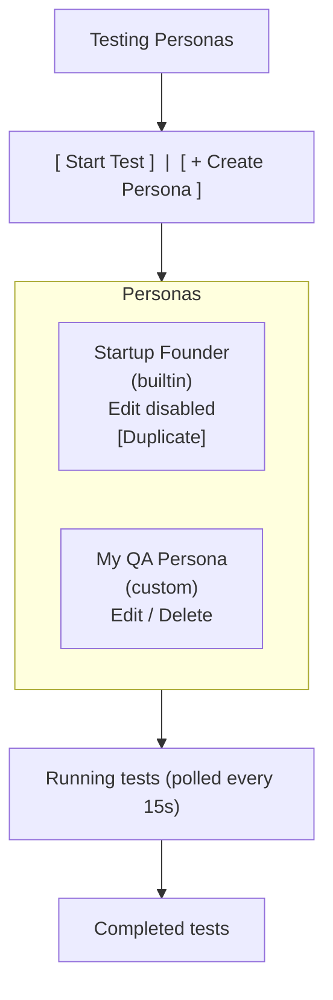

# Feature Spec: Testing Personas

## Context

The platform currently has a feature mounted under `backend/agents/user_agent_founder/` and displayed in the UI as **"Persona Testing"**. It ships a single hardcoded persona ("Alex Chen, startup founder") that autonomously drives the Software Engineering team through a specific workflow: generate a product spec → submit for product analysis → auto-answer pending questions → trigger full build → auto-answer pending questions → done.

Two things are wrong today:

1. **The label is inverted.** These are *testing personas* — personas whose role is to test teams. The current label "Persona Testing" reads as "the activity of testing personas," which is the opposite of what the feature does. The UI should read **"Testing Personas"** (adjective + noun: personas of the testing variety).
2. **The flow is hardcoded end-to-end.** Exactly one persona. Exactly one target team (SE). The UI shows a persona card but clicking "Start Test" on it sends `{}` to the backend — the persona is effectively ignored.

This spec extends the feature so a user can:

- Create / edit / delete their own personas (with name, description, icon, and the free-form system + spec-generation prompts that define the persona's "voice" and product vision).
- Open a **Start Test** form, pick a persona, pick a target team, and click **Start Test**.
- See run history annotated with the persona and target team used.

**Scope for this release:** Only Software Engineering is listed as a testable team. The orchestrator is refactored behind a small adapter interface so future teams (e.g. `planning_v3_team`) can opt in as additive adapter files, without touching the orchestrator core.

## Goals & Non-Goals

**Goals**
- Rename user-visible "Persona Testing" → "Testing Personas".
- Persistable user-created personas with CRUD endpoints and UI.
- Start Test form requiring persona + target team selection.
- Orchestrator refactored to be persona-driven and team-agnostic via an adapter.
- Built-in "startup-founder" persona preserved and read-only (duplicate-to-customize).

**Non-goals**
- Renaming the backend module `user_agent_founder` or the route prefix `/api/user-agent-founder`. (High churn, zero user-facing value; tracked as a future follow-up.)
- Renaming the internal URL path `/persona-testing` in the Angular router. (Would break any bookmarks; internal detail.)
- Adding adapters for teams other than SE.
- Structured persona-builder UI (values / vision / style as separate fields). Free-form textareas only.
- Real-time streaming of persona decisions. Existing 10–15s polling stays.

## UX Flow

### Testing Personas dashboard (`/persona-testing`)



### Start Test dialog

```mermaid
flowchart TB
    Title["Start Test"]
    Persona["Persona: [ Startup Founder &#9662; ] (required)"]
    Team["Target team: [ Software Engineering &#9662; ] (required)"]
    Project["Project name: [ taskflow-mvp ]<br/>(optional; default = slugified persona name + '-mvp')"]
    Buttons["[ Cancel ]  [ Start Test ]"]

    Title --> Persona
    Persona --> Team
    Team --> Project
    Project --> Buttons
```



Clicking **Start Test** → `POST /api/user-agent-founder/start` with `{persona_id, target_team_key, project_name}` → navigate to `/persona-testing/audit/:runId` (existing audit panel, unchanged).

### Create / Edit Persona dialog

Fields: `name`, `description`, `icon` (material icon picker), `system_prompt` (large textarea, persona voice/values/decision framework), `spec_generation_prompt` (large textarea, what product to spec). Built-ins show a read-only view with a single **Duplicate** action that pre-fills the Create form.

## Backend Design

### 1. Rename the team display name

File: `backend/unified_api/config.py` — the `user_agent_founder` entry.

```python
"user_agent_founder": TeamConfig(
    name="Testing Personas",                                   # was "User Agent Founder"
    prefix="/api/user-agent-founder",                          # unchanged
    description="Create personas and direct them to autonomously test other teams.",  # updated
    tags=["persona", "testing", "simulation"],                 # updated
    cell="core_dev",
    timeout_seconds=300.0,
),
```

### 2. Persona storage

Add a new table via `backend/agents/user_agent_founder/postgres/__init__.py`:

```sql
CREATE TABLE IF NOT EXISTS user_agent_founder_personas (
    persona_id              TEXT PRIMARY KEY,      -- slug for builtins, uuid for user-created
    name                    TEXT NOT NULL,
    description             TEXT NOT NULL,
    icon                    TEXT NOT NULL DEFAULT 'person',
    system_prompt           TEXT NOT NULL,
    spec_generation_prompt  TEXT NOT NULL,
    is_builtin              BOOLEAN NOT NULL DEFAULT FALSE,
    created_at              TIMESTAMPTZ NOT NULL,
    updated_at              TIMESTAMPTZ NOT NULL
);
```

**Seeding.** On lifespan startup, insert the built-in `startup-founder` persona if missing, using the existing `FOUNDER_SYSTEM_PROMPT` / `SPEC_GENERATION_PROMPT` from `backend/agents/user_agent_founder/agent.py` verbatim as the `system_prompt` / `spec_generation_prompt` values. `persona_id='startup-founder'`, `is_builtin=TRUE`. Idempotent on the stable slug.

**Extend the runs table** with run-context columns:

```sql
ALTER TABLE user_agent_founder_runs
    ADD COLUMN IF NOT EXISTS persona_id       TEXT,
    ADD COLUMN IF NOT EXISTS target_team_key  TEXT,
    ADD COLUMN IF NOT EXISTS project_name     TEXT;
```

Backfill existing rows during migration: `persona_id='startup-founder'`, `target_team_key='software_engineering'`, `project_name='taskflow-mvp'`.

### 3. Persona store + agent refactor

- New `PersonaStore` (alongside `FounderRunStore`) in `backend/agents/user_agent_founder/store.py` with: `list_personas()`, `get_persona(id)`, `create_persona(...)`, `update_persona(id, ...)`, `delete_persona(id)`, `seed_builtins()`. `update` / `delete` raise on `is_builtin=TRUE`.
- Change `FounderAgent.__init__` in `backend/agents/user_agent_founder/agent.py` to accept `system_prompt: str` and `spec_generation_prompt: str` as constructor args. Keep the module-level `FOUNDER_SYSTEM_PROMPT` / `SPEC_GENERATION_PROMPT` only as values used for seeding the builtin. Keep `QUESTION_ANSWERING_PROMPT` as a shared framework template (persona voice comes from `system_prompt` passed to `llm.complete`).
- Delete the singleton `get_founder_agent()` — callers now construct a per-run `FounderAgent(system_prompt=…, spec_generation_prompt=…)` from the selected persona row.
- Rename class/file to `PersonaAgent` / `persona_agent.py` within the module (internal only — the module dir stays `user_agent_founder`).

### 4. Target-team adapter

Introduce a narrow interface so the orchestrator no longer hardcodes SE endpoint paths.

New file: `backend/agents/user_agent_founder/targets/base.py`

```python
class TargetTeamAdapter(Protocol):
    team_key: str
    display_name: str

    def start_from_spec(self, client, project_name: str, spec: str) -> str: ...   # returns analysis_job_id
    def poll_analysis(self, client, job_id: str) -> dict: ...                      # returns status dict
    def submit_analysis_answers(self, client, job_id: str, answers: list[dict]) -> None: ...
    def start_build(self, client, repo_path: str) -> str: ...                      # returns se_job_id
    def poll_build(self, client, job_id: str) -> dict: ...
    def submit_build_answers(self, client, job_id: str, answers: list[dict]) -> None: ...
```

New file: `backend/agents/user_agent_founder/targets/software_engineering.py` implements the adapter using the existing SE endpoints (lifts the code currently inline in `orchestrator.py` — `_se_url`, `_run_product_analysis`, `_run_se_team`, `_answer_pending_questions`).

New file: `backend/agents/user_agent_founder/targets/__init__.py` exposes a registry:

```python
ADAPTERS: dict[str, type[TargetTeamAdapter]] = {
    "software_engineering": SoftwareEngineeringAdapter,
}

def get_adapter(team_key: str) -> TargetTeamAdapter:
    if team_key not in ADAPTERS:
        raise ValueError(f"Team {team_key!r} does not support persona testing")
    return ADAPTERS[team_key]()
```

`orchestrator.run_workflow` is rewritten to:

```python
def run_workflow(run_id, store, agent, adapter, project_name):
    # Phase 1: agent.generate_spec()  (uses persona's spec_generation_prompt)
    # Phase 2: adapter.start_from_spec() + poll loop calling agent.answer_question()
    # Phase 3: adapter.start_build() + poll loop calling agent.answer_question()
```

All `/api/software-engineering/...` URLs vanish from `orchestrator.py`.

### 5. API endpoints

File: `backend/agents/user_agent_founder/api/main.py`

**Persona CRUD** (all under `/api/user-agent-founder`):

| Method | Path | Body | Response |
|---|---|---|---|
| `GET` | `/personas` | — | `{personas: PersonaInfo[]}` (unchanged shape; now DB-backed; extend `PersonaInfo` with `is_builtin`, `system_prompt`, `spec_generation_prompt`, timestamps) |
| `POST` | `/personas` | `CreatePersonaRequest` | `PersonaInfo` (201) |
| `GET` | `/personas/{id}` | — | `PersonaInfo` |
| `PUT` | `/personas/{id}` | `UpdatePersonaRequest` | `PersonaInfo` (403 if builtin) |
| `DELETE` | `/personas/{id}` | — | 204 (403 if builtin) |

**Testable teams discovery**:

| Method | Path | Response |
|---|---|---|
| `GET` | `/testable-teams` | `{teams: [{team_key, display_name}]}` — derived from `targets.ADAPTERS` keys joined against `TEAM_CONFIGS` for display names. |

**Start test — additive change to `/start`** (no breaking change):

```python
class StartRunRequest(BaseModel):
    persona_id: str = "startup-founder"                  # default = builtin
    target_team_key: str = "software_engineering"        # default = only adapter
    project_name: Optional[str] = None                   # default computed server-side
```

The endpoint must accept **no body at all** (existing clients post `{}` or nothing) in addition to a full payload. FastAPI treats a plain `StartRunRequest` parameter as a required body, so the handler wraps it as optional and coalesces server-side:

```python
from fastapi import Body

@app.post("/start", response_model=StartRunResponse)
def start_founder_workflow(
    request: Optional[StartRunRequest] = Body(default=None),
) -> StartRunResponse:
    req = request or StartRunRequest()
    # ... use req.persona_id, req.target_team_key, req.project_name
```

`POST /start` then:
1. Loads the persona row (404 if missing).
2. Resolves the adapter via `get_adapter(req.target_team_key)` (400 if unsupported).
3. Mints a new `run_id = uuid4().hex` up front.
4. Computes `project_name` if absent: **`<slugified-persona-name>-<run_id[:8]>`** — e.g., `startup-founder-3f9a2b1c`. Slug is lowercase `[a-z0-9-]`, truncated so the full name fits SE's `project_name` rule (alphanumeric + hyphens/underscores, reasonable length). The 8-char run-id suffix guarantees uniqueness across repeat runs so the SE `start-from-spec` "project already exists" guard never trips on the default; a user-supplied `project_name` is used verbatim (no suffix appended).
5. `store.create_run(run_id, persona_id, target_team_key, project_name)`.
6. Spawns the background thread with `agent = FounderAgent(persona.system_prompt, persona.spec_generation_prompt)` and `adapter`.

Backward compatibility: an empty POST body (no JSON / no `Content-Type`) still parses as `request=None` → defaults to the builtin founder against SE, with a unique `project_name` minted per run so consecutive no-body calls don't collide.

**Status / list endpoints**: extend `RunStatusResponse`, `RunSummaryResponse` with `persona_id`, `target_team_key`, `project_name` (all `Optional[str]`). No breaking change — new fields are additive.

## Frontend Design

### 1. Label rename

- `user-interface/src/app/models/navigation.model.ts:53` — change `label: 'Persona Testing'` → `'Testing Personas'`.
- `user-interface/src/app/app.routes.ts:64-65` — update `breadcrumb` and `title` data for both the dashboard and audit routes.
- `user-interface/src/app/components/persona-testing-dashboard/persona-testing-dashboard.component.html:2` — update `title="Persona Testing"` → `title="Testing Personas"` and refresh the subtitle to describe the new flow ("Create personas and direct them to autonomously test your teams.").
- `user-interface/src/app/components/persona-test-audit-panel/persona-test-audit-panel.component.html:3` — update back-link text to "Back to Testing Personas".

Route path `/persona-testing` and component class/file names stay as-is (internal).

### 2. Models (extend)

File: `user-interface/src/app/models/persona-testing.model.ts`

```ts
export interface PersonaInfo {
  id: string;
  name: string;
  description: string;
  icon: string;
  is_builtin: boolean;
  system_prompt: string;
  spec_generation_prompt: string;
  created_at: string;
  updated_at: string;
}

export interface TestableTeam {
  team_key: string;
  display_name: string;
}

export interface PersonaTestRun {
  // …existing fields…
  persona_id?: string;
  target_team_key?: string;
  project_name?: string;
}
```

New `CreatePersonaRequest` / `UpdatePersonaRequest` interfaces mirror the backend models.

### 3. Service additions

File: `user-interface/src/app/services/persona-testing-api.service.ts`

Add:

```ts
createPersona(payload: CreatePersonaRequest): Observable<PersonaInfo>
updatePersona(id: string, payload: UpdatePersonaRequest): Observable<PersonaInfo>
deletePersona(id: string): Observable<void>
getTestableTeams(): Observable<{ teams: TestableTeam[] }>
```

Change the existing `startTest()` signature:

```ts
startTest(payload: { persona_id: string; target_team_key: string; project_name?: string }):
  Observable<{ run_id: string; status: string; message: string }>
```

### 4. Dashboard component

File: `user-interface/src/app/components/persona-testing-dashboard/persona-testing-dashboard.component.ts` and `.html`.

- Header actions: `[ Start Test ]` (primary) and `[ + Create Persona ]`.
- Persona cards show `is_builtin` badge; built-ins render **Duplicate** action, user-created render **Edit** + **Delete**.
- Remove the per-card "Start Test" button (it was broken — didn't send the persona ID). Start Test is now a single dashboard-level action that opens the dialog.
- Run rows in Running / Completed sections include a new column: **Persona** / **Target team** (fall back to `—` for older rows that pre-date the schema change, though migration backfills `startup-founder` + `software_engineering`).

### 5. New dialog components

Reuse the pattern from `BrandingDashboardComponent` (client/brand create forms via Angular Material `MatDialog`).

- `PersonaEditorDialogComponent` — used for both Create and Duplicate. Form fields: name, description, icon picker, system_prompt (`MatInput` multiline, ~20 rows), spec_generation_prompt (multiline, ~15 rows). Submit → `createPersona()` or `updatePersona()`.
- `StartTestDialogComponent` — persona `mat-select` (from `getPersonas()`), target team `mat-select` (from `getTestableTeams()`), optional project name. Both selectors required; submit disabled otherwise. Submit → `startTest({...})` → router navigate to `/persona-testing/audit/:runId`.

## Files to Modify

**Backend**
- `backend/unified_api/config.py` — rename team display name + description.
- `backend/agents/user_agent_founder/postgres/__init__.py` — new `user_agent_founder_personas` table + `ALTER TABLE` for `runs`.
- `backend/agents/user_agent_founder/store.py` — new `PersonaStore`; extend `create_run`/`get_run`/`list_runs` to handle the three new columns.
- `backend/agents/user_agent_founder/agent.py` — make prompts constructor args; keep module constants only for seeding.
- `backend/agents/user_agent_founder/orchestrator.py` — delegate all SE-specific HTTP to the adapter; accept `agent`, `adapter`, `project_name`.
- `backend/agents/user_agent_founder/targets/__init__.py`, `base.py`, `software_engineering.py` — new adapter package.
- `backend/agents/user_agent_founder/api/main.py` — persona CRUD, `/testable-teams`, extended `/start` payload, seed builtins in lifespan.
- `backend/agents/user_agent_founder/temporal/__init__.py` — update activity signature if Temporal mode is enabled (non-functional: adapter is constructed inside the activity from `target_team_key`).
- `backend/agents/user_agent_founder/tests/test_store.py` + new `test_persona_store.py`, `test_api_personas.py`, `test_adapter_se.py`.

**Frontend**
- `user-interface/src/app/models/navigation.model.ts` — label rename.
- `user-interface/src/app/app.routes.ts` — breadcrumb/title rename.
- `user-interface/src/app/models/persona-testing.model.ts` — extend interfaces + new types.
- `user-interface/src/app/services/persona-testing-api.service.ts` — CRUD methods, new `startTest` signature, `getTestableTeams()`.
- `user-interface/src/app/components/persona-testing-dashboard/*.{ts,html,scss}` — refactor cards, add header actions, wire dialogs, show persona/team columns on runs.
- `user-interface/src/app/components/persona-testing-dashboard/persona-editor-dialog.component.ts` (new).
- `user-interface/src/app/components/persona-testing-dashboard/start-test-dialog.component.ts` (new).
- `user-interface/src/app/components/persona-test-audit-panel/persona-test-audit-panel.component.html` — back link + optional display of `persona_id` / `target_team_key` / `project_name` in the run header.

## Reusable patterns / existing code to lean on

- **Branding team CRUD + dialog pattern**: `backend/agents/branding_team/api/main.py` (clients/brands CRUD with store layer + `HTTPException(404)` on missing parents) and `user-interface/src/app/components/branding-dashboard/` (MatDialog-based create flows). This is the closest template for persona CRUD.
- **SE Q&A contract** lives in `backend/agents/software_engineering_team/api/main.py` at `/product-analysis/start-from-spec`, `/product-analysis/status/{job_id}`, `/product-analysis/{job_id}/answers`, `/run-team`, `/run-team/{job_id}`, `/run-team/{job_id}/answers`. Lifted verbatim into `targets/software_engineering.py`.
- **Shared postgres** registration via `register_team_schemas(SCHEMA)` in the lifespan — already in place in `user_agent_founder/api/main.py`.
- **`QUESTION_ANSWERING_PROMPT`** in `backend/agents/user_agent_founder/agent.py:90-116` stays as the shared Q&A framework template — it's persona-agnostic (persona voice flows through via `system_prompt=...` passed alongside it to `llm.complete`).

## Verification

**Backend**
1. `cd backend && make install-dev && make lint && make test` — ruff + pytest green, including new persona store / API / adapter tests.
2. Start Postgres per `CLAUDE.md` dev instructions and run `python run_unified_api.py`. Confirm on startup: logs show `persona startup-founder seeded (builtin)` on first run, no-op on subsequent runs.
3. `curl http://localhost:8080/api/user-agent-founder/personas` returns the builtin. `curl -X POST .../personas -d '{"name":"QA","description":"...","icon":"bug_report","system_prompt":"…","spec_generation_prompt":"…"}'` creates a user persona. `PUT` / `DELETE` on `startup-founder` return 403.
4. `curl http://localhost:8080/api/user-agent-founder/testable-teams` → `{"teams":[{"team_key":"software_engineering","display_name":"Software Engineering"}]}`.
5. `curl -X POST .../start -d '{"persona_id":"startup-founder","target_team_key":"software_engineering"}'` returns a `run_id`, `/status/{run_id}` progresses through `generating_spec → submitting_analysis → …` just as before. Then verify the two backward-compat / default-uniqueness paths:
   a. `curl -X POST .../start` with **no body and no `Content-Type`** returns 200 with a new `run_id` (empty body defaults to builtin persona + SE), proving the optional-`Body(default=None)` wrapping.
   b. Immediately repeat `curl -X POST .../start` (still no body) — the second call also returns 200 and advances past `submitting_analysis` without hitting SE's "project already exists" guard, proving the computed `project_name` carries the per-run suffix.
6. Existing runs queried via `/runs` show `persona_id="startup-founder"`, `target_team_key="software_engineering"` from the backfill.

**Frontend**
1. `cd user-interface && npm ci && npm test` — Vitest suites green, 80% coverage floor.
2. `npm start` and navigate to `/persona-testing`. Sidebar reads **Testing Personas**. Dashboard shell title reads **Testing Personas**. Breadcrumb reads **Testing Personas**.
3. Click **+ Create Persona** → dialog opens → fill required fields → submit → persona appears in the list with an **Edit / Delete** action.
4. On the builtin card click **Duplicate** → dialog opens pre-filled with builtin's prompts + name `"Startup Founder (copy)"` → submit → new user persona created.
5. Click **Start Test** → dialog opens → both dropdowns populated (personas from `/personas`, one team from `/testable-teams`) → Submit disabled until both selected → select → submit → app routes to the audit panel and the run appears in the **Running tests** list with the selected persona name + `Software Engineering`.
6. Delete a user persona → disappears; try to delete the builtin from the UI — no delete button rendered.
7. Audit panel still functions — existing component unchanged except header now displays the persona / team / project name for the run.

**End-to-end smoke**
1. Full stack via `docker compose -f docker/docker-compose.yml --env-file docker/.env up --build`.
2. From the UI, create a persona, start a test against SE, watch the audit panel polling advance through phases, confirm decisions are recorded with the new persona's system prompt influencing answers (check the decision rationales reflect the persona's voice, not Alex Chen's, when a user persona was used).
