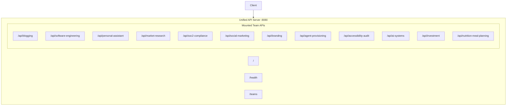

# Unified API Server

The Unified API Server consolidates all Strands Agent team APIs under a single entry point, providing a consistent interface for accessing all platform capabilities.

## Overview

Instead of running multiple API servers on different ports, the unified server mounts all team APIs under namespaced prefixes on a single port (default: 8080).



## Quick Start

```bash
# From repository root
cd backend
python run_unified_api.py

# With custom port
python run_unified_api.py --port 9000

# Development mode (auto-reload)
python run_unified_api.py --reload

# Production with multiple workers
python run_unified_api.py --workers 4 --log-level warning
```

## API Endpoints

### Root Endpoints

| Method | Path | Description |
|--------|------|-------------|
| GET | `/` | API information and list of available teams |
| GET | `/health` | Unified health check for all teams |
| GET | `/teams` | Detailed team information with mount status |
| GET | `/docs` | Interactive Swagger UI documentation |
| GET | `/redoc` | ReDoc API documentation |

### Team API Prefixes

| Team | Prefix | Team Docs |
|------|--------|-----------|
| Blogging | `/api/blogging` | `/api/blogging/docs` |
| Software Engineering | `/api/software-engineering` | `/api/software-engineering/docs` |
| Personal Assistant | `/api/personal-assistant` | `/api/personal-assistant/docs` |
| Market Research | `/api/market-research` | `/api/market-research/docs` |
| SOC2 Compliance | `/api/soc2-compliance` | `/api/soc2-compliance/docs` |
| Social Marketing | `/api/social-marketing` | `/api/social-marketing/docs` |
| Branding | `/api/branding` | `/api/branding/docs` |
| Agent Provisioning | `/api/agent-provisioning` | `/api/agent-provisioning/docs` |
| Accessibility Audit | `/api/accessibility-audit` | `/api/accessibility-audit/docs` |
| AI Systems | `/api/ai-systems` | `/api/ai-systems/docs` |
| Investment | `/api/investment` | `/api/investment/docs` |
| Nutrition & Meal Planning | `/api/nutrition-meal-planning` | `/api/nutrition-meal-planning/docs` |

## Environment Variables

| Variable | Default | Description |
|----------|---------|-------------|
| `UNIFIED_API_HOST` | `0.0.0.0` | Host to bind |
| `UNIFIED_API_PORT` | `8080` | Port to bind |
| `AGENT_CACHE` | `.agent_cache` | Directory for job and integrations storage (e.g. `integrations.json`). |
| `INTEGRATIONS_BROWSER_SESSION_ROOT` | `${AGENT_CACHE}/integrations/browser_sessions` | Optional override for browser session files (e.g. Medium `storage_state.json`). Path is backend-controlled only; cannot be set from UI/API payloads. |
| `MEDIUM_BROWSER_HEADLESS` | `0` | Optional: set `1`/`true` for headless Chromium during Medium Playwright login. |
| `MEDIUM_BROWSER_TIMEOUT_MS` | `180000` | Optional: max time (ms) for automated Medium/Google login. |
| `SLACK_WEBHOOK_URL` | (none) | Optional. Slack Incoming Webhook URL; used as fallback when not set via Integrations UI. When set, open questions and Personal Assistant replies can be sent to Slack if Slack integration is enabled. |
| `UI_BASE_URL` | `http://localhost:4200` | Base URL of the Angular UI; used in Slack messages for "Answer in UI" links. |

Team-specific environment variables (e.g., `OLLAMA_API_KEY`, `SW_LLM_*`, `PA_*`) are passed through to the mounted team APIs.

## CLI Options

```
usage: run_unified_api.py [-h] [--host HOST] [--port PORT] [--reload]
                          [--workers WORKERS] [--log-level {debug,info,warning,error,critical}]

Options:
  --host HOST           Host to bind (default: 0.0.0.0)
  --port PORT           Port to bind (default: 8080)
  --reload              Enable auto-reload for development
  --workers WORKERS     Number of worker processes (default: 1)
  --log-level LEVEL     Log level: debug, info, warning, error, critical
```

## Health Check

The unified health endpoint (`GET /health`) returns the status of all mounted teams:

```json
{
  "status": "healthy",
  "version": "1.0.0",
  "teams": [
    {
      "name": "Blogging",
      "prefix": "/api/blogging",
      "status": "healthy",
      "enabled": true
    },
    {
      "name": "Software Engineering",
      "prefix": "/api/software-engineering",
      "status": "healthy",
      "enabled": true
    }
  ]
}
```

Status values:
- `healthy` - All enabled teams are mounted and working
- `degraded` - Some teams failed to mount (check individual team statuses)
- `unavailable` - Team could not be mounted (import error, missing dependencies)

## Architecture

### File Structure

```
unified_api/
├── __init__.py          # Package initialization
├── config.py            # Team configurations and settings
├── main.py              # FastAPI application with team mounts
└── README.md            # This documentation

run_unified_api.py       # Launcher script (project root)
```

### Mount Strategy

Each team's FastAPI application is mounted as a sub-application:

```python
from blogging.api.main import app as blogging_app
app.mount("/api/blogging", blogging_app)
```

This preserves:
- All original routes under the new prefix
- Team-specific middleware and dependencies
- Individual Swagger documentation at `{prefix}/docs`

### Graceful Degradation

If a team API fails to import (missing dependencies, configuration errors), the unified server continues with other teams:

```
2024-01-15 10:00:00 [WARNING] unified_api: Could not mount Investment Team API: No module named 'investment_team'
2024-01-15 10:00:00 [INFO] unified_api: Mounted 7/8 team APIs
```

## Example Usage

### List Available Teams

```bash
curl http://localhost:8080/teams
```

### Call Blogging API

```bash
curl -X POST http://localhost:8080/api/blogging/research-and-review \
  -H "Content-Type: application/json" \
  -d '{"brief": "AI observability best practices"}'
```

### Call Personal Assistant API

```bash
curl -X POST http://localhost:8080/api/personal-assistant/users/default/assistant \
  -H "Content-Type: application/json" \
  -d '{"message": "What tasks do I have today?"}'
```

### Start Software Engineering Job

```bash
curl -X POST http://localhost:8080/api/software-engineering/run-team \
  -H "Content-Type: application/json" \
  -d '{"repo_url": "https://github.com/example/project"}'
```

## Configuration

### Enabling/Disabling Teams

Edit `unified_api/config.py` to disable specific teams:

```python
TEAM_CONFIGS = {
    "blogging": TeamConfig(
        name="Blogging",
        prefix="/api/blogging",
        description="...",
        enabled=True,  # Set to False to disable
    ),
    # ...
}
```

### Custom Prefixes

Modify the `prefix` field in team configurations to change URL paths:

```python
"personal_assistant": TeamConfig(
    name="Personal Assistant",
    prefix="/api/pa",  # Shorter prefix
    # ...
),
```

## Production Deployment

### With Gunicorn

```bash
gunicorn unified_api.main:app \
  --workers 4 \
  --worker-class uvicorn.workers.UvicornWorker \
  --bind 0.0.0.0:8080
```

### With Docker

**Backend + UI (recommended):** From the `backend/` directory, run `docker compose up --build`. This starts the Unified API and the Angular UI; the UI is served at **http://localhost:4200** and proxies `/api`, `/docs`, and `/health` to the API. Direct API access remains at **http://localhost:8080**.

**Backend only:** See `backend/Dockerfile`. Build with `docker build -f backend/Dockerfile backend` from repo root.

```dockerfile
FROM python:3.11-slim
WORKDIR /app
COPY . .
RUN pip install -r requirements.txt
EXPOSE 8080
CMD ["python", "run_unified_api.py", "--workers", "4"]
```

### Reverse Proxy (Nginx)

```nginx
upstream unified_api {
    server 127.0.0.1:8080;
}

server {
    listen 80;
    server_name api.example.com;

    location / {
        proxy_pass http://unified_api;
        proxy_set_header Host $host;
        proxy_set_header X-Real-IP $remote_addr;
    }
}
```

## Troubleshooting

### Team Not Mounting

Check the console output for import errors:

```
[WARNING] Could not mount Personal Assistant API: No module named 'cryptography'
```

Fix: Install missing dependencies (`pip install cryptography`).

### Port Already in Use

```bash
# Find process using port
lsof -i :8080

# Kill process
kill -9 <PID>

# Or use a different port
python run_unified_api.py --port 9000
```

### Jobs not showing on Software Engineering or Jobs Overview

The job list (e.g. **Running jobs** on the Software Engineering page and the Jobs Dashboard) is returned by the **same process** that serves the API. Jobs are stored under a cache directory:

- If **AGENT_CACHE** is set, that path is used (resolved to an absolute path).
- Otherwise, `.agent_cache` is used, relative to the **server process working directory**.

Software Engineering jobs are stored under `{cache_dir}/software_engineering_team/jobs/`. If you start the unified API from a different directory than the process that created the job, or run the job in a different process, the list will be empty.

**What to do:**

1. Ensure the UI talks to the same server that is running the job (e.g. unified API on port 8080).
2. Set **AGENT_CACHE** to an absolute path and restart the server so job creation and listing use the same directory regardless of CWD:
   ```bash
   export AGENT_CACHE=/var/lib/strands/agent_cache
   python run_unified_api.py
   ```
3. Verify the list endpoint: `GET http://localhost:8080/api/software-engineering/run-team/jobs`. If it returns `{ "jobs": [] }` while a job is running elsewhere, the backend is reading from a different store (different process or CWD). Check server logs for the line `Software engineering job store path: ...` to see which directory is used.

### Slack integration (Phase 1)

- **Integrations API:** `GET /api/integrations` lists configured integrations. **Slack:** `GET/PUT /api/integrations/slack`, OAuth connect/disconnect — configure via UI in `webhook` or `bot` mode; `SLACK_WEBHOOK_URL` remains a webhook fallback env var. **Shared Google browser login:** `GET/PUT/DELETE /api/integrations/google-browser-login` — one **Fernet-encrypted** Gmail/Google email+password for **all** integrations that use “Sign in with Google” via Playwright (Postgres when `POSTGRES_HOST` is set, else encrypted SQLite). **Medium (blogging stats):** `GET/PUT /api/integrations/medium`, optional `GET /api/integrations/medium/oauth/google/connect` + callback, `POST/DELETE /api/integrations/medium/session` for manual `storage_state` at `${INTEGRATIONS_BROWSER_SESSION_ROOT:-$AGENT_CACHE/integrations/browser_sessions}/medium/storage_state.json`, and `POST /api/integrations/medium/session/browser-login` to capture Medium using the **shared** Google credentials (`playwright install chromium` on the API host). Stats **auto-login** when the session file is missing if shared credentials exist.
- **Manual E2E checklist:** (1) Start unified API and Angular UI. (2) Open **Integrations**, enable Slack, paste a valid Incoming Webhook URL, save. (3) Run a software-engineering job (or planning-v2 / product-analysis) that produces open questions; confirm a message appears in the Slack channel with a link to the UI. (4) Send a message to the Personal Assistant; confirm the assistant reply appears in the same Slack channel.

### Phase 2: Inbound from Slack (optional)

To allow answering open questions and PA chat from Slack (instead of only the UI):

1. **Slack App setup:** Create a Slack App at api.slack.com. Enable **Incoming Webhooks** (for outbound). For inbound: add a **Bot token** and enable **Events API** (e.g. `message.channels`, `message.im`) or **Socket Mode** so the backend can receive events without a public URL. Install the app to your workspace.
2. **Events service:** Run a small service (e.g. in `unified_api` or a separate process) that receives Slack events (HTTP endpoint for Events API or Socket Mode client). Map Slack channel/thread to `job_id` (e.g. when posting "open questions" to Slack, store `thread_ts` → `job_id` in a file or cache).
3. **Submit answers:** On message events in the question thread, parse the user reply (or use interactive Block Kit buttons), build `AnswerSubmission[]`, and call the existing `store_submit_answers(job_id, answers)` (and planning-v2 / product-analysis equivalents by job type).
4. **PA chat from Slack:** On message events (e.g. DM to bot or message in configured channel), call `POST /users/{user_id}/assistant` (map Slack user to `user_id` via config or store), then post `AssistantResponse.message` back to Slack via `chat.postMessage` (Bot token).

### CORS Issues

The unified API enables CORS by default with `allow_origins=["*"]`. For production, modify `main.py` to restrict origins:

```python
app.add_middleware(
    CORSMiddleware,
    allow_origins=["https://your-frontend.com"],
    # ...
)
```
