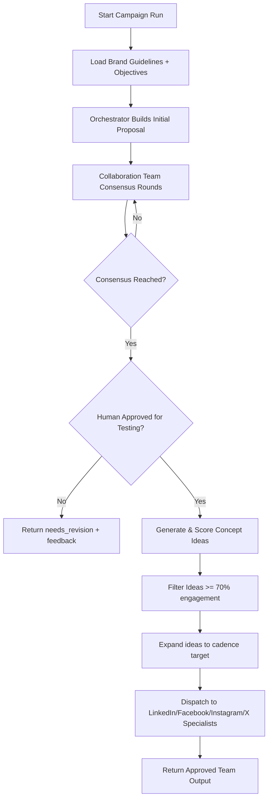
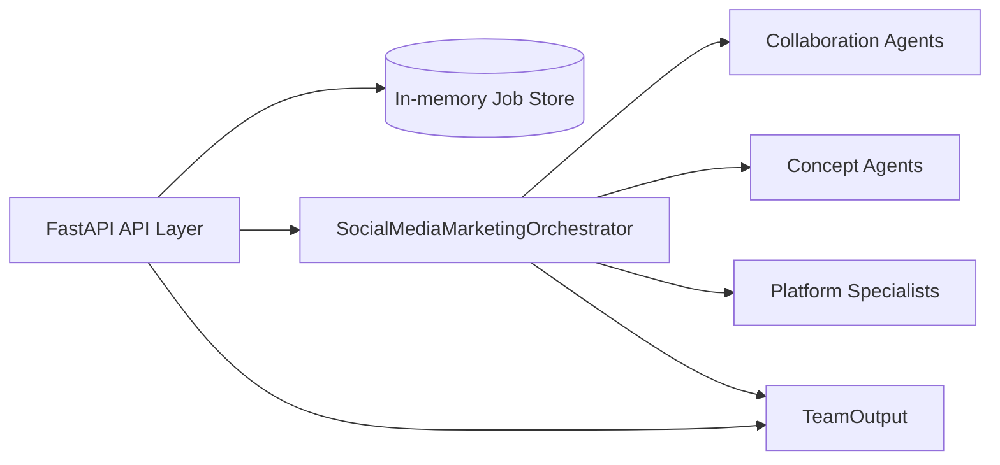
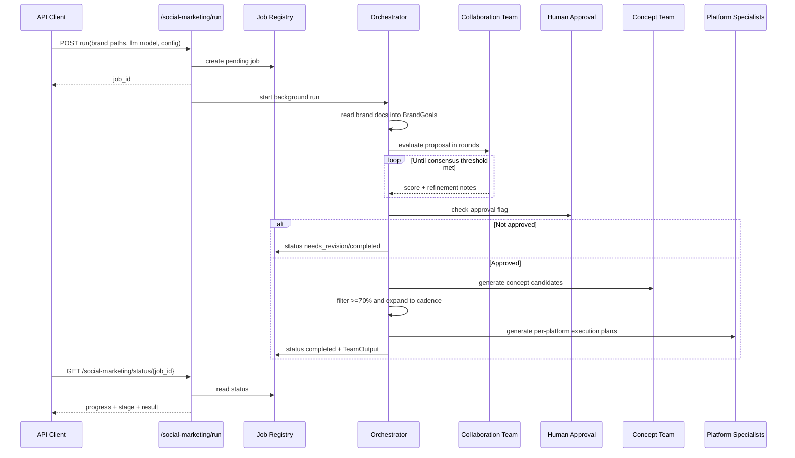

# Social Media Marketing Team

A multi-agent social media marketing system that plans cross-platform campaigns, enforces human approval before testing, and produces execution-ready content plans for LinkedIn, Facebook, Instagram, and X.

## What this team does

The `social_media_marketing_team` package orchestrates a marketing workflow that:

1. Reads brand context (guidelines + objectives).
2. Builds a campaign proposal collaboratively across specialist planning agents.
3. Requires explicit human approval before testing/planning execution content.
4. Generates and scores post concepts by brand fit, audience resonance, and goal alignment.
5. Filters ideas to those with at least **70% estimated engagement probability**.
6. Expands ideas to satisfy cadence defaults (**2 posts/day for 14 days = 28 ideas**).
7. Sends approved concepts to platform specialists for channel-specific execution plans.

---

## Team architecture

### Core coordination roles
- **SocialMediaMarketingOrchestrator**: coordinates end-to-end workflow and consensus loop.
- **Campaign collaboration agents**:
  - Campaign Strategist
  - Audience Research Lead
  - Performance Marketing Analyst
- **Content concept agents**:
  - Brand Storytelling Lead
  - Creative Testing Lead

### Platform specialist roles
- LinkedIn specialist
- Facebook specialist
- Instagram specialist
- X specialist

Each platform specialist returns posting guidelines, first-week schedule structure, and KPI focus tuned to that channel.

---

## How it works

### 1) Proposal collaboration and consensus
The orchestrator runs proposal-review rounds until a consensus threshold is met (with a minimum number of rounds). Proposal notes and refinements are captured in a communication log.

### 2) Human approval gate
Before testing or execution planning, a human must approve the campaign. If not approved, the workflow returns `needs_revision` and preserves proposal + collaboration feedback.

### 3) Concept planning + quality filter
Content concept agents generate idea candidates, and the orchestrator filters to concepts with estimated engagement probability `>= 0.70`.

### 4) Cadence completion
If there are not enough approved ideas to meet cadence targets, the orchestrator creates safe variants from approved seeds to reach the required total.

### 5) Platform execution output
Approved concepts are then routed to each platform specialist agent to produce channel-specific execution guidance.

---

## Mermaid diagrams

### High-level flow



### System/component diagram



### Low-level execution sequence



---

## Build and run

### Prerequisites
- Python 3.10+
- Dependencies installed from repo root (`requirements.txt` includes FastAPI/uvicorn).

### Install dependencies

```bash
pip install -r requirements.txt
```

### Run tests for this package

```bash
pytest -q social_media_marketing_team/tests
```

### Start API locally

```bash
uvicorn social_media_marketing_team.api.main:app --host 0.0.0.0 --port 8010
```

---

## Deploy

A simple production deployment pattern:

1. Package this repo into a container image.
2. Run with an ASGI server, e.g. `uvicorn` (or `gunicorn` + uvicorn workers).
3. Mount brand document storage so paths are accessible to the process.
4. Put a reverse proxy/load balancer in front (TLS, auth, rate limiting).
5. Add centralized logging/monitoring for job status and failures.

Example container command:

```bash
uvicorn social_media_marketing_team.api.main:app --host 0.0.0.0 --port 8010 --workers 2
```

---

## API interaction

### POST `/social-marketing/run`
Starts a background job.

#### Required fields
- `brand_guidelines_path`: filesystem path to brand guidelines document.
- `brand_objectives_path`: filesystem path to brand objectives document.
- `llm_model_name`: local model identifier to use by agents.

#### Optional fields
- `brand_name`, `target_audience`, `goals`
- `voice_and_tone`
- `cadence_posts_per_day`, `duration_days`
- `human_approved_for_testing`, `human_feedback`

#### Example request

```bash
curl -X POST http://127.0.0.1:8010/social-marketing/run \
  -H "Content-Type: application/json" \
  -d '{
    "brand_guidelines_path": "/data/brand/guidelines.md",
    "brand_objectives_path": "/data/brand/objectives.md",
    "llm_model_name": "llama3.1",
    "brand_name": "Acme AI",
    "target_audience": "B2B marketing leaders",
    "human_approved_for_testing": true
  }'
```

### GET `/social-marketing/status/{job_id}`
Poll for status updates and final result payload.

#### Example

```bash
curl http://127.0.0.1:8010/social-marketing/status/<job_id>
```

Response includes:
- `status` (`pending`, `running`, `completed`, `failed`)
- `current_stage`
- `progress` (0-100)
- `llm_model_name`
- file paths for brand docs
- `result` (`TeamOutput`) when complete


### POST `/social-marketing/performance/{job_id}`
Ingest post-level performance observations (e.g., engagement rates) so future planning runs can calibrate confidence scores.

### POST `/social-marketing/revise/{job_id}`
Submit revision feedback for an existing job and rerun planning with updated human guidance.

### GET `/health`
Simple service health response:

```json
{"status": "ok"}
```

---

## Package usage (direct Python)

```python
from social_media_marketing_team import BrandGoals, HumanReview, SocialMediaMarketingOrchestrator

orchestrator = SocialMediaMarketingOrchestrator(llm_model_name="llama3.1")

goals = BrandGoals(
    brand_name="Acme AI",
    target_audience="B2B marketing leaders",
    goals=["engagement", "follower growth", "qualified inbound"],
    brand_guidelines_path="/data/guidelines.md",
    brand_objectives_path="/data/objectives.md",
    brand_guidelines="Use clear, practical language.",
    brand_objectives="Increase qualified engagement by 20%.",
)

result = orchestrator.run(
    goals=goals,
    human_review=HumanReview(approved=True, feedback="Approved for test planning."),
)

print(result.status)
print(result.llm_model_name)
print(result.content_plan.total_required_posts if result.content_plan else 0)
```

---

## Notes and constraints

- Brand file paths must be readable by the API process.
- Job storage is in-memory; restart clears job history.
- Human approval is required before campaign testing/execution planning is finalized.
