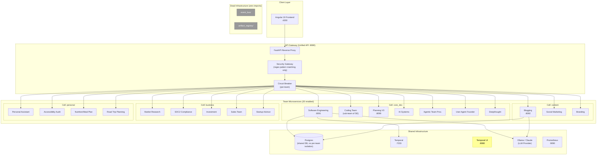
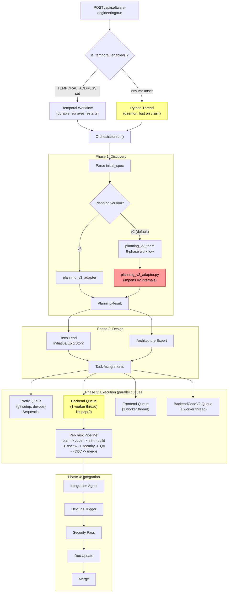
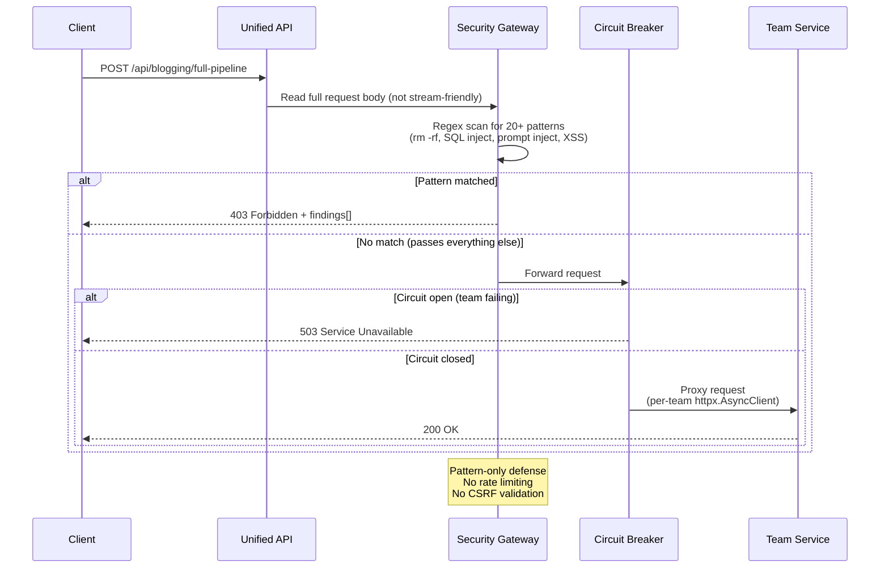
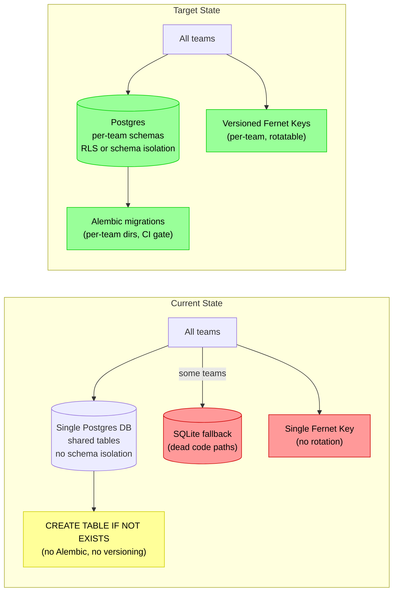
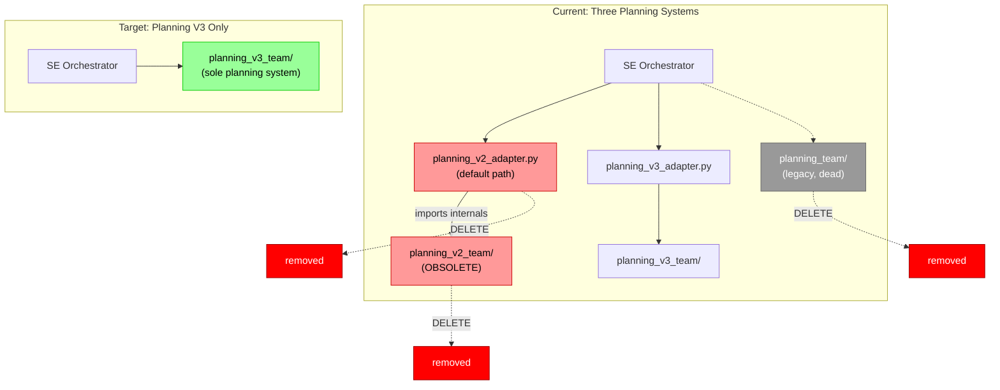
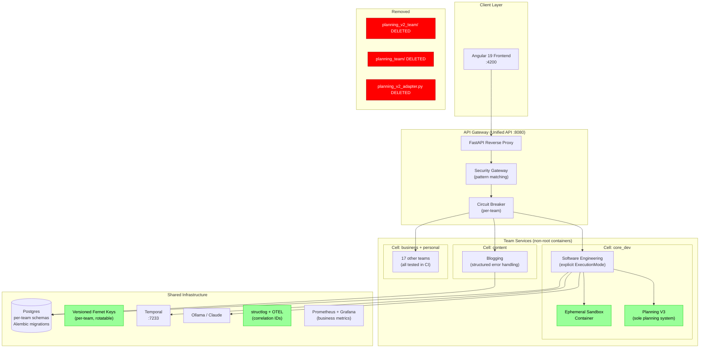

# SPEC-001: Platform Hardening and Foundation Consolidation

| Field       | Value                                               |
|-------------|-----------------------------------------------------|
| **Status**  | Approved                                            |
| **Author**  | Principal Engineer Review                           |
| **Created** | 2026-04-10                                          |
| **Priority**| P0-P2 (phased)                                      |
| **Scope**   | Cross-cutting: CI, Docker, SE pipeline, data layer, observability, DX |

---

## 1. Problem Statement

The Khala platform mounts 20 enabled agent teams under a single Unified FastAPI reverse proxy, backed by Postgres, Temporal, and Ollama/Claude LLM providers. A comprehensive review identified that the platform is **adding teams and capabilities faster than it is hardening shared infrastructure**. Specific gaps include:

- 17 of 20+ teams have **zero CI test coverage** -- regressions ship silently
- All Docker containers **run as root** with unsandboxed code execution
- Three planning systems coexist (**V2, V3, and legacy**) with tight adapter coupling
- Dead infrastructure (`event_bus/`, `artifact_registry/`) misleads contributors
- No database migration tooling, no structured logging, ad-hoc configuration management

Left unaddressed, these gaps increase incident risk, slow onboarding, and prevent safe scaling beyond the current team count.

---

## 2. Current State

### 2.1 System Overview



### 2.2 SE Pipeline (Primary Orchestrator)



### 2.3 Request Flow Through Security Gateway



### 2.4 Data Layer



### 2.5 Key Strengths (Preserve)

1. **Clean team mounting pattern** (`config.py`): Declarative `TeamConfig` with per-team timeouts, cell-based blast radius containment, circuit breakers, and lazy proxy registration
2. **Shared Postgres schema registry** (`shared_postgres/`): Pattern B (explicit lifespan call, pure-data `TeamSchema` exports) -- no import-time side effects, safe for testing
3. **LLM abstraction with typed error hierarchy** (`llm_service/`): `LLMClient` ABC with provider-agnostic error types and per-agent model selection via `LLM_MODEL_{agent_key}` env vars
4. **Observability scaffolding**: OpenTelemetry + Prometheus deps, `shared_observability/init_otel()` at startup, FastAPI/httpx auto-instrumentation
5. **Temporal integration**: SE team supports durable long-running workflows when `TEMPORAL_ADDRESS` is set
6. **Pydantic models throughout**: Consistent use of typed request/response contracts across teams

---

## 3. Goals and Non-Goals

### Goals

- Bring all teams under CI test coverage to prevent silent regressions
- Harden container security (non-root, credential hygiene)
- Consolidate the SE pipeline onto Planning V3 as the sole planning system
- Remove dead code (event_bus, artifact_registry, SQLite fallback paths, orphan directories)
- Introduce database migration tooling (Alembic)
- Improve observability with structured logging and correlation IDs
- Improve DX with a team scaffolding tool and centralized configuration

### Non-Goals

- Adding authentication or authorization to the API gateway (deferred)
- Rewriting the SE orchestrator's execution model (thread vs Temporal) -- only making the mode explicit
- Implementing code execution sandboxing (tracked in Ongoing, not in the 8-week window)
- Migrating the frontend to a different framework

---

## 4. Detailed Design

### 4.1 P0 -- Critical (Must Fix Before Production)

#### 4.1.1 Expand CI Test Coverage to All Teams

**Problem**: Only 6 of 20+ teams have CI test jobs (`.github/workflows/ci.yml`). The remaining 17 teams have tests that never run in CI.

**Files to modify**:
- `.github/workflows/ci.yml` -- add test jobs for all teams with existing test directories

**Approach**: For each team with a `tests/` directory, add a parallel CI job using the same pattern as existing jobs (Postgres service container, `pytest`).

#### 4.1.2 Run Containers as Non-Root

**Problem**: No `USER` directive in any Dockerfile. All containers run as root.

**Files to modify**:
- `backend/Dockerfile`
- All team service Dockerfiles under `backend/agents/*/Dockerfile` and `docker/`

**Approach**: Add a non-root user in the base image build stage, then `USER 1000` before the `CMD`.

#### 4.1.3 Remove Default Postgres Credentials

**Problem**: `postgres/postgres` defaults in `docker/docker-compose.yml` and `docker/.env.example`.

**Files to modify**:
- `docker/docker-compose.yml`
- `docker/.env.example`
- `CLAUDE.md` (getting started snippet)

**Approach**: Remove default values from compose `${VAR:-default}` patterns. Require explicit `.env`. Update docs.

#### 4.1.4 SE Team Code Execution Sandboxing (Design Only)

**Problem**: `subprocess.run()` in `backend/agents/software_engineering_team/shared/command_runner.py` executes with full container privileges.

**This phase**: Document the sandboxing approach. Implementation is tracked in Ongoing.

---

### 4.2 P1 -- High Priority (Reliability and Planning Migration)

#### 4.2.1 Fix Silent Exception Swallowing in Blogging Pipeline

**Problem**: 7+ `except Exception: pass` blocks in `backend/agents/blogging/shared/run_pipeline_job.py`.

**Approach**: Replace `pass` with structured error reporting: log at ERROR level, transition job to explicit failure state, re-raise `CancelledError` where appropriate.

#### 4.2.2 Integrate Database Migration Tooling (Alembic)

**Problem**: Schema changes are hand-rolled `CREATE TABLE IF NOT EXISTS` in `shared_postgres/`. No versioning, no rollback.

**Files to modify**:
- `backend/agents/shared_postgres/` -- add Alembic integration
- Per-team `postgres/` directories -- add migration scripts

**Approach**: Per-team Alembic `env.py` + `versions/` directories. CI gate validates `alembic upgrade head` succeeds.

#### 4.2.3 Migrate Fully to Planning V3

**Problem**: Three planning systems coexist. Planning V2 is obsolete. The SE orchestrator defaults to V2 via `planning_v2_adapter.py`.



**Files to modify/delete**:
- `software_engineering_team/orchestrator.py` -- switch default to V3
- `software_engineering_team/api/main.py` -- remove V2 code paths
- DELETE `software_engineering_team/planning_v2_adapter.py`
- DELETE `software_engineering_team/planning_v2_team/` (entire directory)
- DELETE `software_engineering_team/planning_team/` (entire directory)
- Simplify or inline `software_engineering_team/planning_v3_adapter.py`

**Approach**:
1. Update SE orchestrator to call Planning V3 directly (via existing `planning_v3_adapter.py`)
2. Remove all V2 references and the V2 adapter
3. Delete the `planning_v2_team/` and `planning_team/` directories
4. Simplify the V3 adapter -- with only one planning system, a thin adapter or direct call is sufficient

#### 4.2.4 Fernet Encryption Key Rotation

**Problem**: Single key in `backend/unified_api/integration_credentials.py`. No versioning, no rotation.

**Approach**: Store key version ID alongside ciphertext. Support multiple active keys. Add CLI for rotation + re-encryption of existing rows.

#### 4.2.5 Make Execution Mode Explicit

**Problem**: Thread vs Temporal mode is determined by env var at `software_engineering_team/api/main.py:503-514`. The orchestrator doesn't know which mode it's in.

**Approach**: Pass an `ExecutionMode` enum to the orchestrator. Log the active mode at startup.

#### 4.2.6 Delete SQLite Dead Code Paths

**Problem**: CLAUDE.md says "no SQLite fallback" for migrated teams, but SQLite code remains in `branding_team/store.py`, `agentic_team_provisioning/assistant/store.py`, `team_assistant/store.py`.

**Approach**: Delete SQLite code paths. Use in-memory stores for unit tests.

---

### 4.3 P2 -- Medium Priority (Maintainability and DX)

#### 4.3.1 Remove Dead Infrastructure

Delete `backend/agents/event_bus/` (zero imports outside its own `__init__.py`) and `backend/agents/artifact_registry/` (zero imports anywhere).

#### 4.3.2 Audit Orphan Directories

Investigate and clean up: `agent_repair_team/`, `team_assistant/`, `agent_git_tools/`, `agent_llm_tools_service/`, `analytics/`, `continuation_logs/`, `plans/`, nested `docker/` inside agents.

#### 4.3.3 Enable Type Checking in CI

Add pyright to CI. Fix violations incrementally. Remove the `agent_implementations/**` exemption from `pyproject.toml`.

#### 4.3.4 Create Team Scaffolding CLI

Build `khala scaffold <team_name>` that generates: `api/main.py`, `agent.py`, `models.py`, `prompts.py`, `temporal/__init__.py`, `postgres/__init__.py`, `tests/test_*.py`, and registers in `config.py`.

#### 4.3.5 Consolidate Configuration Management

Replace ~266 ad-hoc `os.getenv()` calls with Pydantic `BaseSettings` per team. Fail fast on missing required vars.

#### 4.3.6 Structured Logging with Correlation IDs

Migrate from `logging.basicConfig()` to `structlog`. Propagate `job_id` and `team_key` as bound context through agent workflows.

#### 4.3.7 Explicit Task Dependency Graph

Replace implicit FIFO queue ordering in the SE orchestrator with a DAG-based scheduler using topological sort.

#### 4.3.8 Extract Shared Backend Coding Logic

`backend_code_v2_team/` and `backend_agent/` share zero code. Extract common logic into `backend_code_agent_lib`.

---

## 5. Rollout Plan

```mermaid
gantt
    title 8-Week Improvement Roadmap
    dateFormat YYYY-MM-DD
    axisFormat %b %d

    section P0: Security & CI
    Add USER 1000 to all Dockerfiles          :crit, sec1, 2026-04-13, 2d
    Remove default Postgres credentials       :crit, sec2, 2026-04-13, 1d
    Add CI test jobs for 17 untested teams    :crit, sec3, 2026-04-14, 3d

    section P1: Reliability
    Fix silent except:pass in blogging        :high, rel1, 2026-04-20, 2d
    Delete SQLite dead code paths             :high, rel2, 2026-04-20, 3d
    Make execution mode explicit in SE        :high, rel3, 2026-04-22, 4d
    Fernet key versioning + rotation          :high, rel4, 2026-04-24, 4d

    section P1: Planning V3 Migration
    Update SE orchestrator to use V3 only     :crit, pv1, 2026-04-27, 3d
    Remove planning_v2_adapter + v2 team      :crit, pv2, 2026-04-30, 2d
    Delete legacy planning_team               :crit, pv3, 2026-05-01, 1d

    section P1-P2: Data & Observability
    Integrate Alembic migrations              :obs1, 2026-05-04, 5d
    Migrate to structlog + correlation IDs    :obs2, 2026-05-06, 4d
    Pool timeout + circuit breaker            :obs3, 2026-05-08, 3d
    Business metrics dashboard                :obs4, 2026-05-11, 4d

    section P2: Architecture & DX
    Delete/integrate event_bus + artifact_reg :dx1, 2026-05-18, 2d
    Audit orphan directories                  :dx2, 2026-05-18, 2d
    Create team scaffolding CLI               :dx3, 2026-05-20, 4d
    Pydantic BaseSettings consolidation       :dx4, 2026-05-22, 4d
```

### Week 1-2: Security & CI (P0)
- [ ] Add `USER 1000` to all Dockerfiles
- [ ] Remove default Postgres credentials from docker-compose
- [ ] Add CI test jobs for all 17 untested teams

### Week 3-4: Reliability (P1)
- [ ] Replace silent `except: pass` with structured error handling in blogging pipeline
- [ ] Delete SQLite code paths from migrated teams
- [ ] Make SE team execution mode explicit (pass mode to orchestrator)
- [ ] Add Fernet key versioning + rotation CLI

### Week 4-5: Planning V3 Migration (P1)
- [ ] Update SE orchestrator to use Planning V3 as sole planning system
- [ ] Remove `planning_v2_adapter.py` and all V2 references from SE orchestrator
- [ ] Delete `software_engineering_team/planning_v2_team/` entirely
- [ ] Delete `software_engineering_team/planning_team/` (legacy)
- [ ] Simplify or inline `planning_v3_adapter.py` (no adapter needed for single system)

### Week 5-6: Data & Observability (P1-P2)
- [ ] Integrate Alembic for schema migrations
- [ ] Migrate to structlog with correlation IDs
- [ ] Add pool wait timeout + circuit breaker to shared_postgres
- [ ] Add business metrics (job success rate, LLM cost, planning duration)

### Week 7-8: Architecture & DX (P2)
- [ ] Delete or integrate event_bus and artifact_registry
- [ ] Audit and clean up orphan directories
- [ ] Create team scaffolding CLI
- [ ] Consolidate env vars into Pydantic BaseSettings per team

### Ongoing (Beyond 8-Week Window)
- [ ] Enable pyright in CI (incremental rollout)
- [ ] Add E2E tests (Playwright) for critical UI flows
- [ ] Extract shared backend coding logic into library
- [ ] Build explicit task DAG for SE orchestrator
- [ ] Implement code execution sandboxing (ephemeral containers)

---

## 6. Target Architecture



---

## 7. Verification

After implementing improvements, validate with:

| Check | Command / Method | Expected Result |
|-------|-----------------|-----------------|
| CI coverage | Review `.github/workflows/ci.yml` | Test job count matches team count |
| Container security | `docker inspect --format '{{.Config.User}}' <container>` | Returns non-root user |
| Planning V3 migration | `grep -r "planning_v2" backend/` | 0 results |
| Planning V3 migration | `ls backend/agents/software_engineering_team/planning_v2_team/` | Directory does not exist |
| Migration tooling | `alembic upgrade head && alembic downgrade -1` | Both succeed |
| Structured logging | Inspect log output from any team service | Contains `trace_id`, `job_id` fields |
| No dead code | `grep -r "from event_bus" backend/` | 0 results |
| No SQLite fallback | `grep -r "sqlite" backend/agents/branding_team/ backend/agents/agentic_team_provisioning/` | 0 results |
| Credentials | `grep -rn "postgres.*:-postgres" docker/docker-compose.yml` | 0 results (no defaults) |
