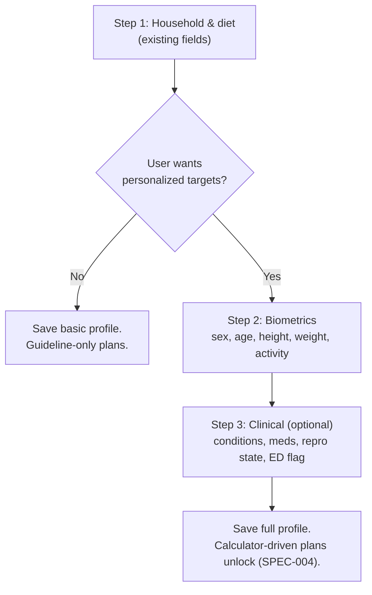

# SPEC-002: Nutrition profile — biometric and clinical data model

| Field       | Value                                                    |
|-------------|----------------------------------------------------------|
| **Status**  | Proposed                                                 |
| **Author**  | Nutrition & Meal Planning team                           |
| **Created** | 2026-04-17                                               |
| **Priority**| P0 (blocks SPEC-003 and SPEC-004)                        |
| **Scope**   | `backend/agents/nutrition_meal_planning_team/` (models, Postgres, intake agent, orchestrator, API) + `user-interface/` intake screens |
| **Implements** | ADR-001 §1 (profile extension), §5 (safety routing — data side) |

---

## 1. Problem Statement

The Nutritionist agent is being asked to produce numeric daily targets
(kcal, protein, fat, carbs, micros) from a `ClientProfile` that does
not carry the inputs any textbook equation needs. The profile has no
`sex`, `age_years`, `height_cm`, `weight_kg`, or activity level; it
has no way to express medical conditions, medications, pregnancy, or
lactation beyond a free-text `goals.notes` field.

The deterministic calculator (SPEC-003) and the refactored agent
(SPEC-004) cannot ship until the profile can carry the inputs they
require and the intake pipeline can reliably collect them. This spec
is the data-and-intake half of ADR-001 and must land first.

This spec does **not** compute targets or change agent behavior. It
only ensures the data exists, is validated, and is editable.

---

## 2. Current State

### 2.1 Profile today

`backend/agents/nutrition_meal_planning_team/models.py:58-72`:

```
ClientProfile
├── client_id: str
├── household: HouseholdInfo
├── dietary_needs: List[str]
├── allergies_and_intolerances: List[str]
├── lifestyle: LifestyleInfo
├── preferences: PreferencesInfo
├── goals: GoalsInfo { goal_type, notes }
└── updated_at: Optional[str]
```

### 2.2 Intake flow today

```mermaid
flowchart LR
    UI["Intake UI<br/>(profile form)"] -->|PUT /profile/{id}| API
    API -->|ProfileUpdateRequest| ORCH[Orchestrator]
    ORCH -->|intake_agent.run| INTAKE["IntakeProfileAgent<br/>(LLM merge/complete)"]
    INTAKE -->|ClientProfile| STORE[(nutrition_profiles)]
    INTAKE -.fallback.-> MERGE["_merge_profile_structural<br/>(no-LLM merge)"]
```

`IntakeProfileAgent` (`agents/intake_profile_agent/agent.py`) takes
partial updates, asks the LLM to validate + complete, and falls back
to a structural merge when the LLM is unavailable. There is no
numeric validation, no unit enforcement, and no safety routing.

### 2.3 Gaps

1. Biometrics absent — no height, weight, age, sex, activity level.
2. Clinical context absent — no structured conditions, medications,
   pregnancy/lactation state.
3. Units not enforced — the LLM is free to interpret any strings it
   sees.
4. Edit audit absent — we cannot tell when weight was last logged or
   why targets should be recomputed.
5. Safety flags (ED history, clinician-set floors, minor status) have
   no home in the model.

---

## 3. Goals and Non-Goals

### 3.1 Goals

- Extend `ClientProfile` with the fields ADR-001 requires, with
  explicit units, strict validation, and implausibility guards.
- Provide a versioned, audited write path (biometrics change over
  time; history matters for SPEC-003 trajectory work and ADR-006).
- Ship progressive-disclosure UI: existing paths remain usable with
  a partial profile; advanced fields unlock calculator-driven
  features.
- Add structured safety flags and clinician overrides as first-class
  fields, not free text.
- Migrate existing profiles without data loss and without requiring
  users to re-enter data they have already provided.

### 3.2 Non-goals

- **No calculator behavior.** This spec does not compute BMR, TDEE,
  targets, or trajectories. That is SPEC-003.
- **No agent refactor.** The Nutritionist agent continues to receive
  the profile as-is. SPEC-004 changes how the agent uses it.
- **No device integrations.** Apple Health / Google Fit / Withings
  ingestion is an ADR-006 follow-up and lands on top of the schema
  defined here, unchanged.
- **No clinician portal.** Clinician-set overrides are modelled here
  but the authorization path (who can write them) is a separate
  spec. v1 accepts overrides only from admin API with audit log.

---

## 4. Detailed Design

### 4.1 Model additions (`models.py`)

New Pydantic models and fields on `ClientProfile`. All additive.

```python
class Sex(str, Enum):
    female = "female"
    male = "male"
    other = "other"
    unspecified = "unspecified"

class ActivityLevel(str, Enum):
    sedentary = "sedentary"      # PAL 1.2
    light = "light"              # PAL 1.375
    moderate = "moderate"        # PAL 1.55
    active = "active"            # PAL 1.725
    very_active = "very_active"  # PAL 1.9

class BiometricInfo(BaseModel):
    sex: Sex = Sex.unspecified
    age_years: Optional[int] = Field(default=None, ge=2, le=120)
    height_cm: Optional[float] = Field(default=None, ge=50, le=260)
    weight_kg: Optional[float] = Field(default=None, ge=20, le=400)
    body_fat_pct: Optional[float] = Field(default=None, ge=3, le=75)
    activity_level: ActivityLevel = ActivityLevel.sedentary
    timezone: str = "UTC"            # IANA zone; used by ADR-005/006
    measured_at: Optional[str] = None

class ReproductiveState(str, Enum):
    none = "none"
    pregnant_t1 = "pregnant_t1"
    pregnant_t2 = "pregnant_t2"
    pregnant_t3 = "pregnant_t3"
    lactating = "lactating"
    postpartum = "postpartum"

class ClinicalInfo(BaseModel):
    conditions: List[str] = []       # canonical tags, see §4.2
    medications: List[str] = []      # canonical tags, see §4.2
    reproductive_state: ReproductiveState = ReproductiveState.none
    ed_history_flag: bool = False    # disables scale-centric UX
    clinician_overrides: Dict[str, float] = {}  # e.g. {"bmi_floor": 19.5}

class GoalsInfo(BaseModel):
    goal_type: str = "maintain"
    target_weight_kg: Optional[float] = Field(default=None, ge=20, le=400)
    rate_kg_per_week: Optional[float] = Field(default=None, ge=0, le=1.0)
    started_at: Optional[str] = None
    paused_at: Optional[str] = None
    notes: str = ""

class ClientProfile(BaseModel):
    # ... existing fields ...
    biometrics: BiometricInfo = Field(default_factory=BiometricInfo)
    clinical: ClinicalInfo = Field(default_factory=ClinicalInfo)
    profile_version: int = 1         # monotonic; bumped on any write
    schema_version: str = "2.0"      # data-model version
```

Field-level validators (Pydantic v2 `@field_validator`):

- `weight_kg` and `target_weight_kg`: implausibility ranges above
  (20–400 kg). Hard reject outside the range — do **not** clamp;
  return 422 to the client.
- `rate_kg_per_week`: cap at 1.0 per week on input; clinical clamps
  apply later in SPEC-004.
- `timezone`: must be an IANA zone (validate via `zoneinfo`).
- `age_years < 18`: allowed on write, but every response that
  includes such a profile sets a `minor=True` derived flag for the UI
  (SPEC-004 refuses weight-loss goals for minors — not here).

### 4.2 Canonical clinical taxonomy

Separate file `nutrition_meal_planning_team/clinical_taxonomy.py`:

- `CONDITIONS` — closed enum, v1 covers: `ckd_stage_1..5`,
  `hypertension`, `t1_diabetes`, `t2_diabetes`, `prediabetes`,
  `pcos`, `hypothyroid`, `hyperthyroid`, `celiac`, `ibs`, `gerd`,
  `gallstones`, `dyslipidemia`, `gout`. Anything outside the enum
  goes to `conditions_freetext: List[str]` on `ClinicalInfo` (string
  list, surfaced to agents as caveat notes, not used by calculator).
- `MEDICATIONS` — closed enum tagging *class*, not drug name:
  `warfarin`, `maoi`, `ssri`, `acei_arb`, `k_sparing_diuretic`,
  `statin`, `amiodarone`, `glp1`, `metformin`, `levothyroxine`,
  `lithium`, `st_johns_wort`. Same open/closed split.
- The enum is load-bearing for ADR-002's interaction guardrail; we
  freeze it in a file and version it (`CLINICAL_TAXONOMY_VERSION`).

### 4.3 Postgres schema

Register via `shared_postgres.register_team_schemas` in the team's
lifespan (`api/main.py`):

```sql
-- Additive: extend nutrition_profiles (existing table)
ALTER TABLE nutrition_profiles
    ADD COLUMN biometrics JSONB NOT NULL DEFAULT '{}'::jsonb,
    ADD COLUMN clinical   JSONB NOT NULL DEFAULT '{}'::jsonb,
    ADD COLUMN profile_version INT NOT NULL DEFAULT 1,
    ADD COLUMN schema_version TEXT NOT NULL DEFAULT '2.0';

-- New: audit trail for biometric edits (feeds ADR-006)
CREATE TABLE nutrition_biometric_log (
    id              BIGSERIAL PRIMARY KEY,
    client_id       TEXT NOT NULL REFERENCES nutrition_profiles(client_id)
                         ON DELETE CASCADE,
    field           TEXT NOT NULL,        -- e.g. 'weight_kg'
    value_numeric   DOUBLE PRECISION,
    value_text      TEXT,
    unit            TEXT,
    source          TEXT NOT NULL,        -- 'manual' | 'api' | 'import'
    recorded_at     TIMESTAMPTZ NOT NULL DEFAULT now(),
    recorded_by     TEXT                   -- user id or 'system'
);
CREATE INDEX ON nutrition_biometric_log (client_id, field, recorded_at DESC);

-- New: clinician-authored overrides and safety flags audit
CREATE TABLE nutrition_clinical_overrides_log (
    id              BIGSERIAL PRIMARY KEY,
    client_id       TEXT NOT NULL REFERENCES nutrition_profiles(client_id)
                         ON DELETE CASCADE,
    key             TEXT NOT NULL,
    value_numeric   DOUBLE PRECISION,
    reason          TEXT,
    author          TEXT NOT NULL,         -- clinician id or 'admin'
    recorded_at     TIMESTAMPTZ NOT NULL DEFAULT now()
);
```

Follow the Pattern B schema registry from
[shared_postgres/README.md](backend/agents/shared_postgres/README.md).
A migration script (idempotent `CREATE ... IF NOT EXISTS` and
`ADD COLUMN IF NOT EXISTS`) lives at
`nutrition_meal_planning_team/postgres/migrations/002_biometrics.sql`
and is applied on lifespan startup.

### 4.4 Intake agent changes

`agents/intake_profile_agent/agent.py`:

- System prompt updated to describe the new fields with **explicit
  unit reminders** ("height in cm only", "weight in kg only"). The
  agent's job is still merge-and-complete, not inference — never
  invent biometrics.
- Parse output via `llm_service` structured-output contract (PR #184)
  — no more regex markdown stripping.
- On LLM failure, `_merge_profile_structural` extended to handle the
  new sub-objects with the same shallow-merge semantics.
- New: **unit coercion pass** — if the user enters a height in inches
  or weight in lbs, the intake agent performs explicit conversion
  (with a confirmation note in the response) rather than silently
  accepting a wrong number. Conversions live in
  `nutrition_meal_planning_team/units.py` (pure function, tested).

### 4.5 API surface

Additive endpoints on top of the existing `/api/nutrition-meal-planning`:

| Method | Path | Purpose |
|--------|------|---------|
| `PATCH` | `/profile/{client_id}/biometrics` | Append-only biometric update; writes to `nutrition_biometric_log`; updates `ClientProfile.biometrics` to latest values |
| `GET`  | `/profile/{client_id}/biometrics/history?field=weight_kg&since=...` | Paginated biometric history for the UI trend chart and ADR-006 |
| `PATCH` | `/profile/{client_id}/clinical` | Update `ClinicalInfo` (conditions, meds, reproductive state, ED flag) |
| `PUT`  | `/profile/{client_id}/clinical-overrides` | Admin-only (v1); writes `nutrition_clinical_overrides_log` and updates `clinician_overrides` |
| `GET`  | `/profile/{client_id}/completeness` | Returns `{has_biometrics: bool, has_activity: bool, has_conditions_confirmed: bool, blockers: [str]}` — drives UI gating |

The existing `PUT /profile/{client_id}` remains for bulk updates and
accepts the new nested fields; preferred writes for biometrics use
the `PATCH` path so history is recorded.

### 4.6 UI changes (intake)

Progressive-disclosure flow in `user-interface/src/app/components/`:



Key UI rules:

- **Units**: input fields carry the unit in the label ("Height (cm)")
  and optionally a unit toggle (cm↔ft/in, kg↔lb) that performs
  conversion client-side before submit. The toggle writes user
  preference to `BiometricInfo.preferred_units` (additive field, not
  in calculator path).
- **Implausibility feedback**: client-side validation mirrors backend
  bounds to avoid round-trip errors.
- **ED-history flag**: presented as "I'd prefer to avoid scale-based
  or calorie-based goals" in plain language, not as a medical term.
  Toggling it to true hides weight inputs and any weight-trend UI.
- **Minor flow**: when `age_years < 18`, the form disables
  weight-loss goals and shows a short "growth-focused guidance"
  explanation.
- **Clinician-set overrides**: not user-editable. Displayed read-only
  with author and date where present.

### 4.7 Backfill and migration

Existing profiles lack the new fields. Strategy:

1. Migration sets `biometrics={}`, `clinical={}` defaults — users do
   not lose anything; they simply do not have advanced data yet.
2. On the next login after deploy, the orchestrator's
   `get_profile` adds a `completeness` block to the response (see
   §4.5). UI uses it to show a dismissible "add details for a
   personalized plan" banner.
3. We do **not** block existing flows. Profiles with empty
   biometrics continue to work against the existing agent path
   (SPEC-004 gates calculator features on completeness).

### 4.8 Privacy and retention

- Biometrics and clinical data are PHI-adjacent. They inherit the
  existing `nutrition_profiles` retention policy; deletion cascades
  remove `nutrition_biometric_log` and `nutrition_clinical_overrides_log`.
- Logs above DEBUG level must not include biometric values. A
  `shared_observability` filter rule is added and tested in §6.
- Existing PII considerations from the platform privacy policy apply;
  no new policy work is required for this spec, but a one-line
  CHANGELOG entry under "Privacy" is mandatory on deploy.

### 4.9 Priority-grouped work items

| # | Item | Owner | Priority |
|---|------|-------|----------|
| W1 | Extend `models.py` with `BiometricInfo`, `ClinicalInfo`, `GoalsInfo` additions, `Sex`, `ActivityLevel`, `ReproductiveState` enums; add Pydantic validators | Backend | P0 |
| W2 | `clinical_taxonomy.py` with closed enums + freetext escape hatch | Backend | P0 |
| W3 | Postgres migration `002_biometrics.sql` + update `SCHEMA` registration | Backend | P0 |
| W4 | Intake agent prompt update + structured-output parsing + unit coercion | Backend | P1 |
| W5 | API endpoints (§4.5) + store helpers | Backend | P1 |
| W6 | Completeness endpoint + banner component | FE+BE | P1 |
| W7 | Progressive-disclosure intake UI (Steps 2–3) | Frontend | P1 |
| W8 | Clinical-override admin endpoint (stub UI) | Backend | P2 |
| W9 | Unit toggle (cm↔ft/in, kg↔lb) component | Frontend | P2 |
| W10 | Retention + log-redaction audit | Backend | P2 |

---

## 5. Rollout Plan

Phased behind a feature flag `NUTRITION_PROFILE_V2` (unified-config).
All phases are reversible via flag; schema migration is additive and
non-destructive.

### Phase 0 — Foundation (P0)
- [ ] Land W1, W2, W3. Migration applied in staging Postgres.
- [ ] Existing tests green; no behavior change yet.
- [ ] Flag defaulted off.

### Phase 1 — Write path (P0/P1)
- [ ] W4 intake agent changes (flagged path).
- [ ] W5 PATCH endpoints live (flag-gated).
- [ ] W10 log redaction verified in staging (grep biometric values in logs → must be zero).
- [ ] Deploy to staging; dogfood with team profiles.

### Phase 2 — Read path and UI (P1)
- [ ] W6 completeness endpoint returning correct blockers.
- [ ] W7 progressive intake UI behind flag.
- [ ] Banner copy review (see §6.5 copy checklist).
- [ ] Soft launch to 10% of users; monitor completion funnel.

### Phase 3 — Polish and override path (P2)
- [ ] W8 clinician-override admin endpoint.
- [ ] W9 unit toggle.
- [ ] Flag defaulted on; flag-removal ticket filed (sunset in 30 days).

### Rollback
- Flag off → UI collapses to existing intake, API ignores new fields
  on read. Migration stays applied (additive; no destructive rollback
  needed).

---

## 6. Verification

### 6.1 Unit tests

- `test_models_validators.py` — every bound (`age`, `height`, `weight`,
  `body_fat`, `rate_kg_per_week`, `timezone`) rejects outside-range
  input with 422-equivalent validation errors.
- `test_units.py` — unit-conversion round-trips are exact to 3
  decimal places; malformed input returns `None`, not silent zero.
- `test_clinical_taxonomy.py` — enum membership; taxonomy version
  constant present and exported.
- `test_intake_agent_v2.py` — structured-output parse success and
  failure paths; fallback merge handles new nested objects without
  flattening.

### 6.2 Integration tests

- `test_profile_api_biometrics.py` — `PATCH /biometrics` writes both
  the latest value onto `ClientProfile.biometrics` and a row into
  `nutrition_biometric_log`; `GET /history` pagination works.
- `test_completeness.py` — matrix of partial profiles returns the
  correct blockers.
- `test_minor_flow.py` — profile with `age_years=15` returns
  `minor=True` and blocks weight-loss goals at API level.
- `test_ed_flag.py` — profile with `ed_history_flag=true` causes
  `completeness` to omit scale/calorie blockers and UI-side
  rendering tests confirm weight inputs disappear.

### 6.3 Migration tests

- `test_migration_002.py` — against a fixture with `schema_version=1`
  profiles, applying the migration produces `schema_version=2.0`
  with default empty `biometrics`/`clinical`, and no existing field
  is dropped or changed.

### 6.4 Observability

- OTel counters: `nutrition.profile.biometric_write{field}`,
  `nutrition.profile.implausible_reject{field}`,
  `nutrition.profile.completeness_blocker{blocker}`.
- Log-redaction grep check in CI (§Phase 1 checklist).

### 6.5 UX / copy checklist (dashboard parity with ADR-006 §6)

- [ ] No shame-framed copy anywhere in intake.
- [ ] ED-flag toggle uses plain language, not medical jargon.
- [ ] Minor flow copy reviewed against roadmap copy guidelines.
- [ ] Unit labels unambiguous; toggle is obvious and reversible.

### 6.6 Cutover criteria (flag-on)

- P0/P1 tests passing on `main`.
- Staging dogfood ≥7 days with zero implausibility false-rejects on
  real team profiles.
- Logs grep: 0 biometric values leaked at INFO or above.
- Completion funnel on 10% soft launch ≥70% (users who started the
  biometrics step finished it). Below 70% → revisit UX before wider
  roll.

---

## 7. Open Questions

- **Who owns the clinical taxonomy?** The team needs a named reviewer
  when we extend `CONDITIONS` / `MEDICATIONS`. Deferred to a naming
  doc; initial reviewer is the Nutrition team lead.
- **Do we expose `preferred_units` in the API response to other
  teams?** Probably yes for UI consistency. v1 keeps it private to
  the nutrition team; revisit when another team needs it.
- **Biometric-log retention horizon.** We keep indefinitely in v1.
  Revisit when ADR-006 compliance export lands.
