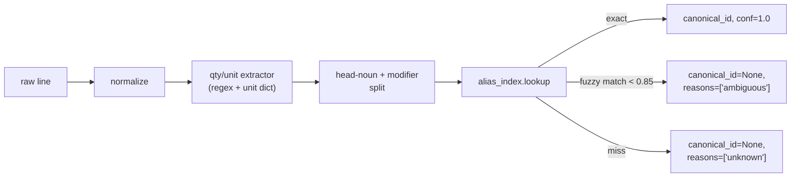

# SPEC-005: Ingredient knowledge base and deterministic parser

| Field       | Value                                                    |
|-------------|----------------------------------------------------------|
| **Status**  | Proposed                                                 |
| **Author**  | Nutrition & Meal Planning team                           |
| **Created** | 2026-04-17                                               |
| **Priority**| P0 (blocks SPEC-006, SPEC-007, ADR-003, ADR-005)         |
| **Scope**   | New pure-Python module `backend/agents/nutrition_meal_planning_team/ingredient_kb/`, data files, parser, CLI tools |
| **Implements** | ADR-002 §1 (canonical ingredient model) |

---

## 1. Problem Statement

Every downstream nutrition feature — the allergen guardrail (SPEC-007),
the nutrient rollup (ADR-003), the grocery-list aggregator and
substitution agent (ADR-005) — needs one thing the codebase does not
have: a deterministic way to take a free-text ingredient line
("almond flour", "1 tbsp soy sauce", "a handful of cashews") and
resolve it to a canonical identifier with known properties.

`MealRecommendation.ingredients: List[str]` is free text. Two
recipes that both call for red onion emit different strings; a
parser that "almost works" propagates errors into safety checks.

This spec ships the canonical ingredient knowledge base and its
parser as a standalone library — no LLM, no Postgres, no agent
dependency. It is the foundation the next three specs (and several
follow-up roadmap items) consume unchanged.

The data-curation commitment is the non-trivial part; §4.1–§4.3
define the shape of the data, the process for extending it, and the
quality bar for shipping v1.

---

## 2. Current State

### 2.1 Ingredient strings today

`MealRecommendation.ingredients` is produced by the meal-planning
agent and looks like:

```
["1 tbsp olive oil",
 "400g chicken thighs, diced",
 "a handful of cashews",
 "soy sauce",
 "chili flakes to taste"]
```

These strings flow through `_record_suggestions`
([orchestrator/agent.py:171](backend/agents/nutrition_meal_planning_team/orchestrator/agent.py:171))
directly into the store with no normalization.

### 2.2 Downstream consumers (blocked by this spec)

- **SPEC-006 / SPEC-007 allergen guardrail** — must know "cashews"
  is a `tree_nut`.
- **ADR-003 nutrient rollup** — must convert "a handful" of cashews
  into grams, then grams into kcal / protein / fat / micros.
- **ADR-005 grocery list** — must aggregate "1 tbsp soy sauce"
  across three recipes into one purchasable unit.
- **ADR-005 substitution** — must know that silken tofu is a
  reasonable stand-in for Greek yogurt for given use cases.

All of these depend on the same three capabilities: resolve a string
to a canonical id, look up properties of that id, convert between
units.

### 2.3 Gaps

- No canonical id space for ingredients.
- No closed allergen taxonomy.
- No parser. No alias index. No unit conversion table.
- No curation process, reviewer, or versioning for the KB.

---

## 3. Goals and Non-Goals

### 3.1 Goals

- Ship a pure-Python module exposing three primary functions:
  `parse_ingredient`, `resolve_canonical_id`, and
  `convert_to_grams`. All three are deterministic and have no I/O.
- Define the closed allergen taxonomy (FDA Big-9 + EU-14 superset)
  as an authoritative Python enum. The enum is load-bearing for
  SPEC-006 and SPEC-007.
- Seed `canonical_foods.yaml` with ~2,000 common ingredients, with
  strict rules about what "shipped" means: citation for allergen
  tags, reviewer sign-off on edits.
- Provide CLI tools for (a) adding new ingredients with lint checks,
  (b) auditing parser coverage against a corpus of past recipe
  outputs, and (c) regenerating the alias index from a single
  source of truth.
- Version the KB. A `KB_VERSION` constant lets downstream caches
  (SPEC-007 guardrail rejections, ADR-003 rollups) invalidate
  deterministically.

### 3.2 Non-goals

- **No enforcement.** This spec does not reject meals, warn users,
  or call agents. It only resolves strings to ids and exposes
  properties.
- **No nutrient data.** Per-ingredient nutrients are ADR-003. The
  schema here has a reserved slot; population lives in the nutrient
  rollup spec.
- **No recipe parsing.** Only ingredient *lines* are in scope. Step
  text, recipe titles, grocery-list formatting are out.
- **No branded foods.** v1 covers generic ingredients only. Branded
  Foods (USDA Branded Foods set) are a follow-up.
- **No LLM fallback.** Ambiguous lines return `canonical_id=None`
  with a reason — the downstream decision (ask the user, reject the
  meal) belongs in SPEC-006 and SPEC-007.

---

## 4. Detailed Design

### 4.1 Module layout

```
backend/agents/nutrition_meal_planning_team/ingredient_kb/
├── __init__.py                 # parse_ingredient, resolve_canonical_id,
│                               # convert_to_grams, KB_VERSION
├── version.py                  # KB_VERSION = "1.0.0"
├── taxonomy.py                 # AllergenTag, DietaryTag, InteractionTag enums
├── types.py                    # ParsedIngredient, CanonicalFood, Unit
├── parser.py                   # deterministic rule-based parser
├── normalizer.py               # string normalization (case, diacritics, plurals)
├── alias_index.py              # prefix + fuzzy lookup over aliases
├── units.py                    # unit conversion (volume/mass/count)
├── errors.py                   # KBError, UnknownUnitError, AmbiguousIngredientError
├── data/
│   ├── canonical_foods.yaml    # the authoritative catalog
│   ├── aliases.yaml            # surface-form → canonical_id
│   ├── densities.yaml          # volume→mass by canonical_id
│   ├── units.yaml              # unit definitions and conversions
│   └── interactions.yaml       # ingredient → interaction_tag (reserved for
│                               #   SPEC-007; populated but not enforced here)
├── cli/
│   ├── add.py                  # interactive add + lint
│   ├── audit.py                # parser coverage over a corpus
│   └── reindex.py              # rebuild aliases.yaml from canonical_foods.yaml
└── tests/
    ├── corpora/                # fixture ingredient lines (see §6)
    └── ...
```

### 4.2 Closed taxonomies (`taxonomy.py`)

Three closed `StrEnum`s. **Closed** means: only changeable via a
MAJOR `KB_VERSION` bump; downstream code pattern-matches on them.

- `AllergenTag` — FDA Big-9 (`peanut`, `tree_nut`, `dairy`, `egg`,
  `soy`, `wheat`, `fish`, `shellfish`, `sesame`) plus EU-14 extras
  (`mustard`, `celery`, `sulfites`, `lupin`, `mollusc`, `gluten`).
  `gluten` is separate from `wheat` deliberately — spelt and barley
  are gluten without being wheat.
- `DietaryTag` — `animal`, `dairy`, `egg`, `honey`, `gelatin`,
  `alcohol`, `high_fodmap`, `nightshade`, `gluten`, `grain`,
  `legume`, `nightshade`. A `vegan` profile (SPEC-006) expands to
  `forbid: {animal, dairy, egg, honey, gelatin}`.
- `InteractionTag` — `vitamin_k_high`, `tyramine_high`,
  `potassium_high`, `grapefruit`, `licorice`, `st_johns_wort`,
  `very_high_fat`, `caffeine_high`, `sodium_very_high`.
  Reserved for SPEC-007 enforcement; this spec only tags foods.

Enum changes require:

1. A `KB_VERSION` bump (major for removals or tag renames; minor
   for additions).
2. Changelog entry under `ingredient_kb/CHANGELOG.md`.
3. Reviewer sign-off (see §4.6).

### 4.3 Canonical food schema (`canonical_foods.yaml`)

```yaml
- id: almond_flour
  display_name: "Almond flour"
  fdc_id: 170567                 # USDA FDC id where available
  allergen_tags: [tree_nut]
  dietary_tags: [grain]          # for grain-free filtering; not a gluten
  interaction_tags: []
  parent_ids: [almond]
  purchase_unit:
    unit: g
    typical_package_g: 454
  aliases:
    - "almond flour"
    - "ground almonds"
    - "almond meal"
  citations:
    allergen: "FDA Big-9: tree nuts include almonds"
  notes: "Meal and flour differ in texture but share allergen tags."

- id: soy_sauce
  display_name: "Soy sauce"
  fdc_id: 174278
  allergen_tags: [soy, wheat, gluten]
  dietary_tags: [alcohol]        # brewed; most contain trace alcohol
  interaction_tags: [sodium_very_high]
  purchase_unit: { unit: ml, typical_package_ml: 250 }
  aliases: ["soy sauce", "shoyu", "light soy sauce", "dark soy sauce"]
  notes: "Tamari variants do NOT share gluten. Separate canonical id: tamari."
```

Required fields: `id`, `display_name`, `allergen_tags`,
`dietary_tags`, `aliases`. All other fields are optional in v1.

**Rules enforced by lint (`cli/add.py`):**

- `id` is `snake_case`, globally unique, ASCII.
- `aliases` includes `display_name` lowercased.
- Any `allergen_tag` or `dietary_tag` that maps to a regulated
  category (FDA Big-9) requires a non-empty `citations.allergen`.
- Variants that differ in allergen profile (tamari vs. soy sauce,
  oat milk made with barley) must be separate ids, not aliases.
- Plural forms are NOT aliases — the normalizer handles pluralization
  (§4.7).

### 4.4 v1 seed corpus (2,000 ingredients)

v1 ships with ~2,000 ingredients covering:

- USDA FDC SR Legacy most-used foods (≈1,200).
- Top ingredients from a sample of recipe corpora (≈500) —
  generated by running `cli/audit.py` against a snapshot of past
  `MealRecommendation` outputs and anything with ≥3 occurrences
  that does not yet resolve.
- Priority allergen-bearing foods (≈300 on top, some overlap) —
  every item in FDA Big-9 + EU-14 categories covered at least for
  common forms.

**Ship gate**: parser coverage ≥95% on a 500-line holdout corpus
of ingredient strings sampled from production (`audit` tool, §4.9).

### 4.5 Parser (`parser.py`)

Deterministic, grammar-light. Input: one line of free text. Output:

```python
@dataclass(frozen=True)
class ParsedIngredient:
    raw: str
    qty: Optional[float]             # 1.0, 0.5, None ("to taste")
    unit: Optional[Unit]             # Unit.tbsp, Unit.g, Unit.count, ...
    name: str                        # the head noun phrase
    modifiers: tuple[str, ...]       # "diced", "raw", "low-sodium"
    canonical_id: Optional[str]
    confidence: float                # 0.0..1.0
    reasons: tuple[str, ...]         # when confidence < 1.0, why
```

Pipeline:



No ML, no LLM. This is deliberate — ambiguity is surfaced, not
hidden. Downstream decides what to do.

Quirk handling (all covered by tests in §6.1):

- "a handful of cashews" → `qty=None, unit=None`,
  `reasons=['unparsed_qty']`, but canonical resolution still succeeds.
- "1 (14 oz) can of chickpeas" → `qty=14, unit=oz` (the package
  size), preferring canonical purchase-unit semantics.
- "salt, to taste" → `canonical_id=salt, qty=None, unit=None`.
- Recipe-embedded instructions ("chicken, diced and patted dry") →
  modifiers stripped; `canonical_id=chicken_breast_raw` or
  `chicken_thigh_raw` only if explicitly stated, otherwise the
  generic `chicken_raw` with `confidence=0.9`.
- "juice of 1 lemon" → `canonical_id=lemon_juice, qty=1, unit=count_lemon`
  with a special unit that `convert_to_grams` handles.

### 4.6 Alias index (`alias_index.py`)

- Built in-memory at import from `aliases.yaml` + the `aliases`
  field on every canonical food.
- Primary lookup is exact after normalization (§4.7). Falls through
  to a prefix/ngram fuzzy match capped at `score < 0.85` as
  ambiguous.
- Index is stable: same input → same result, deterministically.
- Rebuild via `cli/reindex.py` on every canonical-foods edit; the
  rebuilt file is checked in so runtime doesn't compute it.

### 4.7 Normalizer (`normalizer.py`)

Rules, applied in order:

1. Unicode NFKC, strip diacritics.
2. Lowercase.
3. Pluralization: English rules + an overrides table for
   irregulars (`tomatoes`→`tomato`, `leaves`→`leaf`). Non-English
   text is routed through the alias index as-is (aliases include
   non-English forms explicitly, e.g. `"amandes en poudre"` →
   `almond_flour`).
4. Punctuation stripped except interior commas (used by the parser).
5. Stopword trim (`of`, `the`) only when adjacent to a unit token.

Normalization is applied to both sides of alias lookup so authors
can write aliases in natural form.

### 4.8 Unit system (`units.py`, `densities.yaml`)

- `units.yaml` defines: `mass` (g, kg, oz, lb), `volume` (ml, l,
  tsp, tbsp, cup, fl_oz, pint, quart), `count` (count, dozen,
  `count_lemon`/`count_egg`/etc.).
- Volume → mass conversion uses `densities.yaml` keyed by
  `canonical_id`. `densities.yaml` is hand-curated; missing entries
  cause `convert_to_grams` to return `None` with a structured reason.
- `convert_to_grams(parsed: ParsedIngredient) -> Optional[Grams]`
  is pure and deterministic. Missing density → returns `None`; no
  silent fallback to "average density of food".
- `count` units for items like onions use per-item masses from
  `densities.yaml` (`onion_medium: 170g`).

### 4.9 CLI tools

- `python -m ingredient_kb.cli.add` — interactive: prompts for
  `id`, `display_name`, allergens, aliases; runs lint; appends to
  `canonical_foods.yaml`; rebuilds `aliases.yaml`; prints the diff
  for PR review.
- `python -m ingredient_kb.cli.audit PATH` — reads ingredient lines
  (one per line, or CSV), runs `parse_ingredient`, emits a report:
  coverage %, top unresolved strings, top low-confidence resolutions.
  Runs in CI against a checked-in holdout corpus.
- `python -m ingredient_kb.cli.reindex` — rebuilds `aliases.yaml`
  from the ground truth in `canonical_foods.yaml`; fails CI if the
  two are out of sync.

### 4.10 Versioning

`KB_VERSION = "MAJOR.MINOR.PATCH"`:

- **MAJOR** — taxonomy change (enum removal or rename), `id`
  rename. Downstream caches must invalidate.
- **MINOR** — enum addition, ingredient addition, alias addition,
  density addition.
- **PATCH** — citation edits, typos, non-behavioral fixes.

SPEC-007 pins on `KB_VERSION` for its `guardrail_version` cache
field.

### 4.11 Review process

- Any edit to `canonical_foods.yaml` requires lint pass (§4.3) and
  reviewer approval from the nutrition team lead.
- Edits to `taxonomy.py` require the team lead plus a second
  reviewer (the SPEC-007 owner, so enforcement implications are
  considered simultaneously).
- `densities.yaml` edits require a linked citation in the PR
  (USDA FDC density value, cookbook reference, or measured value).
- Interaction-tag additions to `interactions.yaml` require the
  SPEC-007 owner; additions do not take effect on user meals until
  SPEC-007 ships, but tagging is consistent from day one.

### 4.12 Priority-grouped work items

| # | Item | Priority |
|---|------|----------|
| W1 | Module scaffolding, `version.py`, `types.py`, `errors.py` | P0 |
| W2 | `taxonomy.py` with closed enums + tests on enum membership | P0 |
| W3 | `normalizer.py` + pluralization rules + unit tests | P0 |
| W4 | `units.py` + `units.yaml` + `densities.yaml` seed | P0 |
| W5 | `parser.py` with tests on ≥200 fixture lines (see §6.1) | P0 |
| W6 | `alias_index.py` with lookup tests | P0 |
| W7 | `canonical_foods.yaml` seed — 2,000 ingredients, with lint | P0 |
| W8 | `aliases.yaml` regeneration + `reindex` CLI | P0 |
| W9 | `audit` CLI + CI job against holdout corpus | P1 |
| W10 | `add` CLI + lint | P1 |
| W11 | Citation pass on allergen tags (reviewer sign-off) | P1 |
| W12 | `interactions.yaml` stubbed with tags but no consumer (SPEC-007 uses it) | P2 |
| W13 | Benchmark: `parse_ingredient` p99 ≤ 2 ms on reference runner | P2 |

---

## 5. Rollout Plan

This is a pure library with no runtime callers in v1. Rollout is
about landing data, hitting the quality bar, and freezing `KB_VERSION`
before SPEC-006 and SPEC-007 consume it.

### Phase 0 — Scaffolding (P0)
- [ ] W1–W4 landed; empty test suite green.
- [ ] Enum taxonomy reviewed and frozen.

### Phase 1 — Core parser + alias index (P0)
- [ ] W5, W6, W8 landed.
- [ ] Parser unit tests pass on the ≥200-line fixture corpus.
- [ ] Seed of ~200 most-common ingredients in `canonical_foods.yaml`.

### Phase 2 — Seed corpus (P0/P1)
- [ ] W7 grows to 2,000 entries across at least three curation
      batches; every batch PR carries lint + reviewer sign-off.
- [ ] W9 audit CLI runs in CI; coverage metric tracked in
      `ingredient_kb/coverage.json`.
- [ ] Holdout corpus coverage ≥95%, low-confidence rate ≤3%.

### Phase 3 — Tooling and freeze (P1/P2)
- [ ] W10 `add` CLI used for at least the last 500 entries.
- [ ] W11 citation pass complete.
- [ ] W13 benchmark baselined.
- [ ] `KB_VERSION = "1.0.0"` frozen in `version.py`; CHANGELOG entry.

### Rollback
- Library is unused at v1.0.0 ship. Any issue is fixed with a
  patch PR; no runtime rollback needed.

---

## 6. Verification

### 6.1 Parser fixture tests

`tests/corpora/fixtures.yaml` holds labeled lines:

```yaml
- raw: "1 tbsp olive oil"
  qty: 1.0
  unit: tbsp
  canonical_id: olive_oil
  confidence: 1.0
- raw: "a handful of cashews"
  qty: null
  unit: null
  canonical_id: cashew
  confidence: 1.0
  reasons: ["unparsed_qty"]
- raw: "400g boneless chicken thighs, diced"
  qty: 400
  unit: g
  canonical_id: chicken_thigh_raw
  modifiers: ["boneless", "diced"]
- raw: "mysterious_greens"
  canonical_id: null
  confidence: 0.0
  reasons: ["unknown"]
```

At least 200 labeled lines across: common, ambiguous, non-English,
multi-item ("salt and pepper" → reject as multi), qty-less, and
adversarial inputs (empty string, punctuation only, very long
strings). Every parser PR adds labeled fixtures for any line it
changes behavior on.

### 6.2 Coverage audit

- `audit` CLI runs against a checked-in **holdout corpus**
  (`tests/corpora/holdout.txt`, 500 lines from production,
  anonymized).
- CI threshold: **coverage ≥95%**, **low-confidence rate ≤3%**.
- Regressions fail CI. Adding to `canonical_foods.yaml` is the fix.

### 6.3 Taxonomy invariants

- `test_taxonomy_stability.py` — enum values do not change string
  representation across minor/patch version bumps unless
  `KB_VERSION` major bumps.
- `test_canonical_foods_lint.py` — every row passes §4.3 lint;
  every allergen-tagged row has a citation.
- `test_alias_uniqueness.py` — no alias resolves to two different
  `canonical_id`s.
- `test_reindex_stable.py` — `reindex` output byte-equal to
  checked-in `aliases.yaml`; CI fails if they diverge.

### 6.4 Unit-system tests

- Round-trip: known density + known volume → correct grams to
  0.1 g.
- Missing density → `None` with a structured reason (no silent
  fallback).
- Count-unit items: `juice of 1 lemon` resolves to a known gram mass.

### 6.5 Property tests (`hypothesis`)

- For all `ParsedIngredient` with `canonical_id` set and
  `confidence >= 0.85`, looking up the canonical food returns a
  record with `id` equal to `parsed.canonical_id`.
- Normalization is idempotent: `normalize(normalize(s)) == normalize(s)`.
- Unit conversion is monotonic within the same unit family.

### 6.6 Benchmarks

- `parse_ingredient` p99 ≤ 2 ms on CI reference runner.
- Alias index memory ≤ 10 MB resident.

### 6.7 Review gates

- Clinical reviewer sign-off on allergen-tag citations for the 300
  allergen-bearing seed rows.
- Second-engineer review on `taxonomy.py` (enum stability is
  load-bearing).
- Owner for `ingredient_kb/` named in CODEOWNERS; future PRs route
  there automatically.

### 6.8 Cutover criteria (freeze v1.0.0)

- All tests green, coverage ≥95%, low-confidence ≤3%,
  benchmarks within budget.
- Reviewer sign-offs on §6.7 recorded.
- No open P0 or P1 issues.
- CHANGELOG entry with "v1.0.0 — initial release, 2,000 ingredients,
  FDA Big-9 + EU-14 allergen coverage".

---

## 7. Open Questions

- **Branded foods.** v1 is generic only. When SPEC-006/SPEC-007
  land, we will see cases like "store-brand peanut-free granola"
  that deserve a branded-foods extension; separate follow-up spec.
- **Non-English aliases.** Seeded for the most common non-English
  surface forms; long tail is open. Coverage metric tracked by
  language in the audit CLI so we can prioritize.
- **`count_onion` vs. `onion_medium` vs. `onion`.** We pick a
  per-size-class approach (`onion_medium`, `onion_large`) with an
  `onion` parent id that resolves to `onion_medium` when size is
  unspecified. Documented in the KB style guide.
- **Whether to ship a pre-built alias index binary** for faster
  import. Probably not — YAML import is fast enough and keeps the
  build simple. Revisit if p99 import time becomes a cold-start
  concern.
