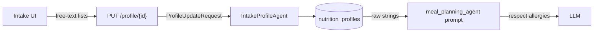

# SPEC-006: Profile-side restriction normalization

| Field       | Value                                                    |
|-------------|----------------------------------------------------------|
| **Status**  | Proposed                                                 |
| **Author**  | Nutrition & Meal Planning team                           |
| **Created** | 2026-04-17                                               |
| **Priority**| P0 (blocks SPEC-007 enforcement; unblocks ADR-005 substitutions) |
| **Scope**   | `backend/agents/nutrition_meal_planning_team/models.py`, `agents/intake_profile_agent/`, `orchestrator/`, `shared/client_profile_store`, `postgres/`, `user-interface/` profile restriction screens |
| **Depends on** | SPEC-002 (profile schema), SPEC-005 (taxonomy enums, alias index) |
| **Implements** | ADR-002 §2 (profile-side normalization) |

---

## 1. Problem Statement

SPEC-005 gives us the closed `AllergenTag` and `DietaryTag` enums.
The profile has the corresponding user-entered free text:

- `ClientProfile.allergies_and_intolerances: List[str]` — strings
  like `"nuts"`, `"shellfish"`, `"gluten"`, `"no cashews"`.
- `ClientProfile.dietary_needs: List[str]` — strings like
  `"vegetarian"`, `"vegan"`, `"keto"`, `"low-sodium"`, `"pescatarian
  except anchovies"`.

These strings flow into LLM prompts today and are never resolved to
anything a downstream filter can reason about. SPEC-007's guardrail
cannot enforce what it cannot identify.

This spec resolves those strings into structured, canonical tag sets
at profile save time, surfaces ambiguity to the user through an
explicit resolution flow, and keeps the unresolved remainder
available so it still reaches the LLM as caveat text.

It does **not** reject meals, modify the meal-planning prompt, or
change agent behavior beyond the intake step. That is SPEC-007.

---

## 2. Current State

### 2.1 Today's flow



- `allergies_and_intolerances` and `dietary_needs` are persisted as
  raw strings.
- `meal_planning_agent` prompt includes them verbatim:
  `"respect allergies and dietary needs"`.
- No check that `"nuts"` is expanded to `{peanut, tree_nut}`; no
  check that `"vegan"` implies `{animal, dairy, egg, honey,
  gelatin}` is forbidden; no check that `"no cashews"` is a subset
  of `tree_nut` enforcement.

### 2.2 Gaps

1. Enforcement consumers have nothing structured to enforce against.
2. Ambiguous user input ("nuts" → peanut only? or tree nut only? or
   both?) is resolved silently by the LLM's interpretation, which
   means it is not resolved at all.
3. There is no place to store *resolved* tags alongside raw input,
   so we cannot audit what the system believed.

---

## 3. Goals and Non-Goals

### 3.1 Goals

- On profile write, resolve `allergies_and_intolerances` and
  `dietary_needs` to canonical tag sets using SPEC-005's taxonomy
  and alias index.
- Persist both raw strings and resolved tags, plus an `unresolved`
  remainder and an `ambiguous` list that the UI surfaces for user
  confirmation.
- Expand shorthand dietary tags deterministically (`vegan`,
  `vegetarian`, `pescatarian`, `keto`, `halal`, `kosher`) into their
  forbid/require tag sets.
- Provide a dedicated resolution UI: every ambiguity becomes a
  deterministic user choice, not a silent interpretation.
- Emit observability metrics so coverage gaps in the KB become
  visible and actionable.
- Zero behavior change on the meal side in this spec — SPEC-007 is
  the enforcement step.

### 3.2 Non-goals

- **No enforcement.** `MealPlanResponse` is not filtered here. That
  is SPEC-007.
- **No LLM prompt changes.** The meal-planning prompt continues to
  receive the raw strings for v1 of this spec; SPEC-007 replaces
  them with structured constraints.
- **No KB edits.** If the alias index cannot resolve a phrase, the
  fix is a SPEC-005 KB addition, not a patch here.
- **No cross-team sharing.** Resolved tags live on the nutrition
  profile only. Sharing with other teams is a separate spec when a
  caller appears.

---

## 4. Detailed Design

### 4.1 Model additions (`models.py`)

Additive; existing fields unchanged.

```python
from nutrition_meal_planning_team.ingredient_kb.taxonomy import (
    AllergenTag, DietaryTag,
)

class ResolvedRestriction(BaseModel):
    raw: str                              # "nuts", "gluten-free", "vegan"
    allergen_tags: Set[AllergenTag] = set()
    dietary_tags_forbid: Set[DietaryTag] = set()
    dietary_tags_require: Set[DietaryTag] = set()
    matched_canonical_ids: List[str] = [] # specific foods ("cashew"), if applicable
    confidence: float = 1.0               # 1.0 exact, <1.0 fuzzy or shorthand
    source: str = "user"                  # "user" | "shorthand" | "clinician"

class RestrictionResolution(BaseModel):
    resolved: List[ResolvedRestriction] = []
    ambiguous: List[AmbiguousRestriction] = []
    unresolved: List[str] = []
    kb_version: str = ""                  # SPEC-005 KB_VERSION at resolve time
    resolved_at: Optional[str] = None

class AmbiguousRestriction(BaseModel):
    raw: str
    candidates: List[ResolvedRestriction] # >1; user picks one
    question: str                         # human-readable disambiguation prompt

class ClientProfile(BaseModel):
    # existing fields unchanged
    restriction_resolution: RestrictionResolution = Field(
        default_factory=RestrictionResolution
    )
```

Raw `allergies_and_intolerances` and `dietary_needs` are preserved
on the profile — the resolver is additive, never destructive. The
user's original words remain visible in the UI.

### 4.2 Resolver module

New module
`backend/agents/nutrition_meal_planning_team/restriction_resolver/`:

```
restriction_resolver/
├── __init__.py                 # resolve_restrictions
├── shorthand.py                # vegan/vegetarian/keto/etc. expansion
├── resolver.py                 # orchestration
├── data/
│   └── shorthand.yaml          # closed shorthand → tag-set map
└── tests/
```

Public interface:

```python
def resolve_restrictions(
    allergies: List[str],
    dietary_needs: List[str],
) -> RestrictionResolution: ...
```

- Pure function; no I/O, no LLM.
- Uses `ingredient_kb.alias_index` for specific-ingredient
  resolution (`"cashew"` → `canonical_id=cashew` →
  `allergen_tags={tree_nut}`).
- Uses `shorthand.yaml` for high-level dietary labels:
  ```yaml
  vegan:
    forbid: [animal, dairy, egg, honey, gelatin]
  vegetarian:
    forbid: [animal]
    allow_exceptions: [dairy, egg]
  pescatarian:
    forbid: [animal]
    allow_exceptions: [dairy, egg, fish, shellfish]
  keto:
    soft_constraint: "low_carb"       # advisory; no forbid
  low_sodium:
    interaction_flag: sodium_very_high
  halal:
    forbid: [alcohol]
    additional_raw_note: "requires halal-certified meat"
  kosher:
    forbid: []
    additional_raw_note: "requires kosher preparation"
  gluten_free:
    forbid: [gluten]
  ```
- Shorthand table is closed; additions require the team lead's
  review and a KB version note in `restriction_resolver/CHANGELOG.md`.
- Ambiguity is deterministic. "Nuts" is ambiguous (peanut vs tree
  nut — they are legally distinct allergens and clinically
  different); the resolver emits an `AmbiguousRestriction` with
  `candidates=[{peanut}, {tree_nut}, {peanut, tree_nut}]` and a
  clear question.

### 4.3 Resolution rules

Closed set of rules, applied in order:

1. **Exact alias match** (from SPEC-005 alias index): resolves to a
   specific canonical food and its tags. `confidence = 1.0`.
2. **Shorthand hit**: from `shorthand.yaml`. `confidence = 1.0`,
   `source = "shorthand"`.
3. **Allergen-category name**: phrases like "tree nuts", "shellfish",
   "gluten" match directly to an `AllergenTag`. `confidence = 1.0`.
4. **Negation patterns** (`"no X"`, `"avoid X"`, `"X-free"`): same
   resolution as X, with the negation recorded in the raw string.
5. **Fuzzy match** via alias index (≥0.85): `confidence = score`,
   still a candidate.
6. **Otherwise**: unresolved. Raw string lands in
   `unresolved[]`; surfaced in UI as "we couldn't map this; tell us
   what to do."

Ambiguity is declared when:

- Input matches two or more top-level allergen categories (e.g.,
  "nuts" → peanut or tree nut), or
- A shorthand has multiple common interpretations (e.g., "low-carb"
  could be `keto` or a soft constraint), or
- Fuzzy match returns multiple candidates within 0.05 of the top
  score.

### 4.4 Intake integration

`IntakeProfileAgent.run` (`agents/intake_profile_agent/agent.py`):

- After LLM merge (or structural fallback), call
  `resolve_restrictions(profile.allergies_and_intolerances,
  profile.dietary_needs)`.
- Attach the resulting `RestrictionResolution` to the profile before
  save.
- `resolved_at` and `kb_version` recorded on every write.

Re-resolution triggers:

- Any write to `allergies_and_intolerances` or `dietary_needs`.
- Background re-resolution when `KB_VERSION` bumps (job scans
  profiles where `restriction_resolution.kb_version` < current,
  re-runs resolver, surfaces any newly ambiguous items to the user
  on next login). Rate-limited; the background job is additive only
  (never removes previously-confirmed tags).

### 4.5 API surface

Additive endpoints:

| Method | Path | Purpose |
|--------|------|---------|
| `GET` | `/profile/{client_id}/restrictions` | Returns `RestrictionResolution` — raw inputs, resolved tags, ambiguities, unresolved |
| `POST` | `/profile/{client_id}/restrictions/resolve-ambiguous` | Body: `{raw: str, chosen_candidate: ResolvedRestriction}`. User answers an ambiguity |
| `POST` | `/profile/{client_id}/restrictions/reresolve` | Forces a re-run against current `KB_VERSION`. Rate-limited |

The existing `PUT /profile/{client_id}` and SPEC-002's `PATCH
/profile/{client_id}/clinical` both trigger resolver passes on
write. No new fields in their request bodies — the resolver reads
what's already there.

### 4.6 UI — ambiguity resolution

Progressive: if all restrictions resolve cleanly, no UI change. If
any item is ambiguous, the restrictions page shows a card per
ambiguity:

```
You entered: "nuts"
We're not sure what to block. Pick one:
  [ ] Peanuts only
  [ ] Tree nuts only (almond, cashew, walnut, …)
  [X] Both peanuts and tree nuts   ← default highlighted when severity warrants
```

Rules:

- Default selection is the **strictest** option (both). The user
  must actively narrow rather than actively broaden. This is the
  safer default for a safety feature.
- After one user confirmation, the choice persists on the profile
  — we never re-ask for the same raw string.
- Unresolved items ("exotic-greens-i-can-t-have") show a free-text
  "tell us what to avoid" field with autocomplete against the KB;
  if still nothing resolves, it is kept as a raw note surfaced to
  the LLM (pre-SPEC-007 behavior, unchanged).

Dedicated screen in `user-interface/src/app/components/` (existing
restrictions UI extended):

```mermaid
flowchart LR
    Enter[User enters<br/>allergies + diets] --> Resolve[Backend resolves]
    Resolve -->|all resolved| Show[Show resolved tag chips]
    Resolve -->|ambiguous| Ask["Show ambiguity cards<br/>one at a time"]
    Ask --> Confirm[User confirms]
    Confirm --> Persist[Persist to profile]
    Resolve -->|unresolved| Note[Show as "noted for guidance"<br/>with KB-add nudge]
```

### 4.7 Resolved-tag chips view

Everywhere restrictions are shown (profile page, meal-plan request
confirmation), render **resolved chips**:

```
Your restrictions:
  [Tree nuts]  [Peanuts]  [Dairy (from "vegan")]  [Animal (from "vegan")]  ...
  + 2 noted for guidance:  ["grandma's weird thing"]  ["the cilantro thing"]
  Last reviewed: KB v1.2.0 on 2026-04-15  [re-review]
```

This is the single biggest trust win of this spec — the user sees
what the system believes about them.

### 4.8 Postgres

Resolution is persisted in `nutrition_profiles` as a JSONB column
alongside the existing profile JSON. Migration
`004_restriction_resolution.sql`:

```sql
ALTER TABLE nutrition_profiles
    ADD COLUMN restriction_resolution JSONB NOT NULL DEFAULT '{}'::jsonb,
    ADD COLUMN restriction_resolver_kb_version TEXT;

CREATE INDEX ON nutrition_profiles (restriction_resolver_kb_version);
```

Index supports the background re-resolution job in §4.4.

### 4.9 Observability

OTel counters:

- `nutrition.restriction.resolve{outcome}` where outcome ∈
  `resolved | ambiguous | unresolved`.
- `nutrition.restriction.shorthand_used{name}`.
- `nutrition.restriction.unresolved_top_terms` — top-K of
  unresolved raw strings, captured hourly (anonymized). This is the
  SPEC-005 KB prioritization signal.
- `nutrition.restriction.ambiguity_resolution_latency` — time from
  "ambiguity shown to user" to "user resolved it".

A dashboard panel shows the unresolved-terms top-K. This is how
SPEC-005 knows what to add next.

### 4.10 Privacy

- Resolved tags are derived from user input; retention follows the
  profile.
- Unresolved raw strings are PII-adjacent; they may mention
  conditions or preferences. Do not log at INFO or above; only
  tag-level counters are emitted.
- Aggregation for the "top unresolved" panel uses a count-min
  sketch or similar that does not retain individual strings past
  the rollup window.

### 4.11 Priority-grouped work items

| # | Item | Priority |
|---|------|----------|
| W1 | `restriction_resolver/` module + `resolve_restrictions` + unit tests | P0 |
| W2 | `shorthand.yaml` v1 with reviewer sign-off | P0 |
| W3 | `ResolvedRestriction`, `AmbiguousRestriction`, `RestrictionResolution` in `models.py` | P0 |
| W4 | Intake agent integration + structural fallback parity | P0 |
| W5 | Migration `004_restriction_resolution.sql` + schema registration | P0 |
| W6 | API endpoints (§4.5) + store helpers | P1 |
| W7 | UI: ambiguity cards + default-strict selection | FE | P1 |
| W8 | UI: resolved-chips view on profile + meal-plan pages | FE | P1 |
| W9 | Background re-resolution job on `KB_VERSION` bump | P2 |
| W10 | Observability counters + unresolved top-K panel | P1 |
| W11 | Docs for adding to `shorthand.yaml` | P2 |

---

## 5. Rollout Plan

Feature flag `NUTRITION_RESTRICTION_RESOLVER` (off → existing
behavior, on → resolver runs on writes). Flag lives in unified
config.

### Phase 0 — Foundation (P0)
- [ ] SPEC-005 frozen at `KB_VERSION=1.0.0`.
- [ ] W1–W3, W5 landed. Migration applied in staging. No behavior
      change (flag off).

### Phase 1 — Resolver behind flag (P0)
- [ ] W4 intake integration flag-gated.
- [ ] W6 API endpoints live, flag-gated.
- [ ] Unit and integration tests green.

### Phase 2 — UI + dogfood (P1)
- [ ] W7–W8 shipped.
- [ ] Flag on for internal team profiles.
- [ ] Measure: what fraction of internal profiles have at least one
      ambiguity? What fraction have unresolved items?

### Phase 3 — Ramp (P1/P2)
- [ ] W10 observability in production.
- [ ] 10% → 50% → 100% ramp over two weeks.
- [ ] Top-K unresolved-terms dashboard watched daily; each term
      that crosses a frequency threshold triggers a SPEC-005 KB
      addition.

### Phase 4 — Cleanup (P2)
- [ ] W9 background re-resolver live.
- [ ] W11 docs shipped.
- [ ] Flag default on; flag-removal ticket filed.

### Rollback
- Flag off → resolver skipped; raw fields flow to the LLM as today.
- Migration is additive; no rollback needed.
- Existing `restriction_resolution` rows become inert when flag is off.

---

## 6. Verification

### 6.1 Unit tests

- `test_resolver_exact.py` — exact alias hits resolve to the
  expected tags; `confidence=1.0`.
- `test_resolver_shorthand.py` — every row of `shorthand.yaml`
  produces the expected `forbid`/`require` sets.
- `test_resolver_ambiguity.py` — inputs like `"nuts"`, `"low-carb"`,
  `"seafood"` produce `AmbiguousRestriction` with ≥2 candidates and
  a non-empty `question`.
- `test_resolver_negation.py` — `"no X"`, `"X-free"`, `"avoid X"`
  resolve identically to `"X"` with the negation preserved in raw.
- `test_resolver_unresolved.py` — junk input lands in
  `unresolved[]` without throwing.

### 6.2 Integration tests

- `test_intake_resolves_on_write.py` — `PUT /profile/{id}` with
  allergies/diet strings populates `restriction_resolution`.
- `test_ambiguity_resolution_flow.py` — ambiguous input →
  `POST /restrictions/resolve-ambiguous` → persists chosen
  candidate; subsequent reads do not re-ask.
- `test_default_strict_on_unanswered.py` — ambiguous input that the
  user has not yet resolved: **the profile exposes the strictest
  candidate's tags as the active enforcement set** so SPEC-007 can
  fail closed even before the user confirms.
- `test_background_reresolve.py` — bumping `KB_VERSION` and running
  the job: additive-only behavior; previously-confirmed choices
  preserved; newly ambiguous items queued for the user.

### 6.3 Taxonomy parity tests

- `test_shorthand_against_taxonomy.py` — every tag referenced in
  `shorthand.yaml` exists in the SPEC-005 enums. CI fails on drift.

### 6.4 UI tests

- Ambiguity card: "both" option is default-selected for allergen
  ambiguities; snapshot test.
- Resolved-chips view renders every tag in
  `restriction_resolution.resolved` and groups chips by their
  `raw` source ("from 'vegan'").

### 6.5 Observability

- Counters emitted match §4.9.
- Unresolved top-K dashboard populated in staging and reviewed in
  Phase 2 dogfood.

### 6.6 Privacy

- Log-redaction grep: zero instances of user-entered raw restriction
  strings at INFO or above in production logs during Phase 3.

### 6.7 Cutover criteria

- All P0/P1 tests green.
- Phase 3 ramp completed with:
  - Ambiguity-resolution completion rate ≥80% within 7 days of
    first prompt (users respond to the prompt, not just dismiss it).
  - Unresolved rate on new profiles ≤5% (most strings resolve
    cleanly; unresolved ones trigger SPEC-005 KB additions within
    the week).
  - Zero correctness incidents (a confirmed case where the resolved
    tags disagree with what the user actually intended, after UX
    polish).
- Reviewer sign-off on `shorthand.yaml`.

---

## 7. Open Questions

- **Halal and kosher enforcement.** v1 records the dietary intent
  as a note; actual certification of meat/preparation is outside our
  ingredient KB. Do we add a `certification_required` soft flag for
  SPEC-007 to surface a caution? Probably yes; tracked under
  SPEC-007's scope, not here.
- **"Low-sodium" and "low-carb" as soft constraints.** These do not
  map to forbid tags; they map to ADR-001 clinical clamps or
  nutrient-rollup tolerances (ADR-003). The resolver records the
  intent; SPEC-007 decides whether it enforces per-ingredient
  (sodium_very_high) or defers to ADR-003 per-meal caps.
- **Default-strict for ambiguous allergens** is a policy choice. We
  default to strict in §4.6 and §6.2. A user who is casual about
  allergy boundaries will find this annoying; a user who is serious
  will find it correct. The safer default loses some UX polish to
  gain clinical defensibility. Revisit after Phase 3 ramp metrics.
- **Clinician-authored restrictions.** A dietitian or doctor should
  be able to write a restriction that the user cannot override
  through the resolver UI. SPEC-002's `clinician_overrides` is the
  right home; we track the feature as a SPEC-006.1 extension.
