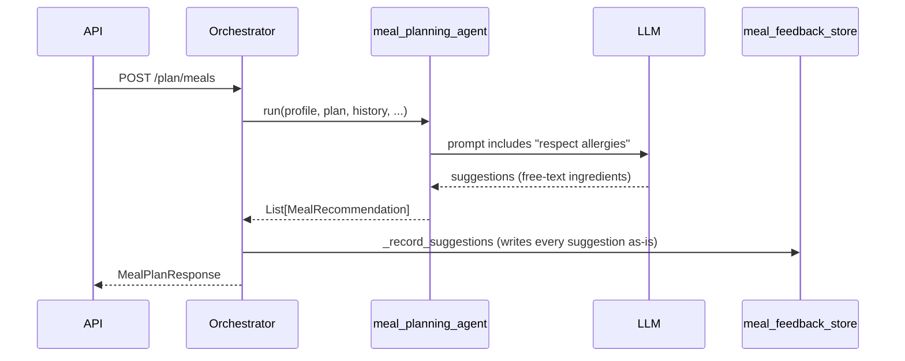
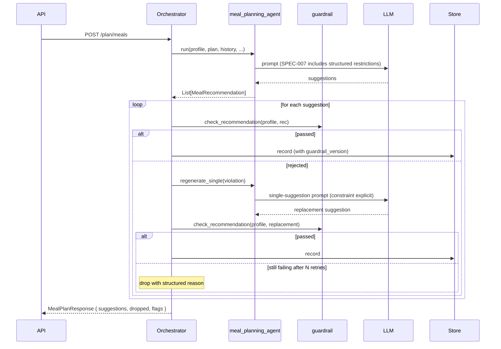

# SPEC-007: Meal recommendation guardrail — enforcement, targeted regeneration, and user-visible filtering

| Field       | Value                                                    |
|-------------|----------------------------------------------------------|
| **Status**  | Proposed                                                 |
| **Author**  | Nutrition & Meal Planning team                           |
| **Created** | 2026-04-17                                               |
| **Priority**| P0 (capstone for ADR-002; unblocks ADR-005 substitutions; safety-critical) |
| **Scope**   | `backend/agents/nutrition_meal_planning_team/guardrail/` (new), `orchestrator/`, `agents/meal_planning_agent/`, `shared/meal_feedback_store`, `models.py` (additive), `user-interface/` meal-plan display |
| **Depends on** | SPEC-005 (ingredient KB + parser), SPEC-006 (resolved restrictions on profile) |
| **Implements** | ADR-002 §3 (guardrail pipeline), §4 (orchestrator integration), §5 (observability), §6 (versioning) |

---

## 1. Problem Statement

SPEC-005 gives us canonical ingredients with allergen, dietary, and
interaction tags. SPEC-006 gives every profile a resolved tag set
describing what is forbidden, flagged, or required. This spec is the
enforcement step: no meal recommendation reaches a user until a
deterministic check proves the recipe's ingredients are legal for
that profile.

Today, "respect allergies" is a line in a prompt. After this spec, it
is a property of the code path. Meal suggestions are parsed against
SPEC-005's KB, checked against SPEC-006's resolved restrictions, and
either (a) emitted unchanged, (b) regenerated under a targeted
constraint, or (c) dropped with a visible, structured reason.

This is the single highest-stakes change in the nutrition roadmap —
a missed allergen can cause anaphylaxis. We treat it accordingly:
deterministic logic, fail-closed defaults, exhaustive tests, explicit
observability, and user-visible enforcement so trust is earned, not
assumed.

---

## 2. Current State

### 2.1 Today's flow



Relevant code:

- Agent prompt: [agents/meal_planning_agent/agent.py:21-33](backend/agents/nutrition_meal_planning_team/agents/meal_planning_agent/agent.py:21)
- `_record_suggestions`: [orchestrator/agent.py:171-179](backend/agents/nutrition_meal_planning_team/orchestrator/agent.py:171)
- No parse, no check, no filter.

### 2.2 Gaps

1. Enforcement is probabilistic (prompt-adherence dependent).
2. No regeneration on violation — a rejected suggestion silently
   ships.
3. No visible filtering — users cannot see what was blocked and
   therefore cannot trust that anything was.
4. No `guardrail_version` stamped on recorded recommendations —
   policy changes cannot cause re-evaluation.

---

## 3. Goals and Non-Goals

### 3.1 Goals

- Deterministic post-generation guardrail: no
  `MealRecommendationWithId` is persisted or returned unless it has
  passed `check_recommendation`.
- Fail closed on unresolved ingredients — if we cannot tell what a
  food is, we do not serve it.
- Targeted regeneration: on rejection, issue a single-suggestion LLM
  call with the specific violation spelled out, capped retries.
  Dropped suggestions are surfaced to the user with structured
  reasons.
- Stamp every persisted recommendation with `guardrail_version` and
  a snapshot of the restriction set used, so re-evaluation after
  policy bumps is possible.
- Emit metrics sufficient to audit safety and to prioritize KB
  additions.
- Keep performance acceptable: the synchronous path should add
  ≤ 100 ms typical and ≤ 2 s worst case in absence of regeneration;
  regenerations run concurrently across independent rejected
  suggestions.

### 3.2 Non-goals

- **No nutrient-level checks.** Sodium-per-meal caps and other
  quantitative per-meal/per-day constraints are ADR-003
  (nutrient-rollup spec). The interaction between per-ingredient
  sodium-very-high tags and per-meal sodium caps is explicitly
  noted in §4.4 but fully enforced only when ADR-003 lands.
- **No learning signal changes.** ADR-004 consumes guardrail
  rejection logs to improve KB priorities and planner prompts, but
  the structured learning loop is a separate spec.
- **No substitution endpoint.** ADR-005's
  `/recipes/{id}/substitute` reuses this guardrail verbatim but is
  specified separately.
- **No clinical drug-interaction medical claims.** v1 flags
  curated, documented interactions between a closed medication
  class and a closed set of `InteractionTag`s. It is not a
  substitute for clinical review. The UI copy says so.

---

## 4. Detailed Design

### 4.1 New flow



### 4.2 Module layout

```
backend/agents/nutrition_meal_planning_team/guardrail/
├── __init__.py               # check_recommendation, GUARDRAIL_VERSION
├── version.py                # GUARDRAIL_VERSION = "1.0.0"
├── checker.py                # check_recommendation
├── violations.py             # Violation, Flag dataclasses + reason enums
├── interactions.py           # loader for interactions.yaml + med-class mapping
├── regeneration.py           # build_regen_prompt
├── data/
│   └── interactions.yaml     # medication_class → forbidden InteractionTags
├── errors.py
└── tests/
```

### 4.3 Public interface

```python
@dataclass(frozen=True)
class Violation:
    reason: ViolationReason
    ingredient_raw: str
    canonical_id: Optional[str]
    tag: Optional[str]           # e.g. "tree_nut", "gluten"
    detail: str                  # human-readable
    severity: Severity           # hard_reject | flag

class ViolationReason(StrEnum):
    allergen = "allergen"
    dietary_forbid = "dietary_forbid"
    unresolved_ingredient = "unresolved_ingredient"
    interaction_hard = "interaction_hard"
    interaction_flag = "interaction_flag"

@dataclass(frozen=True)
class GuardrailResult:
    passed: bool
    violations: tuple[Violation, ...]   # reason-severity hard_reject
    flags: tuple[Violation, ...]        # reason-severity flag; non-blocking
    parsed_ingredients: tuple[ParsedIngredient, ...]  # for reuse by ADR-003

def check_recommendation(
    profile: ClientProfile,
    rec: MealRecommendation,
) -> GuardrailResult: ...
```

Contract:

- **Deterministic.** Same `(profile, rec)` → same result, byte-for-byte.
- **Pure.** No I/O, no LLM.
- **Fail closed.** Any unresolved ingredient above a confidence
  threshold → `ViolationReason.unresolved_ingredient` with
  `severity.hard_reject`.

### 4.4 Check pipeline

Executed in order; any `hard_reject` violation short-circuits
further hard-reject checks but flags still accumulate:

1. **Parse** each ingredient via `ingredient_kb.parse_ingredient`.
2. **Allergen check** — for each parsed ingredient, intersect the
   canonical food's `allergen_tags` with
   `profile.restriction_resolution` active allergen tags (strictest
   candidate if ambiguity is unresolved — SPEC-006 §6.2).
3. **Dietary check** — intersect `dietary_tags` with the profile's
   `dietary_tags_forbid` set.
4. **Interaction check** — for each `medications[]` tag, load
   forbidden `InteractionTag`s from `interactions.yaml`:
   ```yaml
   warfarin:
     hard:  []                  # v1: no hard reject, only flags
     flag:  [vitamin_k_high]
     note:  "Coordinate vitamin K intake with INR monitoring."
   maoi:
     hard:  [tyramine_high]     # tyramine reactions are acute
     flag:  []
     note:  "Aged cheeses, cured meats, fermented foods excluded."
   acei_arb:
     hard:  []
     flag:  [potassium_high]
   statin:
     hard:  []
     flag:  [grapefruit]
   ssri:
     hard:  []
     flag:  [st_johns_wort]
   glp1:
     hard:  []
     flag:  [very_high_fat]
   ```
   Policy: default to `flag` (advisory) unless the interaction is
   both acute and well-documented (MAOI × tyramine). `hard` requires
   team-lead plus clinical reviewer sign-off per entry.
5. **Unknown-ingredient policy** — any parsed ingredient with
   `canonical_id=None` and `confidence<0.85` → hard reject.
   `confidence≥0.85` + `canonical_id=None` → flag (the parser was
   confident about structure but the alias index missed; user sees
   a caution chip; SPEC-005 gets a signal in the unresolved top-K).
6. **Condition-specific per-meal flags** — e.g. CKD-3: flag if a
   recipe contains >3 `potassium_high` tags, HTN: flag if ≥2
   `sodium_very_high` tags. Thresholds are advisory in v1; per-meal
   quantitative caps land in ADR-003 once nutrient data is attached.

`Severity.hard_reject` blocks the suggestion. `Severity.flag`
attaches to the recommendation but does not block.

### 4.5 Orchestrator integration

`NutritionMealPlanningOrchestrator._record_suggestions`
([orchestrator/agent.py:171-179](backend/agents/nutrition_meal_planning_team/orchestrator/agent.py:171)) becomes
a two-pass pipeline:

```python
def _record_suggestions(
    self, client_id: str, suggestions: list, profile: ClientProfile
) -> RecordedSuggestions:
    recorded: list[MealRecommendationWithId] = []
    dropped: list[DroppedSuggestion] = []

    checks = [check_recommendation(profile, s) for s in suggestions]
    for original, result in zip(suggestions, checks):
        if result.passed:
            rec_id = self._record(client_id, original, result)
            recorded.append(self._with_id(original, result, rec_id))
            continue

        # Targeted regeneration
        last_violations = result.violations
        for attempt in range(MAX_REGEN_RETRIES):
            replacement = self.meal_planning_agent.regenerate_single(
                profile=profile,
                original=original,
                violations=last_violations,
            )
            if replacement is None:
                break
            retry_result = check_recommendation(profile, replacement)
            if retry_result.passed:
                rec_id = self._record(client_id, replacement, retry_result)
                recorded.append(self._with_id(replacement, retry_result, rec_id))
                break
            last_violations = retry_result.violations
        else:
            dropped.append(
                DroppedSuggestion(
                    name=original.name,
                    reasons=[v.reason for v in last_violations],
                    detail=[v.detail for v in last_violations],
                )
            )

    return RecordedSuggestions(recorded=recorded, dropped=dropped)
```

- Regenerations across different rejected suggestions run
  concurrently (per-suggestion threads; no shared state).
- `MAX_REGEN_RETRIES` = 2. Higher values don't help in practice
  and burn tokens.
- Each recorded row on `nutrition_recommendations` stores:
  `guardrail_version`, `parsed_ingredients_json`, `flags_json`, and
  a hash of the active restriction set (`restriction_snapshot_hash`)
  for replay on policy bumps.

### 4.6 Planner prompt changes

`meal_planning_agent` prompt gains a structured constraints block
derived from SPEC-006's `restriction_resolution`:

```
FORBIDDEN ingredients (must not appear, by any name):
  - cashew (tree_nut), peanut (peanut), milk (dairy), ...
FORBIDDEN categories:
  - gluten, shellfish, animal-derived
FLAG-ONLY (avoid when possible):
  - vitamin_k_high (warfarin), sodium_very_high (hypertension)
DIETARY SHORTHANDS (resolve to above):
  - vegan, low-sodium
```

The prompt explicitly says: *"If you are unsure whether an ingredient
violates a restriction, do not include it. We will reject it anyway."*
This is prompt-side prevention; the guardrail is enforcement.

New public method `meal_planning_agent.regenerate_single(profile,
original, violations)` constructs a single-suggestion prompt that:

- Restates the original recipe's slot (meal_type, suggested_date,
  max cook time).
- Lists every `Violation.ingredient_raw` + `tag` explicitly.
- Requires a strict structured-output schema (single
  `MealRecommendation`).

### 4.7 API response changes

`MealPlanResponse` gains:

```python
class DroppedSuggestion(BaseModel):
    name: str
    reasons: list[str]        # e.g. ["allergen:tree_nut"]
    detail: list[str]         # user-facing strings

class MealPlanResponse(BaseModel):
    client_id: str
    suggestions: List[MealRecommendationWithId]
    dropped: List[DroppedSuggestion] = []
    flags_by_recommendation: Dict[str, List[str]] = {}
    guardrail_version: str = ""
```

Every `MealRecommendationWithId` gains:

```python
class MealRecommendationWithId(MealRecommendation):
    recommendation_id: str
    clinical_flags: List[str] = []       # from SPEC-007 flags
    parsed_ingredients_present: bool = True
```

Additive at the field level; existing clients ignore.

### 4.8 UI changes

- **Filter notice** shown above the suggestions list when
  `dropped` non-empty:
  *"We filtered 1 suggestion that conflicted with your tree-nut
  allergy."* Clickable to show the specific names + reasons.
  Neutral framing, no shame, never implies the user did something
  wrong.
- **Flag chips** on each recommendation card:
  *"⚠ Advisory: contains high-vitamin-K greens — coordinate with
  INR monitoring."* Clicking opens a dialog with the full
  `interactions.yaml` note.
- **Medication-disclaimer banner** on the meal-plan page when any
  `medications[]` is set: *"Recommendations are general guidance,
  not medical advice. For medications that interact with food,
  please work with your clinician."* Copy reviewed per ADR-006 §6.5.

### 4.9 Observability

OTel counters:

- `guardrail.check_ran{result}` where result ∈ `passed | rejected |
  flagged`.
- `guardrail.rejection{reason}` per `ViolationReason`.
- `guardrail.flag{class}` per flag class.
- `guardrail.unknown_ingredient_rate` (rolling).
- `guardrail.regen_attempt{outcome}` where outcome ∈ `passed |
  retry | dropped`.
- `guardrail.dropped_total` per plan. Steady-state should be low;
  sustained spikes indicate prompt drift or KB gap.
- `guardrail.ingestion_latency_ms` histogram for parse+check path.

Traces: `_record_suggestions` root with child spans per
suggestion's check + regen path. Regenerations are separate spans
with `attempt_n` attribute.

Audit log: every rejection is persisted to
`nutrition_guardrail_rejections` with profile id (not user PII
beyond that), ingredient, canonical_id, tag, violation reason, and
timestamp. This is both safety audit and KB prioritization signal.

### 4.10 Versioning and replay

`GUARDRAIL_VERSION = "MAJOR.MINOR.PATCH"`:

- **MAJOR** — severity policy change (e.g. promoting a flag to
  hard reject), `ViolationReason` enum change. Triggers replay.
- **MINOR** — data additions (new meds in interactions.yaml, new
  tags). Triggers replay.
- **PATCH** — copy/doc only.

On `GUARDRAIL_VERSION` or `KB_VERSION` bump: background job scans
`nutrition_recommendations` where stored version < current,
re-runs `check_recommendation` against each, and surfaces newly
rejected recommendations to the user ("we re-checked your meal plan
with updated safety rules; 1 recommendation no longer fits your
profile"). Replay is additive only — it never un-flags something
previously flagged.

### 4.11 Failure modes and fallback

- **LLM regeneration fails or times out.** Treat as unresolved
  retry; count toward `MAX_REGEN_RETRIES`.
- **Parser throws.** Suggestion hard-rejected with
  `unresolved_ingredient`; exception logged; never silently passed.
- **`profile.restriction_resolution` missing** (legacy profiles
  before SPEC-006 flag-on). Guardrail runs with the best-effort
  resolution computed on the fly from raw fields using SPEC-005
  directly, **plus** a strict-mode flag that marks the plan as
  `restrictions_best_effort=true` so the UI prompts the user to
  confirm. We do not trust best-effort resolution for permanent
  enforcement.
- **Orchestrator panic mid-pipeline.** Any exception in
  `_record_suggestions` for a given suggestion drops that
  suggestion with reason `internal_error` and continues. The plan
  is not aborted by a single bad suggestion.

### 4.12 Priority-grouped work items

| # | Item | Priority |
|---|------|----------|
| W1 | `guardrail/` scaffolding, `version.py`, dataclasses, errors | P0 |
| W2 | `checker.py` allergen + dietary + unresolved rules + tests | P0 |
| W3 | `interactions.yaml` v1 + loader + tests; reviewer sign-off | P0 |
| W4 | Interaction check in `checker.py` + tests | P0 |
| W5 | `meal_planning_agent.regenerate_single` + structured-output schema | P0 |
| W6 | Meal-planner prompt constraints block (§4.6) | P0 |
| W7 | Orchestrator `_record_suggestions` two-pass pipeline + concurrency | P0 |
| W8 | `MealPlanResponse` additive fields + `MealRecommendationWithId` flags | P0 |
| W9 | Migration: extend `nutrition_recommendations` with `guardrail_version`, `parsed_ingredients_json`, `flags_json`, `restriction_snapshot_hash`; new `nutrition_guardrail_rejections` table | P0 |
| W10 | UI: filter notice + flag chips + medication banner | FE | P1 |
| W11 | Observability counters + rejection audit log | P1 |
| W12 | Replay job on `GUARDRAIL_VERSION` / `KB_VERSION` bump | P2 |
| W13 | CODEOWNERS entry for `interactions.yaml` — team lead + clinical reviewer | P1 |
| W14 | Benchmarks: `check_recommendation` p99 ≤ 10 ms | P2 |

---

## 5. Rollout Plan

Feature flag `NUTRITION_GUARDRAIL` (off → legacy pass-through,
on → SPEC-007 pipeline).

### Phase 0 — Foundation (P0)
- [ ] SPEC-005 frozen at `KB_VERSION=1.0.0`.
- [ ] SPEC-006 deployed and flag on for dogfood profiles.
- [ ] W1, W9 landed. Migration applied in staging. No behavior change.

### Phase 1 — Shadow mode (P0)
- [ ] W2–W7 landed behind flag.
- [ ] Shadow mode: flag-off callers run `check_recommendation` in
      a background task and record results to
      `nutrition_guardrail_rejections` without affecting the
      response.
- [ ] 2 weeks of shadow data reviewed. Metrics:
      - Rejection rate per profile type.
      - False-positive audit on 100 sampled rejections — are any
        "rejected" suggestions actually safe?
      - Unknown-ingredient rate feeding SPEC-005 KB additions.

### Phase 2 — Enforce for internal (P0)
- [ ] Flag on for internal team profiles.
- [ ] Observe for 1 week. Success gates:
      - Zero **false negatives** in sampled audit (a missed
        allergen reaching a user).
      - `guardrail.dropped_total` median ≤ 1 per 7-day plan on
        typical profiles.
      - Regen loop median retries ≤ 0.5 per rejected suggestion.

### Phase 3 — Ramp (P0/P1)
- [ ] W10 (UI) shipped.
- [ ] W11 (observability) dashboards live.
- [ ] 10% → 25% → 50% → 100% over three weeks. At each step:
      - Monitor `guardrail.rejection{reason}` distribution.
      - Review audit log for false negatives (any rejection that
        should have been a flag or vice versa).

### Phase 4 — Replay and cleanup (P1/P2)
- [ ] W12 replay job live.
- [ ] W13 CODEOWNERS committed.
- [ ] W14 benchmarks baselined.
- [ ] Flag default on; flag removal scheduled.

### Rollback
- Flag off → legacy `_record_suggestions`. New DB columns inert.
- No data destruction on rollback. `nutrition_guardrail_rejections`
  retained for audit.
- Policy bump that causes an unexpected rejection surge can be
  reverted by rolling back `GUARDRAIL_VERSION` in a patch release;
  replay job picks up the new version on next run.

---

## 6. Verification

### 6.1 Unit tests (`guardrail/tests/`)

- `test_allergen_rejection.py` — every tag in
  `AllergenTag` triggers rejection when profile has that tag active;
  cross-matrix parametrized.
- `test_dietary_rejection.py` — vegan + `milk` → reject; pescatarian
  + `chicken` → reject; pescatarian + `fish` → pass.
- `test_unresolved_fail_closed.py` — unknown ingredient with
  `confidence<0.85` → hard reject; `confidence≥0.85` but
  `canonical_id=None` → flag.
- `test_interactions_maoi_tyramine.py` — aged cheese and cured
  meats hard-rejected for MAOI profile.
- `test_interactions_warfarin_vitamin_k.py` — kale recipe flagged,
  not rejected.
- `test_determinism.py` — same `(profile, rec)` → byte-equal
  `GuardrailResult` across 100 iterations.

### 6.2 Red-team tests

Dedicated fixture suite `tests/red_team/` of known-hostile
LLM-style outputs:

- Peanut oil sneaked into a nut-free recipe.
- "Worcestershire sauce" in a pescatarian-except-fish profile
  (contains anchovy).
- "Marzipan garnish" on a no-tree-nut profile.
- Almond flour in a nut-free baked good.
- "Broth" on a vegetarian profile (often animal-derived).
- Gelatin in a "vegetarian" dessert.
- "Dashi" on a no-fish profile.
- "Caesar dressing" with hidden anchovy on a vegetarian profile.
- Honey in a vegan recipe.

Every red-team fixture must be caught (hard reject). CI fails if any
fixture passes.

### 6.3 Integration tests

- `test_plan_meals_with_guardrail.py` — end-to-end
  `POST /plan/meals` with a tree-nut allergic profile against a
  recorded LLM-output fixture that includes a cashew recipe:
  response contains zero cashew recipes; `dropped` contains the
  expected entry; audit log row written.
- `test_regen_loop.py` — LLM first returns a violating suggestion,
  then returns a clean one; pipeline records the clean one;
  `guardrail.regen_attempt{passed}` counter increments.
- `test_regen_exhausted.py` — LLM returns violating suggestions on
  all retries; pipeline drops the suggestion; `dropped` entry
  correct; no exception.
- `test_parity_chat_path.py` — chat-initiated meal generation
  (`_handle_generate_meals`) goes through the same pipeline; audit
  log rows identical in shape.
- `test_legacy_profile_best_effort.py` — profile without
  `restriction_resolution` gets best-effort resolution at call
  time; response `restrictions_best_effort=true` flag present.

### 6.4 Concurrency and performance

- `test_regen_concurrency.py` — three violating suggestions trigger
  three concurrent regen calls; wall-time ≈ single regen latency,
  not 3×.
- `bench_check_recommendation.py` — p99 ≤ 10 ms on CI reference
  runner for typical 10-ingredient recipes.

### 6.5 Shadow-mode metrics (Phase 1)

- False-positive audit: sample 100 shadow-rejected suggestions;
  human reviewer confirms whether each rejection was correct.
  Target: ≥98% correctness. Below that → investigate before
  Phase 2.
- False-negative audit: sample 100 shadow-passed suggestions from
  profiles with ≥2 resolved allergens; confirm none contained a
  forbidden allergen. **Any false negative blocks rollout** until
  root cause is identified (prompt, parser, or KB gap) and fixed.

### 6.6 Observability verification

- Every counter in §4.9 emits in staging and is visible on the
  dashboard.
- `nutrition_guardrail_rejections` table populated correctly on
  dogfood profiles.
- Alerting: `guardrail.dropped_total` > 3 per plan for >5% of users
  in a rolling hour → page. Indicates prompt or KB regression.

### 6.7 Copy review

- Filter notice, flag chips, and medication banner reviewed against
  the ADR-006 §6.5 copy checklist: behavior- and information-framed,
  never shame-framed.
- Medication banner explicitly states "general guidance, not
  medical advice, work with your clinician" — legal review sign-off
  recorded in the PR.

### 6.8 Cutover criteria (flag on by default)

- All P0 tests green; red-team fixtures all caught.
- Phase 1 shadow audit: false-positive ≥98% correct, zero
  confirmed false negatives.
- Phase 2 internal enforcement: zero false negatives across 1 week
  of internal dogfood.
- Phase 3 ramp complete with monitoring dashboards stable; no
  false-negative incident.
- Clinical reviewer and team lead sign-off on promotion.

---

## 7. Open Questions

- **Whether certain medication–food interactions should be
  `hard` rather than `flag` in v1.** MAOI × tyramine is already
  hard (acute reaction, well documented). Others (warfarin × high
  vitamin K, ACEi × potassium) we keep as flags in v1 to avoid
  punishing users eating spinach salads; this is policy, not
  technical. The per-entry `hard`/`flag` split in
  `interactions.yaml` is explicitly designed so we can promote
  individually with review, no code change.
- **How strict is "strict" for SPEC-006 ambiguity defaults?** We
  default to the broadest candidate set at enforcement time for
  ambiguous allergens (SPEC-006 §6.2). UX impact will surface in
  Phase 3; if users push back, the lever is a per-profile
  "I'll confirm later, use my stated words as-is" fallback that
  makes `best_effort` persistent until resolved.
- **Brand-new medication classes not in `interactions.yaml`.** v1
  is closed-enum. Profile-level free-text medications that do not
  map to a class flow through as an advisory note on the plan
  ("one or more medications were not recognized; please work with
  your clinician"). Do not fail closed on every unrecognized med —
  that would drop every plan for any user taking something outside
  our enum.
- **Compatibility with the substitution endpoint (ADR-005).** Same
  guardrail, single call path. Documented here for alignment;
  implementation lives in ADR-005's spec.
- **Recording `parsed_ingredients_json` on every recommendation**
  inflates the table size. We checked: typical recipe = ~10
  ingredients × ~200 bytes of parse metadata = ~2 KB. Acceptable;
  ADR-003 nutrient data will dominate eventually. Compress column
  or archive >90 days if it becomes an issue.
