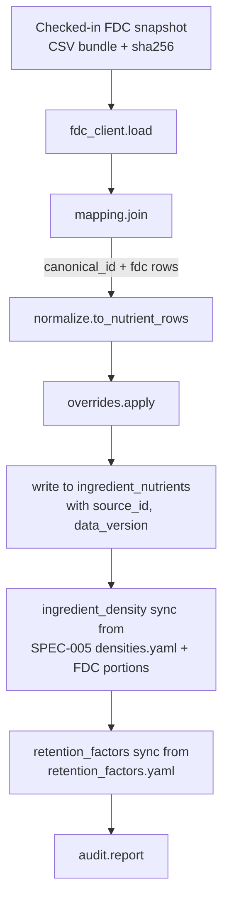

# SPEC-008: USDA FoodData Central ingestion and nutrient data tables

| Field       | Value                                                    |
|-------------|----------------------------------------------------------|
| **Status**  | Proposed                                                 |
| **Author**  | Nutrition & Meal Planning team                           |
| **Created** | 2026-04-17                                               |
| **Priority**| P0 (blocks SPEC-009, SPEC-010, ADR-005 grocery/substitution) |
| **Scope**   | New module `backend/agents/nutrition_meal_planning_team/nutrient_data/`, Postgres tables (`ingredient_nutrients`, `ingredient_density`, `retention_factors`, `nutrient_sources`), scheduled refresh job, CLI tools |
| **Depends on** | SPEC-005 (canonical ingredient ids and unit system) |
| **Implements** | ADR-003 §1 (per-ingredient nutrient data) |

---

## 1. Problem Statement

Every ADR-003 capability — recipe rollup, plan validation, targeted
repair — requires one primitive we do not have: reliable
per-ingredient nutrient data keyed by SPEC-005's canonical ids.

SPEC-005 ships a catalog of ~2,000 canonical foods and a unit system.
It does **not** carry nutrient values. `canonical_foods.yaml` has an
`fdc_id` slot reserved for each food and nothing else. Until those
foods are joined to actual nutrient records and converted to a
stable per-100g representation, SPEC-009 cannot compute a single
recipe's macros.

This spec builds the ingestion pipeline, the Postgres tables it
populates, and the refresh and audit tooling. It is pure data
infrastructure. It does not compute rollups, validate plans, or
change any user-visible behavior. It is what makes the next two
specs possible.

The scope discipline here matters: nutrient data is the long-tail
item in the roadmap. Getting the ingestion path versioned,
auditable, and refreshable now keeps SPEC-009 and SPEC-010 small.

---

## 2. Current State

### 2.1 What we have

- SPEC-005 canonical catalog with `fdc_id` populated where known,
  null otherwise.
- `densities.yaml` (SPEC-005) with a small seed of volume-to-mass
  conversions for common ingredients. Hand-curated.
- No per-ingredient nutrient data anywhere.

### 2.2 Gaps

1. No nutrient table keyed by canonical id.
2. No ingestion job against any authoritative source.
3. No versioning or audit on nutrient values — so downstream caches
   would have no safe invalidation key.
4. No retention-factor data (raw vs. cooked; water loss alters per-
   serving macros by 20–40% for meats and 50%+ for leafy greens).
5. No handling for foods we intentionally do not want from FDC
   (composite recipes; user's own pantry entries).

---

## 3. Goals and Non-Goals

### 3.1 Goals

- Ship a versioned ingestion pipeline that joins SPEC-005 canonical
  ids to USDA FDC nutrient records, producing `per_100g` values for
  the nutrient set ADR-001 + ADR-003 require.
- Populate `ingredient_nutrients` (nutrient data) and extend
  `ingredient_density` (already partly in SPEC-005) in Postgres as
  the single runtime source of truth. YAML files remain the
  authoring layer for densities and retention factors; nutrient
  values are sourced from FDC and not hand-edited in v1.
- Version every row with `NUTRIENT_DATA_VERSION` and an `fdc_import_id`
  so downstream cache invalidation is deterministic.
- Provide a retention-factor table covering the ingredients where
  raw-to-cooked conversion meaningfully changes per-serving macros.
- Provide CLI tools for refresh, coverage audit, and manual
  override of individual values when FDC data is wrong or absent.
- Keep the runtime read path O(1) per lookup — no network calls,
  no scans.

### 3.2 Non-goals

- **No rollup logic.** SPEC-009 does the arithmetic.
- **No branded foods.** FDC Branded Foods is high-churn and
  user-specific; deferred to a follow-up alongside the broader
  branded-foods SPEC-005 extension.
- **No ingredient-level per-serving claims.** We compute `per_100g`
  only; serving conversions live in SPEC-009 using SPEC-005
  densities.
- **No recipe-level nutrient data**. Recipes are the assembly of
  ingredients; composites are not ingested here.
- **No calorie-only approach.** v1 ingests the full nutrient set
  needed by ADR-001's `DailyTargets` plus the micros used by
  clinical clamps.

---

## 4. Detailed Design

### 4.1 Module layout

```
backend/agents/nutrition_meal_planning_team/nutrient_data/
├── __init__.py                   # get_nutrients, get_density, get_retention, VERSION
├── version.py                    # NUTRIENT_DATA_VERSION = "1.0.0"
├── types.py                      # Nutrients, NutrientValue, Density, RetentionFactor
├── reader.py                     # runtime read path (Postgres-backed, in-memory cached)
├── ingest/
│   ├── fdc_client.py             # thin wrapper over FDC CSV bulk download + REST
│   ├── mapping.py                # canonical_id → fdc_id(s) joiner
│   ├── normalize.py              # FDC nutrient schema → our Nutrient enum
│   ├── overrides.py              # hand-curated corrections (YAML-backed)
│   ├── pipeline.py               # end-to-end: download → join → write
│   └── audit.py                  # coverage + diff reports
├── data/
│   ├── nutrient_enum.py          # closed Nutrient enum (kcal, protein_g, ...)
│   ├── retention_factors.yaml    # raw→cooked factors by canonical_id + method
│   ├── overrides.yaml            # canonical_id-scoped manual corrections
│   └── fdc_snapshots/            # checked-in checksummed FDC bulk files
│       └── 2026-04-fdc.sha256
├── cli/
│   ├── refresh.py
│   ├── coverage.py
│   ├── diff.py
│   └── override.py
└── tests/
```

### 4.2 Nutrient enum

`nutrient_enum.py` defines a closed `Nutrient` enum. v1 includes:

- Macros: `kcal`, `protein_g`, `fat_g`, `saturated_fat_g`,
  `carbs_g`, `sugar_g`, `added_sugar_g`, `fiber_g`.
- Micros required by ADR-001 clinical clamps and ADR-003 rollup:
  `sodium_mg`, `potassium_mg`, `calcium_mg`, `iron_mg`,
  `phosphorus_mg`, `magnesium_mg`, `zinc_mg`, `vitamin_d_mcg`,
  `vitamin_b12_mcg`, `vitamin_k_mcg`, `vitamin_c_mg`, `folate_mcg_dfe`.

Closed. Additions are a minor version bump with reviewer sign-off.

### 4.3 Postgres schema

Registered via `shared_postgres.register_team_schemas` in the
nutrition team's lifespan. Migration
`005_nutrient_data.sql`:

```sql
-- Closed source registry; each import writes a row.
CREATE TABLE IF NOT EXISTS nutrient_sources (
    id              BIGSERIAL PRIMARY KEY,
    name            TEXT NOT NULL,          -- 'fdc_sr_legacy', 'fdc_foundation', 'manual'
    snapshot_label  TEXT NOT NULL,          -- e.g. '2026-04-fdc'
    imported_at     TIMESTAMPTZ NOT NULL DEFAULT now(),
    data_version    TEXT NOT NULL,          -- NUTRIENT_DATA_VERSION at import time
    checksum        TEXT,                   -- sha256 of source payload
    notes           TEXT
);

-- One row per (canonical_id, nutrient). per_100g is the single
-- authoritative value; confidence + source are for audit and UI.
CREATE TABLE IF NOT EXISTS ingredient_nutrients (
    canonical_id    TEXT NOT NULL,
    nutrient        TEXT NOT NULL,          -- Nutrient enum value
    per_100g        DOUBLE PRECISION NOT NULL,
    unit            TEXT NOT NULL,          -- 'g', 'mg', 'mcg', 'kcal'
    source_id       BIGINT NOT NULL REFERENCES nutrient_sources(id),
    confidence      REAL NOT NULL DEFAULT 1.0,
    is_override     BOOLEAN NOT NULL DEFAULT FALSE,
    data_version    TEXT NOT NULL,
    updated_at      TIMESTAMPTZ NOT NULL DEFAULT now(),
    PRIMARY KEY (canonical_id, nutrient)
);
CREATE INDEX ON ingredient_nutrients (data_version);
CREATE INDEX ON ingredient_nutrients (canonical_id);

-- Extends SPEC-005 densities YAML into Postgres; YAML remains the
-- authoring layer, job syncs it on refresh.
CREATE TABLE IF NOT EXISTS ingredient_density (
    canonical_id    TEXT NOT NULL,
    unit            TEXT NOT NULL,
    grams           DOUBLE PRECISION NOT NULL,
    source          TEXT NOT NULL,          -- 'spec005_yaml' | 'fdc_portion' | 'manual'
    data_version    TEXT NOT NULL,
    PRIMARY KEY (canonical_id, unit)
);

-- Retention factors: ratio applied to per-100g nutrient when the
-- recipe describes a cooked preparation. Keyed by canonical_id +
-- method; nutrient-specific where it matters.
CREATE TABLE IF NOT EXISTS retention_factors (
    canonical_id    TEXT NOT NULL,
    method          TEXT NOT NULL,          -- 'boiled', 'baked', 'fried', 'steamed', 'raw'
    nutrient        TEXT,                   -- NULL = applies to all macros uniformly
    mass_retention  REAL NOT NULL DEFAULT 1.0,   -- e.g. 0.75 for chicken baked
    nutrient_retention REAL NOT NULL DEFAULT 1.0, -- e.g. 0.6 for vitamin C boiled
    source          TEXT NOT NULL,
    data_version    TEXT NOT NULL,
    PRIMARY KEY (canonical_id, method, COALESCE(nutrient, ''))
);

-- Audit log for every override write.
CREATE TABLE IF NOT EXISTS nutrient_override_log (
    id              BIGSERIAL PRIMARY KEY,
    canonical_id    TEXT NOT NULL,
    nutrient        TEXT NOT NULL,
    old_value       DOUBLE PRECISION,
    new_value       DOUBLE PRECISION NOT NULL,
    reason          TEXT NOT NULL,
    author          TEXT NOT NULL,
    recorded_at     TIMESTAMPTZ NOT NULL DEFAULT now()
);
```

### 4.4 Ingestion pipeline (`ingest/pipeline.py`)



Behavior:

- FDC bulk files (SR Legacy + Foundation Foods) are downloaded
  once per release, their sha256 checksummed, and committed under
  `data/fdc_snapshots/`. The bulk payload itself is **not** in the
  repo; only the checksum lives there, with a pointer to the
  download URL in a pinned README. This keeps diff noise down and
  lets CI verify the file we ingested matches what was reviewed.
- `mapping.join` reads `fdc_id` from every SPEC-005 canonical food;
  every canonical food without `fdc_id` emits a coverage warning.
- `normalize.to_nutrient_rows` maps FDC's nutrient ids to our
  `Nutrient` enum. Anything in FDC but not in our enum is
  discarded; anything in our enum but missing in FDC is reported in
  the coverage pass.
- `overrides.apply` reads `overrides.yaml` and replaces values for
  specific `(canonical_id, nutrient)` pairs with a manual value,
  setting `is_override=true` and writing to `nutrient_override_log`.
  Used when FDC values are wrong (rare) or when an ingredient has
  no FDC id but is common (we manually enter the canonical values
  from a peer-reviewed source, cite in the YAML).
- Write is **transactional**: the entire refresh lands atomically
  via a staging table swap, not row-by-row.

### 4.5 Retention-factor policy

Retention factors live in a small hand-curated YAML
(`retention_factors.yaml`). v1 coverage:

- Meats (chicken, beef, pork, fish): `baked`, `grilled`, `boiled`,
  `fried`. Mass retention 0.70–0.85 depending on method + cut.
  Nutrient retention ≈ 1.0 for macros, 0.6–0.9 for water-soluble
  vitamins on boiled.
- Pasta and rice: `boiled`. Mass retention ≈ 2.5–3.0× (water
  absorbed). Nutrient-per-100g on the cooked side drops accordingly.
- Leafy greens (spinach, kale, chard, beet greens): `sauteed`,
  `boiled`, `steamed`. Mass retention 0.25–0.35; nutrient retention
  0.7–0.9 for most nutrients, lower for folate and vitamin C on
  boiled.
- Starchy vegetables (potato, sweet potato): `baked`, `boiled`,
  `fried`. Mass retention 0.85–0.95.

Everything outside the v1 list defaults to `mass_retention=1.0`,
`nutrient_retention=1.0` — i.e., we assume raw. SPEC-009's
confidence score is lowered when a recipe's method is one we do not
have retention data for.

Each row carries a citation in `retention_factors.yaml` comments.
Reviewer sign-off required on any edit.

### 4.6 Runtime read path (`reader.py`)

- Single query: `SELECT nutrient, per_100g, unit FROM ingredient_nutrients WHERE canonical_id = $1`.
- In-memory LRU cache keyed by `(canonical_id, NUTRIENT_DATA_VERSION)`.
  Cache is versioned; a refresh job bumps `NUTRIENT_DATA_VERSION`
  and downstream caches (SPEC-009 recipe rollups, SPEC-010 plan
  snapshots) miss and repopulate.
- `get_density(canonical_id, unit)` and `get_retention(canonical_id,
  method)` follow the same pattern.
- No network. No LLM.

Interface (module-level):

```python
def get_nutrients(canonical_id: str) -> Optional[Nutrients]: ...
def get_density(canonical_id: str, unit: str) -> Optional[float]: ...
def get_retention(canonical_id: str, method: str) -> Retention: ...
NUTRIENT_DATA_VERSION: str
```

### 4.7 Scheduled refresh

Refresh runs via the platform's `scheduled-tasks` mechanism. Cadence:
**quarterly**, manual trigger allowed. FDC releases are infrequent;
quarterly is a reasonable default.

Refresh steps:

1. Verify checked-in snapshot checksum matches the FDC file on disk
   (fail if not — means someone swapped it without going through
   the checksum PR).
2. Run pipeline against staging Postgres.
3. Run coverage audit; compare against the previous data version's
   coverage. Drops beyond a threshold (3% absolute) fail the job
   and require human review.
4. Run nutrient-diff audit: per-canonical-id max absolute delta
   on each nutrient vs. previous version. Outliers (>50% change on
   a macro for a food that was not added or flagged) fail the job.
5. On success, swap staging → production via a transaction.
6. Bump `NUTRIENT_DATA_VERSION` minor.
7. Write CHANGELOG entry listing added/removed foods and notable
   value changes.

Manual refresh (out-of-cadence) uses the same pipeline; admin-only
CLI command.

### 4.8 CLI tools

- `python -m nutrient_data.cli.refresh [--dry-run]` — runs the
  ingest pipeline. Dry-run prints diffs without writing.
- `python -m nutrient_data.cli.coverage` — reports:
  - Canonical foods with no `fdc_id` and no override (gap).
  - Canonical foods with `fdc_id` but FDC returned an incomplete
    nutrient set.
  - Top-N macros with `confidence < 0.9`.
- `python -m nutrient_data.cli.diff VERSION_A VERSION_B` — prints
  per-nutrient deltas between two data versions; used by the
  quarterly refresh review.
- `python -m nutrient_data.cli.override CANONICAL_ID NUTRIENT VALUE --reason "..."` —
  interactive; writes to `overrides.yaml` and `nutrient_override_log`;
  requires `--reason`.

### 4.9 Versioning

`NUTRIENT_DATA_VERSION = "MAJOR.MINOR.PATCH"`:

- **MAJOR** — `Nutrient` enum removal/rename, schema change,
  retention-factor model change.
- **MINOR** — data refresh (quarterly), enum addition, new
  retention factors.
- **PATCH** — override additions/corrections that do not change the
  shape of downstream rollups meaningfully.

Every `ingredient_nutrients` row carries `data_version` so queries
can verify consistency; downstream caches pin on it.

### 4.10 Privacy and licensing

- FDC data is public domain (explicitly — US government data).
  License permits redistribution; we still cite it per the FDC
  attribution guidance in the nutrient-source registry and in UI
  "why these numbers" panels.
- No user data is involved in this pipeline.

### 4.11 Priority-grouped work items

| # | Item | Priority |
|---|------|----------|
| W1 | Module scaffolding, `version.py`, `types.py`, `nutrient_enum.py` | P0 |
| W2 | Migration `005_nutrient_data.sql` + schema registration | P0 |
| W3 | `fdc_client.load` (reads CSV bundle from snapshot directory) | P0 |
| W4 | `mapping.join` + coverage report | P0 |
| W5 | `normalize.to_nutrient_rows` + tests | P0 |
| W6 | Overrides loader + `nutrient_override_log` wiring | P0 |
| W7 | `pipeline.py` end-to-end with staging-table atomic swap | P0 |
| W8 | `reader.py` runtime read path with version-aware cache | P0 |
| W9 | Initial `fdc_snapshots/2026-04-fdc.sha256` + README pointing to FDC URL | P0 |
| W10 | Retention-factor YAML seed + sync step | P1 |
| W11 | CLI tools: refresh, coverage, diff, override | P1 |
| W12 | Scheduled-task wiring (quarterly refresh) | P1 |
| W13 | Audit: CI coverage check (canonical foods with missing nutrients) | P1 |
| W14 | Benchmarks: `get_nutrients` p99 ≤ 200 µs (cached) / ≤ 5 ms (cold) | P2 |

---

## 5. Rollout Plan

No runtime callers at v1.0.0 ship. Rollout is about getting the
pipeline, the data, and the versioning clean before SPEC-009
consumes them.

### Phase 0 — Scaffolding (P0)
- [ ] W1–W2 landed. Staging migration applied.

### Phase 1 — Ingest pipeline (P0)
- [ ] W3–W7 landed.
- [ ] W9 snapshot checked in; pipeline runs green against it in
      staging.
- [ ] Coverage report shows ≥95% of SPEC-005's canonical foods
      have at least kcal + macros populated.
- [ ] Micros coverage ≥ 80% on foods with an `fdc_id`.

### Phase 2 — Retention + overrides (P0/P1)
- [ ] W10 retention factors seeded.
- [ ] W6 overrides YAML exercised on at least 30 known-problem
      entries (v1 overrides list).
- [ ] W8 read path wired; in-memory cache hit rate ≥ 99% after
      warm-up.

### Phase 3 — Tooling and scheduled refresh (P1)
- [ ] W11 CLI tools shipped.
- [ ] W12 scheduled task configured (quarterly cadence).
- [ ] W13 CI coverage check enforces thresholds on PRs.

### Phase 4 — Freeze (P1/P2)
- [ ] W14 benchmarks baselined.
- [ ] `NUTRIENT_DATA_VERSION = "1.0.0"` frozen; CHANGELOG entry.

### Rollback
- Pipeline is a write-only source of truth with a staging swap; if
  a refresh lands bad data, roll back by re-running with the
  previous snapshot (snapshots kept indefinitely) or restore the
  staging-swap's prior tables (retained for 30 days).
- Runtime callers lag behind the data version; any caller on
  version N is unaffected by a bad version N+1 until they
  invalidate their cache.

---

## 6. Verification

### 6.1 Unit tests

- `test_nutrient_enum.py` — closed-set invariants; stable string
  representation across versions.
- `test_normalize_fdc.py` — fixture FDC rows produce expected
  `(canonical_id, nutrient, per_100g, unit)` tuples; unit
  conversions correct (FDC stores mg vs. g inconsistently).
- `test_overrides_apply.py` — override replaces the FDC value,
  marks `is_override=true`, writes audit log row.
- `test_retention_lookup.py` — known (canonical_id, method) pairs
  return expected factors; missing pairs return identity factor
  (1.0, 1.0) with `is_default=true` flag.

### 6.2 Integration tests

- `test_pipeline_end_to_end.py` — fixture FDC bundle (small,
  checked-in) runs through the full pipeline against a staging
  Postgres; final tables match expected snapshot.
- `test_atomic_swap.py` — pipeline fails mid-write; no partial
  data visible to runtime readers; pre-existing version still
  serves.
- `test_reader_cache_invalidation.py` — bumping
  `NUTRIENT_DATA_VERSION` causes runtime reader to miss cache and
  re-fetch.

### 6.3 Coverage and audit tests

- `test_coverage_threshold.py` — fails if any SPEC-005 canonical
  food with `fdc_id` set has zero nutrients after ingest.
- `test_snapshot_checksum.py` — fails if the on-disk FDC bundle
  does not match the checked-in sha256.
- `test_nutrient_diff_alerts.py` — simulated refresh with a known
  outlier (50% drop on a macro) triggers the diff-audit failure.

### 6.4 Performance

- `bench_get_nutrients.py` — cold read ≤ 5 ms, warm read ≤ 200 µs,
  both on CI reference runner.
- Cache hit rate ≥ 99% after a typical 100-lookup warmup.

### 6.5 Review gates

- Clinical reviewer sign-off on `Nutrient` enum (what we commit to
  carrying long-term).
- Clinical reviewer sign-off on `retention_factors.yaml` seed.
- Licensing/attribution note in nutrition team README referencing
  FDC as the source.

### 6.6 Cutover criteria (freeze v1.0.0)

- All tests green.
- Phase 1 coverage thresholds met (≥95% macros, ≥80% micros on
  fdc-tagged foods).
- Reviewer sign-offs recorded.
- No open P0 issues.

---

## 7. Open Questions

- **FDC REST vs. bulk CSV.** v1 uses bulk CSV snapshots (deterministic,
  reviewable). A REST fallback for branded foods is a v1.1 feature
  once we decide to support those.
- **Where does "cooked" mass retention for pasta land?** Pasta
  cooked mass is greater than raw (water absorption), which flips
  the usual retention direction. `mass_retention > 1.0` is legal in
  the schema; the UI just needs to understand it.
- **Override TTL.** Should manual overrides auto-expire when the
  next FDC refresh covers them? v1 says no — overrides persist
  until explicitly removed. We may add a review flag in v1.1.
- **Branded foods.** Deferred per §3.2. When they land they add a
  `brand` column on `ingredient_nutrients` and a separate
  `branded_foods` table; no schema migration required on the tables
  this spec defines.
