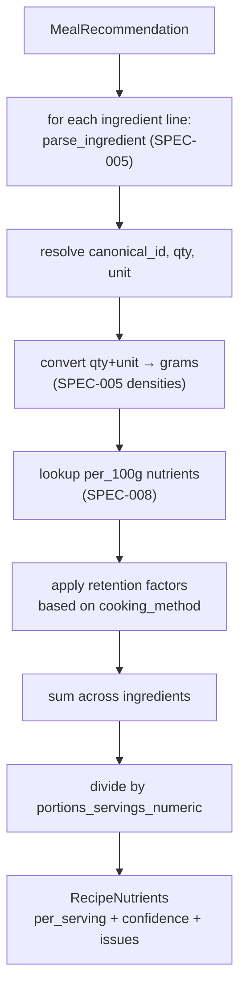

# SPEC-009: Recipe and plan nutrient rollup

| Field       | Value                                                    |
|-------------|----------------------------------------------------------|
| **Status**  | Proposed                                                 |
| **Author**  | Nutrition & Meal Planning team                           |
| **Created** | 2026-04-17                                               |
| **Priority**| P0 (blocks SPEC-010; inputs to ADR-006 eaten rollup)     |
| **Scope**   | New pure-Python module `backend/agents/nutrition_meal_planning_team/nutrient_rollup/` |
| **Depends on** | SPEC-005 (parser, densities, units), SPEC-008 (nutrient data, retention factors) |
| **Implements** | ADR-003 §2 (recipe nutrient computation), §3 (plan-level rollup) |

---

## 1. Problem Statement

After SPEC-005 and SPEC-008 land, we have canonical ingredient ids,
a parser, a density table, a retention-factor table, and per-100g
nutrient values. What we do not have is the arithmetic that turns
those primitives into per-recipe and per-plan nutrient totals.

This spec ships that arithmetic as a pure-Python module. It answers
two questions:

1. **Per recipe**: for a `MealRecommendation` with a list of
   free-text ingredient lines, what are the per-serving nutrients
   and how confident are we?
2. **Per plan**: for a week of recipes assigned to dates, what are
   the daily totals and how do they compare to the
   `NutritionPlan.daily_targets` from SPEC-003 / SPEC-004?

The module has no LLM dependency, no agent, no orchestrator, no
HTTP. It is importable and testable in isolation. SPEC-010 wires it
into the orchestrator and adds the repair loop. Keeping the
arithmetic in a pure module is deliberate — it is what makes the
numbers reviewable and the confidence story honest.

---

## 2. Current State

### 2.1 What's there

- `MealRecommendation.ingredients: List[str]` — free-text lines.
- `NutritionPlan.daily_targets: DailyTargets` — numeric targets
  from SPEC-003.
- `MealRecommendation.suggested_date: Optional[str]` — recipes
  optionally carry their assigned date.
- `portions_servings: str` — free-text serving count.

### 2.2 What's missing

1. No function that takes a `MealRecommendation` and returns its
   per-serving nutrient totals.
2. No function that takes a list of dated `MealRecommendation`s
   and returns daily/weekly totals + variance.
3. No confidence score on recipe-level rollups — low-confidence
   plans cannot be distinguished from high-confidence plans, which
   means SPEC-010's repair loop cannot make sensible decisions.
4. No structured recipe-step output to support cooked-vs-raw
   retention — recipes today carry a rationale sentence but no
   method tag.

---

## 3. Goals and Non-Goals

### 3.1 Goals

- Deterministic `compute_recipe_nutrients(rec) -> RecipeNutrients`
  that consumes SPEC-005 parsing and SPEC-008 data and returns
  per-serving values with a confidence score and a structured list
  of resolution issues.
- Deterministic `rollup_plan(suggestions, targets, period_days) ->
  PlanRollup` that computes daily totals, weekly totals, and
  variance vs. targets, plus a list of tolerance breaches.
- Handle the unglamorous cases explicitly: unresolvable ingredients,
  missing densities, unknown cooking methods, fractional servings,
  recipes with no `suggested_date`.
- Expose the intermediate parsed-ingredient list on
  `RecipeNutrients` so SPEC-007 (guardrail) and SPEC-010 (repair
  loop) do not re-parse.
- Pure, no I/O beyond SPEC-008 reads, deterministic, versioned.

### 3.2 Non-goals

- **No repair loop, swap, or regeneration.** SPEC-010 owns that.
- **No tolerance policy authoring.** Tolerance thresholds are
  consumed from a config file owned by SPEC-010; this module
  applies them.
- **No cooking-method inference.** If a recipe does not emit a
  structured method tag, we default to raw. Inferring method from
  prose is out of scope and error-prone.
- **No eaten rollup.** Cooking-event-based totals (what the user
  actually ate) are ADR-006; the same `rollup_plan` core is reused
  there via a different input list, but the new endpoint is not
  in this spec.

---

## 4. Detailed Design

### 4.1 Module layout

```
backend/agents/nutrition_meal_planning_team/nutrient_rollup/
├── __init__.py            # compute_recipe_nutrients, rollup_plan, VERSION
├── version.py             # ROLLUP_VERSION = "1.0.0"
├── types.py               # RecipeNutrients, PlanRollup, DailyTotals,
│                          # NutrientBreach, ResolutionIssue
├── recipe.py              # compute_recipe_nutrients
├── plan.py                # rollup_plan
├── confidence.py          # confidence scoring
├── errors.py
└── tests/
```

Public interface:

```python
def compute_recipe_nutrients(rec: MealRecommendation) -> RecipeNutrients: ...
def rollup_plan(
    suggestions: Sequence[MealRecommendationWithId],
    targets: DailyTargets,
    period_days: int,
    tolerances: Tolerances,
) -> PlanRollup: ...
```

### 4.2 Required `MealRecommendation` additions

Additive fields on `MealRecommendation` (models.py):

```python
class CookingMethod(str, Enum):
    raw = "raw"
    baked = "baked"
    grilled = "grilled"
    boiled = "boiled"
    steamed = "steamed"
    fried = "fried"
    sauteed = "sauteed"
    mixed = "mixed"          # e.g. salad bowl + grilled protein; recipe-level default

class MealRecommendation(BaseModel):
    # ... existing ...
    cooking_method: CookingMethod = CookingMethod.raw
    portions_servings_numeric: Optional[float] = None  # parsed from string if present
```

- Absent `cooking_method` defaults to `raw`; confidence is reduced
  (§4.6).
- `portions_servings_numeric` is populated by the meal-planning
  agent when possible; if absent, this module parses
  `portions_servings: str` (e.g. `"serves 4"`) with a small regex,
  then falls back to `1.0` with a reduced confidence.

The meal-planning agent prompt (SPEC-007's updated prompt) is
extended in the SPEC-010 rollout to emit these fields reliably.
This spec tolerates their absence.

### 4.3 `compute_recipe_nutrients`

Pipeline:



Types:

```python
@dataclass(frozen=True)
class ResolutionIssue:
    kind: Literal[
        "unresolved_ingredient",
        "missing_density",
        "missing_qty",
        "missing_nutrients",
        "unknown_method",
        "missing_portions",
    ]
    ingredient_raw: Optional[str]
    detail: str

@dataclass(frozen=True)
class RecipeNutrients:
    per_serving: dict[Nutrient, float]        # from nutrient_enum
    per_serving_units: dict[Nutrient, str]    # 'kcal', 'g', 'mg', 'mcg'
    total_mass_g_per_serving: float
    confidence: float                          # 0.0..1.0
    issues: tuple[ResolutionIssue, ...]
    parsed_ingredients: tuple[ParsedIngredient, ...]
    rollup_version: str                        # ROLLUP_VERSION
    data_version: str                          # SPEC-008 NUTRIENT_DATA_VERSION
```

Rules:

- An ingredient line with `canonical_id=None` contributes zero to
  all nutrients and emits an `unresolved_ingredient` issue.
- An ingredient with `qty=None` (e.g. "a handful of cashews",
  "salt to taste") uses a lookup in SPEC-005's `densities.yaml`
  for a "default unspecified quantity" (e.g. `handful_cashew: 30g`)
  where defined, otherwise falls back to `0g` with a `missing_qty`
  issue. Salt and "to taste" items default to zero and emit an
  issue rather than inventing a number.
- An ingredient with `qty` and `unit` but missing density (e.g.
  `"2 tbsp exotic-herb-paste"` with no density entry) contributes
  zero and emits `missing_density`.
- An ingredient with canonical id but no nutrient row emits
  `missing_nutrients` (coverage gap; SPEC-008 should have it, so
  the signal helps prioritize).
- Retention: for each ingredient, look up the
  `(canonical_id, cooking_method)` retention factor from SPEC-008.
  Default to (1.0, 1.0) with `unknown_method` issue if none.
  Apply `nutrient_retention` to each nutrient; apply `mass_retention`
  to the contributing mass for per-serving mass reporting.
- Total is summed across ingredients, then divided by
  `portions_servings_numeric`.

### 4.4 Confidence scoring

Single scalar, explainable:

```
confidence = 1.0
  - 0.10 per unresolved_ingredient       (capped at 0.5 total)
  - 0.05 per missing_density             (capped at 0.2 total)
  - 0.05 per missing_qty                 (capped at 0.2 total)
  - 0.10 per missing_nutrients           (capped at 0.4 total)
  - 0.05 if cooking_method absent or "mixed"
  - 0.10 if unknown_method on >30% of ingredient mass
  - 0.10 if missing_portions
confidence = clamp(confidence, 0.0, 1.0)
```

Confidence is mass-weighted where possible: losing 5% of mass to an
unresolved ingredient hurts less than losing 40%. A helper in
`confidence.py` implements the mass-weighting; the table above is
the floor rule for sparse recipes where mass can't be computed.

SPEC-010's repair loop treats `confidence < 0.7` recipes as "do
not repair against this; ask user to clarify or regenerate." Low
confidence is visible in the UI as a caution chip.

### 4.5 `rollup_plan`

```python
@dataclass(frozen=True)
class DailyTotals:
    date: date
    nutrients: dict[Nutrient, float]
    recipe_ids: tuple[str, ...]
    low_confidence_recipe_ids: tuple[str, ...]

@dataclass(frozen=True)
class NutrientBreach:
    scope: Literal["per_meal", "per_day", "per_week"]
    date: Optional[date]
    recipe_id: Optional[str]
    nutrient: Nutrient
    observed: float
    target: float
    lower: Optional[float]
    upper: Optional[float]
    severity: Literal["cap_breach", "band_miss", "adequacy_gap"]

@dataclass(frozen=True)
class PlanRollup:
    by_day: tuple[DailyTotals, ...]
    weekly_totals: dict[Nutrient, float]
    variance_vs_target_per_day: dict[date, dict[Nutrient, float]]    # pct_delta
    variance_vs_target_weekly: dict[Nutrient, float]
    breaches: tuple[NutrientBreach, ...]
    per_meal_caps_breached: tuple[NutrientBreach, ...]
    confidence: float                                                  # plan-level
    issues: tuple[ResolutionIssue, ...]
    rollup_version: str
    data_version: str
```

Rules:

- Suggestions without `suggested_date` are distributed round-robin
  across the period's days. The UI shows unassigned recipes
  distinctly and invites the user to schedule them; we do not
  silently scatter them.
- Per-day summing is straightforward. Per-week summing sums across
  the period.
- `variance_vs_target_per_day[date][nutrient] = (observed - target) / target`
  where `target` is drawn from `DailyTargets` for per-day nutrients
  and from a weekly-adequacy map for nutrients where weekly
  adequacy is preferred (vitamin D, iron, vitamin K — see SPEC-010
  tolerances).
- `breaches` is populated using the tolerance set passed in. This
  spec does not define the thresholds; it applies them.
- `per_meal_caps_breached` is populated when a single recipe
  exceeds a per-meal cap (sodium, carbs for T2D). Per-meal caps
  are passed in via the `Tolerances` object, derived from ADR-001
  clinical overrides.
- `confidence` at the plan level is the minimum recipe confidence
  across the plan, with a small penalty for any recipe below 0.7.

### 4.6 Tolerances input shape

`Tolerances` is the input shape SPEC-010 constructs and passes in.
Defining the shape here (not the values) keeps this module
self-contained for testing.

```python
@dataclass(frozen=True)
class Tolerance:
    lower_pct: Optional[float]    # e.g. -0.10 for "protein can be 10% under"
    upper_pct: Optional[float]    # e.g. +0.10 for "kcal can be 10% over"
    cap_absolute: Optional[float] # e.g. 2300 mg sodium/day
    per_meal_cap: Optional[float] # e.g. 800 mg sodium/meal
    scope: Literal["per_day", "per_week"]

@dataclass(frozen=True)
class Tolerances:
    by_nutrient: dict[Nutrient, Tolerance]
```

SPEC-010 loads the YAML and constructs `Tolerances`. Unit tests
here exercise the shape with fixture tolerance sets.

### 4.7 Edge cases enumerated

- **Zero recipes.** Returns an empty `PlanRollup` with `confidence=1.0`,
  no breaches, no issues. Not an error.
- **Negative numbers anywhere.** Defensive: sums floor at zero,
  `NutrientBreach.observed` is never negative. A bug upstream that
  produced a negative should not cascade.
- **Recipe with one ingredient that has 95% of mass missing
  density.** Confidence drops to ~0.15, `missing_density` issue
  attached, `total_mass_g_per_serving` underreported accordingly.
  SPEC-010 will not repair against this.
- **Recipe that resolves cleanly but has no targets in its
  `Tolerances`.** No breaches emitted for those nutrients; no
  variance either. (SPEC-010's defaults cover every nutrient in
  `DailyTargets`.)
- **Plan spanning DST transitions.** Dates are `date`, not
  `datetime`; DST is not relevant. Timezone handling lives on the
  profile for meal-planning purposes but rollup is date-keyed.

### 4.8 Determinism

- Floating-point summation uses `math.fsum` for per-day totals to
  avoid accumulator drift across different Python builds.
- `parsed_ingredients` is ordered to match the input recipe order.
- Dict iteration order is insertion order throughout (Python 3.7+
  guarantee).
- Same inputs → byte-equal output across machines and runs. Golden
  tests (§6) enforce this.

### 4.9 Versioning

`ROLLUP_VERSION = "MAJOR.MINOR.PATCH"`:

- **MAJOR** — confidence formula change, rule change around
  unresolved ingredients, public type change.
- **MINOR** — added optional behavior (e.g. mass-weighted
  confidence refinement).
- **PATCH** — bug fixes that do not change outputs on clean inputs.

SPEC-010 pins on `(ROLLUP_VERSION, NUTRIENT_DATA_VERSION)` for its
recipe-level content-addressed cache.

### 4.10 Caching hook

The module itself is stateless; caching is SPEC-010's responsibility.
The module exposes a stable `recipe_cache_key(rec) -> str` helper:

```
key = sha256(
    rollup_version || data_version || canonical(rec.ingredients)
          || cooking_method || portions_servings_numeric
)
```

Canonicalization of `rec.ingredients` is whitespace-normalized
lowercased join. Two recipes with the same canonical ingredient
content hit the same cache.

### 4.11 Priority-grouped work items

| # | Item | Priority |
|---|------|----------|
| W1 | Module scaffolding; `version.py`; `types.py`; `errors.py` | P0 |
| W2 | Additive `models.py` fields: `CookingMethod`, `portions_servings_numeric` | P0 |
| W3 | `recipe.py::compute_recipe_nutrients` with tests on ≥50 recipe fixtures | P0 |
| W4 | `confidence.py` + unit tests per rule (§4.4) | P0 |
| W5 | `plan.py::rollup_plan` + tests on multi-day fixtures | P0 |
| W6 | Tolerance application + breach detection tests | P0 |
| W7 | `recipe_cache_key` helper + stability test | P0 |
| W8 | Golden-output tests for ≥20 plan fixtures | P1 |
| W9 | Property tests (monotonicity, nonnegativity, mass-weighting) | P1 |
| W10 | Benchmarks: `compute_recipe_nutrients` p99 ≤ 5 ms, `rollup_plan` p99 ≤ 25 ms | P2 |
| W11 | "Unscheduled recipes" handling + tests | P1 |

---

## 5. Rollout Plan

Pure library; no runtime caller in this spec. Rollout is about
hitting the quality bar and freezing the version.

### Phase 0 — Scaffolding (P0)
- [ ] SPEC-008 at `NUTRIENT_DATA_VERSION=1.0.0`.
- [ ] W1–W2 landed.

### Phase 1 — Recipe rollup (P0)
- [ ] W3, W4 landed. Tests green on 50 recipe fixtures.
- [ ] Coverage ≥95% on `nutrient_rollup/`.

### Phase 2 — Plan rollup (P0)
- [ ] W5, W6, W11 landed.
- [ ] Multi-day fixtures: plan rollups match expected within
      floating-point epsilon.

### Phase 3 — Hardening (P1/P2)
- [ ] W7–W10 landed.
- [ ] `ROLLUP_VERSION = "1.0.0"` frozen; CHANGELOG entry.

### Rollback
- Library unused at ship; revert the PR if bugs surface.

---

## 6. Verification

### 6.1 Recipe fixture tests

`tests/fixtures/recipes/` — at least 50 hand-curated recipes across:

- Simple (3–5 ingredients, all common canonical ids).
- Mixed protein/grain/veg complete meals.
- Raw-only (salads, smoothies).
- Boiled/steamed with nutrient retention impact (spinach sauté,
  pasta with water-loss mass change).
- Composite ("grilled protein over rice with veg") spanning
  multiple cooking methods — marked `mixed`.
- Degenerate: empty ingredient list; one ingredient that is
  salt-to-taste; one recipe with a mystery ingredient;
  `portions_servings=""`.

Each fixture records expected per-serving values to ≥1 significant
figure for validation. Exact values come from hand computation
against published FDC numbers (and are re-verified when
`NUTRIENT_DATA_VERSION` changes).

### 6.2 Confidence rule tests

- Every rule in §4.4 has a dedicated fixture that isolates it.
- Mass-weighted confidence: fixture with 5% missing mass ≥ fixture
  with 40% missing mass.
- Cap rules fire: 10 `unresolved_ingredient` issues contribute the
  capped 0.5 decrement, not 1.0.

### 6.3 Plan fixture tests

`tests/fixtures/plans/` — 20 multi-day plan fixtures:

- Balanced 7-day plan hits all targets within tolerance.
- Protein-deficient plan triggers a `band_miss` breach on protein.
- High-sodium plan triggers a `cap_breach` on sodium (day) and a
  `per_meal_caps_breached` on at least one recipe.
- Plan with mixed-date + unscheduled recipes distributes the
  unscheduled ones and flags them.
- Plan where a single recipe has `confidence=0.4` reduces plan
  confidence; plan `low_confidence_recipe_ids` contains the id.

### 6.4 Property tests

- **Monotonicity**: doubling one ingredient's quantity at least
  doubles its nutrient contribution (within floating-point).
- **Nonnegativity**: no nutrient total is negative, ever.
- **Determinism**: 100 runs of `rollup_plan` on the same input
  return byte-equal output.
- **Mass conservation**: sum of recipe per-serving masses across a
  day equals the day's total mass within 1%.

### 6.5 Golden outputs

Checked in under `tests/golden/`. Any change to rollup output must
come with a `ROLLUP_VERSION` bump and an intentional golden
rewrite in the same PR.

### 6.6 Benchmarks

- `compute_recipe_nutrients` p99 ≤ 5 ms on 10-ingredient recipes.
- `rollup_plan` p99 ≤ 25 ms on a 14-recipe week.

### 6.7 Cutover criteria

- All P0 tests green, coverage ≥95%, goldens frozen, benchmarks
  baselined.
- Golden fixtures reviewed by the clinical reviewer who owns
  `Nutrient` enum + retention (§SPEC-008).

---

## 7. Open Questions

- **"Default unspecified quantity" entries in densities.yaml.**
  We suggest a small set (`handful_cashew: 30g`,
  `pinch_spice: 0.5g`) for the most common qty-less patterns. The
  alternative is always emitting `missing_qty`. v1 adds ~20 of
  these; anything else falls through to the issue.
- **Whether `confidence` should be multi-dimensional** (mass
  coverage, nutrient coverage, method coverage) instead of scalar.
  v1 is scalar for UX simplicity; we keep the three dimensions as
  issue categories so SPEC-010 can inspect detail.
- **Composite recipes** (e.g., "grilled chicken + rice + salad" in
  one `MealRecommendation`). Currently we default to
  `CookingMethod.mixed` which disables retention; this is safe but
  conservative. A sub-recipe structure would let us apply different
  methods to different parts of the meal. v1 defers.
- **Weekly-adequacy default set.** The list of nutrients treated as
  weekly-adequacy (D, K, iron) is a tolerance input in this spec,
  but SPEC-010 needs to decide defaults. Coordinated there.
