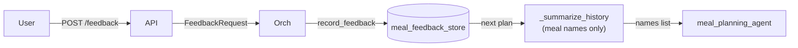

# SPEC-011: Preference signal extraction from meal feedback

| Field       | Value                                                    |
|-------------|----------------------------------------------------------|
| **Status**  | Proposed                                                 |
| **Author**  | Nutrition & Meal Planning team                           |
| **Created** | 2026-04-17                                               |
| **Priority**| P0 (blocks SPEC-012, SPEC-013)                           |
| **Scope**   | New module `backend/agents/nutrition_meal_planning_team/preferences/extractor/`, additive feedback handling, Postgres additions, `llm_service` structured-output integration |
| **Depends on** | SPEC-005 (canonical ids for ingredient tagging), SPEC-009 (recipe parsed ingredients + cooking method) |
| **Implements** | ADR-004 §1 (preference dimensions), §2 (feedback extraction) |

---

## 1. Problem Statement

ADR-004 argues the learning loop as currently implemented extracts
almost no signal per feedback event: `_summarize_history` returns a
comma-separated list of meal *names*, free-text notes are discarded
entirely, and the planner is asked to generalize from raw titles.
This spec is the first of three that implement ADR-004 — it is the
**extraction** layer: turn one `FeedbackRecord` + the recipe it
refers to into structured per-dimension signals that SPEC-012 can
aggregate into a user's learned-preference record.

This spec does not update preferences, feed the planner, or change
UI. It ships a pure extraction module that, given a (recipe,
feedback) pair, returns a deterministic-shape `FeedbackSignals`
payload. Keeping extraction isolated is deliberate: it is the only
component that requires an LLM call, and it is the component most
likely to drift across model versions, so it gets its own tests,
schema, and version stamp.

---

## 2. Current State

### 2.1 Today's feedback flow



- `FeedbackRecord.notes: str` is persisted but never read by any
  downstream logic.
- `rating` and `would_make_again` are the only numeric signals; used
  binary-ish by `_summarize_history`
  ([meal_planning_agent/agent.py:36-55](backend/agents/nutrition_meal_planning_team/agents/meal_planning_agent/agent.py:36)).

### 2.2 Gaps

1. No structured dimensions — all signal is flattened to a meal
   name.
2. Notes discarded; the richest feedback data is write-only.
3. No way to reason about "why" a meal was liked — the single
   biggest generalization blocker.
4. No per-dimension ground truth that SPEC-012 can update against
   or SPEC-013 can retrieve from.

---

## 3. Goals and Non-Goals

### 3.1 Goals

- Ship a pure module `preferences/extractor/` that exposes
  `extract_signals(recipe, feedback) -> FeedbackSignals`.
- Schema-locked output via `llm_service` structured-output contract
  (PR #184). No regex, no free-form parsing.
- Each signal carries dimension, direction, magnitude, and a short
  verbatim evidence snippet (for the UI "we learned this because
  you said X").
- Extract from **both** the numeric signals (rating,
  would_make_again) and the free-text notes; the two are combined
  in the output but tagged by their source so SPEC-012 can weight
  them differently.
- Write extracted signals to Postgres for every feedback event.
  SPEC-012 reads from there.
- Failure-closed: if extraction fails, persist the raw feedback
  unchanged and emit a structured failure event — do not block the
  user's feedback response.

### 3.2 Non-goals

- **No preference aggregation.** Bayesian smoothing, EWMA, and
  per-user rolling scores live in SPEC-012.
- **No retrieval.** Embedding recipes, top-K past hits, few-shot
  injection — all SPEC-013.
- **No UI.** "What we've learned about you" panel lives in SPEC-013.
- **No prompt changes to the meal planner.** The planner continues
  to use the existing name-list summarizer until SPEC-012 ships; we
  change one thing at a time.
- **No cross-user signals.** Per-user only. Collaborative filtering
  is a future ADR.

---

## 4. Detailed Design

### 4.1 Module layout

```
backend/agents/nutrition_meal_planning_team/preferences/extractor/
├── __init__.py               # extract_signals, EXTRACTOR_VERSION
├── version.py                # EXTRACTOR_VERSION = "1.0.0"
├── types.py                  # FeedbackSignals, Signal, Dimension enum
├── recipe_features.py        # derive deterministic tags from a recipe
├── numeric.py                # signals derivable from rating + would_make_again
├── llm_extractor.py          # structured-output LLM call on the note
├── errors.py
└── tests/
```

### 4.2 Output types

```python
class Dimension(str, Enum):
    ingredient = "ingredient"              # key: canonical_id
    cuisine = "cuisine"                    # key: cuisine_tag
    flavor = "flavor"                      # key: flavor_tag
    texture = "texture"                    # key: texture_tag
    format = "format"                      # key: format_tag
    protein = "protein"                    # key: protein_tag
    prep_time = "prep_time"                # key: "weekday" | "weekend"
    portion = "portion"                    # key: "size"
    novelty = "novelty"                    # key: "familiarity"

class SignalSource(str, Enum):
    rating = "rating"
    would_make_again = "would_make_again"
    note = "note"
    derived = "derived"       # from recipe features x numeric

@dataclass(frozen=True)
class Signal:
    dimension: Dimension
    key: str                  # dimension-specific (see §4.3)
    strength: float           # -1.0..+1.0
    source: SignalSource
    evidence: Optional[str] = None   # ≤200 char verbatim snippet
    confidence: float = 1.0

@dataclass(frozen=True)
class FeedbackSignals:
    recommendation_id: str
    client_id: str
    signals: tuple[Signal, ...]
    extracted_at: str         # ISO timestamp
    extractor_version: str
    llm_ok: bool              # False if the LLM-on-note step failed
    issues: tuple[str, ...]   # failure reasons if any
```

### 4.3 Dimension taxonomies

All closed enums. Additions are minor version bumps.

- **`ingredient`**: key = SPEC-005 `canonical_id` (e.g. `cilantro`,
  `tofu`, `chicken_thigh_raw`).
- **`cuisine`**: `italian`, `french`, `japanese`, `chinese_cantonese`,
  `chinese_sichuan`, `korean`, `thai`, `vietnamese`, `indian_north`,
  `indian_south`, `mexican`, `mediterranean`, `levantine`,
  `american_comfort`, `nordic`, `ethiopian`, `peruvian`, `caribbean`,
  `fusion`, `other`.
- **`flavor`**: `spicy`, `umami`, `sweet`, `sour`, `bitter`,
  `fermented`, `smoky`, `buttery`, `citrus`, `herbaceous`.
- **`texture`**: `crispy`, `crunchy`, `creamy`, `chewy`, `soft`,
  `silky`, `juicy`, `dry`.
- **`format`**: `one_pan`, `sheet_pan`, `stir_fry`, `no_cook`,
  `meal_prep`, `handheld`, `bowl`, `soup_stew`, `casserole`,
  `salad`, `grain_bowl`.
- **`protein`**: `chicken`, `beef`, `pork`, `lamb`, `fish`,
  `shellfish`, `egg`, `dairy`, `tofu`, `tempeh`, `seitan`,
  `legume`, `nuts`, `mixed`.
- **`prep_time`**: key ∈ `{weekday, weekend}`, strength maps to
  tolerance for time on that day type.
- **`portion`**: key = `size`; strength < 0 = too small, > 0 = too
  large.
- **`novelty`**: key = `familiarity`; strength < 0 = wanted more
  familiar, > 0 = wanted more adventurous.

The enum file lives at `preferences/taxonomy.py` and is shared with
SPEC-012 and SPEC-013 so all three modules see the same keyspace.

### 4.4 Recipe-feature derivation (`recipe_features.py`)

Deterministic, no LLM. Given a `MealRecommendation` (post
SPEC-007 + SPEC-009), produce:

- `cuisine_tag`: taken from `MealRecommendation.cuisine_tag`
  (additive field; defaulted `other`). The meal-planning agent
  emits it; if absent, defaults to `other` with an `issue`.
- `flavor_tags`, `texture_tags`, `format_tag`, `protein_tag`:
  similarly emitted by the planner under §4.8 prompt changes; with
  sensible defaults derived from ingredients when absent (e.g.
  protein_tag inferred from the canonical_id of the largest-mass
  protein ingredient per SPEC-009).
- `canonical_ingredients`: from SPEC-005 parser outputs already
  attached by SPEC-007.
- `prep_time_bucket`: from recipe's cook + prep times; `weekday` if
  recipe is on Mon–Fri and total ≤ threshold, `weekend` otherwise.
- `familiarity_score`: 1.0 if the canonical ingredient set overlaps
  ≥70% with the user's past 30 meals; 0.0 otherwise. Requires
  SPEC-012's historical view (accepted as a soft dep; v1 of
  extractor does not block on it and passes in a
  `UserHistorySummary` from the caller).

Derivation is deterministic and cheap; cached per `(recipe_id,
rollup_version)` by the caller.

### 4.5 Numeric signal extraction (`numeric.py`)

Given `(rating, would_make_again, recipe_features)`:

- A high positive signal (rating ≥ 4 and/or `would_make_again=true`)
  attaches positive `strength` to every derived feature (cuisine,
  format, protein, top-K ingredients by mass, flavor, texture). The
  exact strength mapping is:
  ```
  rating 5, wma=true  → strength  +0.7
  rating 4, wma=true  → strength  +0.5
  rating 5, wma=null  → strength  +0.5
  rating 4, wma=null  → strength  +0.3
  rating 3            → strength   0.0 (no signal; neutral)
  rating 2, wma=false → strength  -0.4
  rating 1, wma=false → strength  -0.6
  wma=false alone     → strength  -0.3
  ```
- These are **source=derived** signals — they are inferences, not
  direct user statements. SPEC-012 weights `derived` below `note`
  when both exist for the same key.

### 4.6 LLM extraction on the note (`llm_extractor.py`)

- Invoked only when `feedback.notes` is non-empty.
- Uses `llm_service` with a locked structured-output schema:

```python
class NoteExtractionPayload(BaseModel):
    signals: List[NotedSignal]

class NotedSignal(BaseModel):
    dimension: Dimension
    key: str                      # must be a value in the closed taxonomy
    strength: float = Field(ge=-1.0, le=1.0)
    evidence: str = Field(max_length=200)
```

- Prompt is short and strict. Key rules in the system prompt:
  - *"You are a parser. Extract only what the note says. Do not
    predict or invent."*
  - *"Every `key` must be one of the provided taxonomy values
    exactly. If the user's word does not map to the taxonomy,
    leave the signal out."*
  - *"Evidence must be a verbatim substring of the note."*
- The prompt includes the entire taxonomy (it is small enough —
  ~80 values total). No fuzzy matching at output time.
- Validation:
  - Schema rejection → `llm_ok=false`; note verbatim persisted;
    issue = `schema_rejected`.
  - Evidence not a substring of the note → drop that signal with
    issue = `evidence_mismatch`.
  - Key outside taxonomy → drop that signal with issue =
    `key_outside_taxonomy` (defense against a model that ignores
    the rule).

### 4.7 Orchestration

```python
def extract_signals(
    recipe: MealRecommendationWithId,
    feedback: FeedbackRecord,
    user_history: UserHistorySummary,    # for familiarity_score
) -> FeedbackSignals:
    features = derive_recipe_features(recipe, user_history)
    numeric = numeric_signals(feedback, features)
    note_signals: list[Signal] = []
    llm_ok = True
    if feedback.notes and feedback.notes.strip():
        try:
            note_signals = llm_extract(feedback.notes, taxonomy=TAXONOMY)
        except Exception:
            llm_ok = False
    combined = merge(numeric, note_signals)
    return FeedbackSignals(
        recommendation_id=recipe.recommendation_id,
        client_id=feedback.client_id,
        signals=tuple(combined),
        extracted_at=utcnow_iso(),
        extractor_version=EXTRACTOR_VERSION,
        llm_ok=llm_ok,
    )
```

Merge rule: both `note` and `derived` can produce signals for the
same `(dimension, key)`. They are kept as separate `Signal` entries
(not summed). SPEC-012 decides how to aggregate.

### 4.8 Meal-planner prompt additions (minor)

The planner must emit the tags needed for `recipe_features.py`.
Additive fields on `MealRecommendation`:

```python
class MealRecommendation(BaseModel):
    # existing...
    cuisine_tag: Optional[str] = None
    flavor_tags: List[str] = []
    texture_tags: List[str] = []
    format_tag: Optional[str] = None
    protein_tag: Optional[str] = None
```

The meal-planner prompt is amended to emit them using the taxonomy
values. Absence is tolerated; derivation falls back to
ingredient-based defaults (`preferences/taxonomy.py` has defaulting
functions).

### 4.9 API and persistence

Additive handling on the existing feedback path:

`POST /feedback` (existing):

1. Persist the `FeedbackRecord` as today.
2. Dispatch extraction asynchronously (background task in FastAPI;
   the user's response is not delayed).
3. On completion, persist `FeedbackSignals` to a new Postgres table
   `nutrition_feedback_signals`. Failures are logged + persisted
   with `llm_ok=false`.

Migration `007_feedback_signals.sql`:

```sql
CREATE TABLE IF NOT EXISTS nutrition_feedback_signals (
    recommendation_id  TEXT PRIMARY KEY
        REFERENCES nutrition_recommendations(recommendation_id) ON DELETE CASCADE,
    client_id          TEXT NOT NULL,
    signals_json       JSONB NOT NULL,
    llm_ok             BOOLEAN NOT NULL,
    issues_json        JSONB NOT NULL DEFAULT '[]'::jsonb,
    extractor_version  TEXT NOT NULL,
    extracted_at       TIMESTAMPTZ NOT NULL DEFAULT now()
);
CREATE INDEX ON nutrition_feedback_signals (client_id, extracted_at DESC);
```

No new HTTP endpoints in this spec; SPEC-013 exposes read APIs for
signals and preferences.

### 4.10 Observability

- `preferences.extractor.invocations{outcome}` where outcome ∈
  `ok | llm_error | schema_rejected | no_note`.
- `preferences.extractor.note_length_histogram`.
- `preferences.extractor.signals_per_feedback` histogram.
- `preferences.extractor.latency_ms` histogram.
- `preferences.extractor.dropped_signals{reason}` for
  evidence-mismatch, key-outside-taxonomy, etc.

### 4.11 Privacy

- Notes are PII-adjacent and contain personal preferences. Log
  redaction rule: note content is never logged at INFO or above;
  only lengths and outcome classifications.
- Evidence snippets stored in signals are bounded at 200 chars and
  retained for the life of the profile; deleted on account
  deletion via cascade.
- Extraction LLM calls do not include `client_id` or the user's
  profile beyond the note itself; only the taxonomy + prompt.

### 4.12 Versioning

`EXTRACTOR_VERSION = "MAJOR.MINOR.PATCH"`:

- **MAJOR** — taxonomy removal/rename, output schema change.
- **MINOR** — taxonomy addition, new signal source, mapping tweak.
- **PATCH** — prompt or bug fix that does not change output shape.

Re-extraction job (admin-only) can be triggered on a version bump
to refresh signals for existing feedback. v1 does not auto-run the
job; SPEC-012 coordinates invalidation.

### 4.13 Priority-grouped work items

| # | Item | Priority |
|---|------|----------|
| W1 | Module scaffolding, `version.py`, `types.py`, `errors.py` | P0 |
| W2 | `taxonomy.py` closed enums + shared across SPEC-012/013 | P0 |
| W3 | `recipe_features.py` derivation + fallback tests | P0 |
| W4 | `numeric.py` with rating-to-strength table + tests | P0 |
| W5 | `llm_extractor.py` with structured-output schema + validation | P0 |
| W6 | `extract_signals` orchestration + merge rule tests | P0 |
| W7 | Migration `007_feedback_signals.sql` + schema registration | P0 |
| W8 | Feedback endpoint wiring (background dispatch + persistence) | P0 |
| W9 | Meal-planner prompt additions to emit new tags | P1 |
| W10 | Observability counters | P1 |
| W11 | Re-extraction CLI tool (admin) | P2 |
| W12 | Benchmarks: p99 ≤ 3 s per extraction with LLM; ≤ 50 ms without | P2 |

---

## 5. Rollout Plan

Feature flag `NUTRITION_PREF_EXTRACTOR` (off → no extraction runs,
on → extraction runs on every new feedback).

### Phase 0 — Foundation (P0)
- [ ] W1, W2, W7 landed. Migration in staging. No behavior change.

### Phase 1 — Extractor behind flag (P0)
- [ ] W3–W8 landed behind flag.
- [ ] Flag on internal. Monitor extraction outcomes and latency.

### Phase 2 — Dogfood + planner tags (P0/P1)
- [ ] W9 planner prompt emits new tags; absence tolerated.
- [ ] Review first 100 extracted signals manually against their
      source notes. Reviewer: team lead + PM.
- [ ] Acceptance gate: ≥85% of signals judged correct by reviewer;
      zero signals with fabricated evidence (evidence-mismatch
      rate < 1% of LLM-extracted signals).

### Phase 3 — Ramp (P1)
- [ ] 10% → 50% → 100% over two weeks.
- [ ] Watch `dropped_signals{reason}` — high rates indicate
      prompt or taxonomy issues.

### Phase 4 — Cleanup (P1/P2)
- [ ] W10, W11, W12 landed.
- [ ] Flag default on; removal scheduled.

### Rollback
- Flag off → extraction skipped; existing `nutrition_feedback_signals`
  rows retained; no user-visible impact.
- Migration additive; no rollback needed.

---

## 6. Verification

### 6.1 Unit tests

- `test_numeric_strength_table.py` — every row in §4.5 produces the
  expected strength; tied-rating cases handled.
- `test_recipe_features_default.py` — missing cuisine/format/flavor
  tags fall back to derivations; defaults never fail closed.
- `test_llm_extractor_schema.py` — mocked LLM returning
  schema-valid output parses cleanly; schema-invalid output raises
  and is caught by the orchestrator.
- `test_evidence_substring.py` — extractor drops signals whose
  evidence is not a verbatim substring of the note.
- `test_key_outside_taxonomy.py` — extractor drops signals with
  unknown keys; issue recorded.

### 6.2 Integration tests

- `test_feedback_endpoint_triggers_extraction.py` — `POST /feedback`
  returns promptly; background extraction completes; row appears
  in `nutrition_feedback_signals` within 5 s.
- `test_feedback_no_note.py` — feedback with empty notes still
  produces numeric signals; `llm_ok=true` (LLM not called);
  `source=derived` signals present.
- `test_feedback_llm_failure.py` — LLM call raises; row is
  persisted with `llm_ok=false`, `issues=['llm_error']`, numeric
  signals still present.

### 6.3 Fixture-based correctness tests

`tests/fixtures/notes/` — 40 hand-labeled notes with expected
structured signals:

- "Loved the one-pan idea, but spicy was too much" →
  `[format:one_pan:+, flavor:spicy:-]`.
- "Great but portion was tiny" → `[portion:size:-]`.
- "Too long to cook on a Tuesday" → `[prep_time:weekday:-]`.
- "Would make again but not the cilantro" →
  `[ingredient:cilantro:-]`.
- "Perfect" → no note-derived signals (no specific evidence);
  numeric positive signals from the rating stand alone.

Each fixture's extracted signals must match expected by
`(dimension, key, sign_of_strength)`. Exact strength values are
not pinned.

### 6.4 Reviewer audit (Phase 2)

- 100 randomly sampled real extractions reviewed.
- Acceptance: ≥85% judged correct; ≤5% over-interpretation; ≤1%
  fabricated evidence.
- Failures: prompt revisions land before Phase 3 ramp.

### 6.5 Property tests

- Extraction output is deterministic for fixed inputs when the
  LLM step is mocked.
- `extract_signals` never raises on any well-formed input (soft
  contract): errors are captured on `FeedbackSignals.issues`.

### 6.6 Privacy verification

- Log redaction grep over staging logs: zero instances of note
  content at INFO or above.
- Account-deletion test: deleting a profile cascades to
  `nutrition_feedback_signals`.

### 6.7 Cutover criteria

- All P0 tests green.
- Phase 2 reviewer audit meets acceptance thresholds.
- Zero user-facing latency regression on `POST /feedback`
  (background dispatch, not blocking).
- SPEC-012 open for work.

---

## 7. Open Questions

- **How to weight `derived` vs `note` when both exist.** Defined
  as SPEC-012's problem per §4.7. A reasonable first rule: a note
  signal on the same key overrides a derived signal of the same
  sign and amplifies opposite signs.
- **Should we re-extract on taxonomy addition?** v1 no. Added
  taxonomy keys simply cannot be assigned retroactively without
  re-running; SPEC-012 only uses keys that exist at the time of
  extraction. Documented.
- **Cost.** Extraction runs once per feedback event. Typical users
  submit a handful per week. Cost dominated by the LLM call on
  non-empty notes. Budget: single-digit cents per user per month.
  Acceptable.
- **Ambiguous evidence.** Notes can contain statements in tension
  ("loved it but won't make again"). We leave both signals in;
  SPEC-012 aggregates. We deliberately do not try to resolve
  contradictions at extraction time — too easy to lose signal.
