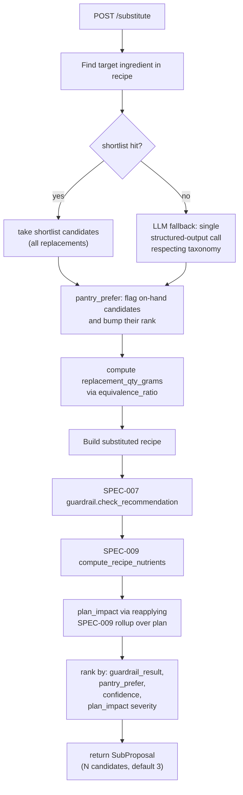

# SPEC-016: Ingredient substitution endpoint

| Field       | Value                                                    |
|-------------|----------------------------------------------------------|
| **Status**  | Proposed                                                 |
| **Author**  | Nutrition & Meal Planning team                           |
| **Created** | 2026-04-17                                               |
| **Priority**| P1 within ADR-005                                        |
| **Scope**   | New module `backend/agents/nutrition_meal_planning_team/substitution/`, API endpoint, planner-prompt variant, UI substitution dialog |
| **Depends on** | SPEC-007 (guardrail), SPEC-009 (recipe nutrients), SPEC-010 (swap primitive), SPEC-013 (retrieval, reused), SPEC-015 (pantry, optional) |
| **Implements** | ADR-005 §3 (substitution) |

---

## 1. Problem Statement

Users run into ingredient problems mid-cook: out of Greek yogurt, no
Parmesan, kid refuses mushrooms. They need a substitute that (a)
keeps the recipe working, (b) stays inside the profile's allergen
and dietary constraints, and (c) does not silently wreck the day's
nutrient targets.

SPEC-010 already ships the `/swap` primitive for a different use
case — repair-loop-driven whole-recipe replacement. This spec
specializes that pattern for **ingredient-level substitution
within a single recipe**, with three concrete upgrades:

1. A deterministic shortlist of common substitutions that does not
   require an LLM.
2. A pantry-preferred mode (SPEC-015): if the user has a viable
   swap on hand, prefer it.
3. Explicit nutrient-delta reporting so the user sees the impact.

The endpoint is the one ADR-005 §3 calls for. ADR-004's retrieval
module is reused for "similar recipe" suggestions when ingredient-
level substitution is not sufficient.

---

## 2. Current State

### 2.1 After SPEC-010

- `/plan/meals/{plan_id}/recipes/{rec_id}/swap` replaces a whole
  recipe under a `SwapConstraint`. No ingredient-level API.

### 2.2 Gaps

1. No ingredient-level substitute endpoint; users with one missing
   item have to regenerate a whole meal.
2. No shortlist of known-good swaps; every replacement burns an
   LLM call.
3. No pantry awareness when suggesting alternatives.
4. No explicit nutrient-impact preview — users trust or don't, but
   can't see the delta.

---

## 3. Goals and Non-Goals

### 3.1 Goals

- Ship `POST /recipes/{rec_id}/substitute` that returns **one or
  more substitution candidates** for a specified ingredient in
  a specific recorded recipe, each with:
  - the proposed `canonical_id` + display name
  - adjusted quantity (to maintain rough equivalence)
  - a nutrient delta vs. the original
  - a guardrail pass/flag result for the substituted recipe
  - a confidence score and a short rationale
- Use a deterministic shortlist (`common_subs.yaml`) for ~200 most
  common swaps; fall back to an LLM call only when the shortlist
  has no entry.
- Honor pantry preference when the user has relevant items on
  hand.
- Always run the SPEC-007 guardrail on the post-substitution
  recipe — a substitution never bypasses allergen/diet checks.
- Commit-or-preview: the endpoint returns candidates; a second
  call `/commit` persists the chosen swap and updates the plan's
  rollup.
- Reuse SPEC-013's retrieval module for whole-recipe alternates
  when no ingredient swap fits (e.g. "no mushrooms and no cream →
  just propose a different recipe with the same meal slot").

### 3.2 Non-goals

- **No recipe-scaling swaps.** Substituting a full protein (chicken
  → tofu) that changes the recipe character fundamentally is
  treated as "whole-recipe swap" and dispatched to SPEC-010.
- **No persistent "my preferred swap" rules.** SPEC-012's overrides
  already cover "avoid cilantro"; substitution is in-the-moment.
- **No cross-recipe propagation.** Substituting in one recipe does
  not auto-apply to others that contain the same ingredient.
- **No multi-ingredient simultaneous substitution in v1.** One
  ingredient per call. Multi-ingredient is v1.1.

---

## 4. Detailed Design

### 4.1 Module layout

```
backend/agents/nutrition_meal_planning_team/substitution/
├── __init__.py                # propose_substitutes, commit_substitute, SUB_VERSION
├── version.py                 # SUB_VERSION = "1.0.0"
├── types.py                   # SubCandidate, SubProposal, CommittedSub
├── shortlist.py               # deterministic swap table
├── data/
│   └── common_subs.yaml       # ~200 canonical-id-to-canonical-id swaps
├── llm_sub.py                 # LLM fallback when shortlist misses
├── pantry_prefer.py           # pantry-aware ranking
├── commit.py                  # writes the swap; recomputes rollup
├── errors.py
└── tests/
```

### 4.2 Shortlist

`common_subs.yaml` structure:

```yaml
greek_yogurt:
  - replacement: sour_cream
    equivalence_ratio: 1.0        # 1 g sour cream per 1 g yogurt
    use_cases: [dressing, sauce, dip]
    note: "Richer in fat; similar tang."
  - replacement: silken_tofu
    equivalence_ratio: 1.0
    use_cases: [creamy_base, baking]
    note: "Blends smoothly; lower fat."
  - replacement: cashew_cream
    equivalence_ratio: 0.9
    use_cases: [creamy_base, sauce]
    note: "Nut-based; check profile."
butter:
  - replacement: olive_oil
    equivalence_ratio: 0.85
    use_cases: [sauteing]
    note: "Do not use for baking."
  - replacement: ghee
    equivalence_ratio: 1.0
    use_cases: [sauteing, baking]
    note: "Lactose-free; still dairy allergen."
milk:
  - replacement: oat_milk
    equivalence_ratio: 1.0
    use_cases: [baking, cereal, sauce]
    note: "Check gluten tolerance (some oats are cross-contaminated)."
```

`use_cases` are tags describing when the swap is appropriate. The
request carries an optional `use_case` hint; without it we rank
all replacements but mark those with mismatched use cases as
lower-confidence.

v1 covers ~200 pairs: dairy fats, dairy liquids, eggs, common oils,
gluten grains/flours, common acids, aromatic herbs, cheese groups.
Reviewer sign-off on every pair; cited in comments.

### 4.3 Types

```python
@dataclass(frozen=True)
class SubCandidate:
    from_canonical_id: str
    to_canonical_id: str
    display_name: str
    replacement_qty_grams: float
    equivalence_ratio: float
    rationale: str
    source: Literal["shortlist", "llm", "pantry_prefer"]
    confidence: float
    guardrail_result: Literal["passed", "flagged", "rejected"]
    guardrail_flags: tuple[str, ...]
    nutrient_delta_per_serving: dict[Nutrient, float]
    plan_impact: dict[Nutrient, float]        # per-day change if committed
    on_hand_in_pantry: bool

@dataclass(frozen=True)
class SubProposal:
    recipe_id: str
    target_ingredient: str             # canonical_id or raw string
    candidates: tuple[SubCandidate, ...]
    fallback_whole_recipe: Optional[RecipeSummary] = None   # from SPEC-013
    proposal_version: str
    generated_at: str
```

### 4.4 API

| Method | Path | Purpose |
|--------|------|---------|
| `POST` | `/recipes/{rec_id}/substitute` | Propose substitutes. Body: `{target_canonical_id? OR raw_name?, use_case?, reason?}`. Returns `SubProposal`. Does not mutate. |
| `POST` | `/recipes/{rec_id}/substitute/commit` | Commit a chosen candidate. Body: `{to_canonical_id, replacement_qty_grams?, note?}`. Returns `CommittedSub` + updated plan rollup. |
| `GET`  | `/recipes/{rec_id}/substitute/history` | List previously committed subs on this recipe (audit) |

Notes:

- `target_canonical_id` is preferred; `raw_name` resolves via
  SPEC-005's parser and returns 400 if ambiguous (the UI can then
  show the ambiguity to the user).
- `use_case` is one of the `common_subs.yaml` tags plus free text;
  free text lowers confidence and biases toward LLM fallback.

### 4.5 Proposal pipeline



- Up to **3 candidates** returned by default; at least one
  shortlist-sourced if the shortlist has entries.
- Candidates that fail the guardrail are still returned but
  ranked last and marked `guardrail_result=rejected` — users see
  *why* a swap is off-limits.
- If no candidate passes and the shortlist is exhausted, a
  single whole-recipe fallback is fetched via SPEC-013
  retrieval filtered by meal slot and attached as
  `fallback_whole_recipe`. UI surfaces this as a separate action
  ("try a different recipe instead").

### 4.6 LLM fallback

When the shortlist has no entry for the target, one single
structured-output LLM call with:

- The full original recipe (ingredients + rationale).
- The target ingredient to replace.
- The user's allergen/dietary tags.
- Optional `use_case` hint.
- Strict schema: array of up to 3 `LlmSubSuggestion` items with
  `{to_canonical_id, equivalence_ratio, rationale}`.

Every `to_canonical_id` must be in SPEC-005's catalog; the LLM is
told "if no canonical match, leave it out." Invalid canonical ids
are dropped.

### 4.7 Commit flow

`/commit` writes the chosen candidate:

1. Verify the proposal hasn't expired (TTL 30 min).
2. Mutate the recipe's parsed ingredients: remove the original,
   insert the substitute at `replacement_qty_grams`.
3. Re-run SPEC-007 guardrail (belt-and-suspenders, commit-time).
4. Re-run SPEC-009 `compute_recipe_nutrients`.
5. Call SPEC-010's `rollup_plan` to update the plan's rollup.
6. Persist the change: append to `nutrition_recipe_substitutions`;
   update `nutrition_recommendations` with the new ingredient
   list and nutrients (mark as `is_modified=true`).
7. Invalidate the grocery list (SPEC-014 auto-regen trigger).
8. If profile has `pantry_auto_debit=true`, update pantry via
   SPEC-015's hook only on cook-event completion (SPEC-018), not
   on substitution commit itself — cooking is what consumes
   pantry, not planning.

### 4.8 Persistence

Migration `012_substitutions.sql`:

```sql
CREATE TABLE IF NOT EXISTS nutrition_recipe_substitutions (
    id                    BIGSERIAL PRIMARY KEY,
    recommendation_id     TEXT NOT NULL
                              REFERENCES nutrition_recommendations(recommendation_id)
                              ON DELETE CASCADE,
    from_canonical_id     TEXT NOT NULL,
    to_canonical_id       TEXT NOT NULL,
    replacement_qty_grams DOUBLE PRECISION NOT NULL,
    source                TEXT NOT NULL,         -- shortlist | llm | pantry_prefer
    nutrient_delta_json   JSONB NOT NULL,
    note                  TEXT,
    committed_at          TIMESTAMPTZ NOT NULL DEFAULT now()
);
CREATE INDEX ON nutrition_recipe_substitutions (recommendation_id);

CREATE TABLE IF NOT EXISTS nutrition_substitution_proposals (
    proposal_id   TEXT PRIMARY KEY,
    client_id     TEXT NOT NULL,
    recipe_id     TEXT NOT NULL,
    payload_json  JSONB NOT NULL,
    expires_at    TIMESTAMPTZ NOT NULL,
    created_at    TIMESTAMPTZ NOT NULL DEFAULT now()
);
```

### 4.9 UI

- Each ingredient in the recipe card gets a subtle "swap" icon.
  Clicking opens a dialog.
- Dialog shows up to 3 candidates with:
  - Visual diff of the ingredient line.
  - Per-serving nutrient delta: green deltas for improvements,
    red for cap-approaching.
  - "✓ in your pantry" chip on pantry-preferred candidates.
  - Guardrail status: ✓ passed / ⚠ flagged / ✗ allergen conflict.
  - Source tag: "common swap" / "suggested" / "from your pantry".
- User selects one → Commit → confirmation with delta preview.
- If all candidates fail guardrail: dialog shows the
  `fallback_whole_recipe` CTA ("try a different dinner instead").

### 4.10 Observability

- `substitution.proposal{source}` — shortlist, llm, pantry_prefer.
- `substitution.commit{guardrail_result}`.
- `substitution.fallback_recipe_offered` counter.
- `substitution.latency_ms` histogram (proposal; commit
  separately).
- `substitution.shortlist_miss{target_canonical_id}` top-K — fuels
  shortlist additions.

### 4.11 Priority-grouped work items

| # | Item | Priority |
|---|------|----------|
| W1 | Module scaffolding, version, types | P0 |
| W2 | Migration `012_substitutions.sql` | P0 |
| W3 | `common_subs.yaml` v1 (~200 pairs) + reviewer sign-off | P0 |
| W4 | `shortlist.py` loader + lookup + tests | P0 |
| W5 | `pantry_prefer.py` integration with SPEC-015 | P1 |
| W6 | `llm_sub.py` with structured-output schema | P0 |
| W7 | Proposal pipeline + ranking + nutrient deltas | P0 |
| W8 | `POST /substitute` endpoint | P0 |
| W9 | `POST /substitute/commit` endpoint + rollup update + grocery invalidation | P0 |
| W10 | `GET /substitute/history` | P1 |
| W11 | Fallback whole-recipe integration with SPEC-013 | P1 |
| W12 | UI: substitution dialog + ingredient swap icons | FE | P1 |
| W13 | UI: nutrient-delta visualization | FE | P2 |
| W14 | Observability counters + shortlist-miss dashboard | P1 |
| W15 | Benchmarks: proposal p99 ≤ 2 s (shortlist) / ≤ 4 s (LLM) | P2 |

---

## 5. Rollout Plan

Flag `NUTRITION_SUBSTITUTION` (off → endpoints hidden; on →
surfaced).

### Phase 0 — Data (P0)
- [ ] W3 `common_subs.yaml` reviewed.
- [ ] W1, W2 landed.

### Phase 1 — Backend behind flag (P0)
- [ ] W4–W9 landed. Flag on internal.
- [ ] Dogfood team performs 20 substitutions across recipes;
      acceptance gate: shortlist hit ≥70%; LLM fallback produces
      valid canonical ids in ≥90% of calls.

### Phase 2 — UI + pantry (P1)
- [ ] W5 pantry prefer; W10–W12 UI.
- [ ] Acceptance gate: user tests show the dialog is clear (nutrient
      delta + guardrail status readable at a glance).

### Phase 3 — Ramp (P1)
- [ ] 10% → 50% → 100% over two weeks.
- [ ] Watch shortlist-miss dashboard; add missing pairs weekly.

### Phase 4 — Cleanup (P1/P2)
- [ ] W13–W15 landed.

### Rollback
- Flag off → endpoints 404. Committed substitutions retained.
- Migration additive.

---

## 6. Verification

### 6.1 Unit tests

- `test_shortlist_lookup.py` — every pair in `common_subs.yaml`
  round-trips.
- `test_equivalence_qty.py` — replacement_qty_grams honors ratio.
- `test_pantry_prefer_ranking.py` — pantry-on-hand candidates rank
  above same-confidence non-pantry.
- `test_guardrail_rejected_last.py` — candidates that fail
  guardrail sorted last but returned.
- `test_llm_fallback_canonical_only.py` — LLM suggestions with
  non-canonical ids are dropped.

### 6.2 Integration tests

- `test_substitute_commit.py` — proposal → commit mutates
  recommendation; rollup recomputed; grocery list invalidated
  (SPEC-014 regen on read).
- `test_substitute_expired_proposal.py` — committing past TTL
  returns 410.
- `test_substitute_allergen_reject.py` — user with cashew allergy
  gets "cashew cream" flagged as rejected in response; commit
  call rejects it.
- `test_fallback_recipe.py` — recipe where all candidates fail →
  proposal includes `fallback_whole_recipe` pulled via SPEC-013.
- `test_parity_with_swap_endpoint.py` — committing a whole-recipe
  replacement via fallback routes through SPEC-010's `/swap`;
  plan state matches either path.

### 6.3 Fixture red-team

Same spirit as SPEC-007:

- Shortlist entry `butter → ghee` offered to a lactose-intolerant
  user → flagged (ghee still dairy).
- `milk → oat_milk` offered to a celiac user → flagged (oats
  commonly cross-contaminated; `oat_milk` has `gluten` dietary
  tag unless `certified_gluten_free` variant).
- LLM returning `silken_tofu` for a soy-allergic user → dropped by
  guardrail; alternate candidates considered.

### 6.4 Reviewer audit (Phase 1)

- 20 real substitutions; reviewer confirms candidates are
  reasonable in ≥17/20 cases.

### 6.5 Observability

All §4.10 counters emit; shortlist-miss dashboard populated in
staging.

### 6.6 Cutover criteria

- All P0 tests green.
- Phase 1 acceptance gate met.
- Phase 3 ramp with no safety incidents.
- Clinical reviewer + team lead sign-off on `common_subs.yaml`.

---

## 7. Open Questions

- **Multi-ingredient substitution.** A recipe missing two items
  (no yogurt, no dill) today requires two calls. v1.1.
- **"Surprise me" swap.** A deliberately variety-adding
  substitution (not user-requested but system-offered) — separate
  feature; would live closer to SPEC-013 retrieval. Backlogged.
- **Persistent household swaps.** "We always use ghee instead of
  butter" — a household-level rule. v1 has none; SPEC-012
  overrides almost cover it but are per-dimension, not per-pair.
  Potential v2 feature.
- **Quantity-based commit override.** User may want to commit with
  a different replacement quantity than the suggested ratio. v1
  accepts optional `replacement_qty_grams` in the commit body to
  allow this.
