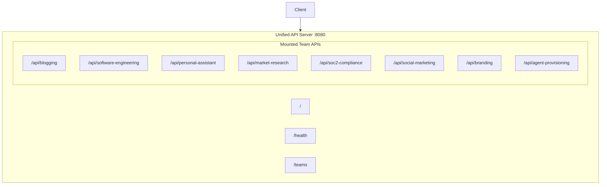

# Unified API Server

The Unified API Server consolidates all Strands Agent team APIs under a single entry point, providing a consistent interface for accessing all platform capabilities.

## Overview

Instead of running multiple API servers on different ports, the unified server mounts all team APIs under namespaced prefixes on a single port (default: 8080).



## Quick Start

```bash
# From project root
python run_unified_api.py

# With custom port
python run_unified_api.py --port 9000

# Development mode (auto-reload)
python run_unified_api.py --reload

# Production with multiple workers
python run_unified_api.py --workers 4 --log-level warning
```

## API Endpoints

### Root Endpoints

| Method | Path | Description |
|--------|------|-------------|
| GET | `/` | API information and list of available teams |
| GET | `/health` | Unified health check for all teams |
| GET | `/teams` | Detailed team information with mount status |
| GET | `/docs` | Interactive Swagger UI documentation |
| GET | `/redoc` | ReDoc API documentation |

### Team API Prefixes

| Team | Prefix | Team Docs |
|------|--------|-----------|
| Blogging | `/api/blogging` | `/api/blogging/docs` |
| Software Engineering | `/api/software-engineering` | `/api/software-engineering/docs` |
| Personal Assistant | `/api/personal-assistant` | `/api/personal-assistant/docs` |
| Market Research | `/api/market-research` | `/api/market-research/docs` |
| SOC2 Compliance | `/api/soc2-compliance` | `/api/soc2-compliance/docs` |
| Social Marketing | `/api/social-marketing` | `/api/social-marketing/docs` |
| Branding | `/api/branding` | `/api/branding/docs` |
| Agent Provisioning | `/api/agent-provisioning` | `/api/agent-provisioning/docs` |

## Environment Variables

| Variable | Default | Description |
|----------|---------|-------------|
| `UNIFIED_API_HOST` | `0.0.0.0` | Host to bind |
| `UNIFIED_API_PORT` | `8080` | Port to bind |

Team-specific environment variables (e.g., `TAVILY_API_KEY`, `SW_LLM_*`, `PA_*`) are passed through to the mounted team APIs.

## CLI Options

```
usage: run_unified_api.py [-h] [--host HOST] [--port PORT] [--reload]
                          [--workers WORKERS] [--log-level {debug,info,warning,error,critical}]

Options:
  --host HOST           Host to bind (default: 0.0.0.0)
  --port PORT           Port to bind (default: 8080)
  --reload              Enable auto-reload for development
  --workers WORKERS     Number of worker processes (default: 1)
  --log-level LEVEL     Log level: debug, info, warning, error, critical
```

## Health Check

The unified health endpoint (`GET /health`) returns the status of all mounted teams:

```json
{
  "status": "healthy",
  "version": "1.0.0",
  "teams": [
    {
      "name": "Blogging",
      "prefix": "/api/blogging",
      "status": "healthy",
      "enabled": true
    },
    {
      "name": "Software Engineering",
      "prefix": "/api/software-engineering",
      "status": "healthy",
      "enabled": true
    }
  ]
}
```

Status values:
- `healthy` - All enabled teams are mounted and working
- `degraded` - Some teams failed to mount (check individual team statuses)
- `unavailable` - Team could not be mounted (import error, missing dependencies)

## Architecture

### File Structure

```
unified_api/
├── __init__.py          # Package initialization
├── config.py            # Team configurations and settings
├── main.py              # FastAPI application with team mounts
└── README.md            # This documentation

run_unified_api.py       # Launcher script (project root)
```

### Mount Strategy

Each team's FastAPI application is mounted as a sub-application:

```python
from blogging.api.main import app as blogging_app
app.mount("/api/blogging", blogging_app)
```

This preserves:
- All original routes under the new prefix
- Team-specific middleware and dependencies
- Individual Swagger documentation at `{prefix}/docs`

### Graceful Degradation

If a team API fails to import (missing dependencies, configuration errors), the unified server continues with other teams:

```
2024-01-15 10:00:00 [WARNING] unified_api: Could not mount Investment Team API: No module named 'investment_team'
2024-01-15 10:00:00 [INFO] unified_api: Mounted 7/8 team APIs
```

## Example Usage

### List Available Teams

```bash
curl http://localhost:8080/teams
```

### Call Blogging API

```bash
curl -X POST http://localhost:8080/api/blogging/research-and-review \
  -H "Content-Type: application/json" \
  -d '{"brief": "AI observability best practices"}'
```

### Call Personal Assistant API

```bash
curl -X POST http://localhost:8080/api/personal-assistant/users/default/assistant \
  -H "Content-Type: application/json" \
  -d '{"message": "What tasks do I have today?"}'
```

### Start Software Engineering Job

```bash
curl -X POST http://localhost:8080/api/software-engineering/run-team \
  -H "Content-Type: application/json" \
  -d '{"repo_url": "https://github.com/example/project"}'
```

## Configuration

### Enabling/Disabling Teams

Edit `unified_api/config.py` to disable specific teams:

```python
TEAM_CONFIGS = {
    "blogging": TeamConfig(
        name="Blogging",
        prefix="/api/blogging",
        description="...",
        enabled=True,  # Set to False to disable
    ),
    # ...
}
```

### Custom Prefixes

Modify the `prefix` field in team configurations to change URL paths:

```python
"personal_assistant": TeamConfig(
    name="Personal Assistant",
    prefix="/api/pa",  # Shorter prefix
    # ...
),
```

## Production Deployment

### With Gunicorn

```bash
gunicorn unified_api.main:app \
  --workers 4 \
  --worker-class uvicorn.workers.UvicornWorker \
  --bind 0.0.0.0:8080
```

### With Docker

```dockerfile
FROM python:3.11-slim
WORKDIR /app
COPY . .
RUN pip install -r requirements.txt
EXPOSE 8080
CMD ["python", "run_unified_api.py", "--workers", "4"]
```

### Reverse Proxy (Nginx)

```nginx
upstream unified_api {
    server 127.0.0.1:8080;
}

server {
    listen 80;
    server_name api.example.com;

    location / {
        proxy_pass http://unified_api;
        proxy_set_header Host $host;
        proxy_set_header X-Real-IP $remote_addr;
    }
}
```

## Troubleshooting

### Team Not Mounting

Check the console output for import errors:

```
[WARNING] Could not mount Personal Assistant API: No module named 'cryptography'
```

Fix: Install missing dependencies (`pip install cryptography`).

### Port Already in Use

```bash
# Find process using port
lsof -i :8080

# Kill process
kill -9 <PID>

# Or use a different port
python run_unified_api.py --port 9000
```

### CORS Issues

The unified API enables CORS by default with `allow_origins=["*"]`. For production, modify `main.py` to restrict origins:

```python
app.add_middleware(
    CORSMiddleware,
    allow_origins=["https://your-frontend.com"],
    # ...
)
```
