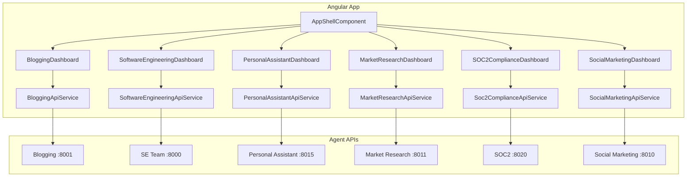
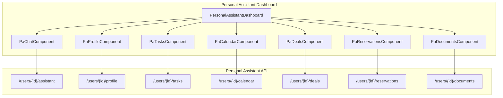

# Architecture

## Overview

The user interface is an Angular 19 standalone application that connects to multiple agent APIs. Each API has a dedicated feature area with forms, results display, and health indicators.

## High-Level Structure

## Routing

- `/` redirects to `/blogging`
- `/blogging` – Blogging API (research-and-review, full-pipeline)
- `/software-engineering` – Software Engineering Team API
- `/personal-assistant` – Personal Assistant API (chat, profile, tasks, calendar, deals, reservations, documents)
- `/market-research` – Market Research API
- `/soc2-compliance` – SOC2 Compliance API
- `/social-marketing` – Social Media Marketing API

## Core Modules

### `core/`

- **error-handler.interceptor.ts** – Catches HTTP errors, shows MatSnackBar, rethrows for caller handling

### `shared/`

- **loading-spinner** – Reusable loading indicator
- **error-message** – Inline error display

### `models/`

TypeScript interfaces mirroring backend Pydantic models for type-safe API calls.

### `services/`

One service per API:

- `BloggingApiService`
- `SoftwareEngineeringApiService`
- `PersonalAssistantApiService`
- `MarketResearchApiService`
- `Soc2ComplianceApiService`
- `SocialMarketingApiService`

## Feature Structure

Each feature follows the same pattern:

1. **Dashboard component** – Container with tabs or sections
2. **Form component(s)** – Collect request payload, emit on submit
3. **Results/status component(s)** – Display response, poll when needed
4. **Health indicator** – Calls `GET /health` for the API

## Data Flow

1. User fills form → component emits request
2. Dashboard calls service method with request
3. Service uses `HttpClient` to call API
4. On success: dashboard stores result, passes to results component
5. On error: interceptor shows snackbar; dashboard may set inline error

## Polling

Job-based APIs (SOC2, Social Marketing, Software Engineering) use `timer(0, 60000).pipe(switchMap(...))` to poll status every 60 seconds until completed or failed.

## SSE

Software Engineering execution stream uses `EventSource` to subscribe to `GET /execution/stream` for real-time events.

## Personal Assistant Dashboard

The Personal Assistant dashboard (`/personal-assistant`) is a tabbed interface with the following sections:

### Tab Components

| Tab | Component | Features |
|-----|-----------|----------|
| **Chat** | `PaChatComponent` | Conversational interface, message history, quick actions |
| **Profile** | `PaProfileComponent` | User preferences, goals, identity, professional info |
| **Tasks** | `PaTasksComponent` | Natural language task input, task lists, completion tracking |
| **Calendar** | `PaCalendarComponent` | Event parsing from text, date/time validation |
| **Deals** | `PaDealsComponent` | Wishlist management, deal search |
| **Reservations** | `PaReservationsComponent` | Restaurant/service reservations, natural language input |
| **Documents** | `PaDocumentsComponent` | Document generation (cover letters, emails, reports) |

### Real-Time Features

- Chat uses standard request/response (not streaming)
- Profile, tasks, and other data refresh on tab activation
- Loading states with Material spinners
- Error handling via MatSnackBar
